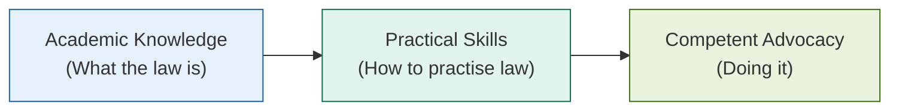
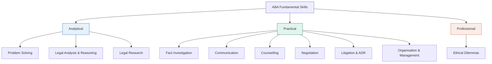

# L00 — Introduction & Prefaces

## Visual

**Animated:** Civil Trial Timeline

![[anim_trial_timeline.gif]]

---

> [!abstract] Chapter Overview
> This chapter introduces the foundational principles of litigation skills training in South Africa, tracing the historical development from Kriegler's foreword through three editions. It establishes the **"learning-by-doing"** methodology and the transition from 40% Bar exam failure rates (2003) to below 2% (2011).
<!-- -->
> [!tip] Core Principle
> **The gap between academic knowledge and practical skills** is the central problem this book addresses. As Marnewick experienced at Potgietersrus: *"I knew what I had to do; I just didn't know how to do it."*

*Figure: The bridge from knowledge to competence.*

---

## Foreword to Revised Edition 2003 — Justice Johann Kriegler

> [!quote] Key Insight
> *"A Bench is as good as its Bar."* — The quality of jurisprudence depends directly on the quality of practitioners appearing before the courts.

### Historical Context

| Year  | Event                      | Significance                                               |
| ----- | -------------------------- | ---------------------------------------------------------- |
| 1994  | **Negotiated Revolution**  | Transfer of state power from Parliament to Constitution    |
| 1994+ | **Doctrine of Separation** | Courts gain enhanced power with justiciable Bill of Rights |
| 1994+ | **Transformation**         | Courts must reflect the society they serve                 |

### The Challenge

- South African Bar developed **structured pupillage over 30 years**
- Shift from theoretical knowledge to **ethics and skills of advocacy**
- Post-1994: Courts transformed from "almost exclusively white male preserve"
- **Increased need for tailor-made training**

> [!important] Kriegler's Assessment
> *"Marnewick on litigation skills is a winner."* — Useful not only for young advocates, but also seasoned advocates, prosecutors, attorneys, and judicial officers.

---

## Preface to Third Edition (2012) — The Training Revolution

### The Crisis (Pre-2003)

> [!danger] Unacceptable Failure Rates
>
> - **40% failure rate** at Bar exams annually (up to 2003)
> - All candidates were **LLB graduates**
> - Majority of failures from **disadvantaged backgrounds and former "homeland" universities**
> - Under-representation of black advocates (particularly African advocates) at the Bar

### The Solution — "Learning-by-Doing" Method

| Year  | Development                           | Result                                        |
| ----- | ------------------------------------- | --------------------------------------------- |
| 2002  | **First Edition** published           | Introduced practical, skills-focused approach |
| 2003  | GCB extends pupillage to **one year** | More time for training                        |
| 2004  | **Workbook Programme** implemented    | Learning-by-doing extended                    |
| 2004  | Annual training for advocacy trainers | Teaching quality improved                     |
| 2004  | Failure rate drops to **20%**         | Immediate improvement                         |
| 2011  | Failure rate drops to **below 2%**    | Near-total success                            |

> [!success] Achievement
> The combined efforts of mentors, tutors, advocacy trainers, pupillage coordinators, administrative staff, bar councils, and retired judges produced this transformation.

---

## Preface to Second Edition (2007) — Aims & Approach

### The Book's Purpose

> [!info] Core Aim
> Help newly qualified lawyers reach the levels of **competency and professionalism** required by the Constitution, the courts, and the public.

### What This Book Is NOT

| Does NOT                         | Instead DOES                 |
| -------------------------------- | ---------------------------- |
| Refer to authorities extensively | Provides practical guidance  |
| Rely on footnotes                | Uses examples and precedents |
| Engage in academic discussions   | Teaches technique            |
| Cover theoretical aspects        | Focuses on "how" not "what"  |

### The Knowledge vs Skills Distinction

| Textbook Knowledge               | Skills Knowledge                      |
| -------------------------------- | ------------------------------------- |
| Acquired by **studying**         | Acquired by **doing**                 |
| **Passive** — exists in the mind | **Active** — demonstrated by action   |
| **Random** — depends on syllabus | **Purposeful** — tied to actual needs |
| **Superficial**                  | **Deep-seated** and lasting           |

> [!warning] The Fundamental Truth
> *"If you can't do it, you don't have the skill; if you can do it, you have the skill. And the only way to demonstrate mastery is to do it — like riding a bicycle!"*

---

## Preface to First Edition (2002) — Origin Story

### The Potgietersrus Revelation

> [!example] Marnewick's First Trial
> With only academic knowledge, Marnewick was handed a docket for a simple stock theft case. He survived only because the magistrate and defence attorney helped him when he didn't know what to do or say.
>
> **Key insight:** There was a large gap between his academic knowledge (which was fine) and his practical skills (which were absent).

### The Myth Debunked

> [!danger] Popular Myth
> "Skills cannot be learned or taught. You are either born with advocacy skills or without them."
<!-- -->
> [!success] Reality
> **Even a moderately talented person can acquire good advocacy skills.** If they can be acquired, they can be taught. The secret lies in learning **general techniques and procedures** adaptable to almost any circumstance.

---

## The ABA Fundamental Skills Framework

> [!info] Source
> American Bar Association, *Legal Education and Professional Development — An Educational Continuum* (1992)

### 10 Fundamental Skills

### 4 Fundamental Values

| Value                             | Description                        |
| --------------------------------- | ---------------------------------- |
| **Competent Representation**      | Provide quality legal services     |
| **Justice, Fairness, Morality**   | Strive to promote these principles |
| **Improve the Profession**        | Contribute to its development      |
| **Professional Self-Development** | Engage in continuous learning      |

---

## Required Resources for Study

> [!warning] Essential Materials
> This book requires access to:
>
> 1. **Uniform Rules of the High Court** (referred to as "the rules")
> 2. **Commentary on the rules** (latest edition)
> 3. **Amler's Precedents of Pleadings** (LexisNexis, latest edition)
> 4. **Textbook on the law of evidence**

---

## Quick Navigation — Precedents, Examples & Strategies

> [!abstract] This section provides a roadmap to all precedents and examples throughout the book.

### Key Precedent Categories

| Category                             | Chapters                                                                                                                              | Examples                                                                                            |
| ------------------------------------ | ------------------------------------------------------------------------------------------------------------------------------------- | --------------------------------------------------------------------------------------------------- |
| **Claims**                           | [[L05 - Function, form and style of pleadings\|L05]], [[L06 - Drafting statements of claim\|L06]]                                     | Particulars of claim, declarations, counterclaims, third party claims, provisional sentence summons |
| **Pleas**                            | [[L07 - Drafting pleas and special pleas\|L07]]                                                                                       | Admissions, denials, confessions and avoidance, special pleas                                       |
| **Replications & Further Pleadings** | [[L08 - Drafting replications and further pleadings\|L08]]                                                                            | Replication                                                                                         |
| **Exceptions & Striking Out**        | [[L09 - Drafting exceptions and striking out\|L09]]                                                                                   | Exceptions under Rule 23, striking out orders, objections to charges                                |
| **Applications**                     | [[L10 - Drafting applications\|L10]]                                                                                                  | Notices of motion, founding/answering/replying affidavits, certificates of urgency                  |
| **Evidence**                         | [[L11 - Preparing the case for trial: Advice on evidence\|L11]], [[L12 - Preparing the case for trial: Assembling the evidence\|L12]] | Further particulars, expert summaries                                                               |
| **Appeals & Reviews**                | [[L24 - Reviews\|L24]], [[L25 - Appeals\|L25]]                                                                                        | Notices of motion for review, notices of appeal and leave to appeal                                 |

### Examples of What to Say in Court

| Skill                    | Chapter                             | Reference                                                                     |
| ------------------------ | ----------------------------------- | ----------------------------------------------------------------------------- |
| **Opening Statements**   | [[L16 - Opening statement\|L16]]    | Prosecution, defence, civil case                                              |
| **Examination-in-Chief** | [[L17 - Examination-in-chief\|L17]] | Using timelines, logical chronology                                           |
| **Cross-Examination**    | [[L18 - Cross-examination\|L18]]    | Confrontation, probing, suggestion, undermining, question too many            |
| **Re-Examination**       | [[L19 - Re-examination\|L19]]       | Favourable explanations, rehabilitation, clarification                        |
| **Handling Exhibits**    | [[L20 - Special procedures\|L20]]   | Proving exhibits, demonstrations, refreshing memory                           |
| **Closing Argument**     | [[L21 - Closing argument\|L21]]     | Issues, facts, points of law                                                  |
| **Motion Court**         | [[L22 - Motion Court\|L22]]         | Provisional sentence, default judgment, summary judgment, urgent applications |
| **Appeals**              | [[L25 - Appeals\|L25]]              | Submissions of law and fact                                                   |

---

## Core Concepts Introduced

> [!abstract] Legal Concepts
>
> - [[Facta Probanda]] — Material facts that must be proved
> - [[Facta Probantia]] — Evidence proving those material facts  
> - [[Cause of Action]] — The legal basis for a claim
> - [[Locus Standi]] — Legal standing to bring a claim

---

## Chapter Navigation

| Direction  | Link                                                                                   |
| ---------- | -------------------------------------------------------------------------------------- |
| ← Previous | **Start** (beginning of course)                                                        |
| → Next     | [[L01 - Interviewing clients and witnesses\|L01 — Interviewing Clients and Witnesses]] |

---

## Key Takeaways

> [!success] Remember
>
> 1. **Skills can be taught** — The 40% → 2% transformation proves it
> 2. **Learning-by-doing** is the methodology — Not passive study
> 3. **The gap is real** — Academic knowledge ≠ practical competence
> 4. **You need the right tools** — Rules, precedents, evidence texts
> 5. **The book covers the full process** — From first client meeting to final appeal
