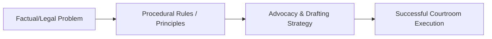

---
# L00 — Introduction & Prefaces

> One-paragraph overview of the litigation skills and principles taught in this chapter.
>
> [!abstract] The arc of this chapter
> **Where we left off:** We explored the previous phase of litigation or litigation foundations.
>
> This chapter covers **Introduction & Prefaces**. We look at the problem of how to execute this task, the rules that govern it, and the strategies for successful advocacy.

*Figure: The problem-to-execution chain in this chapter.*

---

## Chapter Content Walkthrough

## Foreword to revised edition 2003

Although I know the difference between a rave review and a foreword, I simply cannot maintain the requisite degree of dignified restraint here. This book could not have appeared at a better time; nor could its contents have been more appropriate. This I discovered to my delight when I recently used it in preparing a lecture for candidates for Bar pupillage. I was so impressed with the particular section I was studying that I started browsing further and further afield, eventually reading the book from cover to cover.

It is trite that in our system of justice the quality of a court's jurisprudence is directly dependent upon the quality of the practitioners who appear before it - a Bench is as good as its Bar. This the South African Bar (in common with its kindred bodies in England and other similar jurisdictions) has long since known. An increasingly structured system of pupillage has been developed in this country over the past 30 years, concentrating more and more on the ethics and skills of advocacy rather than on theoretical knowledge of the law. Latterly courses have been offered to young advocates already in practice too. The underlying objective is to ensure that attorneys, litigants and the courts can have confidence in the professional skills of members of the Bar.

That objective has been given special impetus over the last decade. The negotiated revolution of 1994 brought about many changes in South Africa. The most important was the transfer of state power from parliament to the Constitution. Adoption of the doctrine of separation of powers with a fully justiciable bill of rights clothed the courts with greatly enhanced power and responsibility. At the same time the courts and their office-bearers had to mutate from an almost exclusively white male preserve to a true reflection of the society they serve. This transformation has increased the need for tailor-made training for all who play a part in the functioning of the courts.

Over many years I have had the privilege of sharing in professional training and can, I think, claim sufficient expertise to express an admissible opinion on the merits or otherwise of forensic training material. *Marnewick on litigation skills* (as I am sure it will soon come to be called familiarly) is a winner. Although the primary target group is young advocates in private practice, everybody involved in litigation who studies what the author has so helpfully systematised will enrich and polish their courtroom knowledge and skills. Here I have in mind not only seasoned advocates, but prosecutors, attorneys and even judicial officers of all ranks.

I have been made to realise, with considerable embarrassment, just how ill-equipped I was for the advocate's profession. I am even more embarrassed at being shown how inadequate my well-meaning but disorganised efforts at training have been. My copy of this book will become dog-eared.

Johann Kriegler
Johannesburg
August 2003

## Preface to third edition

The training of advocates has made considerable progress since the publication of the second edition of this book. Consider the following facts:

- In the five or so years up to 2003 the failure rate at the Bar exams was in the region of 40% each year;
- The people who wrote those examinations were all LLB graduates;
- The vast majority of those who failed came from disadvantaged backgrounds and the former "homeland" universities;
- This occurred against the background of an under-representation of black advocates - particularly African advocates - at the Bar.

The continuing failure of the Bar's training methods to produce an acceptable pass rate stirred many members of the profession into action. The first edition of this book was my effort to bring our training methods into line with international practice and was published in 2002. It advocated and used, as this edition still does, the "learning-by-doing" method I had learned while teaching in New Zealand. In 2003 the General Council of the Bar (GCB) resolved to extend pupillage from six months to one year and to put greater effort and resources into the training of pupil advocates. In 2004 it implemented the Workbook Programme I had written - taking the "learning-by-doing" method a step further - and it stepped up its advocacy training programme at the same time. The GCB also organised annual training for its advocacy trainers and academic tutors in order to facilitate their teaching. In the space of a year or two everything came together and the failure rate at the Bar exams fell from 40% in 2003 to 20% in 2004, and then it reduced incrementally each year until it stood at below 2% in 2011.

There are many who have contributed to this success; advocates who have acted as mentors to pupils, tutors and advocacy trainers who have conducted the training, pupillage coordinators who have overseen the training at their bars, administrative staff and bar councils who have made it all possible. Many retired judges have also participated in the Bar's programmes by providing training.

I would like to acknowledge the good work done by all these men and women by dedicating this edition to them.

And I would like to thank my friend and colleague, Roland Suhr, of the Durban Bar, for his invaluable suggestions for improvements to this work.

---

Chris Marnewick SC  
Auckland  
September 2012

## Preface to second edition

The first edition of this book was a rather surprising success, so much so that the National Bar Examination Board banned it from its Legal Writing examination on the ground that it 'made the examination too easy'. Then the Librarian of the Law Society's library in Durban told me that all three copies she had of the book were quickly stolen from the library. I cannot determine which is the greater compliment; that the book was banned, or that it was stolen.

South Africa is an ordered society based on the constitutional guarantee of equality, fairness and justice. An effective litigation process is one of the cornerstones of such a society. It is therefore essential that in order for the aims of the Constitution to be achieved there should be an effective litigation process, which in turn demands that the lawyers appearing before the courts should be competent and ethical.

The aim of this book is to help newly qualified lawyers to reach the levels of competency and professionalism required by the Constitution, the courts and the public.

We know, after many investigations, seminars and debates, that university training is insufficient to provide our young lawyers with the skills they need to engage in practice in the courts. Justice Johann Kriegler's kind foreword and my own experience in the Potgietersrus (now Mokopane) Magistrates' Court and other courts confirm that this lack of practical skills is not a new phenomenon, and that it is not limited to those students who arrive at the Bar or in an attorney's firm from a background of poor schooling and indifferent universities.

My experience elsewhere led me to the same conclusion. The problem appears to be universal. The solution is obvious - greater emphasis on practical training.

This edition of the book will therefore continue in its own tradition of not referring to authorities, not relying on footnotes, and not engaging in academic discussions. The book is intended to be a practical guide for teacher and student alike, to be used in the teaching and learning of the skills and techniques which are essential for a practitioner embarking on a career in the litigation field.

I have learnt a good deal about the litigation process while trying to teach others. Teaching is a very effective way of learning, and I have learnt a lot from those I have taught. I would like to invite others to join me in that pursuit. It is more rewarding than you could ever imagine. My challenge to my colleagues at the Bar and in the Attorney's profession is this: Don't go to your grave with your knowledge and skills locked up within you; share them with our newly qualified members. Knowledge or skill which is not shared goes to waste.

Chris Marnewick SC  
Durban  
February 2007

## Preface to first edition

*I want to put as many new ideas into the law as I can, to show how particular solutions involve general theory . . .*

**Oliver Wendell Holmes, Jr US Supreme Court Justice, 1902-1932**

I ran my first case in the Magistrates' Court at Potgietersrus, where I was working during the university holidays. The prosecutor handed me a docket and a charge sheet and told me to take the case in the next court; he was too busy with another trial. It was a simple stock theft case. I then found, to my horror, that even though I had been watching other people conducting trials for some time, I really had no idea how to do it myself. *I knew what I had to do; I just didn't know how to do it.* There was a large gap between my academic knowledge, which was fine, and my practical skills, which were absent. It was very embarrassing. I survived the ordeal only because the magistrate and the defence attorney helped me when I didn't know what to do or say.

It doesn't have to be like that.

The aim of this book is to help young practitioners (attorneys, advocates and prosecutors) to acquire and develop the skills and techniques of the litigation process to represent their clients with competence and confidence. The emphasis is on skills, not knowledge. Every chapter of the book therefore concentrates on technique. To help you keep track of all the skills and techniques involved, there is a list of precedents, examples and strategies, including what to say to the court in different situations, immediately after the table of contents.

There is a popular myth among the legal fraternity that skills cannot be learned or taught. The suggestion seems to be that you are either born with advocacy skills or without them; and if you were born without them, you might as well give up any hope you harboured of ever becoming a skilled litigator. I don't agree. Even a moderately talented person can acquire good advocacy skills. If they can be acquired, they can be taught. I would not have written this book if I thought otherwise. The secret lies in learning general techniques and procedures that can be

---

adapted to suit almost any circumstance you may encounter during the litigation process.

The book is not about the theoretical aspects of advocacy. It is about practical skills and tips for everyday use in practice. Its aim is to teach the "how" rather than the "what". Conventional legal education teaches the law student what the law is, the "this" and the "that", the substantive and procedural rules of the law. Universities teach textbook law. Textbook knowledge tends to be superficial. It is acquired by studying. It is passive, existing in the mind. It is also random in that it depends on some arbitrary syllabus, and general, giving the student no clear reason why a particular piece of knowledge is necessary. On the other hand, a skill, or "know-how", is far more deep-seated knowledge, and, once acquired, tends to remain. It is acquired by "doing", by practising the technique of the skill over and over. It is also active knowledge, demonstrated by action. With skills the emphasis is always on "doing". If you can't do it, you don't have the skill; if you can do it, you have the skill. And the only way to demonstrate that you have mastered a particular skill is to do it, like riding a bicycle!

When I started this book, it was intended for use as a litigation skills guide for the practical training of aspirant advocates and attorneys at the law schools of the universities, the Practical Training Schools of the Association of Law Societies and the Advocacy Programmes of the Bar. However, as the book developed during the research and writing processes, it dawned upon me that junior practitioners also need a book that they can carry to court with them, to serve as a first or basic guide for all the steps and procedures which constitute the litigation process. I know of no other book that covers the whole process from beginning to end. I couldn't even find a book to help me with the chapter on appellate advocacy, and as for [[Page-115|fact analysis]], the subject seems to have been largely ignored in South African legal education programmes.

Footnotes and references to cases, statutes, rules and textbooks are avoided as far as possible. Valuable time should not be spent looking up the Rules of Court, or having to find principles, statutes and cases in the Law Reports. Nevertheless, because the book is also intended to cover the syllabus for the Bar Examinations in Legal Writing, parts of the syllabus for Civil Procedure and parts of the Attorney's Admission Examinations, reference is made to the High Court Rules from time to time. The rules referred to in the text should be studied as part of the process of learning how to apply them. The reader will need to have access to the Uniform Rules of the High Court (referred to in the text as "the rules"), a commentary on the rules, Amler's Precedents of Pleadings (LexisNexis - latest edition)) and a good textbook on the law of evidence.

What skills are involved in the litigation process? The American Bar Association has identified ten fundamental skills and four fundamental values which every lawyer should have to be able to assume the full responsibilities of a member of the legal profession (Legal Education and Professional Development - An Educational Continuum Student Edition ABA (1992)).

The ten fundamental skills are:

1 problem solving;
2 legal analysis and reasoning;
3 legal research;
4 fact investigation;
5 communication;
6 counselling;
7 [[Page-30|negotiation]];
8 litigation and alternative dispute resolution procedures;
9 organisation and management of legal work;
10 recognising and resolving ethical dilemmas.

The four fundamental values are:

1 providing competent representation;
2 striving to promote justice, fairness and morality;
3 striving to improve the profession;
4 engaging in professional self-development.

I hope this book will help you to develop these fundamental skills and values so that you may become a competent and confident litigator. It is easier than you might think.

Chris Marnewick SC
Auckland
July 2002

# Acknowledgements

---

A book like this is based on experience and lessons learned and taught in the past. There are so many people who helped me by sharing their experiences, some by allowing me to learn from them while teaching them, others by giving me sound advice when I made mistakes. It would be impossible to acknowledge each contribution, but I would be remiss if I did not mention the following:

- The senior advocates who taught me valuable lessons and skills while leading me in various cases (and taught me more severe lessons later when I had to appear against them!), in particular Douglas Shaw QC, David Gordon SC and Malcolm Wallis SC;
- my friends and colleagues at the Durban Bar, Mark Harcourt, Rashid Vahed SC, Stephen Mullins SC, Graham Lopes SC and Gardner van Niekerk SC, who were always ready to discuss problems and to dispense advice;
- my erstwhile pupils, Johnnie Kruger, Anne Quayle, Greg Harpur SC, Barry Skinner SC, Julian King SC and Richard Salmon SC;
- all those advocates who came to my Legal Writing lectures and are now practising in Durban, Pietermaritzburg, Umtata or Bishu, or who now sit as Judges or occupy other high offices, all of whom allowed me to learn from them while teaching;
- Professor Robin Palmer of the University of Natal (Durban) and Mr ML Pillay of the Attorneys' Practical Training School in Durban, who allowed me to teach in their programmes;
- my colleagues at the Institute of Professional Legal Studies, Auckland, especially Paula Sheahan, Adam Blake, Jane Rushton and Anne-Elise Smith, who shared with me their knowledge and experience in teaching practical skills to young lawyers;
- my 2000 and 2001 trainees at the Institute of Professional Legal Studies, who opened my eyes to new insights by asking intelligent, and some not so intelligent, questions, and allowed me to test some of the techniques advocated in this book on them;
- Jillian Raw, who shares my passion for law as an art and a science, as something more than a way to earn a living, and who read a number of chapters in draft and gave me helpful feedback;
- my friends at the College of Law, New Zealand and Australia, from whom I learnt computer skills, and how to learn and to teach via the Internet.

## Precedents, examples and strategies

#### PRECEDENTS

|  *Plading or other document* | *Chapter* | *Page*  |
| --- | --- | --- |
|  1 Claims: Examples of the citation of plaintiffs and defendants | 5 | 92  |
|  2 Claims: Particulars of claim in a damages action | 6 | 100  |
|  3 Claims: Declaration in a contractual claim | 6 | 105  |
|  4 Claims: Counterclaim in a damages action | 6 | 109  |
|  5 Claims: Third party particulars of claim for a contribution | 6 | 114  |
|  6 Claims: Interpleader particulars of claim | 6 | 118  |
|  7 Claims: Provisional sentence summons | 6 | 122  |
|  8 Charge of theft | 6 | 124  |
|  9 Plea: pleading an admission | 7 | 129  |
|  10 Plea: pleading a denial | 7 | 130  |
|  11 Plea: denying some allegations while admitting others | 7 | 130  |
|  12 Plea: pleading a confession and avoidance | 7 | 131  |
|  13 Plea: pleading that an allegation is not admitted | 7 | 131  |
|  14 Plea: pleading the material facts of the defence | 7 | 132  |
|  15 Plea: pleading an explanation or qualification | 7 | 133  |
|  16 Plea: the prayer | 7 | 134  |
|  17 Plea: an inelegant plea | 7 | 139  |
|  18 Plea: a [[Page-66|special plea]] | 7 | 139  |
|  19 Plea explanation in a criminal case | 7 | 141  |
|  20 Replication | 8 | 145  |
|  21 [[Page-75|Exception]] | 9 | 153  |
|  22 [[Page-75|Striking out]] order under Rule 23(2) | 9 | 156  |
|  23 Objection to criminal charge | 9 | 158  |
|  24 Applications: Notice of motion in spoliation application | 10 | 171  |
|  25 Applications: Founding affidavit in spoliation application | 10 | 173  |
|  26 Applications: Notice of opposition | 10 | 173  |
|  27 Applications: Certificate of urgency | 10 | 177  |
|  28 Applications: Notice of application in interlocutory proceedings | 10 | 179  |

---

|  29 | Applications: Founding affidavit in interlocutory proceedings | 10 | 181  |
| --- | --- | --- | --- |
|  30 | Request for further particulars for trial | 11 | 199  |
|  31 | Further particulars for trial | 11 | 200  |
|  32 | Summary of [[Page-100|expert evidence]] under Rule 36(9) | 11 | 202  |
|  33 | Summary of expert evidence under Rule 36(9) (damages action) | 11 | 204  |
|  34 | Heads of argument (Use Tables 1, 2, 3 and 4 in Chapter 21) | 21 | 392  |
|  35 | Reviews: Notice of motion in review application under Rule 53 | 24 | 440  |
|  36 | Reviews: Founding affidavit in review application under Rule 53 | 24 | 443  |
|  37 | Appeals: Notice of application for leave to appeal | 25 | 451  |
|  38 | Appeals: Notice of application for special leave to appeal | 25 | 454  |
|  39 | Appeals: Notice of appeal under Rule 49(3) | 25 | 457  |

### EXAMPLES OF WHAT TO SAY IN COURT

|  *What to say: Technique or process* |   | *Chapter* | *Page*  |
| --- | --- | --- | --- |
|  1 | Asking open, closed or leading questions | 1 | 9  |
|  2 | Asking questions using the funnelling technique | 1 | 10  |
|  3 | [[Page-131|Opening statement]] for the prosecution | 16 | 290  |
|  4 | Opening statement for the defence | 16 | 294  |
|  5 | Opening statement in a civil case | 16 | 297  |
|  6 | [[Page-136|Examination-in-chief]] | 17 | 316  |
|  7 | Examination-in-chief: using a timeline | 17 | 322  |
|  8 | [[Page-145|Cross-examination]]: confrontation | 18 | 334  |
|  9 | Cross-examination: probing | 18 | 334  |
|  10 | Cross-examination: suggestion | 18 | 336  |
|  11 | Cross-examination: undermining | 18 | 338  |
|  12 | Cross-examination: a question too many | 18 | 340  |
|  13 | Cross-examining to a theme | 18 | 341  |
|  14 | [[Page-160|Re-examination]]: eliciting a favourable explanation | 19 | 348  |
|  15 | Re-examination: rehabilitating the witness | 19 | 348  |
|  16 | Re-examination: clarifying evidence | 19 | 349  |
|  17 | Handling an exhibit which has already been proved | 20 | 354  |
|  18 | Proving an exhibit formally, through a witness | 20 | 355  |
|  19 | Proving a [[Page-100|demonstrative exhibit]], a medical report | 20 | 356  |
|  20 | Recording a demonstration by the witness | 20 | 356  |
|  21 | Confirming a demonstration given at an inspection | 20 | 358  |
|  22 | Using a prior inconsistent statement to discredit the witness | 20 | 359  |
|  23 | Refreshing memory | 20 | 361  |
|  24 | Cross-examination of an expert to demonstrate bias or interest | 20 | 365  |
|  25 | Objections to questions and evidence: phrasing an objection | 20 | 366  |
|  26 | Leading identification evidence in a criminal case | 20 | 370  |
|  27 | Cross-examining an identification witness in a criminal case | 20 | 371  |
|  28 | Objections: how to respond to objections | 20 | 376  |
|  29 | Argument: Dealing with the issues in turn | 21 | 383  |
|  30 | Argument on the facts | 21 | 386  |
|  31 | Argument on a point of law | 21 | 390  |
|  32 | [[Page-179|Motion Court]]: Provisional sentence | 22 | 401  |
|  33 | Motion Court: Default judgment without evidence | 22 | 402  |
|  34 | Motion Court: Default judgment with evidence | 22 | 402  |
|  35 | Motion Court: Summary judgment (unopposed) | 22 | 403  |
|  36 | Motion Court: Summary judgment (consent order) | 22 | 403  |
|  37 | Motion Court: Application for substituted service | 22 | 404  |
|  38 | Motion Court: Divorce trial (unopposed) | 22 | 404  |
|  39 | Motion Court: Rule 43 application (opposed) | 22 | 405  |
|  40 | Motion Court: Sequestration application (unopposed) | 22 | 406  |
|  41 | Motion Court: Urgent application (unopposed) | 22 | 407  |
|  42 | Motion Court: Urgent spoliation application (opposed) | 22 | 408  |
|  43 | Appeals: Making submissions of law | 25 | 464  |
|  44 | Appeals: Making submissions of fact | 25 | 464  |
|  45 | Appeals: Opening the appeal | 25 | 467  |

### STRATEGIES FOR DIFFERENT LITIGATION PROCESSES

|  *Process* |   | *Chapter* | *Page*  |
| --- | --- | --- | --- |
|  1 | Initial [[Page-115|fact analysis]] | 1 | 15  |
|  2 | Interviewing a client | 1 | 18  |

---

---

## Concepts in this lecture
[[Facta Probanda]] · [[Facta Probantia]] · [[Cause of Action]] · [[Locus Standi]]

## Navigation
Prev: ← Start · Next: [[L01 - Interviewing clients and witnesses|Next Chapter →]]
