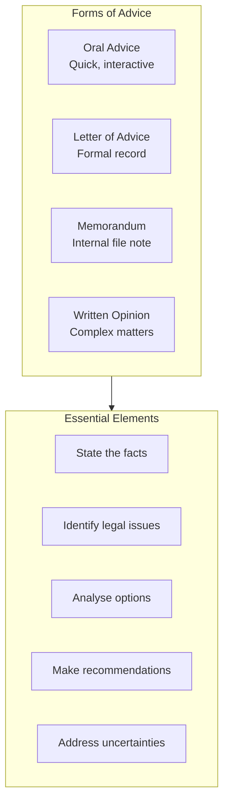

# L02 — Advising and counselling clients

> [!abstract] Chapter Overview
> This chapter covers **advising and counselling clients** — communicating legal opinions, assessments, and recommendations. Key topics: oral vs written advice, letters of advice, memoranda, and formal opinions.
<!-- -->
> [!important] Core Principle
> The client makes the decisions. Your role is to advise on options, risks, and likely outcomes — not to make decisions for them.

## Visual Overview



*Figure: Forms of advice and their essential elements.*

> [!warning] Ethical Duty
> Communicate uncertainty honestly. Never overstate prospects or hide risks. A client properly advised makes informed decisions.
<!-- -->
> [!tip] Connection
> Advice follows the interview ([[L01 - Interviewing clients and witnesses]]) and may lead to ADR ([[L03 - Alternatives to litigation]]) or litigation ([[L04 - Preparing to commence action]]).

---

## Chapter Content Walkthrough

## Chapter 2: Advising and counselling clients

### CONTENTS

- 2.1 Introduction
- 2.2 Advising and counselling generally
  - 2.2.1 Advising the client
  - 2.2.2 Counselling the client
- 2.3 Oral advice and counselling in litigation
- 2.4 Advising by letter
- 2.5 Advice per memorandum
- 2.6 Written opinions
  - 2.6.1 Introduction
  - 2.6.2 Discussion
  - 2.6.3 Analysis
  - 2.6.4 Conclusion
  - 2.6.5 General comments
- 2.7 Advice by a prosecutor
  - 2.7.1 Written opinion
  - 2.7.2 Memorandum and minute
  - 2.7.3 Entry in investigation diary
  - 2.7.4 Oral advice to the complainant
- 2.8 Protocol and ethics

## 2.1 Introduction

Clients approach lawyers for advice and counselling so that they can make informed decisions about their future conduct. The client wants to know, 'What can I do?' and 'What should I do?' In the case of a prosecutor's office, the 'client' is the complainant even though in practice the litigation is usually driven by the police and the prosecution is conducted in the name of the state. The question, 'What can I do?' requires the lawyer to identify and evaluate the available options and the consequences of adopting each of them. It is the lawyer's duty to advise the client of the pros and cons of each option and which option, in the lawyer's view, is the best option. The question, 'What should I do?' on the other hand, requires the lawyer to help the client to make the right decision, having regard to those options and consequences. Counselling therefore goes beyond the mere giving of advice. It is the process by means of which the lawyer helps the client to decide what to do. Having received advice and counselling, the client has the responsibility of making the final decision.

Advising and counselling are complementary, but different, skills. The lawyer acts as an objective investigator during the advice stage but takes on the role of a personal advisor during the counselling stage. Advising and counselling occur in virtually every branch of a lawyer's practice, from property transactions to litigation, from the collection of small debts to the conclusion of international shipping or licensing contracts. Whatever the nature of a lawyer's practice, advising and counselling will be part of it. Attorneys may advise and counsel differently from advocates as they have a more direct, and usually a more enduring, relationship with their clients. Advocates are also usually required to advise or counsel in a far more formal setting.

Advising and counselling are also part of litigation. Indeed, advising and counselling continue through every stage of the litigation process. It can start at the first interview and can continue even after a final appeal has been decided. Nevertheless, the underlying processes and skills to be employed are the same for both branches of the profession and for all types of legal work, including the work of a prosecutor.

## 2.2 Advising and counselling generally

### 2.2.1 Advising the client

Before you can advise a client, you will have to form an opinion or view on the facts and the law. This may only be possible after an exhaustive fact investigation or extensive legal research. Sometimes lawyers will be able to deal with the problem fairly promptly because they have encountered it before or because it falls within their special field of expertise.

Where the problem needs to be investigated before an opinion can be formed or the problem can be solved, you

---

will rely on your skills in legal research and [[Page-115|fact analysis]], which are dealt with in chapters 13 and 14. After identifying possible solutions by using those skills, you should tell the client what the options are and what you think the best option is.

You could do this according to the following scheme:

**Table 2.1** Scheme for advising a client

| Stage                                                                                                                  | Ask yourself . . .                                                                                                                    |
| ---------------------------------------------------------------------------------------------------------------------- | ------------------------------------------------------------------------------------------------------------------------------------- |
| 1. Identify the problem and the client's objectives.                                                                   | What is the problem? What does the client want to achieve?                                                                            |
| 2. Investigate the facts to ensure you can identify the available options.                                             | Against what factual background does this problem exist?                                                                              |
| 3. Identify the legal issues and consider their application to the facts.                                              | What legal principles apply to the facts? What is the effect of those legal principles on the problem and on the client's objectives? |
| 4. Identify the consequences of each option by considering the likely legal and non-legal consequences of each option. | What are the options? What are the likely consequences of each of them? Which is the best option? Why do I think so?                  |
| 5. Discuss the options and their consequences fully with the client.                                                   | What can the client do? What are the advantages and disadvantages of each option?                                                     |
| 6. Tell the client which option you regard as the best option and why you think so.                                    | What should the client do?                                                                                                            |

The counselling phase is not entirely separated from this process and is prominent during the next stage when the client, after having received your advice, has to make a decision. The different stages of the process should also not be applied in too strict a sequence as it may become necessary to return to prior stages before the whole process is finally completed. For example, when you have identified the legal principles and have considered their effect, it may become necessary to re-investigate the facts or even to reconsider the true nature of the problem. A confident lawyer will move between the different stages effortlessly while the solution to the client's problem becomes ever clearer. Like most processes used for solving legal problems, advising and counselling cannot be confined to a straitjacket. Each stage constitutes an essential step towards the finalisation of the process.

### 2.2.2 Counselling the client

The purpose of the counselling process is to empower the client to make an informed and correct decision. This is far easier said than done.
What the counselling process involves can best be explained by an analogy. When a patient who is suffering from a life-threatening disease consults a specialist physician, the physician will conduct various tests and examinations to determine precisely what the problem is and what different treatments are available for the condition diagnosed. These will all be explained very carefully to the patient so that the patient will know what the options are. The physician will go further than that. It is not enough that the patient knows what different options are available - the physician also has the duty to help the patient to make the right decision. The patient may not know or understand enough to make a correct decision on his or her own. Thus, while the physician has to explain what he or she thinks the appropriate treatment is, the advice to the patient should be given in such a way that the patient is empowered to make the right decision. Lawyers have the same duty.

The process of counselling is both *personal* and *dynamic*. It is personal because the style of counselling depends on the individual personalities of the lawyer and the client. It is dynamic because its course depends on what happens during the counselling process itself. Some clients need more help than others before they are ready to make a decision. Some clients make the right decision; others make the wrong decision and the process then may have to continue for a while longer. Sometimes a decision can be made quickly, while in other cases it may take time. For these reasons one cannot be too dogmatic about the exact process or style to adopt. Vary your style and the procedures you adopt within the counselling process according to the demands of each individual case.

Generally you have to ensure that -

- the client has a sufficient opportunity to evaluate the advice;
- the particular client, having regard to his or her individual make-up, is given sufficient help to make the right decision;
- all the client's questions are answered; and that
- you intervene when the client makes a mistake or is about to make the wrong decision.

Clients often make mistakes even after receiving the best advice because they do not judge the likely consequences of a proposed decision correctly or choose the option that accords with what they *want to do* rather than with what they *should do*. Their decisions are often based on the wrong "facts" or values. Sometimes their decisions can simply not be reconciled with an understanding of the risks involved or may result in a clash with the

---

ethics of the legal profession. While clients should be allowed to make their own decisions, this cannot be taken too far. In some cases the assistance and support of a family member or an elder in the client's community or a shop-steward may be necessary.

## 2.3 Oral advice and counselling in litigation

Oral advice can be given during a formal interview, over the telephone or even at court during a trial. There are so many different circumstances under which a lawyer would give advice in a face-to-face situation that it is difficult to lay down any specific procedures for doing it. Nevertheless, there are some pitfalls to avoid.

Lawyers are often in a situation where they are expected to give oral advice in circumstances of varying degrees of urgency. Sometimes they do not have all the facts on which *(see page 32)* sound advice would ordinarily depend. Furthermore, they may not be given the opportunity to research the facts or the law before they have to advise on the question posed. This is not a healthy situation. On the contrary, it is fraught with danger for both the client and the lawyer as the advice may be based on insufficient or incorrect information or on an incorrect interpretation of the facts or the law. The advice may also be misinterpreted by the client or even be forgotten and a dispute may later arise about what the advice had been.

It is therefore important to remember that it is risky to give oral advice. Take steps to eliminate the dangers that may be present in a particular situation. Advise the client that it is undesirable to make decisions on the strength of advice given as a matter of urgency as the advice may be based on insufficient or incorrect information or an incorrect interpretation of the facts and the law. If the client wishes to proceed, the advice should be qualified and both the advice and the facts upon which it is based should be clearly recorded. Do not be rushed into giving advice you have any doubts about.

If pressed to continue, you would be entitled to require the client to sign a disclaimer absolving you from liability for incorrect or negligent advice.

If advice has to be given under circumstances where it is not feasible to record the facts and your advice, confirm the advice and the facts upon which it was based in writing at the first opportunity.

Advising the client at court under the stress of the trial or hearing should be done with a special degree of circumspection. A common complaint by clients about the litigation process is that they were forced into a settlement. Care should be taken that the client does not feel pressured into making any decisions during the hearings. Ask the Judge for time. It will be given if there is a reasonable prospect of a settlement. Go back to the office or counsel's chambers, if necessary. Consider the pros and cons carefully and give the client objective advice on the options. Then make your recommendation. If the client is still uncertain about what he or she should do, start all over again. Make a note of the advice you have given. Advocates often record any advice they give on the brief and ask the client to sign it. It is a practice worth adopting.

There are a few other matters to keep in mind:

- You should make a concerted effort to maintain your neutrality. Counselling is not advocacy. Here the client is entitled to objective advice. The process should therefore have as its aim that the client, after receiving objective advice, is able to make the decision. Nevertheless, there is an element of persuasion involved because the lawyer has the duty to help the client arrive at the correct decision. That may, in certain cases, require a degree of persuasion. The facts, options and consequences may have to be presented in such a way that the client is led to the right decision. However, this approach cannot be taken too far. The client has the ultimate right to make his or her own decision.

- If the client makes the wrong decision, but still a decision which could reasonably be made on the facts, by all means point out the consequences of that decision, as you see them. You may go as far as advising the client again of the other options and how they compare to the one chosen by the client. Once the client has made a decision, after receiving all the help you can give, accept the decision and implement it. Do not undermine the client's confidence by telling him or her that the decision is wrong. You've done your duty when you advised the client of the consequences and how the decision compared to the other options, provided, of course, that you have made sure that the client has been empowered to make the decision.
- Don't rush the client, especially at court when things may not have gone according to plan. The client is probably under severe stress already and needs more assistance, not more stress.

- Keep in mind that the client is an individual, with his or her own levels of intelligence, experience, sophistication, emotional involvement, and support (or lack of it) from family and friends. The problem may range from the simple to the extremely difficult. Adopt an approach to counselling that takes account of these factors.

Let us now revert to our client from chapter 1, Mrs Smith. During the initial interview we can give Mrs Smith the following advice:

- There are several potential claims. She and her children may have personal injury and loss of support claims against the RAF depending on whether negligence on the part of the insured driver can be proved. There may be a claim for the damage to the car, also depending on proof of negligence but only if the car belonged to our client. There may also be claims for the proceeds of insurance policies, depending on who the owner and

---

beneficiaries of the policies are.

- The personal injury and loss of support claims may take between 18 months and three years to resolve if they are disputed. The claim for the damage to the car could be resolved in the Magistrates' Court in less than a year if the damage is within the limits of its jurisdiction. It is not possible to say how long the insurance-policy claims will take to resolve but it could be a relatively short period if the insurers concerned accept the claims and the policies fall outside the deceased estate.
- It may be possible to make claims for her and the children's maintenance against the deceased estate. This will be investigated immediately. In the meantime, she should provide a list of her weekly or monthly expenses as soon as possible.
- It may be possible to negotiate an agreement with the hospital to the effect that they would wait for the finalisation of any action against the RAF before they demand payment. The RAF may be persuaded to make interim payments with regard to medical and hospital expenses, funeral expenses and loss of support, depending on whether liability is accepted.
- It is not possible to advise on the strength of the claims before the facts have been fully investigated.
- So far as fees are concerned, there are various options available. These include an application for legal aid, an agreement that the case be undertaken on a contingency basis, and an agreement by the firm to carry all disbursements and to defer payment until the RAF claim has been finalised. It may be too soon to make decisions in this regard but the matter can be discussed and a decision taken at the next interview.
- Give the client an undertaking to supply her with more detailed advice in a letter within a week after you have done some initial research and investigations. (The promise has to be kept!) Advise her not to act until she has had an opportunity to consider the advice you give in the letter and has had a follow-up meeting with you.

## 2.4 Advising by letter

Attorneys often advise their clients by letter. Even when they have given oral advice, they would usually confirm that advice in a letter. Sometimes the letter confirming the oral advice goes further than the original oral advice, which may have been given in circumstances of some urgency or without an adequate opportunity to gather additional *(see page 34)* information or to do legal research. In cases where attorneys have briefed counsel for a written opinion, they frequently convey the substance of counsel's opinion to the client by way of a letter which explains what counsel's opinion is and what the ramifications of the opinion are for the client. In short, they advise the client what he or she can and should do, having regard to counsel's opinion.

However, it is rather unusual for an advocate to give advice by letter. The usual form of counsel's advice, when it is not given face to face during a conference, is by way of a memorandum or a written opinion. Legal advisors employed by concerns such as municipalities, insurers or other companies also give advice to their councils or directors by way of a letter or a memorandum.

Prosecutors do not offer advice by letter to the public in the ordinary course of their work but they do give advice to other public officials. In such a case the advice is either given in the form of a memorandum or by way of a minute.

Advice given by letter differs from advice by way of a memorandum or written opinion in one crucial aspect: While memoranda and written opinions are usually aimed at another lawyer or more astute clients, the advice given by way of a letter is aimed at the lay client. It is therefore important that the letter be written in such a way (in both style and content) that the lay client is given a clear understanding of his or her options and position. The format of a letter, as well as a memorandum, should allow for the subject-matter to be broken down into paragraphs, each dealing with a distinct aspect:

Table 2.2 Format for a letter (or memorandum) of advice

| Subject-matter                  | Content                                                                                                                                                                                                                                                                       |
| ------------------------------- | ----------------------------------------------------------------------------------------------------------------------------------------------------------------------------------------------------------------------------------------------------------------------------- |
| Executive summary               | This is the initial part of the letter where the client's instructions, the answer to the question or problem and your recommendations are summarised.                                                                                                                        |
| Body                            | The main part of the letter discusses the question or problem in more detail, outlines the conclusion reached and makes a recommendation with regard to further action.                                                                                                       |
| Reasoning or argument           | The argument sets out the reasons for the conclusion with reference to the facts and the law applicable to those facts.                                                                                                                                                       |
| Conclusion and practical advice | In the concluding part of the letter the recommendations and advice are repeated and the client is advised with regard to the practical implementation of the recommendation. This includes what further evidence or information may be needed before proceeding any further. |

Many lay clients are only interested in the first and last stages. They want to know what they can do and what their lawyer suggests they should do. Some clients may also want to know how their lawyer has arrived at the conclusion and on what grounds the recommendation is based. The result is that even the technical part of the

---

letter (where the facts and legal principles are analysed and applied) should be in plain language. That means that jargon, stale Latin phrases and long quotations from textbooks and cases should be avoided.

It is difficult to counsel a lay client effectively in a letter or even in a memorandum. The counselling process is too personal, too important and too dynamic for that type of approach, but advising and counselling by letter cannot be ruled out altogether in every case. One of the advantages of advising by letter is that the client has the opportunity to read and re-read the letter and to reflect upon it, even to take further advice, before *(see page 35)* finally making a decision. The main disadvantage is that there is no opportunity for the client to ask questions or for the lawyer to determine whether the client understands the advice so as not to make a mistake.

Nowadays advice is often given in an e-mail. When you use that form of communication, you should adopt the same approach as for advice by way of a letter, subject to some additional precautions to ensure that confidential communication between your office and the client does not fall into the wrong hands. If attachments are to be attached, they should be in a format - such as Adobe Acrobat - that does not allow amendments or additions to be made to the attachments.

## 2.5 Advice per memorandum

Advising by memorandum is more formal than a letter but less formal than a written opinion by counsel. (The same applies to the counselling process.) A memorandum will usually involve some counselling that is more formal and subtle than counselling by way of a letter of advice.

Attorneys usually adopt memoranda as the means to advise corporate or institutional clients like government departments or bodies, municipalities, insurers and public companies. Clients like these often have internal legal departments staffed by trained lawyers to advise them on legal matters, including interpreting and explaining advice received from the client's attorneys and counsel. This enables clients to understand legal advice better than a member of public. They often have problems of the same nature and file the written memoranda and opinions they receive for use in similar cases they encounter.

Advocates also adopt memoranda as a means of giving advice. They usually resort to this method when they deal with matters of procedure, when they record advice given orally in consultation, or when they engage in the counselling process itself. (It is a natural consequence of the divided profession that advocates are somewhat removed from the counselling process and that attorneys usually fulfil that function, even when counsel has been briefed.)

Since advising by way of a memorandum is in some aspects the same as advising by letter and the formal advice of a written opinion, the structure is similar. Advice by memorandum could be given in the following way:

- You can start, as in a letter of advice, by summarising what the issue is, what your answer is and what you recommend with regard to future steps.
- You can proceed by setting out the facts in more detail, explaining how the problem arose having regard to those facts, and then deal with the legal principles which can be brought to bear on the problem.
- You can then analyse the facts and the law in some detail, as in a formal opinion. Ultimately this analysis should lead to a conclusion or an opinion that answers the two basic questions at the heart of most cases, namely "What can the client do?" and "What should the client do?"
- The memorandum should conclude with a firm recommendation with regard to what the client is advised he or she should do, including the ramifications of any decision that may be made, whether it is to act on the advice or to go against it. The memorandum should contain practical advice about the way forward.

## 2.6 Written opinions

While there is no impediment, legal or practical, to attorneys giving advice by way of formal, written opinions, a written opinion is the traditional way in which an advocate gives advice. Some of the most important sources of the Roman-Dutch law as applied in South Africa are collections of opinions by famous advocates like De Groot. Often a written opinion is in itself a document of such complexity that it needs to be explained to the lay client by another lawyer, usually the attorney who briefed counsel in the first place.

An opinion differs from advocacy. When conducting a trial or any other form of litigation, the advocate makes submissions subjectively, meaning that the submissions which may advance the client's case are put before the court whether the advocate believes in them or not. The judge then makes the decision. When giving an opinion, the advocate follows an objective approach, telling the client what he or she (counsel) really thinks of the facts and the law. What the client receives in litigation is advocacy. What the client receives in an opinion is objective advice.

Opinions -

- are advisory in character, answering some legal or factual question;
- are not academic even though they may contain an apparently academic discussion of a point of law;

---

- deal with real cases, which means that the opinion is case specific and is shaped by the facts of the case;
- require a consideration of the legal principles which are applicable to the facts of the case;
- are objective to the point of being dispassionate; and
- are not designed for the process of counselling the client, although the conclusions reached may well be essential considerations in that process.

If the facts change, the answer may change. Counsel must state the true position as they see it. Clients must know exactly where they stand. The counselling should be left to the attorney. If required, an advocate may assist, but this should be done with both the client and the attorney present.

Advocates usually write opinions under circumstances where the investigation of the facts has been done by the attorney. The advocate might ask for clarification of the facts or for additional information to be obtained. Ultimately the opinion has to be given on the facts and instructions given by the attorney. Advocates often expressly record the facts upon which the opinion is based, either by referring to their written instructions or a set of documents or statements, or by listing the facts in the opinion.

In some instances counsel is required to make an assessment of the available evidence and base the opinion on his or her own view of the facts. In some cases, counsel may even be requested to advise what the court is likely to find with regard to the facts. In such cases, he or she needs a sound method for [[Page-115|fact analysis]], a process described in detail later.

The Inns of Court School of Law suggests the following practical steps as a recipe for a good opinion:

- Read and digest the instructions.
- Determine what the question is which needs to be answered.
- Absorb and organise the facts.
- Construct a legal framework.
- Look at the case as a whole.
- Answer all the questions.
- Consider the advice you have given.

The writing process follows upon the preparatory stage and may overlap to some extent. A written opinion by an advocate will usually have a framework, for example -

- introduction;
- discussion of the facts;
- analysis of the legal principles involved; and
- conclusion or opinion.

### 2.6.1 Introduction

An opinion is always required on some aspect of the facts or the law. Take care to make the opinion understandable to the reader, who may not be familiar with the facts and the question to be discussed. For example, the opinion can be started as follows:

- I have been asked to advise on the quantum of the consultant's damages in an MVA action.
- I have been asked to advise on the consultant's prospects of success on appeal against the judgment of Mr Justice Wilson, delivered on the 1st April, (year).
- I have been asked for an opinion on the proper method of valuation to be adopted with regard to the compensation to be paid to the consultant for the expropriation of his farms.

The introduction will also serve as a reminder of the question to be answered in the final conclusion or opinion section of the opinion. The introduction does not recite the facts but introduces the question to be answered. In some cases the question is put against such a simple set of facts that the question will inevitably refer to some of the facts.

### 2.6.2 Discussion

Since the question to be answered is not raised in a vacuum but in relation to a particular set of facts and circumstances, it is necessary to describe those facts and circumstances. Advocates usually set out the facts in the second part of the opinion. In some cases the pertinent facts and circumstances have to be found by evaluating the statements, documents and exhibits provided before arriving at an opinion of the likely findings of fact the court would make. This part of the opinion does not consist of a mere recital of the facts and circumstances but includes an analysis of the evidence to prove them. A detailed fact analysis in the style described in chapter 14 may be

---

necessary.

A number of questions will have to be answered in the process of weighing up the facts and considering their significance. What are the basic facts? What is the significance of each individual fact? Are the inferences to be drawn from the evidence or the facts sound? Are there facts about which you have some doubts or reservations? Is there more information available? Are all the facts accounted for or are there facts running counter to the general picture painted by the other facts? Can the crucial facts be proved? What would the position be if the facts were different? Does the other side have facts you do not have? What can be done to obtain any missing information?
In litigious matters you may have to consider the [[Page-92|burden of proof]] in relation to the facts. To what standard do the important facts have to be proved? Who bears the onus of proof? (Remember that the onus of proof determines who loses when there is no balance of probability either way on the disputed facts.) Above all, is the available evidence admissible, reliable and sufficient?

The discussion and analytical parts of the opinion often flow into each other so that there is no distinct separation between them.

### 2.6.3 Analysis

The particular facts and circumstances of the case have to be considered in the context of the legal principles applying to those facts. This may also include the contractual provisions between the parties.

It is important to point out at this stage of the opinion what the pertinent legal principles are and how they apply to the particular facts and circumstances of the case. This analysis is an essential component of the argument or process of reasoning which is followed from the introduction of the question to the final conclusion. The client doesn't merely want to know what conclusion the lawyer has reached but also how that conclusion has been arrived at. The opinion has to be *persuasive* in the sense that it has to be convincing in the way it answers the main questions put to counsel and must also accord with the known or assumed facts, the law and the principles of logic.

The starting point will thus be the question: What is the law on the point? This is not always an easy question to answer. The law is not always clear, in fact, the law may even be difficult to find. If the law is found in a statutory provision, you will have to interpret the section. If the section has been considered in prior cases, the law reports may give some assistance. The common law is found in textbooks, new and old, and in case law. In some instances you may have to go to original texts in Latin or High Dutch to find the answer.

Although you start with the law, you end with the facts. The purpose of finding the law is to ensure you apply the correct legal principles to the facts of the case. This is probably the most important part of the opinion. It is here where you have to demonstrate how you came to your conclusion or opinion. The facts and the law are merged in this exercise. The only tools available to you are your legal knowledge, research skills, words and logic. The reader has to be persuaded by what you have written. In demonstrating how you arrived at your opinion, you will rely on analogy, examples, precedents in case law, hypotheses, the probabilities as you see them, presumptions, and even your experience of human behaviour and judicial attitudes. This will assist you in arriving at an answer and will be used to justify the opinion you give the client.

I do not proclaim that this process is easy. In fact, it can be very difficult. You may lie awake many a night wrestling with the facts and the law before you find the answer. You may struggle to find a way to express your opinion so that the client can follow your reasoning. The good news, however, is that it gets easier with practice. You will soon develop a style that works for you. There is often more than one way to arrive at a conclusion. Even if it takes time, all problems can eventually be solved. Sometimes the best thing to do is to write the opinion and then to let it lie on your desk for a while. Let it stew in the subconscious of your mind. It is surprising how often fresh insights into the problem break through while you are engaged on something totally different. When that happens, you can rewrite the opinion to the extent necessary. You don't have to send the opinion out while you are still uncertain about its correctness.

### 2.6.4 Conclusion

The process by which one arrives at the answer cannot be defined nor can it be restricted to a particular model. There are so many different ways to arrive at an opinion after stating the question, setting out the facts and the law, and applying logic and experience in order to *justify* the answer. However, the client asked for an opinion and you have to express an opinion one way or the other. It does not mean that a lawyer is always obliged to have a firm opinion on every question. It may well be that you conclude, for example, that the outcome of an appeal cannot be predicted. If that is your conclusion, you are entitled to say so but you still have to justify your view like any other (by reference to the facts and the law).

An opinion starts and proceeds almost like an argument. (An argument is a connected series of statements or postulates supporting a particular conclusion or submission.) Therefore, once you have completed the opinion, re-read the document in order to determine whether you have covered all the facts and circumstances and have discussed all the legal principles leading to your conclusion or opinion.

### 2.6.5 General comments

William M Rose *Pleadings without Tears: A Guide to Drafting under the Civil Procedure Rules* 7 ed Oxford University

---

Press 2007 gives some sound tips for opinion writing. It is worth repeating some of them here.

Before you can hope to write a good opinion, you will have to master the skills of legal research (chapter 13) and [[Page-115|fact analysis]] (chapter 14). It is not enough to state the facts; you must analyse them. The weight and significance of individual facts should be considered (and explained) very carefully. You should consider (and explain) how the law impacts upon the facts and how a different conclusion may be arrived at if the facts are not as you have them. This is a neglected subject in legal education. No one seems to teach lawyers how to analyse the facts of a case. If you have any difficulty or don't know where to start, try the process described in chapter 14; its uses are not restricted to preparation for trial.

Although your instructions may ask for an opinion on a narrow or specific question, you should give the client practical advice where it appears appropriate. You can't always do this, for example, where you have been asked to advise on the meaning of a word in a statute. Practical advice supported by good reasons will help the client to decide what to do. Keep in mind that the client wants to know what he or she can do and should do.

If the facts you have been given are incomplete, insufficient or doubtful, express your view on a hypothetical basis, assuming that different factual findings could be made. Explain how the conclusion may change as different facts are assumed. This should, however, be done as a last resort. Ask for more information or clarification of the facts first. Qualify your opinion, if you have to, but try not to avoid the issue.

Consider the main argument that could be raised against your views and then deal with it. Explain why you think that argument will not prevail over yours. This exercise will not only sharpen your views, it will also expose glaring errors in your opinion or reasoning. It may also come in handy later when the case has gone to a hearing on the subject-matter of your opinion and you have to defend the views you have expressed. You will by then have considered the opposite view and, presumably, found some answers to it. It is good to do this at a stage when your client still has the opportunity to follow a different course.
Use headings and sub-headings where you can to help separate (and clarify) your discussion of various points, for example:

```text
A. Introduction - the question
B. The facts
   1. The background
   2. The disputed facts
   3. The probabilities
C. The law
   1. The first point - Prescription
   2. The second point - Estoppel
D. Conclusion
   1. The answer
   2. The argument against it
E. The way forward - some practical advice.
```

Be careful not to express your views in absolute or arrogant terms. You may have some difficulty explaining to an irate client, who has just lost the case, what you meant when you said the defence had no merit whatsoever! It is far better to express your views with some circumspection, for example: On these facts I am of the view that the court will probably reject that defence.

When relying on authority for a point you make in the opinion, give the full citation of the case, statute or book, but do not burden the opinion with long quotations from it. Paraphrase, if necessary. Ideally you should tell the client what you think in your own words and only refer to authority when necessary. However, sometimes a point is made so well or so succinctly in a book or judgment that it bears repeating in the exact words of the author. Do not quote reams of authority for obvious or trite points, though. Always acknowledge your sources.

You may test your own opinion by applying the [[Page-115|theory of the case]] methodology advanced in chapter 1 to it. Ask and answer the following questions:

- What is the issue or question?
- What is the conclusion I have reached on that issue or question?
- What are the strongest points leading to that conclusion?
- What is the counter-argument?
- What are the strongest points against the counter-argument?

---

## 2.7 Advice by a prosecutor

Prosecutors give advice in their course of their daily duties as much as lawyers in private practice. The circumstances may differ but the basic skills, techniques and protocols are the same.

### 2.7.1 Written opinion

Prosecutors are not called upon to provide written opinions. That function is performed by the State Attorney, or counsel briefed by the State Attorney, or by someone employed at a higher office, for example, the National Prosecuting Authority.

### 2.7.2 Memorandum and minute

From time to time prosecutors do, however, have to provide advice in the form of a memorandum or a minute. A minute is a letter addressed to another public official and it has a special format which is discussed below. A memorandum prepared by a prosecutor will also be directed to another public official. Memoranda of this kind and minutes resemble the memoranda and letters respectively that lawyers in private practice would write and for that reason the principles discussed earlier in this chapter would apply with equal force to them. The differences need to be emphasised here.

The first difference relates to the filing system. There are literally thousands of different topics with which public officials have to deal. A four-digit reference system is used to distinguish between various departments, offices and subjects to ensure that all official documents will find a logical place where they can be filed and when required found again. For example, the file number for correspondence dealing with statutory offences in 1/4/3/1 and the file for common-law offences is 1/4/3/2. Every minute must therefore have a reference number.

The general reference number of the file is not enough. There may be hundreds or even thousands of items under the particular file number and a means must be used to facilitate the identification of a particular case. This can be achieved by including the following details, or as many of those details as is feasible: The name of the accused, the name of the police station, the RCI (register of criminal investigations) or other appropriate number, the case number and the charge against the accused.

Thus, whether the advice is given in a memorandum or a minute, it should include all the necessary details for filing and archiving purposes.

The second important difference is that memoranda and minutes are working documents. They are usually part of a dynamic process. This requires that copies should be at hand when required, for example in police dockets, case records and the like.

The third difference is that there may be local, provincial or national directives or guidelines with regard to the style and content of a prosecutor's memoranda and minutes. Where there are, they should be applied with great care for professional and personal reasons. (Prosecutors are subject to merit checks and the trail left behind in the form of memoranda and minutes may well be useful to justify a good score and even promotion out of turn. Where the circumstances allow it, copies of documents may be kept for submission to the merit committee.)

In the absence of applicable directives or guidelines, you may adopt the following approach:

- Use the correct letterhead. Since the communication emanates from the prosecutor's office, the letterhead applicable to the magistrates' office should not be used.
- Use the correct postal address (including the postal code) of the intended recipient.
- Name the recipient correctly, and include their title where appropriate.
- Provide the correct reference number and details.
- Provide the name (initials and surname), email address (if in use) and telephone number of the official to whom enquiries should be directed.
- When using the format of a minute, omit the usual "Dear Sir/Madam" and "Yours faithfully" one would find in a business letter.
- The heading should include (where they are available) the case number and police station and RCI number.
- Neither a minute nor a memorandum uses the style in business letters by alluding to the subject-matter in a line commencing with the word, "re".
- The heading or the first paragraph should refer to the reference number and date of the most recent correspondence of the addressee (where those details are available).
- If the memorandum or minute consists of more than one paragraph, the paragraphs should be numbered.
- Deal with the subject-matter in a logical manner, using short words, short sentences and short paragraphs.

---

- Use the formal tone of official communications. Do not include extraneous matters or homilies (such as wishing the addressee a Merry Christmas or "have a good day").
- Introduce the subject-matter, discuss the problem and reach a conclusion. Justify the conclusion, decision or recommendation you have made or suggest should be made. Be brief.
- Where the memorandum or minute envisages that a decision needs to be made by another official, for example the senior prosecutor, the minute should be accompanied by a draft decision.

### 2.7.3 Entry in investigation diary

Prosecutors are often required to give advice to the police during the course of the investigation of the charge and do so either by a minute or by an entry in the investigation diary. A minute should be used where the advice is complex or detailed; otherwise an entry in the investigation diary will suffice.

Entries in the investigation diary must be dated, addressed to the investigating officer, and signed by the prosecutor who makes the entry. The prosecutor concerned must provide full details of his or her office and contact details to enable the investigating officer to communicate with them if necessary.

The focus of an entry in the investigation diary will often be to strengthen the case in respect of one or more of the legal elements of the offence to be proved. In such an instance the entry has a similar role as an [[Page-92|advice on evidence]] (see chapter 11). In other cases the purpose of the entry might be to administrative, for example, giving directions with regard to the attendance of witnesses at the trial and the preparation or production of exhibits.

The tone of entries in the investigation diary must be professional. Avoid emotional outbursts, recrimination, abuse and insults. The purpose of entries in the investigation diary is to advance the investigation, not to discipline officials in another state department.

### 2.7.4 Oral advice to the complainant

The situation may arise for the prosecutor to have to advise the complainant about the further conduct of the proceedings, for example, when the prosecutor contemplates withdrawing the charge or accepting a plea to a lesser charge, or agreeing to a plea agreement in terms of section 105A of the Criminal Procedure Act 51 of 1977 ("the Act"). Complainants are entitled to be involved in decisions of that nature as also where the offender has caused loss or damage the court may be asked to make a compensatory order in terms of section 300 of the Act. (These are examples and there may be many *(see page 43)* other circumstances warranting that the complainant be involved in the decision-making process.)

There are many risks attached to giving oral advice (see paragraph 2.3 above) and those risks are far greater in a criminal case than any other case, yet the circumstances prevailing in our criminal courts are such that prosecutors generally do not have the luxury of time to counsel the complainant in the comfort of their office. So, such advice as must be given is usually given in an abbreviated process during the interview with the complainant or during a short break during the trial.

The process described in Table 2.1 above is indispensable in circumstances with this qualification: The complainant must be made to understand that certain decisions are not his or hers to make but yours as the prosecutor. Prosecutors have a duty to the administration of justice which transcends their duty to the complainant.

Prosecutors should take the utmost care when they are required to advise in cases involving sex crimes or crimes against children. The complainant's support person should be involved, if the complainant so wishes. In the absence of a family member or friend acting as support person, the assistance of the investigating officer - who might well be a sex-crimes specialist - or a suitably qualified person from social services may be called for. There are many organisations providing specialised services in spousal-abuse and child-abuse matters and a suitable support person will usually be available from their ranks.

The advice given to the complainant ought to be recorded in detail in the investigation diary of the police docket or in a minute to be filed under the appropriate reference number. The note or minute should record who the support person was and whether the investigating officer was present.

> [!warning] 2.8 Protocol and ethics

- Guard against the subconscious desire to provide the client with the advice he or she would like to hear.
- Be very careful to express your views confidently and precisely. Do not be vague or ambivalent.
- Be sensitive to the client's feelings. Be diplomatic when you have to break bad news. Do not be judgmental. The client wants your opinion, not your judgment.
- Get a second opinion if you have doubts.
- When counselling the client, be careful to allow the client to make the decision. It is the client's right and duty to make the decision.
- Once the client has made a decision, respect that decision and implement it. If the decision is one which cannot reasonably be made on the facts and the advice you have given, explain the ramifications of the client's decision to him or her and explain why the option you prefer, is better. Then allow the client to decide.

---

---

## Concepts in this lecture

None

## Navigation

Prev: [[L01 - Interviewing clients and witnesses|← Previous Chapter]] · Next: [[L03 - Alternatives to litigation|Next Chapter →]]
