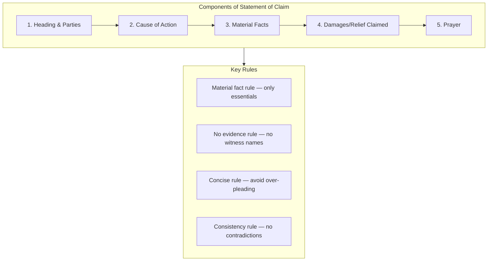

# L06 — Drafting statements of claim

> [!abstract] Chapter Overview
> This chapter covers **drafting statements of claim** — the foundational pleading that sets out the plaintiff's cause of action. Key principles: plead *material facts* (not evidence), be clear and concise, and ensure legal sufficiency.
<!-- -->
> [!important] Core Principle
> *Facta probanda* (facts that must be proved) go in the pleading. *Facta probantia* (facts used to prove) do NOT go in the pleading — they are evidence.

## Visual Overview

**Diagram:** Pleadings Structure

![[diagrams/pleadings-structure.html]]

*Figure: The structure and rules for drafting a statement of claim.*

> [!tip] Connection
> After drafting the statement of claim, the defendant responds with [[L07 - Drafting pleas and special pleas|a plea]]. If the pleading is defective, see [[L09 - Drafting exceptions and striking out|exceptions]].

---

## Chapter Content Walkthrough

- □ Sign your name legibly on all pleadings you have to sign, or print your name below your signature. You are responsible for the pleadings and should not hide behind an illegible signature. The other side is also entitled to know who has signed the pleading so that they can check whether you are entitled to sign.
- □ Knowingly pleading false claims or defences is unethical and may in extreme cases even be tantamount to fraud.
- □ It is equally wrong to plead facts for which you have no foundation in your instructions.
- □ It is unethical to overstate claims. In compensation cases (such as personal injuries or expropriation cases) where the assessment of the compensation has to be made by the court, there is room for differences of opinion. It will be appropriate to make your own assessment and then to claim slightly more than that amount to be on the safe side.
- □ A so-called 'tactical denial' is as dishonest as a false denial. If the party does not know whether an allegation pleaded by the other party is true or can be proved by him or her, the appropriate way to plead to that allegation is to decline to admit it. If so inclined, you may plead: 'The defendant has no knowledge of the allegations in paragraph 5 of the particulars of claim and therefore does not admit them.' You should not deny allegations unless you intend to lead evidence supporting the denial. Remember that a denial is in itself a positive statement; its effect is that the opposite of the factual allegation which it denies is true.
- □ The use of precedents is fraught with danger. The facts of the case should not be forced into a pleading drafted for another set of facts. It is better to use a good book with examples of different causes of action and defences like *Amler's Precedents of Pleadings* LexisNexis (latest edition) (known as '*Amler*') than to blindly follow a pleading drafted by you or someone else for another case. *Amler* has a good summary of the legal requirements for each [[Page-54|cause of action]] or defence in the book. That should be your starting point.
- □ Nevertheless, in cases which occur frequently, the 'known' and 'understood' formulae may be used for the sake of brevity. You may find some examples of the known and understood formulae in the cases that find their way to the Registrar or the [[Page-179|Motion Court]] for default or summary judgment orders. For example, the price of goods is often claimed as 'the purchase price of goods sold and delivered at the defendant's special instance and request'. What this means is that there was a contract of sale between the parties and the defendant has failed to pay the purchase price.

## Chapter 6 Drafting statements of claim

### CONTENTS

- 6.1 Introduction
- 6.2 Form and content of claims
  - 6.2.1 The parties
  - 6.2.2 [[Page-41|Locus standi]]
  - 6.2.3 Jurisdiction
  - 6.2.4 Setting out the cause of action
  - 6.2.5 Compliance with any special procedural requirements
  - 6.2.6 The prayer
- 6.3 Particulars of claim
- 6.4 Declaration
- 6.5 Counterclaim
- 6.6 Third-party claim
- 6.7 Interpleader claim
- 6.8 Provisional sentence summons
- 6.9 The charge (in a summons, charge sheet or indictment)
- 6.10 Protocol and ethics

## 6.1 Introduction

Every legal proceeding is based on a foundational document which sets out what claims are being made against the party who is being sued. In criminal cases the accused receives a summons, a charge sheet or an indictment which sets out particulars of the charge. In civil cases the statement of claim constitutes the fundamental document on which the proceedings are based. Claims are made in the form of written statements of claim which should set out

---

"who" is claiming "what", "from whom" and "why". You will encounter statements of claim in different forms in the litigation process. They have been given different names according to their purpose. In this book the term "statement of claim" is used in the generic sense; it applies to all the various forms of claim documents and can also be used for [[Page-30|arbitration]] claims.

- A liquidated claim is made in a "simple summons", which has to comply with the requirements of Rule 17(1) and be in the form prescribed in Form 9 of the First Schedule to the rules. Although a simple summons states the claim in abbreviated form, it should contain a complete [[Page-54|cause of action]].
- When an action for a liquidated claim is defended a "declaration", which sets out the full details of the claim, has to be delivered (filed and served) in terms of Rule 20.
- An unliquidated claim is made by way of "particulars of claim", which is a separate document and is attached to a "combined summons". The combined summons has to comply with the requirements of Rule 17(2) and be in the form prescribed in Form 10 of the First Schedule. A declaration and particulars of claim are practically identical in their content and style.
- A "counterclaim" (or "claim in reconvention") is a claim made by a defendant against a plaintiff in an existing action and follows the form of a declaration. It is made under Rule 22.
- A "third-party claim" under Rule 13 and Form 7 is used to join additional parties to an existing action. A third party may join further third parties. (In order to avoid confusion, third parties are given numbers like plaintiffs and defendants, in the order in which they are joined, for example, "first third party", "second third party", and so on.)
- An "interpleader claim" under Rule 58 is made by an interpleader claimant in the form of particulars of claim.
- A "provisional sentence summons" under Rule 8 and Form 3 is used for claims based on liquid documents.

In a criminal case the foundational document is a summons, charge sheet or indictment. The principles involved for these documents are discussed in paragraph 6.9.

## 6.2 Form and content of claims

The form of a statement of claim is regulated by the rules and the Forms prescribed in Schedule 1. The content of a statement of claim is dictated by three separate sets of principles. The *first* is the legal requirement that all the material facts upon which the claim is based, have to be set out in the statement of claim. The *second* is the general requirement contained in Rule 18(4) that sufficient particulars of the substance of the case against the defendant must be pleaded to enable the defendant to reply to the statement of claim. The *third* is the procedural requirement that certain formal and conventional or customary matters should also be covered in the statement of claim.

A statement of claim gives details of the following -

- the parties;
- their *[[Page-41|locus standi]]*;
- the jurisdiction of the particular court in which the action is brought;
- the material facts of the claim (with the particulars required by Rule 18);
- compliance with any special procedural requirements; and
- the relief or orders claimed.

### 6.2.1 The parties

Examples of the citation of different persons and entities are given in chapter 5. It is essential that all the appropriate parties are joined in the action; otherwise a special plea of non-joinder may be upheld. Who should be joined is a matter of substantive law and depends on the facts of individual cases. Multiple plaintiffs and defendants may be joined in one action, but care should be taken that there is no misjoinder either, that is, no inappropriate joinder of any party; otherwise a special plea of misjoinder may be upheld. There is a misjoinder if a party with no interest in the relief or against whom no relief is claimed is joined either as a plaintiff or as a defendant.

### 6.2.2 Locus standi

The term *locus standi* is used in its primary sense, meaning a person or party's capacity to participate unassisted in legal proceedings; how a minor can sue or be sued, how to cite a company, partnership, trust, municipality, state department, foundation or even a firm. In its secondary sense, *locus standi* refers to the relationship between the plaintiff and the subject-matter of the claim. A legal relationship has to exist between the plaintiff and the cause of action to explain why *this* plaintiff is entitled to make *this* claim against *this* defendant. *Locus standi* in its secondary sense has to be established as part of the cause of action.

### 6.2.3 Jurisdiction

---

Jurisdiction has more than one aspect to it, namely: (i) whether the court in which the action is to be instituted, has jurisdiction over the particular defendant; (ii) whether that *(see page 97)* court has jurisdiction over the particular [[Page-54|cause of action]]; and (iii) whether the claim is subject to special jurisdiction, for example, a maritime claim. You could use a checklist to ensure that jurisdiction is established by asking:

- Does the defendant's reside within the jurisdiction of the court?
- Did the cause of action arise within the area of jurisdiction of the court?
- Does a special court exists for the type of claim concerned?
- Is there a special procedure within the court's existing structures, for example, admiralty?
- Could or should a consent to jurisdiction be asked for?

### 6.2.4 Setting out the cause of action

A "cause of action" is a set of facts giving rise to a claim recognised by the law. The statement of claim has to traverse all the material facts of the cause of action relied upon. Each item in the prayer should be supported by the material facts required for that item of relief.

Causes of action could conveniently be classified under the following headings:

- **Contractual claims:** all causes of action claiming performance under a contract or damages arising from the breach of contractual obligations.
- **Delictual claims:** all causes of action based on delict, whether the delict has negligence or intention as an ingredient or not.
- **Enrichment claims:** all causes of action relying on any of the *condictiones* or (possibly) a general enrichment action.
- **Statutory claims:** a cause of action which has its basis exclusively in a statute.
- **Mixed claims:** causes of action of mixed origin, for example, an action under the Road Accident Fund Act 56 of 1996 or a divorce action - each relies in part on the common law and in part on a statute.

Multiple claims may be pleaded cumulatively or in the alternative, but not in such a way that the statement of claim becomes vague and embarrassing.

### 6.2.5 Compliance with any special procedural requirements

The Rules of Court lay down various additional requirements for claims. These have to be pleaded in addition to the ordinary facts of the cause of action. Here are a few examples:

- A party suing on a contract has to state whether the contract is oral or in writing and, if it is in writing, has to attach a copy (Rule 18(6)).
- In a divorce action where allegations are made regarding "time", "date", "place" and "another person" (meaning adultery is alleged), those details have to be set out (Rule 18(8)). A party claiming division, transfer or forfeiture of assets in a divorce action also has to give details of the grounds upon which those claims are made (Rule 18(9)).
- A plaintiff suing for damages has to set them out in such a manner that the defendant can reasonably assess their *quantum*. If the claim is for damages for personal injuries, the plaintiff has to give details of the date of birth, the nature and extent of injuries, the nature, effect and duration of any disability. The plaintiff should also set out separately what is claimed for medical and hospital costs, pain and suffering, disability in respect of earnings, loss of amenities and disfigurement (Rule 18(10)).
- A plaintiff suing for loss of support as a result of the death of a person, has to state the date of birth of the deceased and every claimant (Rule 18(10)).

### 6.2.6 The prayer

The content of a statement of claim is determined to a large extent by the relief claimed in the prayer. The prayer takes its name from the customary words: "Wherefore the plaintiff prays for judgment against the defendant for..." The prayer plays a far more important role than its position at the end of the statement of claim may hint at. The prayer determines who the necessary parties are, which court will have jurisdiction, how the cause of action is pleaded, and also how the relief itself will be worded and what ancillary relief should be claimed.

A statement of claim without a prayer is deficient; an [[Page-75|exception]] may be taken to it on the basis that no cause of action is disclosed or that the statement of claim is vague and embarrassing. It should be self-evident that a statement of claim that does not tell the defendant what is being claimed, is vague and embarrassing. A statement of claim without a prayer may also be set aside as an irregular proceeding under the provisions of Rule 30.

The prayer has to specify *all* the relief the court is asked to grant the plaintiff. The plaintiff will not be granted relief that is not foreshadowed by the prayer unless an amendment of the statement of claim and prayer is granted

---

first. Such an amendment may be granted at the plaintiff's expense and after some delay. The court can always grant the plaintiff less than is claimed in the prayer, but not more, unless an amendment has been allowed. The court can grant only the type of relief claimed. If you claim delivery of a tractor by way of the rei vindicatio, you cannot ask for judgment for delivery of anything else, nor for payment of money, unless there is an alternative prayer supported by the necessary factual allegations

You may therefore question the purpose of claiming "further", "alternative" and/or "other" relief. If you want more than already stipulated in the prayer, you have to notify the defendant and amend your prayer. If you want something different to what you have claimed thus far, you once again have to notify the defendant and amend the pleading. Each time you amend, the defendant gets another opportunity to raise a defence. The opinion is sometimes held that this type of catch-all prayer enables the pleader to ask the court for procedural relief such as amendments or postponements, but that cannot be correct as the court has specific, as well as inherent, jurisdiction to grant such relief. The truth is that the prayer for further, alternative and/or other relief is a relic of the distant past when a single word out of place defeated a claim or defence.

### 6.3 Particulars of claim

We may now return to our client, Mrs Anne Smith, a widow now that her husband has been killed in the collision. We have established from her that she was driving her own car at the time of the collision and that she now wants to sue for the repair costs. She also had to hire another car while her own was being repaired. The first step is to identify the material facts (or [[Page-47|facta probanda]]) which are to be set out in the statement of claim. They are -

- the plaintiff's interest in the car (for example, ownership);
- the defendant's act (driving);
- which was performed negligently;
- and caused;
- damage to the plaintiff's car;
- and a diminution in the plaintiff's patrimony (the loss).

You are required to set out the material facts with sufficient particularity to enable the defendant to reply to the particulars of claim (Rule 18(4)). You also have to set out the particulars in consecutively numbered paragraphs containing, as far as possible, separate allegations (averments) (Rule 18(3)). Since the claim is for damages, sufficient the particulars have to be given to enable the defendant to make a reasonable assessment of the quantum of the claim (Rule 18(10)).
Table 6.1 Particulars of claim in a damages action

| Par   | Text of pleading                                                                                                                                              | Comment                                                                                                                                                                                                                                                                                                                                                                                                                                                                                        |
| ----- | ------------------------------------------------------------------------------------------------------------------------------------------------------------- | ---------------------------------------------------------------------------------------------------------------------------------------------------------------------------------------------------------------------------------------------------------------------------------------------------------------------------------------------------------------------------------------------------------------------------------------------------------------------------------------------- |
|       | **Annexure: Plaintiff's Particulars of Claim**                                                                                                                | The Particulars of Claim is an "annexure" to the combined summons in terms of Form 10.                                                                                                                                                                                                                                                                                                                                                                                                         |
| 1     | The plaintiff is Anne Smith, an unemployed widow who resides at [street address].                                                                             | 1 Rule 17(4) requires her name, residence, occupation, sex and marital status, (if female). 2 Describing the plaintiff as a "widow" gives her gender, marital status and [[Page-41\|locus standi]] in one word.                                                                                                                                                                                                                                                                                |
| 2     | The defendant is Joe Soap, an adult male, carpenter, who resides at (street address).                                                                         | 1 Rule 17(4) again but no marital status required to be pleaded for males. 2 Locus standi is demonstrated by his adult status. 3 The jurisdiction of the court over the defendant is demonstrated by the fact that he is resident within the court's jurisdiction.                                                                                                                                                                                                                             |
| 3     | The plaintiff was at all material times the owner of a [year] Honda motorcar with registration number NPN 2001 ("the plaintiff's car").                       | 1 Ownership of the car is a sufficient interest in the car to demonstrate the plaintiff's right to sue for the loss. (No interest, no loss.) The first material fact has been pleaded. 2 The phrase "at all material times" is used to avoid having to give the date of the collision and loss repeatedly. 3 Since the car will be referred to a few times, a definition is created to avoid archaic and stilted phrases like "the plaintiff's aforesaid car" or "the plaintiff's said Honda". |
| 4.1   | On [date] and at about 09:30 a collision occurred between the plaintiff's car and another car which was then being driven by the defendant ("the collision"). | 1 The second material fact, the collision, has been pleaded. 2 The date and time of the collision are necessary to enable the defendant to reply (see Rule 18(4)). 3 Why write, "On or about [date]..."? 4 One definition ("the plaintiff's car") is used and another ("the collision") created.                                                                                                                                                                                               |

---

|       |                                                                                                                                             | 5 It is not necessary to specify who drove the plaintiff's car as it is not relevant to the [[Page-54\|cause of action]].                                                                                                                                                                                                                                                                                                                                           |
| ----- | ------------------------------------------------------------------------------------------------------------------------------------------- | ------------------------------------------------------------------------------------------------------------------------------------------------------------------------------------------------------------------------------------------------------------------------------------------------------------------------------------------------------------------------------------------------------------------------------------------------------------------- |
| 4.2   | The collision occurred at the intersection of [street] and [street], [city or town], within this court's jurisdiction ('the intersection'). | 1 The defendant should be told where the collision occurred as a particular required under Rule 18(4). 2 A second ground for jurisdiction is established. 3 The second definition is used and another created. 4 Paragraphs 4.1 and 4.2 can be combined, but then it will be a longer, unwieldy paragraph. Rule 18(3) requires a separate, numbered paragraph for each distinct averment. 5 The use of sub-paragraphs may help avoid problems with awkward grammar. |

| Par             | Text of pleading                                                                                                                                                                                                                                            | Comment                                                                                                                                                                                                                                                                                                                                                                                                                                                                                                                                                                                                                        |
| --------------- | ----------------------------------------------------------------------------------------------------------------------------------------------------------------------------------------------------------------------------------------------------------- | ------------------------------------------------------------------------------------------------------------------------------------------------------------------------------------------------------------------------------------------------------------------------------------------------------------------------------------------------------------------------------------------------------------------------------------------------------------------------------------------------------------------------------------------------------------------------------------------------------------------------------ |
| 5               | The collision was caused by the defendant's negligence.                                                                                                                                                                                                     | 1 The third material fact, negligence, has now been pleaded. 2 However, the defendant has not yet been given sufficient details of the grounds of negligence relied on (Rule 18(4)). 3 The definitions created earlier are being used consistently.                                                                                                                                                                                                                                                                                                                                                                            |
| 5.1 5.2 5.3 5.4 | *Particulars of defendant's negligence:* He entered the intersection against the red traffic light. He drove at an excessive speed. He failed to keep a proper lookout. He failed to take adequate steps to avoid the collision when he could have done so. | 1 The device of "Particulars" is used to provide a list of details to comply with Rule 18(4). 2 The particulars are given, as far as possible, in sequence, as the events unfolded. 3 The use of "and/or" is avoided. ("The defendant was negligent in one or more of the following respects: . . .", instead of using the device of "Particulars".) 4 The grounds of negligence are specific, not general. They relate to the facts of this case.                                                                                                                                                                             |
| 6               | As a result of the collision and the defendant's negligence, the plaintiff's car was damaged and the plaintiff has suffered damages in the sum of R149 000.00.                                                                                              | 1 The fourth, fifth and sixth material facts, namely causation, damage to the plaintiff's car and the amount of the loss, have been pleaded. 2 The definitions are being used: They've become quite useful, haven't they?                                                                                                                                                                                                                                                                                                                                                                                                      |
| 6.1 6.2 6.3 6.4 | *Particulars of plaintiff's loss* Value of plaintiff's car before the collision R440 000.00 Value of plaintiff's car after the collision R110 000.00 SUBTOTAL R330 000.00 Cost of hiring replacement car for 45 days @ R200.00 R9 000.00 TOTAL R339 000.00  | 1 The device of "Particulars" is used to give the additional details required by Rule 18(4). 2 Legal research will be done to arrive at the amount claimed. What is the basis for the assessment? The answer can be found in *Erasmus v Davis* 1969 (2) SA 1 (A) (in the majority decision). In some cases the repair costs would be claimed and particulars of those would be given instead as: "The reasonable cost of repairing the damage to the plaintiff's car is R339 000.00, which does not exceed the difference between its pre- and post-collision values." (The cost of hiring another car should still be added.) |
| 7               | In the premises, the defendant is liable to pay the sum of R339 000.00 to the plaintiff.                                                                                                                                                                    | 1 The conclusion follows as a matter of law if all the material facts pleaded are established. 2 The phrase "in the premises" means "as a result of what was said earlier".                                                                                                                                                                                                                                                                                                                                                                                                                                                    |

| Par     | Text of pleading                                                                                                                                                                                     | Comment                                                                                                                                                                                                                                                                                                                                                                                                                                                                                                                                                                                                    |
| ------- | ---------------------------------------------------------------------------------------------------------------------------------------------------------------------------------------------------- | ---------------------------------------------------------------------------------------------------------------------------------------------------------------------------------------------------------------------------------------------------------------------------------------------------------------------------------------------------------------------------------------------------------------------------------------------------------------------------------------------------------------------------------------------------------------------------------------------------------- |
| 8       | Notwithstanding demand, the defendant has failed to pay the sum claimed.                                                                                                                             | 1 While a demand is not required as a material fact and is not required by the rules either, it is customary to give details of the demand, if one has been made. 2 You should have given the defendant full details of the pre- and post-collision values and repair costs with a demand to pay within a reasonable time (specified). The court could then have been asked to grant interest on the unliquidated claim for damages from the date the defendant has had a reasonable opportunity to assess the amount of the loss. See sections 1 and 2 of the Prescribed Rate of Interest Act 55 of 1975. |
| (a) (b) | *In the premises the plaintiff claims judgment against the defendant for -* payment of the sum of R339 000.00; interest on the sum claimed in paragraph (a) in terms of section 2 of Act 55 of 1975; | 1 "... the plaintiff prays for judgment", can be used. 2 The precise sum claimed has to be specified. 3 If interest is claimed at a specific rate or from a specific date, those details ought to be given. Section 2(1) of Act 55 of 1975 allows interest from the date of judgment at a prescribed rate, which varies from time to time. 4 If extraordinary costs are claimed, that has to be specified,                                                                                                                                                                                                 |

---

| (c)   | costs of suit.                                                                                                                       | for example, "... on the scale as between attorney and client" or "including the costs of two counsel". 5 It is meaningless to ask for "further, alternative and/or other relief". |
| ----- | ------------------------------------------------------------------------------------------------------------------------------------ | ---------------------------------------------------------------------------------------------------------------------------------------------------------------------------------- |
|       | Dated at [place] this [date]                                                                                                         | These details are given customarily.                                                                                                                                               |
|       | Signature Counsel's name (printed) PLAINTIFF'S COUNSEL                                                                               | Counsel, or an attorney with the right of audience in the High Court, or an individual party personally, must sign the pleading.                                                   |
|       | Signature Attorney's name (printed) X, Y & Z Partnership Plaintiff's Attorneys [address and details as per Rule 6(5)(b).] Ref: S.101 |                                                                                                                                                                                    |

The particulars of claim should now be -

- clear;
- concise;
- complete;
- accurate;
- consistent in its terminology; and
- in compliance with the rules in both form and content.

With a bit of luck and effort they could even be eloquent and elegant.

Mrs Smith has other unliquidated claims. They are the claims for the loss of support she and her children have suffered as a result of her late husband's death and the claims for damages arising from their personal injuries. The particulars of claim in that case will be far more elaborate and will require extensive planning and a good grasp of the principles of pleading. As usual, the first step ought to be to identify the material facts to be pleaded. Then the additional requirements of the rules should be identified so that they can be complied with. Before this process is started, it has to be determined whether all the plaintiffs can sue in one action. In this case they can (Rule 10(1)). Can, or should, they sue in one action for damages for their loss of support arising from the death of the deceased and also for damages for their personal injuries? They have no choice; they have to sue for all their personal damages arising from the collision in one action against the Road Accident Fund. This answer can be found in *Evins v Shield Insurance Co Ltd* 1980 (2) SA 814 (A). A framework for the particulars of claim with a list of material facts, as supplemented by the additional particulars which have to be given in terms of Rule 18, can now be constructed -

A first plaintiff + her date of birth (required by Rule 18(11))
second plaintiff + date of birth (represented by first plaintiff as guardian)
third plaintiff + date of birth (also represented by first plaintiff)
defendant and its *[[Page-41|locus standi]]*
B deceased + his date of birth
the marriage between the first plaintiff and the deceased
the second and third plaintiffs were born of that marriage
C the collision (the "insured driver's" act)
his negligence (if a material fact)
which caused
the death of the deceased
D the deceased owed the plaintiffs a duty of support
he did support them
they needed that support
he would have continued to support them, but for his death
they have lost that support as a result of his death
the amount of each plaintiff's loss + particulars to enable defendant to assess the quantum
E the insured driver's negligence (if a material fact) caused the first plaintiff to suffer bodily injuries
she suffered damages + Rule 18(10) particulars to enable the defendant to assess them
F the insured driver's negligence (if a material fact) caused the second plaintiff to suffer bodily injuries
and he suffered damages + Rule 18(10) particulars
G the insured driver's negligence caused the third plaintiff to suffer bodily injuries
she suffered damages + with Rule 18(10) particulars

---

H the insured driver's negligence caused the three plaintiffs to suffer a loss of support the amount of each plaintiff's loss + Rule 18(10) particulars
I Road Accident Fund Act notices given time periods complied with prescribed period has elapsed.

The material facts have been identified and arranged in clusters where they belong together. You can now draft the particulars of claim with this framework as a guide.

## 6.4 Declaration

Mrs Smith wants to sue the insurance company as well for payment of the amount due on her husband's life policy, which has been ceded to her. Assume that she has already sued by way of a simple summons because the claim is liquidated, but the action has been defended. Assume there has been no application for summary judgment. It is necessary to draft a declaration. We have a copy of the policy. It provides that the insurer will, against payment of a stipulated premium, pay the sum of R750 000.00 to the deceased upon his death. We also have a written cession, signed by the deceased, in which he ceded the policy to our client. She tells us all premiums were paid by way of a debit order on the deceased's bank account. The first step is again to identify the material facts.

They are (not necessarily in the order they should be set out in the declaration) -

- a contract of insurance between the deceased and the defendant;
- including a term that the deceased had to pay premiums;
- and a term that the defendant had to pay the sum assured on the death of the deceased;
- payment of the premiums;
- the death of the deceased; and
- the cession to our client.

Rule 18(6) imposes an obligation on a plaintiff suing on a contract to state whether the contract was oral or written, and to state when, where and by whom, on behalf of the parties, it was concluded. We also have to attach a copy of the policy.
Table 6.2 Declaration in a contractual claim (with a cession)

| Par   | Text of pleading                                                                                                                                                                                                                                                                                | Comment                                                                                                                                                                                                                                                                                                                                                                                                                                                                                                                                                     |
| ----- | ----------------------------------------------------------------------------------------------------------------------------------------------------------------------------------------------------------------------------------------------------------------------------------------------- | ----------------------------------------------------------------------------------------------------------------------------------------------------------------------------------------------------------------------------------------------------------------------------------------------------------------------------------------------------------------------------------------------------------------------------------------------------------------------------------------------------------------------------------------------------------- |
|       | [COURT DESCRIPTION as prescribed] Case no 123/[year] Between: Anne Smith PLAINTIFF and ABC Insurance Limited DEFENDANT PLAINTIFF'S DECLARATION                                                                                                                                                  | 1 The case number and heading are obtained from the simple summons. 2 The description of the court has to be correct (see Schedule 1 to the Supreme Court Act 59 of 1959).                                                                                                                                                                                                                                                                                                                                                                                  |
| 1     | The plaintiff is Anne Smith, an unemployed widow who resides at [street address].                                                                                                                                                                                                               |                                                                                                                                                                                                                                                                                                                                                                                                                                                                                                                                                             |
| 2     | The defendant is ABC Insurance Limited, a company with limited liability, which is duly registered and incorporated according to law and has its registered office at [street address].                                                                                                         | 1 You will probably sue in the city where the defendant (a company) has its registered office. There may be a good argument that the contract was concluded in the same city as the policy was issued there. 2 Do not take chances with jurisdiction.                                                                                                                                                                                                                                                                                                       |
| 3     | On or about [date] the defendant, represented by its policy manager, Joseph James, and John William Smith ("the deceased") concluded a written contract of life assurance ("the policy") at [city], alternatively, at [plaintiff's town or city]. A copy of the policy is attached, marked "A". | 1 You can plead on or about if you are uncertain precisely when the contract was concluded, for example, if the policy document does not have a date on it. 2 The "when", "where", "by whom" and whether it was "written" or "oral" are given as required by Rule 18(6). 3 Attach a copy of the whole policy if it is short enough. If it were a booklet you should only attach the parts relied upon. 4 The alternative can be pleaded if you are unsure whether the contract was concluded where the policy was issued or where the deceased received it. |

---

| 4 4.1 4.2 4.3 | *Material terms of the policy* The defendant insured the life of the deceased for R750 000.00 ("the sum assured"). The deceased was to pay premiums of R750.00 per month to the defendant from the date of the policy until the date of his death. The defendant was to pay the sum assured to the deceased or his nominee upon his death. | Only the terms that are directly relevant to the claims in the prayer have to be set out as material facts.                                                                                                                                                                                                                                                                                                                                                  |
| ------------- | ------------------------------------------------------------------------------------------------------------------------------------------------------------------------------------------------------------------------------------------------------------------------------------------------------------------------------------------ | ------------------------------------------------------------------------------------------------------------------------------------------------------------------------------------------------------------------------------------------------------------------------------------------------------------------------------------------------------------------------------------------------------------------------------------------------------------ |
| 5             | The deceased paid all the premiums which fell due under the policy to the defendant.                                                                                                                                                                                                                                                       | Performance has to be pleaded as a material fact.                                                                                                                                                                                                                                                                                                                                                                                                            |
| 6             | On [date] the deceased ceded all his rights under the policy to the plaintiff. A copy of the written cession is attached, marked "B".                                                                                                                                                                                                      | 1 On a strict interpretation you do not need to attach a copy of the cession because it is not a contract as contemplated by Rule 18(6). 2 But the existence of a written cession may prompt the defendant to capitulate. 3 These facts may be set out here to maintain the sequence of events although many would plead the cession as the last material fact. 4 You should refrain from using the archaic and tautologous "right", "title" and "interest". |
| 7             | The deceased died on [date]. A copy of the death certificate to that effect is attached, marked "C".                                                                                                                                                                                                                                       | 1 The death certificate is evidence and should not be pleaded. 2 A death certificate is an official document that may provide *prima facie* proof of its contents (see the Births, Marriages and Deaths Registration Act 81 of 1963). 3 The defendant may perhaps be persuaded to settle when confronted by these documents.                                                                                                                                 |
| 8             | In the premises the defendant is liable to pay the sum of R750 000.00 to the plaintiff.                                                                                                                                                                                                                                                    | The legal conclusion arising from the material facts has to be pleaded.                                                                                                                                                                                                                                                                                                                                                                                      |
| 9             | Notwithstanding a written demand delivered to the defendant with copies of the policy, cession and death certificate on [date], the defendant has failed to pay the sum claimed to the plaintiff.                                                                                                                                          | 1 Pleading a demand is customary, but if you want interest from the time of demand you have to plead the precise date of the demand. 2 You should provide details of the demand to furnish the court and the defendant with the facts upon which the client relies for her interest claim.                                                                                                                                                                   |

| Par   | Text of pleading                                                                                                                                                    | Comment                                                                                                                                                                                                                |
| ----- | ------------------------------------------------------------------------------------------------------------------------------------------------------------------- | ---------------------------------------------------------------------------------------------------------------------------------------------------------------------------------------------------------------------- |
| (a)   | Wherefore the plaintiff claims judgment against the defendant for:                                                                                                  |                                                                                                                                                                                                                        |
| (b)   | Payment of the sum of R750 000 00. Interest on the sum of R750 000 00 at the rate prescribed by section 2 of Act 55 of 1975 from [date] to the date of payment.     |                                                                                                                                                                                                                        |
| (c)   | Costs of suit.                                                                                                                                                      |                                                                                                                                                                                                                        |
|       | Dated at [place] this [date]                                                                                                                                        |                                                                                                                                                                                                                        |
|       | *Signature* Counsel's name (printed) PLAINTIFF'S COUNSEL                                                                                                            |                                                                                                                                                                                                                        |
|       | *Signature* Attorney's name (printed) X, Y & Z Partnership Plaintiff's Attorneys [street address] Care of Messrs M, N & O [address and details as per Rule 6(5)(b)] |                                                                                                                                                                                                                        |
|       | To: The Registrar [street address] And to: Messrs J, A & K Inc Defendant's Attorneys [address and details as per Rule 6(5)(d)]                                      | Since there is already a firm of attorneys on record for the defendant, (they have delivered a notice of intention to defend), a copy of the declaration has to be served on them. The original goes to the registrar. |

---

Keep in mind the earlier comments about the use of definitions and the need to cover each material fact.

## 6.5 Counterclaim

A counterclaim is a claim made by a defendant in existing proceedings against the plaintiff who has sued him or her. The counterclaim does not have to be linked to the plaintiff's claim. The idea is that the litigation should resolve all outstanding claims between the parties so that a final accounting may be effected between them. It is not compulsory to make a counterclaim. The defendant may institute a separate action but the separate actions may be consolidated later in terms of Rule 11 if it appears to the court to be convenient to consolidate the two actions.

In the action where we act for Mrs Smith, the driver of the other car has delivered a plea and a counterclaim. He blames Mrs Smith for the collision and counterclaims for his own damages.

**Note:** This counterclaim has deliberately been drafted in a different style so that deficiencies and inelegant style can be identified.
**Table 6.3** Counterclaim (for damages)

| Par       | Text of pleading                                                                                                                                                                                                                                                                                                                            | Comment                                                                                                                                                                                                                                                                                                                                                                                                                                                                                                                                                                                          |
| --------- | ------------------------------------------------------------------------------------------------------------------------------------------------------------------------------------------------------------------------------------------------------------------------------------------------------------------------------------------- | ------------------------------------------------------------------------------------------------------------------------------------------------------------------------------------------------------------------------------------------------------------------------------------------------------------------------------------------------------------------------------------------------------------------------------------------------------------------------------------------------------------------------------------------------------------------------------------------------ |
|           | [COURT DESCRIPTION as prescribed] Case no 123/[year] Between: Anne Smith PLAINTIFF and Joe Soap DEFENDANT DEFENDANT'S CLAIM IN RE-CONVENTION                                                                                                                                                                                                | 1 You may prefer 'counterclaim'. 2 The term 'claim in re-convention' is archaic legalese.                                                                                                                                                                                                                                                                                                                                                                                                                                                                                                        |
| 1         | The plaintiff in re-convention is the defendant in convention and the defendant in re-convention is the plaintiff in convention but *brevitatis causa* the plaintiff in re-convention is referred to as the defendant and the defendant in re-convention is referred to as the plaintiff.                                                   | 1 There is no need for convoluted pleading like this. 2 The Latin phrase means 'in the interest of brevity', but as you can see, brevity has been completely defeated by what the pleader has done. 3 'The parties are described as in the plaintiff's particulars of claim', would have been enough.                                                                                                                                                                                                                                                                                            |
| 2         | The defendant repeats paragraphs 1, 2, 4.1 and 4.2 of the plaintiff's particulars of claim as if specifically incorporated herein.                                                                                                                                                                                                          | 1 You may incorporate allegations from other pleadings but you should ensure that they are correct. 2 In this instance you may wonder if the defendant intended to admit the plaintiff's ownership of the car, but he has perhaps done so inadvertently. 3 The words 'as if specifically incorporated herein' are superfluous.                                                                                                                                                                                                                                                                   |
| 3 3.1     | At all material times: the defendant was the lawful possessor of motor vehicle NU 8888, a Ford Granada Ghia, in terms of a valid hire purchase agreement;                                                                                                                                                                                   | 1 This is not a bad paragraph. The opponent has obviously done some legal research to find out what to do when his client is not the owner of the car in respect of which he wants to claim repair costs. Then he set out the right allegations.                                                                                                                                                                                                                                                                                                                                                 |
| 3.2       | under the aforesaid hire purchase contract: (a) the defendant had the obligation to maintain and repair the aforesaid motor vehicle if it were damaged; and (b) the defendant bore the risk of loss and damage in respect of the said motor vehicle.                                                                                        | 2 The creation of a definition or two could have avoided the use of stale and stilted words like 'aforesaid' and 'said'. 3 While 'contract' and 'agreement' are synonyms, it is preferable to use the one or the other consistently. 4 Should the pleader have stated whether the HP contract was oral or written, and if written should he have attached a copy in terms of Rule 18(6)? You may argue that the rule is meant to cover the case where the claim is based on a contract between the parties. Here the HP contract is merely evidence supporting the right to sue for the damages. |
| 4 4.1 4.2 | The said collision was caused by the sole and exclusive negligence of the plaintiff who was negligent in one or more or all of the following aspects: She drove at a speed which was excessive in the circumstances. She failed to accelerate, swerve aside, stop, brake, slow down or take any other reasonable steps she could and should | 1 The word 'said' again. 2 Do the words 'sole and exclusive' contribute anything? 3 What precisely does paragraph 4.2 mean? Did your client go too fast or too slow? What other steps should she have taken? 4 The defendant should have some evidence to prove the allegation in paragraph 4.3.                                                                                                                                                                                                                                                                                                 |

---

| 4.3   | have taken to avoid the accident. She failed to maintain her car in a roadworthy condition.                                                                                                                 | 5 There is some inconsistency in the terminology, "accident/collision".                                                                                                                                                      |
| ----- | ----------------------------------------------------------------------------------------------------------------------------------------------------------------------------------------------------------- | ---------------------------------------------------------------------------------------------------------------------------------------------------------------------------------------------------------------------------- |
| 5     | As a result of the collision, the defendant's car was damaged and the reasonable and necessary cost of repair was R247 000.00. Attached are three quotations for the said repairs, marked "A", "B" and "C". | 1 Causation and the cost of repair could have been set out in two separate paragraphs, each containing a "distinct averment" as contemplated by Rule 18(3). 2 The quotations are evidence and should not have been attached. |

| Par   | Text of pleading                                                                                                                                                                                         | Comment                                                                                                                                                                                                                                                                                                                    |
| ----- | -------------------------------------------------------------------------------------------------------------------------------------------------------------------------------------------------------- | -------------------------------------------------------------------------------------------------------------------------------------------------------------------------------------------------------------------------------------------------------------------------------------------------------------------------- |
| 6     | In the premises the plaintiff is liable to the defendant for the said damages but, notwithstanding demand, the plaintiff has failed, refused and/or neglected to pay the said damages or any part of it. | 1 The "said" word again. 2 There should have been two paragraphs. 3 What is the difference between "failed", "refused" and "neglected" in this context? Does it matter? 4 "And/or" to what purpose?                                                                                                                        |
|       | Wherefore the defendant prays for judgment for payment of R247 000.00, interest and costs.                                                                                                               | 1 You should put the different prayers in different paragraphs and state against whom the judgment is sought. 2 It is always preferable to state the rate of interest and the date from which it is claimed. If *mora* interest (as interest under Act 55 of 1975 has become known) is claimed, that should be made clear. |
|       | Dated at [place] this [date]                                                                                                                                                                             |                                                                                                                                                                                                                                                                                                                            |
|       | Signature DEFENDANT'S COUNSEL                                                                                                                                                                            | Counsel's name should have been printed.                                                                                                                                                                                                                                                                                   |
|       | Signature Attorney's name (printed) Messrs J, F & K ATTORNEYS Defendant's attorneys [address and details as per Rule 6(5)(d)] Ref: S1029.                                                                |                                                                                                                                                                                                                                                                                                                            |
|       | To: The Registrar Masonic Grove, Durban And to: X, Y & Z PARTNERSHIP Plaintiff's attorneys [address and details as per Rule 6(5)(b)]                                                                     |                                                                                                                                                                                                                                                                                                                            |

Even if you should think this is an irregular proceeding because it attached evidence, you should think twice before rushing to court to have it set aside. An application may cause an unnecessary delay in the proceedings.

## 6.6 Third-party claim

By way of the third-party procedure an existing party (plaintiff, defendant or even third party) to an action may join additional parties, referred to as third parties, to the action. The purpose of this procedure is to avoid a multiplicity of actions relating to the same subject-matter. In terms of Rule 13 the third-party procedure can only be used -

- where a party in an action claims, as against the party to be joined, a contribution from that third party; or
- where a party in an action claims, as against the party to be joined, an indemnity from that third party; or
- where a question or an issue in the action is substantially the same as one which has arisen or will arise between the party issuing the third-party notice and the third party to be joined, and it would be appropriate to determine that issue not only between the existing parties but also between the party issuing the notice and the third party to be joined.

An indemnification may be claimed, for example, from an insurer in terms of an insurance policy or from some other party in terms of an indemnity provided or undertaken by such party. A contribution may be claimed in a number of circumstances, including cases of joint wrongdoers (in delict), multiple insurance and partnership.

The procedure is to file and serve a notice in the form of a summons complying with Form 7 together with an annexure in the form of a statement of claim. We call this form of statement of claim a third-party claim for obvious reasons. The third-party notice serves the purpose of a summons, which calls upon the named third party to take steps to defend the claim and warns the third party of the consequences of failure to take those steps. The annexure to the third-party notice serves the same function as particulars of claim or a declaration.

---

The third-party notice and the pleadings arising from it create a separate lis (or dispute) within the action as a whole but only between the party issuing the notice and the third party upon whom it is served. For example, where a plaintiff sues a defendant for damages arising from a motor collision and the defendant joins his or her insurer as a third party, no lis arises between the plaintiff and the insurer. The plaintiff's action is based on a delict committed against the plaintiff by the defendant. The defendant has a separate action based on the insurance contract against the insurer. This means that the plaintiff cannot obtain judgment against the third party for the plaintiff's claim against the defendant. If the plaintiff, after receiving notice of the third-party proceedings, wishes to claim something from the third party, the plaintiff has to join that third party to the plaintiff's own action, either as a second defendant or as a further third party.

A third-party claim must -

- state the complete [[Page-54|cause of action]] of the party issuing it against the third party;
- set out the question or issue to be determined;
- contain a prayer for the relief claimed;
- comply with the rules of pleading because the third-party claim is a pleading; and
- attach a copy of all the pleadings filed to date of the service of the third-party notice.

What follows is a typical third-party claim in a partnership matter. It is based on the following assumed facts: The defendant has been sued for a partnership debt. The partnership (three partners) bought an expensive computer some years ago but the partnership has since been dissolved and the three partners have gone their separate ways. The seller of the computer has sued only our client, apparently because it believes that our client has sufficient funds to meet the claim. Our client thinks it is unfair that he alone should have to pay the whole debt. He feels that his erstwhile partners should pay their fair share of the debt. After doing the necessary legal research, we advised him that he has a right to claim a contribution from his erstwhile partners but only after he has paid the debt. He now wishes to claim such a contribution from the other two partners.
Table 6.4 Third-party claim for a contribution

| Par   | Text of pleading                                                                                                                                                                                                    | Comment                                                                                                                                                                                                                                                                   |
| ----- | ------------------------------------------------------------------------------------------------------------------------------------------------------------------------------------------------------------------- | ------------------------------------------------------------------------------------------------------------------------------------------------------------------------------------------------------------------------------------------------------------------------- |
|       | ANNEXURE: THIRD-PARTY CLAIM                                                                                                                                                                                         |                                                                                                                                                                                                                                                                           |
| 1     | The plaintiff is ABC (PROPRIETARY) LIMITED, a company whose full particulars are set out in the summons and particulars of claim ("the claim"), a copy of which is attached marked "A".                             | Rule 13(3)(a) requires a copy of the pleadings "up to the date of service of the notice" to be attached.                                                                                                                                                                  |
| 2     | The defendant is JOHN ALLEN, whose full particulars are set out in the claim, Annexure "A".                                                                                                                         |                                                                                                                                                                                                                                                                           |
| 3     | The first third party is ANDREW POST, an adult male, architect who resides at [street address].                                                                                                                     |                                                                                                                                                                                                                                                                           |
| 4     | The second third party is PETER PAN, an adult male, architect who resides at [street address].                                                                                                                      |                                                                                                                                                                                                                                                                           |
| 5     | The plaintiff has sued the defendant for payment of the sum of R750 000.00, interest and costs on the grounds set out in the claim.                                                                                 |                                                                                                                                                                                                                                                                           |
| 6     | The defendant disputes liability for the claim on the grounds set out in his plea, a copy of which is attached marked "B".                                                                                          |                                                                                                                                                                                                                                                                           |
| 7     | Material allegations in the claim are the following:                                                                                                                                                                | 1 In order to draft this third-party claim you will have to research the law of partnership, apart from finding all the technical requirements of the rules.                                                                                                              |
| 7.1   | The defendant was at all material times a partner in the partnership known as XYZ partnership ("the partnership").                                                                                                  | 2 You have to find out whether a partner is personally liable for the debts of the dissolved partnership.                                                                                                                                                                 |
| 7.2   | The plaintiff concluded a contract of sale with the partnership in terms of which it sold an IBM 9000 computer ("the computer") to the partnership for R750 000.00 ("the purchase price") payable on delivery.      | 3 You will find that he is not only liable for the debts of the dissolved partnership, but that a partnership creditor is entitled to recover the whole of his debt from any of the erstwhile partners, who are jointly and severally liable to creditors for such debts. |
| 7.3   | Notwithstanding delivery of the computer the purchase price remains unpaid.                                                                                                                                         | 4 The plaintiff cannot sue the partnership as it does not exist any more. It has to sue the individual partners.                                                                                                                                                          |
| 7.5   | The partnership has since been dissolved.                                                                                                                                                                           |                                                                                                                                                                                                                                                                           |
| 7.6   | The defendant, as a partner in the partnership when the plaintiff's claim against the partnership arose, is personally liable for payment of the purchase price. The plaintiff is therefore entitled to recover the |                                                                                                                                                                                                                                                                           |

---

| 7.7   | purchase price, interest and costs from the defendant. |       |
| ----- | ------------------------------------------------------ | ----- |

| Par   | Text of pleading                                                                                                                                                                                                                                                                                                          | Comment                                                                                                                                                                                                                                                                                                                                                                                                                                                                                                                                                                                                                                                                                                                                                                                                                                       |
| ----- | ------------------------------------------------------------------------------------------------------------------------------------------------------------------------------------------------------------------------------------------------------------------------------------------------------------------------- | --------------------------------------------------------------------------------------------------------------------------------------------------------------------------------------------------------------------------------------------------------------------------------------------------------------------------------------------------------------------------------------------------------------------------------------------------------------------------------------------------------------------------------------------------------------------------------------------------------------------------------------------------------------------------------------------------------------------------------------------------------------------------------------------------------------------------------------------- |
| 8     | In the event of -                                                                                                                                                                                                                                                                                                         |                                                                                                                                                                                                                                                                                                                                                                                                                                                                                                                                                                                                                                                                                                                                                                                                                                               |
| 8.1   | the court granting judgment in favour of the plaintiff for the purchase price (or any lesser amount), interest and costs; and                                                                                                                                                                                             | 1 The defendant has a problem in the sense that, as against the plaintiff, he is going to have to pay the full amount of the claim if the court comes to the conclusion that the plaintiff, in fact, has a good claim against the partnership.                                                                                                                                                                                                                                                                                                                                                                                                                                                                                                                                                                                                |
| 8.2   | the defendant making payment of the amount awarded and any interest and costs,                                                                                                                                                                                                                                            | 2 It is unfair that only one of the partners should have to pay debts of the partnership or that the liability of a partner should depend on the whimsy of an individual creditor.                                                                                                                                                                                                                                                                                                                                                                                                                                                                                                                                                                                                                                                            |
| 8.3   | the defendant will be entitled to a contribution as contemplated by Rule 13(1) of the Uniform Rules of Court from each of the third parties by virtue of the facts and circumstances set out in paragraphs 9 to 12 below.                                                                                                 |                                                                                                                                                                                                                                                                                                                                                                                                                                                                                                                                                                                                                                                                                                                                                                                                                                               |
| 9     | During or about [date] and at [place] the defendant, the first third party and the second third party, each acting personally, concluded an oral agreement of partnership ('the partnership agreement') in terms of which they agreed to carry on business in partnership as architects.                                  | If the agreement had been a written one, a copy would have had to be attached to the third-party claim in terms of Rule 18(6).                                                                                                                                                                                                                                                                                                                                                                                                                                                                                                                                                                                                                                                                                                                |
| 10    | In terms of the partnership agreement the defendant, the first third party and the second third party: (a) were to make equal contributions to the partnership business; (b) were to be entitled to equal shares of the profits made by it; and (c) were to be liable in equal shares for its expenses, debts and losses. |                                                                                                                                                                                                                                                                                                                                                                                                                                                                                                                                                                                                                                                                                                                                                                                                                                               |
| 11    | The contract sued upon by the plaintiff was concluded and performed by the plaintiff during the currency of the partnership.                                                                                                                                                                                              |                                                                                                                                                                                                                                                                                                                                                                                                                                                                                                                                                                                                                                                                                                                                                                                                                                               |
| 12    | In the premises the defendant will, upon payment of the amount awarded to the plaintiff, interest and costs, be entitled to an equal contribution from each of the third parties, namely one-third of the amount paid by the defendant to the plaintiff pursuant to the court's judgment.                                 | 1 Further research into the law of partnership disclosed that a partner who pays a valid debt of the erstwhile partnership has a right to a contribution from the other erstwhile partners. There is no right to a contribution before payment. 2 The general principle is that debtors who are jointly and severally liable have a right of contribution amongst themselves. The contribution is determined according to their number. The principle differs in the law of partnership. 3 For example, debtors who are jointly and severally liable, are entitled to a contribution from each other on a simple basis. If there are three debtors, each is liable to contribute a third, and the one who pays the whole debt may recover a third from each of the others. If there are four, then the division is as to a fourth, and so on. |

| Par   | Text of pleading                                                                                                                                                                                                                                                                                                                                                                                                                                               | Comment                                                                                                                                                                                                                                    |
| ----- | -------------------------------------------------------------------------------------------------------------------------------------------------------------------------------------------------------------------------------------------------------------------------------------------------------------------------------------------------------------------------------------------------------------------------------------------------------------- | ------------------------------------------------------------------------------------------------------------------------------------------------------------------------------------------------------------------------------------------ |
|       |                                                                                                                                                                                                                                                                                                                                                                                                                                                                | 4 Partners have to contribute according to the proportion they have to share in the losses of the partnership in terms of the partnership agreement. This could, for example, be 40%, 30% and 30% respectively, instead of one third each. |
| (a)   | WHEREFORE the defendant, in the event of judgment being granted against him for any amount, interest and costs as claimed by the plaintiff, claims judgment against the first and second third parties as follows: The first third party is ordered to pay to the defendant, upon payment by the defendant of the amount awarded to the plaintiff in terms of the judgment of this court, including interest and costs, one-third of the total amount so paid. |                                                                                                                                                                                                                                            |
| (b)   | The second third party is ordered to pay to the defendant, upon payment by the defendant of the amount awarded to the plaintiff in terms of the judgment of this court, including interest and costs, one-third of the total amount so paid.                                                                                                                                                                                                                   |                                                                                                                                                                                                                                            |
| (c)   | Costs of suit.                                                                                                                                                                                                                                                                                                                                                                                                                                                 |                                                                                                                                                                                                                                            |

---

| DATED AT [place] this [date]. *Signature* Counsel's name (printed) DEFENDANT'S COUNSEL                                                                   | The third-party claim is a pleading and has to be signed by counsel, or an attorney with the right of audience in the High Court, or the individual issuing the notice. |
| -------------------------------------------------------------------------------------------------------------------------------------------------------- | ----------------------------------------------------------------------------------------------------------------------------------------------------------------------- |
| *Signature* Attorney's name (printed) Messrs Joe Bloggs & Co Defendant's Attorneys [address and details as per Rule 6(5)(d)]                             |                                                                                                                                                                         |
| To: The Registrar of the High Court Masonic Grove Durban. And to: Messrs Alexanders Inc Plaintiff's Attorneys [address and details as per Rule 6(5)(b)]. |                                                                                                                                                                         |

There are many other cases where an indemnification or contribution may be claimed, for example -

- insurance (defendant joins insurer);
- suretyship (surety joins principal debtor);
- joint wrongdoers (negligent defendant joins another person whose negligence contributed);
- multiple insurance (an insurer claims a contribution from another insurer of the same risk); and
- joint and several debtors (a debtor who paid or is sued joins co-debtors for a contribution).

## 6.7 Interpleader claim

The interpleader procedure is available under Rule 58 to a person who faces competing claims for the same thing or money from different parties. An interpleader situation typically arises when a person is in possession of a thing or money and two others claim it from him, or where the sheriff has attached property in the possession of an execution debtor but a third-party claims them as his or hers. Interpleader proceedings are necessary to enable the person in possession to approach the court for a determination of the rights of the contesting claimants without having to bear the costs of resolving the dispute. The opposing claimants then have to deliver their statements of claim in the form of interpleader claims. In these they have to set out their respective claims to the thing or money concerned.

The procedure is that the applicant (the person in possession) commences proceedings by serving an interpleader notice on the contesting claimants. This notice serves the function of a summons. It calls upon the claimants to deliver "particulars of their claims" within a stated period and advises them of the date the court will be asked to adjudicate on the matter. The applicant also has to serve an affidavit stating that he or she: (a) claims no interest in the thing or money concerned (other than for charges and costs); (b) does not collude with either of the claimants; and (c) is prepared to deal with that thing or money as the court directs. The money in dispute is usually paid to the Registrar of the court, and arrangements are made for the preservation of the thing in dispute until the court has finally determined the outcome. On the date of the application the court usually gives further directions with regard to the way the dispute is to be resolved between the contesting claimants who have delivered their interpleader claims.

Assume you have found a valuable ring on the beach. You are a good citizen and you decide to try and find the owner. You place an advertisement in the local newspaper but three different people turn up at the same time and each of them claims the ring from you. Each of them gives you a very plausible story and you are about to give the ring to one of them when the other two threaten to sue you for damages. Your attorney commences interpleader proceedings. You are named as the applicant. The ring was taken to the Registrar, who has directed that your attorney should keep the ring in a safe place. Then your attorney receives similar interpleader claims from two of the three persons who claimed the ring. One of them claims as follows:
Table 6.5 Interpleader claim

| Par   | Text of pleading                                                                                                                              | Comment |
| ----- | --------------------------------------------------------------------------------------------------------------------------------------------- | ------- |
|       | [COURT DESCRIPTION as prescribed] Case no 132/[year] Between: Jason Appleby Applicant Andrew Gates First claimant Susan Greer Second claimant |         |

---

|         | James Chance                                                                                                                                                                                                           | Third claimant                                                                                                                                                                                                                                                                                                                                                                                                                                                                            |
| ------- | ---------------------------------------------------------------------------------------------------------------------------------------------------------------------------------------------------------------------- | ----------------------------------------------------------------------------------------------------------------------------------------------------------------------------------------------------------------------------------------------------------------------------------------------------------------------------------------------------------------------------------------------------------------------------------------------------------------------------------------- |
|         | **1st Claimant's particulars of claim**                                                                                                                                                                                |                                                                                                                                                                                                                                                                                                                                                                                                                                                                                           |
| 1       | The particulars of the applicant and the claimants are set out in the applicant's interpleader notice.                                                                                                                 | It is acceptable to incorporate details given in the interpleader notice in this way when the details of the parties have already been given in the interpleader application.                                                                                                                                                                                                                                                                                                             |
| 2       | The applicant is in possession of a 2.5 carat emerald cut diamond of flawless clarity and set in a 22 carat gold ring, engraved on its inner side with the initials 'S.G.', ('the ring').                              | The claimant decided to give the fullest description of the ring for two reasons. The first is that she intends to ask for a declaratory order to the effect that she is the owner of the ring. The second is that she wants to emphasise the fact that the ring described in her late mother's will and the estate documents matches the ring which is the subject-matter of the dispute.                                                                                                |
| 3       | The first claimant is the owner of the ring.                                                                                                                                                                           |                                                                                                                                                                                                                                                                                                                                                                                                                                                                                           |
| 3.1 3.2 | **PARTICULARS:** The first claimant inherited the ring from his late mother, Silvia Gates, upon her death in 1988. The ring was inadvertently misplaced or lost on the beach at [place] during or about Easter [year]. | 1 If each claimant merely pleads that he or she is the owner of the ring there will be no tactical advantage to any of them. They will all have pleaded a *rei vindicatio* and they will not have given any particulars to enable the other parties to answer. Nor will they have assisted the court to make its decision on the procedure for the determination of the issues. 2 The court can order the parties to submit affidavits and the claimant appears to have anticipated that. |

| Par   | Text of pleading                                                                                                                                                                                                                                                                                                                                                                                            | Comment                                                                                                                                                     |
| ----- | ----------------------------------------------------------------------------------------------------------------------------------------------------------------------------------------------------------------------------------------------------------------------------------------------------------------------------------------------------------------------------------------------------------- | ----------------------------------------------------------------------------------------------------------------------------------------------------------- |
| 3.3   | Copies of the will of Silvia Gates bequeathing the ring to the first claimant and the liquidation and distribution accounts in the deceased estate of the late Silvia Gates allocating the ring to the first claimant, supported by evidence on affidavit, have been served on the applicant and the second claimant and will be made available to the court at the hearing of the applicant's application. | 3 It appears that the claimant may have a good case.                                                                                                        |
| 4     | The first claimant has thus far not been served with any particulars of claim in terms of which the second or third claimant claims any interest in the ring, but denies in any event that the second or third claimant is the owner of the ring or has any other right to it.                                                                                                                              |                                                                                                                                                             |
| (a)   | WHEREFORE the first claimant prays for an order in the following terms: It is declared that the first claimant is the owner of the ring described in paragraph 1 of this Interpleader Claim.                                                                                                                                                                                                                | 1 The interpleader claim is a pleading and has to have a prayer.                                                                                            |
| (b)   | The applicant is ordered to deliver the ring to the first claimant.                                                                                                                                                                                                                                                                                                                                         | 2 A positive prayer rather than a defensive one is to be preferred. The claimant has asked the court to make a declaratory order and an order for delivery. |
| (c)   | The second and third claimants are ordered to pay the first claimant's costs in these proceedings - (i) jointly and severally, the one paying the other to be absolved; (ii) on the scale as between attorney and own client.                                                                                                                                                                               | 3 The claimant has asked for costs against the other claimants on the attorney/client scale because their dishonesty has caused this litigation.            |
|       | Dated at [place] this [date] *Signature* Counsel's name (printed) FIRST CLAIMANT'S COUNSEL *Signature* Attorney's name (printed) Janet Price Attorneys [address and details as per Rule 6(5)(d)]                                                                                                                                                                                                            |                                                                                                                                                             |

| Par   | Text of pleading                                     | Comment |
| ----- | ---------------------------------------------------- | ------- |
|       | To: The Registrar of the High Court [street address] |         |

---

And to:
Messrs Sanders Inc
Applicant's Attorneys
[address and details as per Rule 6(5)(b)]
And to:
[second claimant]
[address]
[third claimant]
[address]

## 6.8 Provisional sentence summons

A provisional sentence summons is used in provisional sentence (or *namptissement*) proceedings. This process can only be used where the plaintiff relies on a liquid document for his or her claim. A liquid document is a document in which the defendant has admitted or acknowledged his or her indebtedness to the plaintiff. There are many different kinds of liquid documents but the most common ones are cheques, acknowledgments of debt and mortgage bonds. Provisional sentence proceedings are therefore available to enforce such a debt quickly.

A liquid document must (a) be written; (b) have been signed by the defendant or his agent; (c) be unconditional; and (d) demonstrate an admission or acknowledgment of the indebtedness by the defendant for a fixed amount.

There is a prescribed form (Form 3) for a provisional sentence summons. The form makes provision for the [[Page-54|cause of action]] to be set out. The way the form is set out requires the cause of action to be set out in summary form and the whole cause of action is usually (but not always) set out in one paragraph.

Paragraph 1 of a typical provisional sentence summons based on a cheque reads as follows:
**Table 6.6** Provisional sentence summons

| Text of summons                                                                                                                                                                                                                                                                                                                                                                                                                                                                                                                                                                                                                                                                                                                                                                                                                                                                                                                                                                                                                  | Comment                                                                                                                                                                                                                                                                                                                                                                                                                                                                                                                                                                                                                                                                                                                                                                                                                                                                                                                                                                                                                                                                        |
| -------------------------------------------------------------------------------------------------------------------------------------------------------------------------------------------------------------------------------------------------------------------------------------------------------------------------------------------------------------------------------------------------------------------------------------------------------------------------------------------------------------------------------------------------------------------------------------------------------------------------------------------------------------------------------------------------------------------------------------------------------------------------------------------------------------------------------------------------------------------------------------------------------------------------------------------------------------------------------------------------------------------------------- | ------------------------------------------------------------------------------------------------------------------------------------------------------------------------------------------------------------------------------------------------------------------------------------------------------------------------------------------------------------------------------------------------------------------------------------------------------------------------------------------------------------------------------------------------------------------------------------------------------------------------------------------------------------------------------------------------------------------------------------------------------------------------------------------------------------------------------------------------------------------------------------------------------------------------------------------------------------------------------------------------------------------------------------------------------------------------------ |
| To the sheriff or his deputy: INFORM Angus McIver, an adult businessman of [street address], and hereinafter called the defendant - 1 that he (the defendant) is hereby called upon immediately to pay to David John Smith, an adult male, architect, of [street address], (hereinafter called the plaintiff) an amount of R625 000.00 together with interest at the *mora* rate from [date] and costs, claimed by the plaintiff on the grounds that: the plaintiff is the lawful holder of a cheque dated [date], drawn in his favour by the defendant upon the defendant's bank, First National Bank, [place or branch], for the sum of R625 000 00, which cheque was duly presented for payment in terms of section 54 of the Bills of Exchange Act 34 of 1964 but was dishonoured by non-payment, notice of dishonour being dispensed with under section 46 of Act 34 of 1964 because the defendant had countermanded payment of the cheque, a copy of which is attached, marked "A"; 2 that failing such payment . . . etc. | A far more elegant summons could be drafted by numbering the allegations. For example: To the sheriff or his deputy: INFORM Angus McIver, an adult businessman of [street address], and hereinafter called the defendant -: A. that he (the defendant) is hereby called upon immediately to pay to David John Smith, an adult male, architect, of [street address], (hereinafter called the plaintiff) an amount of R625 000 00 together with interest at the *mora* rate from [date] and costs, claimed by the plaintiff on the grounds that: 1 The plaintiff is the lawful holder of a cheque dated [date], drawn in his favour by the defendant upon FNB, [place or branch], for the sum of R625 000. 00. 2 The cheque was duly presented for payment in terms of section 54 of the Bills of Exchange Act 34 of 1964 but was dishonoured by non-payment. 3 Notice of dishonour is dispensed with under section 46 of Act 34 of 1964 because the defendant has countermanded payment. 4 A copy of the cheque is attached marked "A"; B. that failing such payment . . . etc. |

**Note:** The case heading and introductory part will follow the format of Form 3 with the necessary detail inserted.

The rest of the document follows the wording of Form 3 with the necessary detail inserted in the appropriate places.

## 6.9 The charge (in a summons, charge sheet or indictment)

These three documents have different formats but serve the same purpose and must comply with the same

---

principles so far as setting out details of the offences with which the accused is charged are concerned. Chapter 14 (sections 80-104) of the Criminal Procedure Act 51 of 1977 ("the Act") contains the relevant provisions.

The constitutional principle is that the accused must be given sufficient notice of the charges against him or her. Where the attendance of the accused is secured by way of a summons, the summons must comply with the provisions of section 54(1) of the Act. One of those requirements is that the summons must contain "the charge".

Section 84 of the Act sets out the requirements for the charge.

84(1) Subject to the provisions of this Act and of any other law relating to any particular offence, a charge shall set forth the relevant offence in such manner and with such particulars as to the time and place at which the offence is alleged to have been committed and the person, if any, against whom and the property, if any, in respect of which the offence is alleged to have been committed, as may be reasonably sufficient to inform the accused of the nature of the charge.

(2) Where any of the particulars referred to in subsection (1) are unknown to the prosecutor it shall be sufficient to state that fact in the charge.

(3) In criminal proceedings the description of any statutory offence in the words of the law creating the offence, or similar words, shall be sufficient.

Subsections (2) and (3) warrant no further discussion. Subsection (1) lays down four separate requirements:

First requirement: the charge must set forth the relevant offence. It is not enough to identify the offence by name. Its legal elements ([[Page-47|facta probanda]]) must be covered; otherwise the accused may object to the charge in terms of section 85 of the Act on the ground that it does not set out an essential element of the relevant offence. The legal elements must be stated in such a way that the particular facts of the case are set out rather than a bland and unhelpful recitation of the legal elements of the offence.

Second requirement: the charge must give particulars of the time and place where the offence is alleged to have been committed.

Third requirement: the charge must give particulars of the person against whom or the property in respect of which the offence is alleged to have been committed.

Fourth requirement: the charge must be set forth in such a manner and with such particulars that it is reasonably sufficient to inform the accused of the nature of the charge.

A typical charge of murder complying with the requirements of section 84(1) reads as follows:

That the accused is guilty of the crime of MURDER:
IN THAT upon or about [date] and at or near [place] in the district of [district] the accused unlawfully and intentionally killed [name of deceased].

Note how the charge follows the same pattern and includes the legal elements for murder identified in paragraph 5.4.3. (The district in which the offence was committed is not a legal element of the offence but is customarily added to demonstrate that the court concerned has jurisdiction.)
Murder is a relatively easy offence to plead because it has so few legal elements. Theft and robbery, for example, are far more complex. A form of charge for theft which is commonly in use reads as follows:

THAT the accused is guilty of the crime of THEFT:
IN THAT, on or about [date] and at or near [place] in the district of [district] the accused stole [property] to the value of [value], the property or in the lawful possession of [person].

This charge is generally accepted as sufficient to comply with section 84(1) of the Act. Nevertheless, it does nothing to identify the legal elements of theft. A number of these elements have been subsumed under the word "stole". The risk for the prosecutor concerned is that he or she might lose sight of one or more of those subsumed legal elements. The legal elements for theft are -

1 the accused (as the perpetrator of the actus reus)
2 on [date]
3 at [place]
4 unlawfully
5 took
6 [the property concerned] (must be capable of being stolen)
7 belonging to [person - the victim] or in his or her lawful possession
8 with the intention of depriving him or her permanently of it.

Legal research is essential when drawing a charge in respect of a statutory offence. Prosecutors should study the provisions of Chapter 14 of the Act and the commentary of the relevant sections in a textbook such as Kruger

---

---

## Concepts in this lecture

[[Cause of Action]]

## Navigation

Prev: [[L05 - Function, form and style of pleadings|← Previous Chapter]] · Next: [[L07 - Drafting pleas and special pleas|Next Chapter →]]
