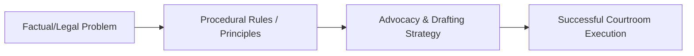

# L09 — Drafting exceptions and striking out

> One-paragraph overview of the litigation skills and principles taught in this chapter.
>
> [!abstract] The arc of this chapter
> **Where we left off:** We explored the previous phase of litigation or litigation foundations.
>
> This chapter covers **Drafting exceptions and striking out**. We look at the problem of how to execute this task, the rules that govern it, and the strategies for successful advocacy.

*Figure: The problem-to-execution chain in this chapter.*

---

## Chapter Content Walkthrough

[ address and details as per Rule 6(5)(d)]
### 8.3 Further pleadings

The most common replication introduces a confession and avoidance in response to allegations made in the plea. The result is that the 'avoidance' part of the replication may introduce new facts to justify the plaintiff's original claims, or to avoid the conclusion contended for by the defendant in the plea. When new facts are introduced in this way, there may be some scope for the new allegations in the replication to be met in turn by a confession and avoidance. Further pleadings may then be delivered. These are called, in the order that they may appear after the replication, a 'rejoinder', 'surrejoinder', 'rebutter' and 'surrebutter' respectively.

The principles for these further pleadings are the same as for replications. It is only necessary to deliver such a pleading if admissions need to be made or additional facts pleaded by way of a confession and avoidance. They also follow the general pattern of a replication and the same prayer is used to join issue.

### 8.4 Close of pleadings (*litis contestatio*)

A purpose served co-incidentally by the delivery of a replication is that the pleadings are then closed, meaning that the parties have defined the issues and are ready to be allocated trial dates. If no replication is delivered within the time allowed, (which is 15 days), the pleadings are closed automatically. Some procedural steps can only be taken after the pleadings have closed. Some claims that would otherwise lapse if the plaintiff were to die are transferred to the deceased estate if the pleadings in the action were closed before the plaintiff's death.

> [!warning] 8.5 Protocol and ethics

The same principles apply as for statements of claim and pleas.

## Chapter 9 Drafting exceptions, applications to strike out and objections to a charge

### CONTENTS

|  9.1 | Introduction  |
| --- | --- |
|  9.2 | Exceptions  |
|  9.2.1 | The purpose of an [[Page-75|exception]]  |
|  9.2.2 | When an exception can and should be taken  |
|  9.2.3 | The procedure for an exception  |
|  9.2.4 | The form, format and style of an exception  |
|  9.3 | Applications to strike out under Rule 23(2)  |
|  9.4 | Applications to strike out under Rule 30  |
|  9.5 | Objection to a charge in criminal proceedings  |
|  9.5.1 | Introduction  |
|  9.5.2 | Objecting to the charge  |
|  9.5.3 | Responding to the objection to the charge  |
|  9.5.4 | Sections 89 to 104  |
|  9.6 | Protocol and ethics  |
### 9.1 Introduction

An *exception* is a defence or answer of a legal nature; it does not rely on any new or additional facts. The exception procedure is used when a statement of claim or a plea is on the face of it defective. That means that the pleading concerned cannot on any reasonable interpretation deliver what it is supposed to deliver, namely, an identifiable and recognised [[Page-54|cause of action]] or defence. One can then take a legal point by way of an exception in order to bring an early end to the proceedings or to dispose of a substantial part of the matter without having to go to trial.

An *application to strike out*, on the other hand, is an interlocutory application designed to set aside a pleading

---

which either contains scandalous, vexatious or irrelevant allegations or constitutes an irregular proceeding because it does not comply with certain technical requirements of the rules. An application to strike out scandalous, vexatious or irrelevant matter is made under Rule 23(2). An application to strike out a pleading as an irregular proceeding is made under Rule 30.

In criminal proceedings an objection similar to an [[Page-75|exception]] may be made to a charge in terms of section 85 of the Criminal Procedure Act 51 of 1977 ("the Act").

## 9.2 Exceptions

An exception can only be taken to a pleading. The following documents are pleadings -

- particulars of claim (attached to a combined summons);
- declaration;
- counterclaim;
- third-party claim (attached to a third-party notice);
- interpleader claim;
- plea, with or without a [[Page-66|special plea]];
- replication;
- further pleadings such as a rejoinder, surrejoinder, rebutter and surrebutter; and
- exception.

These documents are distinguished as pleadings by two main features, namely: (a) they set out the material facts of a claim (statements of claim) or a defence (pleas, [[Page-66|special pleas]] and exceptions) or an answer to a defence (replications and further pleadings); and (b) they specify the relief in the prayer.

### 9.2.1 The purpose of an exception

The purpose of an exception is to obtain a speedy and inexpensive decision on a question of law. The question of law is whether the pleading concerned contains the necessary allegations of fact, which if proved, would sustain a [[Page-54|cause of action]] or defence.

Exceptions are mostly the result of sloppy pleading, but in rare cases an exception is set up to test a question of law when the facts of the case are not in dispute. Two well-known cases can be cited as examples where important principles of law were decided on exception. In the famous English case, *Donoghue v Stevenson* [1932] AC 562 (HL) - the snail in the bottle case - the question was whether the manufacturer owed the public a duty of care independent of any obligations owed by it in contract. The answer given by the House of Lords was in the affirmative and English law was set upon a new course. In the South African case, *Malherbe v Ceres Municipality* 1951 (4) SA 510 (A), the question was whether the owner of a building had a valid cause of action (for an interdict) against the municipality whose trees dropped leaves in the gutters of the building and thus caused damage. The court held that he did. These were not cases of sloppy pleading. They were cases testing the limits of known legal remedies.

Since the purpose of an exception is to avoid leading unnecessary evidence, it will not be granted unless it disposes of a separate cause of action or defence and all the relief claimed pursuant to it. Where alternative items of relief are claimed arising from a single cause of action, an exception will not be granted if it defeats only some of the items of relief because evidence will still be required to justify the remaining claims. The court hearing that evidence can decide all the legal defences raised by the exception when it hears the evidence. There is no need for a separate hearing for the legal issues in such a case. However, if the same relief is claimed in alternative claims which are based on different causes of action, an exception against one of the alternative causes of action will be allowed because it makes it unnecessary to lead evidence on that cause of action.

### 9.2.2 When an exception can and should be taken

An exception can only be taken in two circumstances. The *first* is where the pleading lacks the necessary allegations to sustain a cause of action or a defence. The *second* is where the pleading is vague and embarrassing. Ordinarily litigants are entitled to have their disputes resolved by a trial. Since an exception brings the action to an end without a trial, a clear case will be required before an exception will be granted. The court is unlikely to allow an exception unless it is convinced that there is no arguable case on the pleading as it stands. The test is whether the court *could* (not *should*) hold in favour of the pleader.

An exception can be taken, for example, where -

- there is a question of law which can be decided on the pleading as it stands, that is, without evidence;
- it is clear from the pleadings that the court does not have jurisdiction over the defendant or over the cause of

---

action pleaded;
- the [[Page-54|cause of action]] is incomplete in the sense that an essential allegation has been omitted; or
- it is clear that an essential party lacks [[Page-41|locus standi]].

An [[Page-75|exception]] should generally not be taken where -

- the question turns on the interpretation of a contract (as the interpretation could turn on the evidence);
- the issue is whether there were implied or tacit terms in the contract (as this is a question of fact, not law); or
- the issue is whether a contract is void for vagueness (as the circumstances under which the contract was concluded and matters of interpretation may affect the outcome).

If an exception can be taken, it should generally be taken in order to save costs, especially if you can dispose of the whole case or a substantial part of it. If an exception can be taken but is not, and that failure results in unnecessary costs being incurred by the parties, the party who failed to take an exception could be penalised in the court's award of costs. The court may mero motu (without being asked by either party) order that the point be decided separately under Rule 33(4) before evidence is led. If you have reason to think that an exception may be dismissed because evidence may be relevant on the point in issue, consider drafting a [[Page-66|special plea]] instead. It may add the relevant facts. The court can also be approached for a separation of the issues under Rule 33(4). These procedures allow for a speedy resolution of narrower or more defined issues.

### 9.2.3 The procedure for an exception

In the case where the exception is based on the contention that the pleading "does not contain the necessary averments to sustain a cause of action or defence", the first step taken by the opposing party is the delivery of an exception. That exception is then argued in the ordinary course as if it were an opposed motion. This presupposes that the offending party does not rectify the defect by an amendment after receipt of the exception. If the exception is taken on the basis that the pleading is vague and embarrassing, the first step is to serve a notice on the offending party to cure the defective pleading by removing the cause of the vagueness or embarrassment. If the recipient of the notice fails to remove the cause of the complaint, an exception has to be delivered. The exception is then set down for argument. Further pleadings are suspended under Rule 23(4) until the court has ruled on the exception.

In both types of exception there will be a prayer for an order that the exception be upheld and that the claim or defence, as the case may be, be dismissed or struck out. The court may, however, grant any one of the following orders:

- It may uphold the exception, with or without leave to amend the offending pleading, and dismiss the claim or strike out the defence.
- It may stand the point raised by the exception down for decision at the trial if it is of the view that the point should be decided after hearing evidence or should be heard at the same time as other disputes between the parties.
- It may dismiss the exception.
- It may award costs on the usual principles.

A decision upholding an exception is usually final in its effect and therefore appealable. A decision refusing an exception, however, is interlocutory. It is not binding on the trial court. Notwithstanding its interlocutory nature, it may be appealable in some circumstances.
### 9.2.4 The form, format and style of an exception

An exception is a pleading and for that reason has to comply with the rules relating to pleadings generally. It can be taken to "any pleading", in terms of Rule 23(1). That means, ironically, that an exception may be taken to an exception that does not disclose a ground for the point it purports to take. An exception also has to comply with the rule specific to exceptions, Rule 23. It has to set out the grounds upon which the exception is based clearly and concisely. Because an exception is a pleading, it has to be signed by counsel, or an attorney with the right of audience in the High Court, or by the party excepting personally. An exception also has to have a prayer for relief or else it would be vague and embarrassing. An exception without a prayer would also be an irregular proceeding as contemplated by Rule 30 and liable to be set aside under that rule.

The substantive points taken in an exception will depend on the circumstances of the individual case, but exceptions generally follow the same format. Let us assume that the defendant has been sued on a written contract pertaining to the purchase and sale of immovable property. A copy of the contract said in the declaration to be a true copy has been attached but the copy does not contain a signature in the space allocated for the signature of the purchaser. The plaintiff has sued for payment of the purchase price against transfer of the property. Your legal research discloses that a contract for the alienation of land has to be in writing and signed by both parties or by their agents acting on their written authority.

The exception in this instance will be to the effect that the declaration lacks the necessary averments to sustain

---

a [[Page-54|cause of action]].
**Table 9.1** [[Page-75|Exception]]

|  Par | Text of pleading | Comment  |
| --- | --- | --- |
|   | [DESCRIPTION OF COURT as prescribed] Case no 876/[year] Between: KLM (Pty) Ltd and Ian John Smith PLAINTIFF/RESPONDENT DEFENDANT/EXCIPIENT | 1 The parties are usually described as excipient and respondent respectively, but it will do no harm to add their conventional descriptions too.  |
|   | EXCEPTION |   |
|  1 | The plaintiff's claim as pleaded in the particulars of claim is for the payment of the purchase price of an immovable property, alleged to have been purchased by the defendant in terms of a written contract. It is further alleged that Annexure 'A' to the particulars of claim is a true copy of the contract. | 1 Some legal research will have been done before the grounds for the exception could be identified and pleaded accurately.  |
|  2 | In terms of section 1 of the Alienation of Land Act 68 of 1981 a contract relating to the alienation of immovable property has to be in writing and signed by the parties thereto, or by their agents acting on their written authority. | 2 An exception does not add facts. It raises a point of law. It would therefore be inappropriate to refer to the statements in the exception as 'material facts'. 3 The individual points upon which the excipient wishes to rely in support of the exception are set out in the form of a short argument, which is really what an exception amounts to. 4 Rule 23 requires the grounds to be set out 'clearly and concisely'.  |
|  3 | It is apparent, on the face of the particulars of claim and Annexure 'A' thereto, that the contract sued upon has not been signed by the defendant or his agent acting on his written authority. |   |
|  4 | In the premises the contract sued upon, is void and the allegations in the particulars of claim cannot sustain a cause of action. |   |
|   | WHEREFORE the defendant prays for an order - (a) upholding the exception with costs; (b) dismissing the plaintiff's action with costs. | 1 The prayer seeks complementary orders. Prayer (a) on its own is not enough to dispose of the claim. 2 The court may grant leave to amend, but that is for the respondent to seek and to justify.  |
|  Par | Text of pleading | Comment  |
| --- | --- | --- |
|   | DATED AT [place] this [date] |   |
|   | Signature Counsel's name (printed) Defendant/Excipient's counsel |   |
|   | Signature Attorney's name (printed) Angus McAlpine Defendant/Excipient's Attorney [address and details as per Rule 6(5)(d)] |   |
|   | To: The Registrar [address] And to: Angela Moore and Associates Plaintiff/Respondent's Attorneys [address and details as per Rule 6(5)(b)] Ref: Ms Moore/KLM101 |   |
In a case where the exception is based on an allegation that the pleading is vague and embarrassing, the exception should show that the required notice has been given and that the time for removing the cause of the complaint has elapsed.

### 9.3 Applications to strike out under Rule 23(2)

An application under Rule 23(2) is aimed at individual allegations or paragraphs of the pleading while an exception is aimed at a whole claim or defence. The purpose of an application to strike out offending material under Rule 23(2)

---

is to remove scandalous, vexatious or irrelevant matter from the pleadings. "Scandalous" allegations include malicious gossip or rumour, defamatory allegations or disgraceful innuendo. "Vexatious" allegations include baseless, annoying or embarrassing allegations. In either case, when it is alleged that the material to be struck out is scandalous or vexatious, the offending allegations also have to be irrelevant. That means that they are not necessary to support the material facts or [[Page-54|cause of action]]. "Irrelevant" in the context of Rule 23(2) means not relevant for any legitimate purpose of pleading even though the material may be relevant at the trial stage. The opposing party should not have to deal with such allegations in a pleading and the court hearing the trial should not see (or hear) them. So a mechanism is required to remove them.

The court will grant an application to strike out the offending material only if the innocent party can demonstrate that he or she will suffer prejudice if the offending allegations are to remain. A typical example in a claim for damage to a car is an allegation in the particulars of claim that the defendant has been convicted of negligent driving in relation to the incident which gave rise to the claim. Such an allegation is clearly irrelevant; it could not even be led as evidence at the trial because it would be inadmissible. It is prejudicial too, because the judge reading the pleadings will know that another court has already determined that the defendant had been negligent. If it were not for the requirement that the offending material should be prejudicial, most applications to strike out scandalous, vexatious or irrelevant materials could have been made on notice only. However, prejudice needs to be alleged and proved, which in turn means that evidence is required and that the other party has to be given an opportunity to answer the factual allegations made with regard to the question of prejudice. The procedure is therefore to make an interlocutory application. A notice of motion and a founding affidavit will ordinarily be required. The client should make the affidavit although there may be circumstances where the applicant's attorney will be able to give admissible evidence of the prejudice. Where the prejudice is obvious it may be possible to get by without a founding affidavit.

The prayer in the notice of motion has to specify the material to be struck out of the offending pleading precisely, line by line and paragraph by paragraph. The affidavit should state the ground for suggesting why each of the offending allegations is "scandalous", "vexatious" or "irrelevant", as the case may be, and what prejudice will be suffered if they remain. Examples of interlocutory applications are given in chapter 10.
Table 9.2 [[Page-75|Striking out]] order in the notice of motion

|  Order prayed  |
| --- |
|  . . . for orders that -  |
|  (a) The following parts of the plaintiff's particulars of claim be struck out on the grounds that they contain matter which is scandalous or vexatious or irrelevant:  |
|  (i) the first sentence of paragraph 7;  |
|  (ii) the whole of paragraph 8;  |
|  (iii) the words from "and" up to and including the words "convicted of fraud" in paragraph 9;  |
|  (b) The respondent be ordered to pay the costs of this application.  |

It is not necessary to respond to the offending pleading while the application is pending. (Rule 23(4)) It would generally be unwise to plead to the offending allegations. An application to strike out scandalous, vexatious or irrelevant matter from an affidavit is made under Rule 6(15), which expressly requires prejudice to be proved.

## 9.4 Applications to strike out under Rule 30

Rule 30 provides a general procedure to set aside irregular proceedings of many different descriptions. It also applies to pleadings. It is aimed so far as pleadings are concerned, at irregularities of form, not substance. It could be used where a pleading does not comply with the provisions of Rule 18 relating to pleadings generally, or does not comply with the provisions of the rule relating to a particular pleading. Rule 30 could be invoked to set aside pleadings where -

- the particulars of claim or other pleading has not been signed by counsel or a person entitled to sign;
- there has been a failure to comply with the provisions of Rule 18(10) which requires particulars of damages to be given to enable the defendant to assess them; and
- the pleading does not comply with the requirements of the rule relating to that pleading, such as where a plea does not contain the material facts required to be pleaded by Rule 22(2) or the explanations or qualifications of denials required by Rule 22(3).

The applicant seeking an order to set aside a pleading as an irregular proceeding, has to demonstrate that he or she will suffer prejudice if the pleading concerned is allowed to stand as it is. A notice giving particulars of the irregularity has to be given. The applicant loses the right to make the application if he or she has taken a further step in the action with knowledge of the irregularity, has not given the offending party an opportunity to remove the cause for the complaint, or has not delivered the application within a stipulated period.

The application procedure under Rule 30 is the same as for other interlocutory applications of a procedural nature (see chapter 10). The order would typically ask that the relevant pleading be set aside and ask for the costs of the application. The supporting affidavit has to explain why it is suggested that the pleading amounts to an irregular proceeding and what prejudice will be suffered if it were allowed to stand. The court may then grant the

---

application with or without leave to the other party to amend the offending pleading.
**Table 9.3** Comparing exceptions and applications to strike out under Rules 23(2) and 30

|   | [[Page-75|Exception]] under Rule 23(1) | Application under Rule 23(2) | Application under Rule 30  |
| --- | --- | --- | --- |
|  **When to be made** | 1 When the pleading does not disclose a claim or defence. 2 When the pleading is vague and embarrassing and a notice to cure the defect has been ignored. | When the pleading contains scandalous, vexatious or irrelevant matter and the inclusion of that matter will cause prejudice. | When the pleading (or other proceeding) is irregular in form; when it fails to comply with the requirements of the rules and the irregularity or failure causes prejudice.  |
|  **Purpose** | To obtain a decision without evidence on the question whether there is a *prima facie* claim or defence. | To remove the offending matter and prevent prejudice. | To force compliance with the rules of pleading in order to remove the prejudice.  |
|  **Procedure** | 1 An exception. 2 Notice to cure followed by an exception. | Interlocutory application under Rule 23(2). | Interlocutory application under Rule 30.  |
|  **Its consequences if not opposed** | Claim or defence may be struck out. | Offending matter may be struck out. | The offending pleading (or other proceeding) may be struck out.  |
|  **Response** | An amendment | An amendment. | An amendment.  |
|  **Consequences of not pursuing it** | Adverse costs order at trial. | The prejudice remains. | The prejudice remains.  |
## 9.5 Objection to a charge in criminal proceedings

### 9.5.1 Introduction

Section 84 of the Criminal Procedure Act 51 of 1977 ("the Act") states the requirements for a charge. The section does not stand alone and sections 89 to 104 contain provisions which are specific to particular charges or types of charges (see paragraph 9.5.4).

Section 85 of the Act provides a remedy similar to an exception in civil cases should the charge be defective.

### 9.5.2 Objecting to the charge

Section 85 of the Act provides the grounds upon which the accused may object to the charge:

85(1) An accused may, before pleading to the charge under section 106, object to the charge on the ground -
(a) that the charge does not comply with the provisions of this Act relating to the essentials of a charge;
(b) that the charge does not set out an essential element of the relevant offence;
(c) that the charge does not disclose an offence;
(d) that the charge does not contain sufficient particulars of any matter alleged in the charge: Provided that such an objection may not be raised to a charge when he is required in terms of section 119 or 122A to plead thereto in the magistrates' court;
(e) that the accused is not correctly named in the charge.

Note that the accused who wishes to object to the charge must do so before he or she has pleaded to it. Note also that the accused may not object to a charge when the circumstances envisaged by section 119 (accused required to plead in the magistrates' court on the instruction of the attorney-general) or 122A (pleading on a charge to be tried in the regional court) are present.

The manner of objecting to the charge is by reasonable notice to the prosecution and the accused must also state the ground upon which he bases his objection. (The prosecutor may waive the requirement of notice and the court may dispense with notice or adjourn the matter for notice to be given.)

While there is no express requirement that the notice should be in writing the accused will still have to state the grounds "on the record". In practice the notice is almost without exception in writing. A typical notice shorn of headings and endings will have a format as follows:

Take notice that the accused gives notice of his objection to the charge and that the objection is based on the following grounds:

(1) . . .
(2) . . .

---

(3) . . .

Wherefore the accused prays that the charge be quashed, alternatively, that the prosecution be ordered to make such amendments to the charge or to deliver such particulars as are necessary to remove the cause of the objection.
### 9.5.3 Responding to the objection to the charge

The prosecutor faced with an objection to the charge will have to consider whether the charge as it stands satisfies the requirements of section 84 of the Act and if it does, will be entitled to set the matter down for argument and defend the charge as it stands. If the prosecutor on reflection should come to the conclusion that the objection is good, he or she will have to amend the charge in order to remove the cause of the objection. This is achieved by filing an amended charge (in the form of a summons, charge sheet or indictment).

If the matter is argued and the court finds in favour of the defence, the court may order the prosecution to amend the charge or to deliver particulars. Section 85(2)(b) provides that if the prosecution fails to comply with the order, the court may quash the charge.

When preparing a charge or considering whether an objection to it is good, the prosecutor should keep in mind the provisions of sections 89 to 104 of the Act together with any provisions that may be laid down in the enactment which created a particular statutory offence.

### 9.5.4 Sections 89 to 104

Sections 89 to 104 deal with the requirements for a charge in respect of specific offences or types of offences. Their provisions - which should be studied together with the commentary in and cases referred to in a textbook such as Kruger *Hiemstra's Criminal Procedure* LexisNexis - may be summarised as follows:

- Section 89 - previous convictions must not be mentioned in the charge except where they are an element of the offence.
- Section 90 - the charge need not specify or negative an [[Page-75|exception]], exemption, proviso, excuse or qualification.
- Section 91 - the charge need not state the manner or means of an act.
- Section 92 - certain omissions or imperfections will not invalidate the charge.
- Section 93 - where the defence is an alibi, the prosecution may be held to the date and time alleged in the charge.
- Section 94 - the charge may allege the commission of the offence on diverse occasions.
- Section 95 - deals with the rules applicable to particular charges.
- Section 96 - provides that it is sufficient to refer to a company, firm or partnership by name.
- Section 97 - deals with the naming of joint owners of property.
- Section 98 - provides that it is sufficient on a charge of murder or culpable homicide to allege that the killing was unlawful.
- Section 99 - the charge need not attach a copy of a document or described it or state its value; it is sufficient to refer to it by the name it is commonly known or by its purport (meaning or content).
- Section 100 - on a charge of theft it is sufficient to allege a general deficiency in a stated amount.
- Section 101 - contains special provisions with regard to charges relating to false evidence.
- Section 102 - charges relating to insolvency need not set forth the debt, act of insolvency or determination by a court.
- Section 103 - a charge alleging intent to defraud need not allege such intent in respect of a particular person or mention the owner of the property concerned or give details of the deceit.
- Section 104 - a charge relating to objectionable matter need not set out the words concerned; the court may, however, order that particulars be delivered identifying the relevant passages.

**Note:** This summary should not be used as a substitute for your own legal research.

> [!warning] 9.6 Protocol and ethics

- It is customary among advocates to warn counsel on the other side before they take an exception to their pleadings and to give them an opportunity to remedy the defect. This custom applies also to criminal cases. It

---

---

## Concepts in this lecture
None

## Navigation
Prev: [[L08 - Drafting replications and further pleadings|← Previous Chapter]] · Next: [[L10 - Drafting applications|Next Chapter →]]
