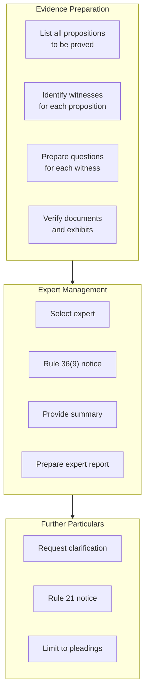

# L11 — Preparing the case for trial: Advice on evidence

> [!abstract] Chapter Overview
> This chapter covers **evidence advice** — planning what each witness will prove. Key topics: Rule 36(9) notices, expert summaries, further particulars, and witness preparation.
<!-- -->
> [!important] Rule 36(9) Notice
> Must give notice of intention to call an expert witness. Opponent can demand a summary of expert evidence. Failure may result in exclusion.

## Visual Overview

*Figure: The evidence preparation workflow.*

> [!tip] Professional Tip
> An "advice on evidence" reduces trial stress. Know what each witness will prove before you walk into court.
<!-- -->
> [!tip] Connection
> Follows [[L08 - Drafting replications and further pleadings|close of pleadings]]. Proceeds to [[L12 - Preparing the case for trial: Assembling the evidence|evidence assembly]] and [[L14 - Preparation for trial: Fact analysis and strategy|strategy]].

---

## Chapter Content Walkthrough

draft order. At this point the drafting of the application does not look quite as daunting a task anymore. Preparation produces confidence.

## 10.6 Hearing of opposed applications

Opposed applications are heard in the [[Page-179|Motion Court]]. There are different procedures in the different divisions of the High Court. In some divisions there is a Motion Court dedicated to opposed motions. In other divisions the opposed motions are heard daily at the end of the unopposed motions. The skills and techniques required for the preparation and argument of opposed motions, are dealt with in chapter 22 (Motion Court), chapter 23 ([[Page-186|Persuasive advocacy]]: Substance and style), chapter 24 (Reviews), and chapter 25 (Appeals).

> [!warning] 10.7 Protocol and ethics

Affidavits contain the evidence of the witnesses. It is important that the evidence is not tainted. It has to be obtained, preserved and conveyed accurately and without any contamination by the lawyer drafting the affidavit. There are a number of duties associated with these principles:

- Draft with precision in mind.
- Do not create or suggest facts. Let the witness tell his or her story.
- Avoid [[Page-92|hearsay]], character evidence, irrelevant material and scandalous or vexatious matter.
- Strictly observe the formalities of the oath.

## Chapter 11

Preparing the case for trial: [[Page-92|Advice on evidence]]

CONTENTS

11.1 Introduction
11.2 Purpose of an advice on evidence
11.3 Structure and style of an advice on evidence
11.3.1 Introductory paragraph
11.3.2 A discussion of the pleadings
11.3.3 Summarising the issues
11.3.4 A discussion of the [[Page-92|burden of proof]] and the duty to begin
11.3.5 A discussion of the oral evidence available to the plaintiff (or defendant)
11.3.6 A discussion of the documentary evidence available to the plaintiff (or defendant)
11.3.7 The need for conferences and inspections
11.3.8 The need for independent examination of persons or things by experts
11.3.9 [[Page-100|Expert witness]]es and summaries of their opinions
11.3.10 Plans, diagrams, photographs and models
11.3.11 Rule 37 procedures
11.3.12 A discussion of the prospects of success and the quantum of the claim
11.3.13 General comments on the state of preparation for trial
11.3.14 A run through the rules
11.3.15 Date and place of signature and name of counsel/attorney
11.4 Request for further particulars
11.5 Rule 37(4) notice and reply
11.6 Expert notices and summaries
11.7 Advising on the evidence in criminal cases
11.7.1 Introduction
11.7.2 Advising on the evidence for prosecutors
11.7.3 Advising on the evidence for defence counsel
11.8 Protocol and ethics

---

## 11.1 Introduction

Trial preparation involves a number of related processes which combine to allow the case to be presented in the best possible light. They are -

- advising on the evidence;
- assembling the evidence;
- conducting legal research; and
- analysing the facts and developing strategy.

These processes are mutually supportive. Each serves the greater purpose of preparing the case and the person who has to conduct it so that the client will enjoy the greatest possible chance of success at the trial. The first two stages, advising on the evidence and assembling the evidence, are designed to prepare the case for the trial. The next two stages, legal research and fact analysis and strategy, are designed to prepare counsel for the trial. These processes are the subjects of the next four chapters, starting with the process of advising on the evidence in this chapter.

All four stages are equally applicable to criminal cases. In practice criminal cases are conducted with less time for reflection and at greater risk of losing due to inadequate preparation. Paragraph 11.7 is devoted to advising on the evidence in criminal cases for both the prosecution and the defence. That said, the general scheme and principles described in the following paragraphs should nevertheless be applied mutatis mutandis when you prepare a criminal case.

## 11.2 Purpose of an advice on evidence

Every trial is conducted according to a framework of rules which controls the whole process from beginning to end. That framework is provided by -

- the procedures of the court due to hear the trial;
- the law of evidence;
- the issues between the parties;
- the evidence which is relevant to those issues;
- the substantive legal principles which apply to the claims and defences; and
- the court's terms, recesses and procedures for the set-down of cases for hearing.

The ideal situation requires counsel to prepare the advice on evidence after the pleadings have closed, the discovery process has been completed fully and comprehensive statements of all the available witnesses have been taken. Counsel should then be able to comment and advise on the sufficiency of the available evidence. This is the true function of an advice on evidence. Counsel is expected to analyse the contents of the discovered documents and the statements of the witnesses in order to advise what further steps should be taken in preparation for trial. For example, a letter may refer to a document that has not been discovered. That document ought then to be obtained unless it is patently irrelevant or if a witness has referred to other potential witnesses, their statements ought to be obtained. It may be that the statement taken from a witness may not be clear on a particular point or may even be entirely silent on it. Counsel may want the witness to clarify or supplement the original statement. It may be necessary to visit the scene of the relevant incident so that the witness can point out the relevant features of the scene.

However, in practice an advice on evidence is usually little more than an initial advice on the procedural steps to be taken for the purpose of getting the trial preparation process underway. This does not really matter as the preparation for trial continues through the steps discussed in the next few chapters.

An advice on the evidence serves the following purpose:

- It ensures that all the procedural steps which are necessary for the proper conduct of the trial have been taken.
- It allows the sufficiency of the available evidence to be considered at an early stage and for the statements of witnesses to be clarified or supplemented where necessary.
- It enables counsel to give practical advice on the future handling of the matter, including the use of alternative dispute resolution methods.

## 11.3 Structure and style of an advice on evidence

---

The [[Page-92|advice on evidence]] has to take into account the facts and circumstances of the case in the brief. Some of the steps referred to below may not be appropriate to all cases. For example, an inspection in loco is hardly ever necessary in a divorce matter. By the same token, a medical examination by a specialist is hardly appropriate in a claim for goods "sold and delivered". Nevertheless, the following format will at least allow you to start with a plan that can work in almost any type of case.

(Paragraph headings can be used to identify the subject-matter of each step in the process.)

### 11.3.1 Introductory paragraph

State in one paragraph what the case is about. This immediately focuses attention on the nature of the case.

- This is an action for damages under the provisions of the Road Accident Fund Act 56 of 1996.
- In this action the consultant (the plaintiff) has sued the defendant for damages for breach of contract. It is said that a stud bull by the name of ZINZAN, which was sold by the defendant to the consultant in [date], is sterile.
- This is an admiralty action in rem for the enforcement of a claim for damage to cargo.

### 11.3.2 A discussion of the pleadings

A close scrutiny of the pleadings is necessary to identify the issues so that the preparation can concentrate on the true issues. Before that is done, a number of other questions need to be addressed:

- Are the pleadings properly closed? If not, advise on the steps to be taken.
- Is a replication or further pleading necessary? The answer may not be obvious at the first reading of the pleadings, but keep this question in mind as you work your way through the other steps of the advice on evidence. A document or statement you consider later in the course of the advice may change your view.
- Are any amendments to the pleadings called for? This may be the case if the documents and statements point to that conclusion. Keep an open mind on this question while you prepare the rest of the advice.
- Is a request for further particulars for trial necessary? Prepare one only if it is necessary to enable you to prepare properly for the trial.
- How long is the trial likely to take? Advise generally and ensure that the necessary steps are taken to set the trial down for the anticipated duration. (The set-down procedures depend on the rules of each individual division, not the Uniform Rules.)
- Are there issues which can be decided separately to bring an early end to the case? If, for example, the issues of liability and quantum could be separated in a damages action, advise your side to take the matter up with their opponents. Advise them on the procedure to follow if the other side does not agree. (An interlocutory application to the court for an order under Rule 33(4) may force the issue.) Determine whether there are any special defences that could be dealt with under Rule 33(4).
- Is there a legal issue which could be dealt with as a special case under Rule 33(1)? This procedure is available where the facts are agreed but a question of law remains. If that appears to be so, advise on the steps to bring a special case before the court for hearing.
- Have the pleadings been paginated and indexed? Many a case has lost its place on the roll because the court file had not been put in order. Advise on the appropriate steps to take and the consequences if they are not taken.

### 11.3.3 Summarising the issues

The issues have to be identified individually. Go through the pleadings carefully to determine what allegations made by each of the parties are in issue. This is an essential step because one of the main purposes of the advice on evidence is to advise the client on the necessary and relevant evidence on each of the issues.

The easiest way to identify the issues is to compare the plaintiff's pleadings with the defendant's pleadings, paragraph by paragraph, line by line. For example, one would compare paragraph 1 of the declaration with what is said in the plea to determine whether that paragraph is admitted or not. If it is, the allegations in paragraph 1 of the declaration are not in dispute; they are taken as having been proved by the defendant's admission. However, if allegations are denied in the plea, they become "issues". Allegations which have not been admitted are also treated as if they are in issue because they still have to be proved. The process of identifying the issues continues through all the pleadings (and any further particulars that may have been furnished in response to a request for further particulars or a request under Rule 37(4)).
The issues are then listed, one by one, in numbered paragraphs. Matters which are not in issue can be listed separately. It is a matter of personal preference. If that style were to be adopted, it can be done as follows:

- "The following facts and circumstances are common cause on the pleadings:

(a) The names and [[Page-41|locus standi]] of the parties . . .

---

(b) That the plaintiff was at all material times . . . etc."

You can then list and paraphrase the issues as follows:

- "The following issues are apparent from the pleadings:

(a) Whether there was a collision . . .
(b) Whether the collision was caused by negligence . . . etc."

It may become apparent, from an examination of the discovered documents and perusal of the statements of the witnesses, that some of the issues you have identified can be eliminated by way of admissions. Keep this in mind for the part of the advice dealing with the Rule 37 conference.

### 11.3.4 A discussion of the burden of proof and the duty to begin

The sufficiency of the evidence is determined by the amount and quality of the available evidence, the incidence of the onus and the standard of proof. Determine and state who bears the onus of proof on each issue. Then consider which of the parties has the duty to begin (Rule 39(11)). This is an important exercise. You could summarise your conclusion as follows:

- "The plaintiff bears the onus of proof on all the issues listed above except issues X, Y and Z. The ordinary standard of proof in civil cases, namely a preponderance of probability applies. Because the plaintiff bears the onus in respect of some of the issues, the plaintiff is bound to commence adducing evidence first."

### 11.3.5 A discussion of the oral evidence available to the plaintiff (or defendant)

By this stage of the analysis you will have a fair idea of what the case is about. You will know what the issues are and who bears the onus of proof in relation to each of them. It is now necessary to make a preliminary assessment of the witnesses, the available documentary evidence and the sufficiency of the available evidence, having regard to the onus and standard of proof. If you were to conclude that there is insufficient evidence to sustain your client's claim or defence, this is the time to explain that to the client so that further evidence may be obtained or negotiations may be opened with the other side. The available evidence should be considered in detail, in the context of the case as a whole.

You may need witnesses to prove disputed documents. You have to consider whether witnesses are available to prove the relevant documents. (Documents don't "prove" themselves except in exceptional circumstances. You need a witness who is able say, for example, "I signed this contract and I was present when the defendant signed it there," or, "I wrote this letter and posted it to the defendant". Those documents will not be admissible as evidence and cannot be used unless they are admitted by the other side.)

You should analyse the evidence of each witness and summarise the salient parts of their evidence. This does not mean that one has to recount word for word what each *(see page 195)* witness has said in his written statement. In an RAF case where negligence is or may be an issue you might mention the following:

- "The plaintiff has to be called to explain the circumstances under which the collision occurred. According to him, he was crossing the street at a marked pedestrian crossing when the Durban Corporation bus ran him over."
- "Sergeant NAIDOO of the Phoenix Police Station who attended at the scene of the collision afterwards, has to be called as a witness. He says that he spoke to the driver of the Corporation bus who admitted to him that he was unaware of the plaintiff's presence on the road because, although he was already driving at 60 kilometres per hour, he was still collecting money from passengers and issuing tickets to them."
- "Sergeant PILLAY of the same station also attended at the scene of the collision. He drew a plan after measuring the relevant distances between important points, all of which are depicted on a plan and a key thereto. He ought to be called as a witness."

If the evidence is insufficient in any respect or incomplete, or if new evidence has come to light which another witness can and should comment on, advise on the steps to be taken to ensure that the evidence is complete. Ensure also that the necessary witnesses will be available at the hearing. Advise on the need for subpoenas. If additional witnesses are necessary, advise on the need to take statements from them and note the topics on which their evidence is necessary.

### 11.3.6 A discussion of the documentary evidence available to the plaintiff (or defendant)

A systematic approach is necessary in order for you to cope with documentary evidence; the more documents there are in the case, the greater the need for a good system.

- Ensure that the discovery procedure has been fully complied with by both sides. If it has not, advise on the steps to take. For example, if a document has not been discovered by the other side and you regard it as relevant, advise the attorney to serve a Rule 35(3) notice requiring the discovery of the relevant document.
- Carefully peruse the discovered documents. You should have them in a bundle in chronological order. Consider their contents, analyse them and get your thoughts in order. Where is the case going? Where do the documents lead? What do they mean? What effect do they have on what the witnesses have to say? Isolate the documents that are relevant to each issue by way of a separate list. The analysis of the

---

documentary evidence could be done according to the scheme discussed in chapter 14.

- Consider whether the parties should agree that the documents are what they purport to be and that they were written and were received by their apparent authors and addressees. Their contents may well remain in dispute. Advise whether any of the documents may be admitted as having been properly executed and whether their contents may be taken as true. Isolate the documents which appear to be truly in issue and discuss how your side is going to prove them or cast doubt on them, as the case may be.
- You should consider and discuss, in relation to problematic documents, the possibility that they may be proved or admitted under the provisions of the Civil Proceedings Evidence Act 45 of 1988, the Law of Evidence Amendment Act 45 of 1988, the Electronic Communications and Transactions Act 25 of 2002 or Rule 35(10). There may be special rules in other Acts. Different procedures apply to the proof of documents under these provisions. It is counsel's duty to know these procedures off by heart. Consider *(see page 196)* if a witness who has relevant documents in his or her possession needs to be subpoenaed to deliver the documents to the Registrar (Rule 38(1)). Ensure that the documents which become available in this way do not gather dust in the Registrar's office, unread and unused.
- Advise on the preparation of a bundle of the relevant documents for use in court. There should be sufficient copies for the judge, the witnesses and the parties. The bundle should be paginated and indexed. The status of every document in the bundle should be clear. The best way to do this is to give an indication in the index whether a document is agreed or not.
- You may need to divide the documents so that there are separate bundles, for example, a correspondence bundle, a contract documents bundle, a bundle of medical reports, another for invoices and similar statements, a bundle for expert summaries and reports, and a bundle of plans and photographs. The bigger the case, the more important it is to have separate bundles.
- Keep in mind that the process of persuasion requires that a difficult case should be kept simple, for counsel, for the witnesses and for the judge who has to hear the case. Plan the documentary evidence to be used at the trial with this principle in mind.

### 11.3.7 The need for conferences and inspections

It is preferable for counsel to interview and brief the witnesses well before the hearing. Advise the client which witnesses you want to interview before the hearing. In some instances an inspection *in loco* will be necessary to enable you to be fully acquainted with the scene and with the facts. When in doubt, always go on an inspection. It could mean the difference between winning and losing the case. It is often helpful to take the witnesses to the scene to explain there what happened.

Do you think the court may understand the facts or evidence more clearly if the court were to hold an inspection during the trial? Do you have witnesses who can best convey to the court what they saw and experienced if they could explain that at the scene? Advise on the arrangements to be made (the inspection may have to be held far from the seat of the court) and list this aspect for discussion at the Rule 37 conference. (See chapter 12 for more detail on consultations and inspections.)

### 11.3.8 The need for independent examination of persons or things by experts

Rule 36(1) provides for an examination of the plaintiff claiming damages arising from bodily injuries by a medical adviser nominated by the defendant and Rule 36(2) sets out the procedures for such an examination. If you require the plaintiff in an MVA action to be examined by an independent specialist to give evidence on the defendant's behalf, you will have to comply with these provisions. Advise on the procedures set out in Rule 36(2) to (5).

The same principle applies under Rule 36(5A) to a plaintiff who claims damages for loss of support where that plaintiff's state of health is a relevant factor in determining the amount of his or her loss. If you act for the plaintiff, advise the plaintiff on the procedures to expect, and in particular, advise the plaintiff that he or she should not discuss the merits of the case (the collision or underlying event giving rise to the injuries) with the plaintiff's medical advisers.
Rule 36(6) and (7) have similar provisions for the examination of property (movable and immovable) where the nature or condition of the property may be relevant to any issue in the case.

### 11.3.9 Expert witnesses and summaries of their opinions

Rule 36(9) requires that notice has to be given of the intention to call an expert witness and that such notice has to be given at least 15 days before the trial. A summary of the opinions and reasons of the expert also has to be served on the other side at least ten days before the trial.

Consider whether any evidence to be given is of an expert nature and if so, ensure that your client knows that these notices and summaries have to be provided. It is often necessary to consult with the expert witnesses in order to be able to draft the relevant summaries and if you think that is the advisable course, tell your client what needs to be done. If your client needs assistance in order to brief an appropriate expert, deal with the matter in the [[Page-92|advice on evidence]]. (See chapter 12 for a more detailed discussion on the procurement of [[Page-100|expert evidence]].)

### 11.3.10 Plans, diagrams, photographs and models

---

Rule 36(10) requires that notice be given of the intention to use plans, diagrams, photographs or models at the trial. The standard notice is worded in such a way that the other party is called upon to admit the relevant plans and photographs. If there is no response, the plans and photographs will be admissible as evidence without further proof.

In many cases there are plans or diagrams and even photographs already in existence when the dispute arises. These form part of the evidence relating to the issues. These have to be proved like any other facts if they are not admitted. Ordinarily you would have to call the photographer who took the photographs you intend to use to establish that they accurately depict what they show. In the case of a diagram, you would usually call the person who drafted it to establish that the diagram is accurate. Those persons have to be added to the list of witnesses. In other cases plans, diagrams, photographs or models may be created for the purpose of the trial. These are 'demonstrative' exhibits. They are prepared for the purpose of assisting a witness to convey the evidence accurately to the court, or to assist the court in following and understanding evidence that might be unclear or difficult to follow. Rule 36(10) applies to both pre-existing and [[Page-100|demonstrative exhibit]]s.

Consider and advise generally whether there are exhibits in the nature of plans, diagrams, photographs or models to be used at the trial. Further consider whether demonstrative exhibits of this type should be created for the trial. Advise generally on the way to procure and preserve this type of evidence. (See chapter 12 with regard to the creation of demonstrative exhibits.)

### 11.3.11 Rule 37 procedures

Rule 37(4) requires the parties to exchange what amount to summaries of the matters they intend to discuss at the Rule 37 conference. Advise and draft the necessary notice if required to do so. Advise on the admissions to be made at the Rule 37 conference and also on the admissions to be sought from the other party. Advise on the prospects of a settlement and how a settlement could be achieved if that is at all deemed feasible.
Consider the requirements of Rule 37 carefully and advise on any aspect of the rule that may be applicable to the case at hand. Make a list of the matters to be raised at the conference and try to anticipate the other side's approach at the conference. Remember that some divisions of the High Court have special Rule 37 procedures. Ensure that your side will be able to comply strictly with those requirements; otherwise your case may lose its place on the roll.

### 11.3.12 A discussion of the prospects of success and the quantum of the claim

It is not essential to advise the client on the prospects of success when doing an [[Page-92|advice on evidence]] but it is a helpful tool in your preparation for trial to do so. It is, however, your duty to advise the client at the earliest opportunity if you think that his or her prospects of success are poor. If you have come to that conclusion, advise the client fully, either in the advice on evidence or in a consultation.

The process of considering a suitable settlement and what the client's prospects of success are may require an assessment of the quantum of his claim, especially in a damages action. At this juncture you may make a preliminary assessment of the court's likely award and advise the client appropriately.

### 11.3.13 General comments on the state of preparation for trial

You can make general remarks in conclusion. The advice given at this stage is usually in the nature of practical advice. For example, if you are briefed in a matrimonial action and it appears to you that the parties may benefit from counselling, you may mention that in the advice. Or in a partnership dispute you may conclude that the partners are in the process of ruining an otherwise prosperous business by the litigation and suggest that they go to [[Page-30|mediation]] instead. If you think the case should be settled, this is the time to say so. The client should not receive that kind of advice for the first time at the doors of the court.

### 11.3.14 A run through the rules

There are other rules that may apply to the case:

- Rule 11: Should the trial be consolidated with another trial?
- Rule 34: Should an offer to settle be made or accepted?
- Rule 34A: Is there a case to be made for an interim payment?
- Rule 38(3): Is there evidence which may have to be taken on commission?
- Rule 39(16): Is a running transcript of the evidence necessary? If so, the other side needs to be approached for their consent and for an agreement to share the initial expense on the basis that the costs of obtaining the transcript will be costs in the cause, meaning that the loser ultimately pays the full amount.
- Rule 39(22): Can (or should) the case be transferred to the Magistrates' Court?
- Rule 41: Are the plaintiff's prospects of success so poor that he or she needs to be advised to withdraw the action?
- Rules 45 and 46: Will there be assets to execute against if the case is won? If not, the wisdom of proceeding should be reconsidered. Will it help to make an interlocutory application for a freezing order (Mareva injunction)?
- Rules 60 and 63: Do any of the documents relied on need to be translated or authenticated?
- Rule 61: Will an interpreter be necessary for any of the witnesses? If so, advise on the arrangements to be made to acquire the services of a reliable interpreter. If it appears that the other side also needs an interpreter, advise that they should be approached for the purpose of reaching an agreement that an interpreter be employed. Advise that the parties should share the initial expense on the basis that the costs of employing the interpreter will be costs in the cause.
- Are there any practice directives (issued by the Judge-President of the division concerned) which need to be complied with? If so, advise on the steps that are necessary to ensure compliance with them.

### 11.3.15 Date and place of signature and name of counsel/attorney

It is customary to sign the [[Page-92|advice on evidence]] and to date it.

## 11.4 Request for further particulars

Further particulars for the purpose of preparing for trial may be requested under Rule 21, not less than 20 days before the trial. The request has to be signed by an advocate or an attorney with the right of audience in the High Court, or the client (who must be a natural person). The request adopts the format of the other pleadings. While the purpose of further particulars is to enable the party requesting them to prepare for trial that does not mean that the other party could be subjected to a series of questions in the nature of [[Page-145|cross-examination]]. Be aware of the fact that the court may make punitive orders for costs with regard to requests for particulars that constitute an abuse of the process of the court.

In the following example the plaintiff had sued a garage for the value of his car. The car had been stolen while in the custody of the garage for the purpose of a service. The garage pleaded [[Page-66|contributory negligence]] on the basis that the plaintiff had failed to take reasonable steps to safeguard his car.

**Table 11.1** Request for further particulars for trial

| Par   | Text of request for particulars                                                                                                          | Comment |
| ----- | ---------------------------------------------------------------------------------------------------------------------------------------- | ------- |
|       | [COURT DESCRIPTION as prescribed] Case no 3986/[year] In the matter between: OJ Trading Company PLAINTIFF and MC Group Limited DEFENDANT |         |
|       | REQUEST FOR FURTHER PARTICULARS TO THE DEFENDANT'S PLEA FOR THE PURPOSE OF TRIAL                                                         |         |

| Par   | Text of request for particulars                                                                                                                                  | Comment                                                                                                                                                                                                                                                                                                                                                                                                      |
| ----- | ---------------------------------------------------------------------------------------------------------------------------------------------------------------- | ------------------------------------------------------------------------------------------------------------------------------------------------------------------------------------------------------------------------------------------------------------------------------------------------------------------------------------------------------------------------------------------------------------ |
| 1     | AD PARAGRAPH 4(b) OF THE PLEA: What steps is it alleged the plaintiff should have taken to ensure that the vehicle was not stolen?                               | 1 The question concentrates on the issue. The purpose of the question is to ensure that the plaintiff is not caught by surprise at the trial. 2 The answer was to the effect that the plaintiff had lent his spare keys to a third party, who then used them to steal the car. 3 Imagine if the plaintiff were to have been confronted with this allegation for the first time when under cross-examination! |
|       | Dated at [place] this .. day of .., [year].                                                                                                                      |                                                                                                                                                                                                                                                                                                                                                                                                              |
|       | Signature Counsel's name (printed) Plaintiff's counsel Signature Attorney's name (printed) L & L Defendant's Attorneys [address and details as per Rule 6(5)(b)] |                                                                                                                                                                                                                                                                                                                                                                                                              |
|       | To: The Registrar [address]                                                                                                                                      |                                                                                                                                                                                                                                                                                                                                                                                                              |

---

And to: P X & Company Plaintiff's Attorneys
[address and details as per Rule 6(5)(d)]

The response was short and to the point:

**Table 11.2** Further particulars

| 1. AD PARAGRAPH 4(b) OF THE PLEA The plaintiff - (i) failed to look after the spare keys to the car; (ii) allowed the spare keys to the car to fall into the hands of the person who unlawfully removed it from the defendant's premises. |
| ----------------------------------------------------------------------------------------------------------------------------------------------------------------------------------------------------------------------------------------- |

The further particulars were signed by counsel and an attorney and addressed to the registrar and the plaintiff's attorneys. So everyone knew what to expect on this issue.

The formal style of a declaration or a plea would be used in the further particulars. An inadequate response could be followed by an application to compel and, in an extreme case, dismissal of the claim or [[Page-75|striking out]] of the defence. Further particulars for trial bind the party who supplied them. Take care that they accurately reflect the facts as given by your client.

## 11.5 Rule 37(4) notice and reply

Rule 37(4) requires every party to furnish every other party with a list of admissions required, enquiries he or she will direct at them at the Rule 37 conference, and any other matters to be raised at the conference. This notice has to be given at least ten days before the conference. The practice with regard to Rule 37 conferences differs in the various divisions of the High Court. Those differences are also apparent in the different *(see page 201)* styles adopted in respect of Rule 37(4) notices. In some divisions judges pay scant regard to Rule 37(4) and are quite content to hear cases on the basis that counsel would have made use of the provisions of Rule 37(4) if it was necessary. In other divisions judges take an opposite view and scrutinise the Rule 37 procedures with a fine tooth comb in order to determine whether, in their opinion, the case is ready to proceed. Generally it would be sufficient to show that a serious attempt has been made to eliminate unnecessary disputes of fact. A Rule 37(4) notice could serve a useful purpose if it is drafted with the intention of obtaining meaningful admissions of fact or admissions with regard to documents.

The format of a Rule 37(4) notice and response is the same as for a request for further particulars and its answer respectively.

## 11.6 Expert notices and summaries

A party may not, except with the leave of the court, call a witness to give [[Page-100|expert evidence]] without first having given notice of the intention to do so (Rule 36(9)(a)) and having delivered a summary of the expert's opinions and the reasons for his or her opinions (Rule 36(9)(b)). The purpose of the notice is to alert the opponent to the fact that expert evidence will be given and to prevent the opponent from being caught by surprise at the trial. An appropriate notice will give the name and address of the expert and even a copy of his or her *curriculum vitae*. Armed with that information, you could investigate the background, knowledge and experience of the proposed expert and even employ experts in the same field of endeavour to give evidence for your side.

The purpose of the summary is also to prevent surprise. It goes further in that it also gives the opponent an opportunity to consider the opinion evidence to be relied upon and to counter that evidence with other evidence, both factual and opinion. No great amount of detail is required, but the summary should provide sufficient detail to constitute a fair synopsis of the opinions and the reasons upon which the expert relied to arrive at those opinions. When in doubt, one should err on the side of giving too much, rather than too little, detail. The consequences of an error the wrong side of the line could be an adjournment with an adverse order for costs attached to it, or worse, the court ruling the evidence inadmissible. Most [[Page-100|expert witness]]es provide the side which calls them with written reports which contain their opinions, the facts upon which they are based and the reasons which have led them to those opinions. There is no harm in serving a copy of such a report, edited if necessary, to remove privileged material and irrelevant material, as part compliance with the rules.

The following example of an expert summary relates to an expropriation action involving a dispute about the development potential of the expropriated property. The plaintiff contends that the land had the potential to be developed into a golf course estate. The defendant contends that the plaintiff would not have been given town-planning approval because of environmental concerns. The notice under Rule 36(9)(a) and the summary under Rule 36(9)(b) are combined. Care has to be taken that the time limits of both rules are complied with and that the annexure to the summary provides both the opinions to be expressed by the expert and his reasons for holding those opinions.
**Table 11.3** Expert summary in terms of Rule 36(9)(b)

| Par   | Text of summary | Comment |
| ----- | --------------- | ------- |

---

|       | [COURT DESCRIPTION as prescribed] Case no 669/[year] In the matter between: Sydney Hart PLAINTIFF and The Municipality of West Suburbia DEFENDANT                                                                                                                                                                                                                                                      |                                                                                                                                                                                                                                                                                          |
| ----- | ------------------------------------------------------------------------------------------------------------------------------------------------------------------------------------------------------------------------------------------------------------------------------------------------------------------------------------------------------------------------------------------------------ | ---------------------------------------------------------------------------------------------------------------------------------------------------------------------------------------------------------------------------------------------------------------------------------------- |
|       | SUMMARY IN TERMS OF RULE 36(9)(b)                                                                                                                                                                                                                                                                                                                                                                      |                                                                                                                                                                                                                                                                                          |
| 1     | The plaintiff intends to call Mr. JOHN FULLERTON as an [[Page-100\|expert witness]] at the trial.                                                                                                                                                                                                                                                                                                      |                                                                                                                                                                                                                                                                                          |
| 2     | The qualifications and experience of the witness are as follows: He has a BSc degree in biological sciences from the University of Cape Town. The degree was awarded to him in [year] with distinction and with a special merit for outstanding work in environmental biology.                                                                                                                         |                                                                                                                                                                                                                                                                                          |
| 2.1   | He has a BSc Honours degree (year) in ecology and an MSc [year] in urban and regional planning from the same university.                                                                                                                                                                                                                                                                               |                                                                                                                                                                                                                                                                                          |
| 2.2   | The Honours Degree was pursued through a scholarship awarded by the CSIR, and researched aspects of the ecology and management of small urban nature reserves. The Masters Degree was awarded on the basis of applied research done on the behalf of the Wildlife Society of Southern Africa and the Town and Regional Planning Commission.                                                            | 1 The qualifications and experience of the witness are not strictly required by the rule.                                                                                                                                                                                                |
| 2.3   | His services have been called upon in environmental, planning and management issues by a wide range of central government, provincial and local government, quasi-government bodies, research institutes, non-government development agencies, private companies and individuals. (Full details are set out in his curriculum vitae, which is Appendix 1 of his report, Annexure "A" to this summary.) | 2 However, the expert is most likely going to be required to give evidence of his expertise and it may be good advocacy to set his qualifications and experience out in a document which the judge will have reference to repeatedly during the trial and also while writing a judgment. |
| 2.4   |                                                                                                                                                                                                                                                                                                                                                                                                        | 3 If the witness has a written CV, it may as well be attached as a separate annexure.                                                                                                                                                                                                    |

| Par   | Text of summary                                                                                                                                                                                                                                                                                                                                                                                                                                                | Comment                                                                                                                                                                       |
| ----- | -------------------------------------------------------------------------------------------------------------------------------------------------------------------------------------------------------------------------------------------------------------------------------------------------------------------------------------------------------------------------------------------------------------------------------------------------------------- | ----------------------------------------------------------------------------------------------------------------------------------------------------------------------------- |
| 3     | Mr FULLERTON will express the opinion that the potential for development of Rem of Lot 1606 of West Suburbia could be realised by a golf course estate type of development as proposed by Mr. JOHANNES VLOK. The development potential can be realised in such a way that the reasonable requirements of the owner, the environment, environmental protection agencies, local, regional and central government organisations and the site itself could be met. | 1 Notwithstanding that the written report which contains the full opinion is to be attached, the main conclusions of the expert should be emphasised in the summary itself.   |
| 4     | Mr FULLERTON will further express the opinion that the necessary permission for the development to proceed would in all likelihood have been granted.                                                                                                                                                                                                                                                                                                          | 2 The crucial principle is that the opinions and reasons should be adequately set out in the annexure. It is of no use to attach a report that does not comply with the rule. |
| 5     | His opinions and reasons are fully set out in Annexure "B".                                                                                                                                                                                                                                                                                                                                                                                                    | 3 If for some reason you do not want to give the other side a copy of the expert's report, you will have to set out the reasons and opinions in the body of the summary.      |
| 6     | His opinions and reasons are fully set out in Annexure "B".                                                                                                                                                                                                                                                                                                                                                                                                    | 4 In that case you will have to ensure that the expert agrees with the way you have paraphrased his or her opinions and reasons.                                              |
|       | DATED AT [place] this .. day of .., [year]. signature Attorney's name (printed) WAREINGS INC. Plaintiff's attorneys [address and details as per Rule 6(5)(b)]                                                                                                                                                                                                                                                                                                  |                                                                                                                                                                               |
|       | To: The Registrar High Court Masonic Grove DURBAN And to: P X & Company Defendant's Attorneys [address and details as per Rule 6(5)(d)] Ref. 60/006/afs                                                                                                                                                                                                                                                                                                        |                                                                                                                                                                               |

The opinions and reasons could be given in the summary itself rather than in a report attached to the notice. In such a case care has to be taken that the salient facts upon which the expert based his or her opinion are also

---

provided in the summary. If the facts are not given in summary form, it will be impossible to follow the expert's reasons. The summary could be styled as follows, using the case of a claim for damage to a car as the example:

**Table 11.4** Expert summary in damages action

| The witness will express the following opinions for the reasons which are indicated:                                                                                                                                                                                         |
| ---------------------------------------------------------------------------------------------------------------------------------------------------------------------------------------------------------------------------------------------------------------------------- |
| (a) *Opinion:* The reasonable and necessary cost of repair of the plaintiff's car is R250 000.00, being R150 000.00 for labour and R100 000.00 for parts.                                                                                                                    |
| *Reasons:*                                                                                                                                                                                                                                                                   |
| (i) The repair work would take a qualified and competent panelbeater at least 75 hours. This is an estimate based on the nature and number of the parts to be removed, the time it would take to do so, and the time it would take to fit and repaint the replacement parts. |
| (ii) The market rate of remuneration for a qualified panelbeater, which accords with the rate prescribed by the Department of Manpower, is R400.00 per hour.                                                                                                                 |
| (iii) The parts which needed to be replaced because they could not be repaired would have cost at least R100 000.00, being the manufacturer's price for the replacement parts. See the attached price list from the manufacturer.                                            |
| **Note:** Details of each item and its price ought to be given.                                                                                                                                                                                                              |
| (b) *Opinion:* The market value of the plaintiff's car before the collision was at least R750 000.00.                                                                                                                                                                        |
| *Reasons:*                                                                                                                                                                                                                                                                   |
| (i) Cars of the same make and model sold on the second-hand market for R750 000.00 or more at the time of the collision, if they were in reasonably good condition.                                                                                                          |
| (ii) The plaintiff's car, on a visual inspection after the collision, appeared to have been in a reasonably good condition prior to the collision. This is supported by the car's service records and by what the plaintiff has informed the witness.                        |
| (c) *Opinion:* The market value of the plaintiff's car after the collision was no more than R50 000.00.                                                                                                                                                                      |
| *Reasons:*                                                                                                                                                                                                                                                                   |
| (i) The estimated repair cost of R250 000.00 would have had to be spent before the car could be roadworthy.                                                                                                                                                                  |
| (ii) A buyer would have taken that into account when negotiating a price for the car in its damaged condition.                                                                                                                                                               |

The summary should always give the expert's reasons separately.

## 11.7 Advising on the evidence in criminal cases

### 11.7.1 Introduction

Defence lawyers and prosecutors underestimate the value of an advice on the evidence in criminal matters. In four decades in practice I never saw an advice on the evidence in a criminal case. The fact of the matter is that there is no reason why the advantages a well-constructed advice of the evidence contribute or can contribute to a successful outcome in a criminal case should be brushed aside.
Remember the purposes of an advice on the evidence: It ensures that the necessary procedural steps have been taken. It allows you to assess the sufficiency of the evidence. It allows you to determine whether further evidence should be obtained. It enables you to give practical advice with regard to the handling of the matter. These purposes combine to enhance your chances of winning.

The defence starts with an advantage in the sense that they will have copies of the statements in the police docket. The prosecutor may have a statement by the accused but usually doesn't know in advance who will be called as defence witnesses. Different strategies are therefore required for prosecutors in their preparation for the trial.

### 11.7.2 Advising on the evidence for prosecutors

One has to sympathise with prosecutors who have to conduct large numbers of trials against almost impossible odds. Some have time constraints and often see the docket only on the morning of the trial. Others are sent on circuit with a month's worth of cases to run one after the other and with no breathing space - time for preparation - between trials. Irrescible magistrates and judges and impatient defence lawyers may add to the pressure. It is absolutely necessary for prosecutors operating under those conditions to have a simple yet efficient system to cope and in coping to enhance their performance and to improve their chances of winning.

Such a system starts with the preparation of an advice on the evidence. That advice does not have to be in writing; all that is required is a systematic review of the evidence and a meaningful discussion with the investigating

---

officer.

In some cases the trial prosecutor will have seen the docket prior to the trial date and may have assisted the investigating officer by giving directions with regard to further investigation. All of that work will have been done in preparation for trial. But the fact of the matter is that in the larger centres where there are many courts running simultaneously, the prosecutor to whom the trial is allocated may only see the docket for the first time on the remand date when the trial date is fixed. The investigation will have been - or ought to have been - completed by then and the trial prosecutor will then have an opportunity to do the equivalent of an advice on the evidence for the guidance of the investigating officer. Such an advice will differ in structure and content from the advice lawyers will do in civil cases, but not in the basic principles and techniques which are involved. The purpose of the advice is to ensure that the case will be ready for the trial and it will include at least the following steps or processes:

- The issues: Determine what the issues or main issues are going to be. The accused may have pleaded to the charge by this time and the defence ought to be apparent from the plea explanation. If it isn't, the likely defence will have to be identified from the statements in the police docket. Consider which of the legal elements of the offence concerned are no longer in issue. Don't assume anything. Unless an element is eliminated by an admission recorded as such in terms of section 220 of the Criminal Procedure Act 51 of 1977 ("the Act"), regard that element as being in issue.

- Identify the witnesses to call on each issue: Give the investigating officer a list of the witnesses to be called. Make arrangements for subpoenas for those who need to be subpoenaed and prepare minutes (see chapter 2) for officials in other departments, for example, the district surgeon, to ensure that all the witnesses attend on the trial date. Use the proof-making model of [[Page-115|fact analysis]] to determine whether a person from whom a statement has been taken should be called as a witness. The test is whether the evidence of the witness is likely to make the case for the prosecution better.
- Identify the exhibits to be used: Give the investigating officer a list of the exhibits to be used at the trial. Make arrangements for the exhibits which have been handed in at the court to be available. Arrange for a sufficient number of copies to be made of documentary exhibits; the original for the court, a copy for each accused's lawyer, a copy for the witness to look at, a copy for yourself, and a spare copy for the gremlins haunting the trial process.

- Identify the witness or witnesses necessary to prove each exhibit, including the "chain of evidence": Enter the name or names of every witness you need to prove the exhibits on the list of exhibits you give to the investigating officer. Keep a copy for your own use at the trial to ensure you don't forget to lead the evidence when the witness is in the witness box.

- Identify the likely defence witnesses: Carefully consider the evidential material available in the police docket in order to identify potential defence witnesses. It is not too late to direct the investigating officer to take statements from them. You need to eliminate as far as possible the risk of being caught by surprise at the trial and you need to plan your [[Page-145|cross-examination]] as well. Give the relevant details to the investigating officer and ask him or her to take the necessary statements. Ensure that the defence gets copies.

- Identify the themes for the cross-examination of each defence witness, the accused included: Conduct this exercise irrespective of whether you have a statement for the witness or not (see paragraph 18.8). Discuss your themes with the investigation officer and consider whether it is necessary to take statements from further witnesses or to subpoena additional witnesses. Example: You may need a witness to prove a prior inconsistent statement by the accused or a potential defence witness. Although that evidence may not be directly relevant to an issue in the case, it is admissible and relevant to the credibility of the witness. Ensure that the defence gets copies.

- Identify or refine your [[Page-115|theory of the case]]: See paragraph 14.6, Step 5.

- Identify any constitutional safeguards that may be applicable and ensure compliance: Some constitutional safeguards are obvious, such as the accused's right to information, the right to a speedy trial, the right to silence, and so on. Others may be less obvious. Consider the issues and the procedure very carefully to ensure that compliance has occurred or that outstanding matters will be taken in hand before the trial date.

- Identify any special requirements for the case concerned: Example: Assume the defence is an alibi and the defence has given notice to that effect. The main issue is therefore whether the prosecution can prove the identity of the offender (the accused) beyond reasonable doubt. That proof may consist of three or four different types of evidence: (a) direct or eye-witness evidence (b) [[Page-100|circumstantial evidence]] (fingerprints, DNA, other circumstances) (c) admissions or confessions (d) evidence to counter the alibi witnesses. The first three types may already be part of your trial strategy, but what about the last one? How does one counter the evidence of alibi witnesses? The short answer is that you must prepare and that preparation will include an advice on the evidence to the investigating officer. Consider doing the following: (i) Direct the investigating officer to investigate the circumstances of the alibi so far as place, time and the people present are concerned; (ii) have him or her take statements from each alibi witness; (iii) in respect of each witness work out how you can undermine that witness's evidence, for example, by using one or more of the themes for cross-examination described in paragraph 18.8; (iv) determine whether the evidence to *(see page 207)* undermine the alibi will be led during the prosecution case or in rebuttal (Example: Evidence to prove bias, prejudice, corruption or a prior inconsistent statement on the part of the alibi witness may be introduced in rebuttal.); (v) research the law: see for example section 93 of the Act and the commentary in Kruger Hiemstra's Criminal Procedure LexisNexis at 14-31-14-32.

Where the pressures under which you have to operate as prosecutor are such that you are unable to give an

---

---

## Concepts in this lecture

None

## Navigation

Prev: [[L10 - Drafting applications|← Previous Chapter]] · Next: [[L12 - Preparing the case for trial: Assembling the evidence|Next Chapter →]]
