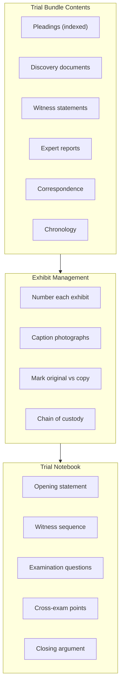

# L12 — Preparing the case for trial: Assembling the evidence

> [!abstract] Chapter Overview
> This chapter covers **evidence assembly** — organizing documents and exhibits for trial. Key topics: trial bundles, documentary evidence, captioning photographs, and trial notebooks.

> [!important] Trial Bundle
> A complete set of documents for the court, including: pleadings, discovery documents, witness statements, expert reports, and relevant correspondence.

## Visual Overview

*Figure: From bundle to notebook — organizing for trial success.*

> [!tip] Organization Tip
> Page-number every document. Create an index. The judge should find any document in seconds.

> [!tip] Connection
> Follows [[L11 - Preparing the case for trial: Advice on evidence|evidence advice]]. Proceeds to [[L13 - Preparation for trial: Legal research|legal research]] and [[L14 - Preparation for trial: Fact analysis and strategy|strategy]].

---

## Chapter Content Walkthrough

advice on the evidence before the trial date, you may nevertheless be able to spend a fruitful half hour with the investigating officer the day before the trial or even during the hour before the court is due to sit to discuss the matters listed above.

It is a fact that the performance stress that is so much part of the adversarial litigation process is ameliorated by having a good plan and sound strategy. Don't overlook the assistance you can get in this regard by doing an advice on the evidence.

### 11.7.3 Advising on the evidence for defence counsel

There should be no difference in principle for defence lawyers between an advice on the evidence in civil and criminal cases.

Defence counsel (attorney or advocate) has the advantage of copies of the police statements. They serve as the basis for an analysis of the issues, the onus and standard of proof, who the prosecution's witnesses are likely to be, what exhibits are available and so on. The steps in an [[Page-92|advice on evidence]] discussed earlier in this chapter should be followed where they are applicable and adapted where appropriate.

There are special requirements in criminal cases. Consider for example the failure of the accused (or his lawyers) to give notice of an alibi before the conclusion of the prosecution case. Does this perhaps devalue the alibi? See section 93 of the Act and the commentary in Kruger Hiemstra's Criminal Procedure LexisNexis at 14-31 to 14-32 and in particular S v Zwayi 1997 (2) SACR 772 (Ck) at 778d-j. Consider whether notice needs to be given that you intend to call [[Page-100|expert witness]]es. Consider whether there were inadmissible admissions or confessions made by the accused and the procedure to adopt in having them excluded. Consider whether you need to interview prosecution witnesses and if so, the procedure to follow (see paragraph 1.5.3.3). Consider whether you need to have prosecution exhibits examined by your own expert and if so, the procedure to be adopted to obtain permission and the safeguards to be put in place. Consider the constitutional principles that are applicable to the case and what to do if any of them has been breached.

This is not a closed list of things for defence counsel to consider. Each case will have its own demands. The time for doing an advice on the evidence in a criminal case is before the accused pleads and gives a plea explanation.

> [!warning] 11.8 Protocol and ethics

- Preparing for trial requires a certain amount of co-operation between the lawyers on the opposing sides. So maintain good relations and co-operate for the mutual benefit of both clients.
- Cases are won or lost in the preparation. When lawyers are sued for negligence, their conduct in the preparation phase is most likely to be blamed. The trial, at least, is a dynamic affair where things change from moment to moment, from question to question. But anyone can see, after the event, whether the preparation has been *(see page 208)* done with reasonable diligence and a reasonable amount of competence. A paper trail is left behind in the file, so the client who wishes to sue has all the evidence in his or her lawyer's own file.
- If the claim or defence is bad, the preparation will probably show that to be so. This is the time to think about settlement.
- Perhaps the most salutary lesson is this: When all the lawyers in the case are competent and do their work diligently, the cases are usually decided on the facts and the law. But if a lawyer makes a mistake or does not prepare properly, justice may not be done in the case. The whole system of justice relies on competent and ethical representation of litigants; preparation for trial is an important component of competent representation.

## Chapter 12: Preparing the case for trial: Assembling the evidence

CONTENTS

| 12.1 | Introduction |
| --- | --- |
| 12.1.1 | Types of evidence |
| 12.1.2 | The sources of evidence |
| 12.1.3 | The need to preserve the evidence |
| 12.2 | Consultations |
| 12.3 | Inspecting documents and examining exhibits |
| 12.4 | Inspections in loco |
| 12.5 | Creating [[Page-100\|demonstrative exhibit]]s: Plans, photographs and models |
| 12.5.1 | Plans |
| 12.5.2 | Photographs |
| 12.5.3 | Models |

---

12.5.4 Rule 36(10)
12.6 Consulting and briefing experts
12.6.1 Who is an expert?
12.6.2 Types of [[Page-100|expert evidence]]
12.6.3 Admissibility of expert evidence
12.6.4 The field of expertise
12.6.5 How to select an expert
12.6.6 Preparing the expert's brief
12.6.7 Problems to anticipate
12.7 Conducting a [[Page-100|pre-trial conference]]
12.8 Assembling the evidence: The prosecutor's position
12.9 Protocol and ethics

## 12.1 Introduction

Assembling the evidence and presenting it to the court are distinct but related processes. The police investigate criminal cases for the prosecution. Defence counsel and lawyers engaged in civil cases have to conduct their own investigations. In America this type of investigative work is done by specialist investigators, who are often also qualified lawyers. While private investigators are used to a limited degree in South Africa, the investigation of the facts of the case is almost without [[Page-75|exception]] done by the attorney who is going to conduct the trial, either as counsel, or as the instructing attorney who will assist counsel during the trial. In the latter situation it is common for counsel and the instructing attorney to work together as a team. They will conduct consultations and inspections together, take written statements from prospective witnesses, consult experts and prepare [[Page-100|demonstrative exhibit]]s. They will acquire essential knowledge about the facts to put before the court in order to persuade it to rule in their client's favour.

The main purpose of this stage of the trial preparation is to find as much evidence as possible to maximise the client's chances of winning. The initial process of evidence gathering, which took place before the summons was issued or the plea delivered, is now taken to a higher level. The attorney has to go on an extensive search for the evidence, exploring all avenues, considering every item of evidence that could help the client's cause. The search has to be controlled, structured and cost effective. In this search the attorney will concentrate on the different types of evidence, the sources of evidence, and the ways and means to preserve the evidence so that it will eventually be available to be presented to the court.

### 12.1.1 Types of evidence

There are three main types of evidence that could help to prove the existence of a fact or could cast doubt on the existence of a fact. They are direct evidence, indirect evidence and credibility evidence.

Direct evidence: Direct evidence is eye-witness evidence. In other words, it is evidence perceived by the witnesses with their own senses, namely their sight, hearing, touch, smell and taste. One witness may have seen the collision. Another may have heard the sound of the collision and noted the time it occurred. Yet another may only have felt the impact when the car collided with him without him having heard or seen anything. These *(see page 210)* witnesses can all give direct evidence of the collision and help you to prove that it did, as a fact, occur. The search for witnesses of this nature would lead to questions such as: "Who else was in the vicinity when the collision occurred? What did they see or hear or feel?" Then an effort should be made to interview all those persons as potential witnesses to help prove the client's case.

Indirect evidence: Indirect evidence differs from direct evidence in the sense that it does not matter whether the witness concerned actually saw the collision. [[Page-100|Circumstantial evidence]] is the most common form of indirect evidence. For example, a police officer may be able to give evidence to the effect that she arrived at the scene and observed a car with a damaged headlight and front bumper, an injured person lying on its bonnet and brake marks leading from some distance back towards a point in the road where there was broken glass matching that of the other headlight. These circumstances would tend to prove that there had been a collision between the damaged car and the injured person found on its bonnet, even though the constable did not personally witness the incident. Circumstantial evidence could be decisive; while it is relatively easy to cross-examine eye-witnesses to cast doubt on their observations, it may be very difficult to explain why the accused's fingerprints are on the murder weapon when he says that he has an alibi. You should therefore make a concerted effort to find as much circumstantial evidence as possible to help prove the facts supporting your [[Page-115|theory of the case]]. The facts of a particular case would tend to indicate what circumstances are relevant and helpful. Opinion evidence is another form of indirect evidence. An orthopaedic surgeon may be able to give expert evidence to the effect that the injuries suffered by the pedestrian were consistent with what one would expect if a car had collided with him. So, if the fact of the collision were in issue, you can look for evidence of this nature to help prove that the car had collided with the client.

Credibility evidence: Credibility evidence is evidence which serves to establish that an item of direct or indirect evidence is credible or reliable. For example, if it were suggested (in [[Page-145|cross-examination]]) that an eye-witness suffered from poor eyesight, the witness could give a demonstration to prove that he does not. An optometrist can be called to give evidence that he has tested the witness's eyesight and that he has 20/20 vision. The evidence would therefore help to establish the credibility of the witness or the reliability of his observations. Similarly, an

---

entry in the constable's pocket book may help to prove that the constable's evidence of what she saw at the scene is true. So you may look for this type of evidence too while investigating the facts and collecting the evidence, and even create [[Page-100|demonstrative exhibit]]s to help the witnesses present their evidence in the most persuasive way. Photographs of the damaged car may help the witness to explain the nature and extent of the damage more convincingly.

### 12.1.2 The sources of evidence

The court is going to receive evidence from two sources. Each side may place relevant and admissible evidence before the court. That evidence will be in the form of either oral evidence or exhibits. While it is relatively easy to gather, preserve and analyse the evidence available from the client and his or her witnesses and exhibits, you should also ascertain what evidence is available to the other side so that you can prepare fully to deal with that evidence during the trial. Try to find out as much as possible of the other side's case by -

- finding out what version their witnesses have given to other persons; and
- considering their discovered documents and other exhibits.

This will reduce the chances of being caught by surprise.

### 12.1.3 The need to preserve the evidence

The main aim is to preserve and organise the evidence for use at the trial in a form that ensures that the evidence is admissible, reliable and sufficient. In short, ensure that the client's evidence is legally and logically sufficient to prove the case (or to cast doubt on the other side's case, if acting for the defendant). Also, subject the evidence to analysis, a process explained in chapter 14. However, there is no purpose in analysing evidence that is not going to be available at the trial. Consider what to do to ensure that the evidence is available at the trial by being firstly, admissible in its form, secondly, reliable in its quality, and thirdly, sufficient in its quantity to prevail over the other side. A number of different processes can be employed to these ends, depending on the type of evidence and its sources.

Witnesses are needed to give the direct, indirect and credibility evidence. They have to be traced first, contact has to be maintained with them and, finally, they have to be taken to court to give their evidence. Subpoenas may be required to ensure the witnesses turn up.

Documents and other exhibits, likewise, have to be found, preserved in uncontaminated form and then produced in the court. The documents cannot be used unless they have been disclosed in terms of the rules relating to discovery. A proper discovery affidavit is essential for the documentary exhibits to be received as evidence. The evidence of the witnesses may need to establish the chain of custody of some exhibits.

The steps to be taken in the investigations to find and preserve the evidence for use at the trial will in most cases be -

- consultations with prospective witnesses;
- inspections of documents and examination of exhibits;
- inspections at the scene;
- the creation of demonstrative exhibits; and
- employing and briefing experts.

There is no particular order in which these steps are taken. The investigations also continue up to the commencement of the trial, and in some cases even during the trial. There is a relentless pursuit of the evidence that never really stops until the litigation has been concluded.

## 12.2 Consultations

The investigation of the facts usually starts at the first interview with the client. From that time on, you will interview witnesses or prospective witnesses right up to the date of the trial. Fact investigation is not limited to consultations with persons who invariably have to be called as witnesses. There are two main reasons why lawyers consult witnesses before a trial. The one is to prepare the witness for the hearing and the other to prepare counsel for the hearing. In some cases counsel would consult persons who could assist him or her in coming to grips with difficult matters of science. In a difficult murder case in the 1950s defence counsel went as far as attending a post-mortem examination in order to prepare his [[Page-145|cross-examination]] of the state pathologist.

During consultations with witnesses, make notes and draft a statement for signature by the witness. The statement should as far as possible be in the words and language of the witness. Refer to, or attach, appropriate documents, photographs or other exhibits to the statement and supplement the statement, where necessary, when additional *(see page 212)* information comes to hand from further investigations. Deal with the events in chronological order.

The statement should contain only admissible evidence. It is possible, however, that some irrelevant matter or

---

[[Page-92|hearsay]] or character evidence may creep in. This should, where appropriate, be kept separate, in an addendum or similar document. In short, the statement should be a "proof of evidence", a blueprint for the evidence-in-chief of the witness. In a proper case, an [[Page-30|arbitration]] or [[Page-30|mediation]], the statement can be handed in as evidence of the facts set out in it.

Statements from witnesses should be taken with only counsel and the instructing attorney present. If the client is unlikely to be a witness at the trial, he can be present. However, care should be taken that the witness does not feel intimidated or pressurised into giving a favourable statement because the client is present. This can happen all too easily when the client is in a position of authority or power in relation to the witness, for example, employer-employee or parent-child.

Other witnesses should be excluded from the interview, even if it seems quite convenient to discuss the matter with all the witnesses present at once. It is of the utmost importance to maintain the integrity of the evidence. Contamination can occur when the witnesses discuss the matter. It can also be caused by a careless attorney or advocate. Imagine the effect on the value of your witness's evidence if your opponent cross-examines your witness as follows:

Q. So when you saw my learned friend all the other witnesses were present and you heard what they had to say?

A. Yes.

Q. And you heard all the questions counsel put to them?

A. Yes.

Q. And they must have heard all the questions put to you and all the answers you gave?

A. Yes, but . . .

The services of an interpreter should be obtained for witnesses who do not speak English.

The statements of your side's witnesses have to be listed in the discovery affidavit in the section dealing with privileged documents. While it is customary simply to list statements as "Statements of witnesses", it is probably more correct to list the witnesses by name.

Create a timeline (or outline) for each witness. A timeline is a sequential (or chronological) list of the important facts a witness has to cover in his or her evidence. When you are on your feet leading the evidence-in-chief of the witness, that timeline could serve the function of a prompt, allowing you to concentrate on the answers given by the witness and the next question you need to ask. The timeline could be incorporated in your copy of the witness's statement. Create an extra wide margin on the one side of the paper and insert the key words and phrases from the text of the statement so that the highlighted words appear next to the relevant text. (See Table 17.2.)

You may need to interview a number of witnesses to gather all the evidence on each aspect of the case. For example, in order to collect all the medical evidence you need for Mrs Anne Smith and her two children's RAF action, you may have to speak to them, to the doctors who treated them, to some hospital staff, to a variety of specialists who may have been involved in their treatment and to the suppliers of medication. If the children's intellectual capacity has been affected by the injuries sustained in the collision, you may *(see page 213)* have to speak to their teachers. The witnesses could also lead you to important documentary evidence, for example -

- the medical records and reports kept or created by the doctors who treated them, which ought to contain details of the treatment, its cost, the prognosis for the future, all organised in date order with appropriate schedules to be prepared;
- the hospital records and reports relating to their treatment and recovery in hospital, similarly arranged;
- diagnostic aids like X-rays, blood and tissue analyses, ultrasound scans, ECG and EEG reports;
- photographs depicting the injuries and scarring, and the progress (or lack of progress) in the healing process;
- the children's scholastic records; and
- expert medical opinions and reports.

All these sources should be studied and incorporated in the statements of the witnesses in order to create a complete medical file for each plaintiff. That medical file should then be put before your [[Page-100|expert witness]]es for their comment and opinion on the matters referred to in Rule 18(10), namely -

- the nature and extent of the injuries;
- the nature, effects and duration of any disability;
- the medical and hospital costs;
- the pain and suffering experienced by each plaintiff;
- any disability in respect of earning capacity, past and future;
- any disability in respect of the enjoyment of the amenities of life; and
- disfigurement.

---

The medical file will form the basis of the client's discovery affidavit as well and may even be produced as an agreed bundle of exhibits at the trial. You need to be careful, though, that the contents of the file are legible. You also need to watch out for misleading terminology and adverse comments like, "This patient has made a satisfactory recovery," as it is not clear to whom the "satisfactory" refers. These comments and entries have to be dealt with by the [[Page-100|expert witness]]es and should not be left unanswered and unexplained.

## 12.3 Inspecting documents and examining exhibits

The evidence placed before the court consists largely of documentary evidence. Like oral evidence, documentary evidence has to be found, organised and placed before the court through credible witnesses who can give admissible evidence. Some of the documents may be obtained from the client, but it would be extremely unwise to conduct a trial with only the information gathered from the client.

The discovery procedures provided by the rules have to be employed to obtain access to all the other side's documentary evidence. You won't learn exactly what their witnesses will say, except for expert witnesses, but their documents may open up new avenues of investigation.

In one American case the plaintiff's lawyer traced a witness to the collision by noting the registration number of a parked car in one of the defendant's photographs. When he traced the owner of the car, it was confirmed that the car played no part in the collision, but its owner had been nearby and saw everything. The witness carried the day for the plaintiff.
In some instances the documents or exhibits you need may be in the possession of third parties, such as the police. Many a case has turned on an entry in a police officer's pocket book or diary, or plans prepared by the police. The local municipality may also have useful plans and photographs of the scene of a collision or incident. Remember that the plans do not show where the trees and vegetation are. These may be relevant to your case. Documents in the possession of third parties can usually be obtained from them by a polite request and an offer to pay the cost of collection and copying. If that doesn't work, a subpoena duces tecum will have to be served on the person who has possession of the documents.

All the documentary evidence you obtain from the other side should be integrated with your own. Privileged documents and witness statements should be kept in separate folders. Organise the documents in separate bundles, for example, for general correspondence, contract documents, documents relating to quantum, photographs and plans and drawings.

There are computer programmes available to help you keep track of all the documents in a way that will allow you to see at a glance where the document is and where it fits into the greater scheme of the case. Whether you do it manually or by computer, arrange the documents in each folder in chronological order and note the following details for each:

Table 12.1 Scheme for organising documentary evidence

| Date | Nature of document | Author | Recipient | Summary of contents | Notes or comments |
| --- | --- | --- | --- | --- | --- |
| Documents should be in date order. | Letter? Contract? Receipt? Invoice? Plan? Photograph? etc. | Who wrote, signed or drafted it? (This person could be a necessary witness.) | Who received it? (Another potential witness.) | What does the document mean in the context of the case? Where does it fit in the story? Tell your story through the documents. | Cross-reference to other documents or evidence, make notes for [[Page-145\|cross-examination]] and so on. |

This is by no means the only way to organise the documents. If you adopt this kind of process you will inevitably have to read and analyse each document and think about its role and use in the dispute. Most documents don't help at all, but then, in the miner's pan there are only a few flecks of gold to be found after all that sifting and swirling! Analysing the documents is an intensive and useful exercise for trial preparation and is also hard work, best done without distractions. You could use a scheme such as the one discussed in chapter 14 for this type of analysis.

Having organised and analysed the documents in this fashion, you are ready to start creating a trial bundle. Each side has to ensure that the documents supporting their [[Page-115|theory of the case]] are included. Every document not admitted by the other party has to be proved by a competent witness. The following general formula should suffice in most cases:

- "It is agreed that each document in the bundle -
- is what it purports to be;
- was properly executed by the person or persons indicated in the document as its author or authors;
- was so executed on the date reflected in the document; and
- in the case of correspondence, was received by its addressee in the normal course of postal delivery or telefax, as the case may be.

---

- The content of any documents in the bundle is not in issue, except for the following documents: -" (Prepare a list to be attached to the agreement.)

## 12.4 Inspections in loco

It is surprising that so many lawyers try to conduct a trial without having visited the scene of the events giving rise to the dispute, for example, where a collision occurred. What is not surprising, is how often some feature at the scene decisively influences the outcome of the trial. A taxi driver lost his right arm when his taxi and an approaching Post Office truck collided with each other. The two vehicles had struck each other a glancing blow, right side to right side, on a narrow road. The point of impact on all versions was more or less in the centre of the road. The taxi driver could not point out the scene. His passengers could not be found until the trial. The police plan did not identify the scene well enough to enable counsel to determine precisely where the collision had occurred. An inspection of the place where the taxi driver's counsel and attorney initially thought the collision had occurred revealed nothing of interest. However, on the morning of the trial one of the passengers turned up and was able to pinpoint the scene. Counsel went to the scene. One look at the scene was enough. It revealed that the taxi driver had no room to swerve to his left as there was a vertical cliff and a barrier right on the edge of the road surface. The Post Office driver, on the other hand, had at least the width of the road again to his left. This area was level and passable and he could have avoided the collision by swerving to his left. The damages were apportioned two thirds/one third against the Post Office driver on the basis that he had failed to swerve to his left to avoid the collision. Both drivers were held to have been equally negligent in not keeping a proper lookout but only one of them had the room for evasive action.

An inspection requires some planning to be done in advance. The following questions can be used as a guideline: What will you be looking for? Why is the information you seek important? How are you going to place the information you gather before the court? Which of the witnesses should you take to the inspection so that they can point out the salient features and give the evidence? What will you need to enable you to put your client's case persuasively to the court?

An inspection toolkit for trial lawyers (all tax deductible!) should include at least the following -

- a 30 or 50 metre tape measure;
- a compass;
- a stopwatch;
- a digital camera, preferably with a zoom lens (from about 35 to 135 mm);
- a video camera (which may have to be borrowed or hired as this is a rather expensive item);
- graph paper; and
- dividers.

With these tools you should be able to prepare a decent plan of the scene, with proper compass directions and with a key that shows precise distances rather than estimates. You can take a set of photographs to illuminate the scene. Using a digital camera allows you to print the photographs through your computer. You can also e-mail them to your client or your opponent. A video might record the ambience of the scene better than a set of still photographs.

The witnesses should be kept separate so that the value of their evidence is not diminished. You can ensure that one witness does not see or hear what another points out at the scene by staggering their arrival times. The features pointed out by each witness *(see page 216)* should be recorded accurately by marking the salient points on a plan or by taking a photograph. Most cases requiring an inspection involve personal injuries or loss of support claims arising from motor collisions.

The main purpose of the inspection is to acquaint yourself with the facts of the case so that you can convey them to the court in such a way that your client's case is presented accurately and persuasively. The secret is to take your time and to soak in the atmosphere of the scene. Return to the scene alone, if necessary, until you are certain you can visualise how the events unfolded. Make sure that you visit the scene at the same time of day that the incident which gave rise to the dispute occurred. It may not be helpful to look at the scene in daylight when the events concerned happened at midnight. Work out how you can convey what you have seen and experienced to the court. Decide whether a plan of the scene will be enough; whether photographs will help; whether a video is necessary. The next step is to create the [[Page-100|demonstrative exhibit]]s that will help you to present the case persuasively.

## 12.5 Creating demonstrative exhibits: Plans, photographs and models

Demonstrative exhibits are created to help the witnesses tell their story, to help counsel lead the evidence, and help the judge to follow the evidence.

### 12.5.1 Plans

---

Let's assume we are to inspect the scene where our client, Mrs Anne Smith, was involved in a collision with Mr Joe Soap. For such an inspection you would probably proceed as follows:

- Meet at the scene at the arranged time after alerting the traffic department that you will be conducting an inspection.
- Ensure that you are at the right place by comparing the point of reference (usually referred to as a 'fixed object') given in the police plan with that object at the scene, if you can find it. Double check with the witnesses that you are indeed at the right place.
- Draw a rough sketch of the scene. Where did it happen: at a straight section of the road, an intersection or a T-junction? We know from our previous instructions to expect a robot-controlled intersection.
- Add all road markings and traffic signs.
- Note and reflect the number of lanes, if it is a road divided in traffic lanes.
- Measure and record the respective widths of the road and any demarcated lanes in the general area where the incident occurred.
- Ask the client to point out where the collision occurred. Mark this as the point of impact on your drawing. Measure the distance from the side of the road to the point of impact. Then measure the distance from the other side to the point of impact. Make sure that your measurements are perpendicular to the side of the road.
- Make a note of the phasing of the traffic lights. Are there any turning arrows? Make a note and record the duration of each phase of the lights, for example, for how long the turning arrow flashes.
- Note all obstructions such as trees, shrubs, and bus shelters.
Back at the office or chambers, create as accurate a plan as you can with the information you have obtained at the scene. Measurements and other features or observations may be recorded on a separate document, commonly known as the 'key to the plan'. You should also draft a statement for Mrs Smith incorporating the plan, the key and the photographs you have taken. Remember that she is going to be the witness, not you.

Plans are usually drawn to present a bird's eye view of the scene. Many witnesses have difficulty in dealing with plans of this nature, so care has to be taken to ensure that they know how to deal with your plan. North is always at the top of the page. While plans drawn to scale are not necessary for ordinary matters such as RAF or other motor-collision cases, the use of graph paper may still help you to draw a plan which has things more or less in proportion. If a drawing to scale is required, you will have to employ an expert such as an architect or land surveyor.

### 12.5.2 Photographs

A good set of photographs may make it unnecessary for the court to visit the scene and may thus save time and cost. It could also place the Court of Appeal in a better position to evaluate the factual findings of the court appealed from. When photographs are prepared for the court, they should be taken with three main objectives in mind. The *first* is that the photograph should depict some feature of the scene that would help you establish a useful fact. The *second* is that the photograph should not be controversial. There is no purpose in producing photographs that serve only to distract the court from the main issues. The *third* is that the photograph should make it easier for your witnesses to give their evidence or help the judge to understand the evidence.

A key should be prepared for each photograph. This should initially be done at the scene where, as soon as a photograph is taken, you should jot down some details. Later, when the photographs have been developed and printed, a bundle could be prepared. Care should be taken that the caption to each photograph is an accurate reflection of what can be seen at the scene. The following information should suffice:

**Table 12.2** Providing captions for photographs

| Number | Date | Legend | Compass | Comment |
| --- | --- | --- | --- | --- |
| 1 | 2/3/[year] | The photograph depicts the plaintiff's position when he first saw the bus approaching. The plaintiff's house is the one with the green roof opposite the bus stop. | Photographer facing south. | The photograph was taken a year after the incident. The new houses on the eastern side of the road were built after the incident. |

If the case is about a collision, say, an elderly pensioner living in a rural area was knocked down by a bus, your client may need a lot of help to be able to give his evidence coherently and persuasively. In such a case I would suggest the following process for a set of helpful photographs:

- If it is safe, ask the client to stand at the point of impact, facing the same way he was facing at the moment he was struck by the bus, then take a photograph in the direction from which the bus approached. The photograph should show the client in the road (or wherever he was at the moment of impact) with a view in the direction from which the bus approached. This photograph should show the scene as through the eyes of

---

the client. Could and should he have seen the bus?

- Take another photograph from the point where the client started crossing the road. Could and should he have seen the bus when he started crossing?
- Take a set of five photographs at 30 metre intervals from the point of impact. They should show the scene as seen by the bus driver at 150, 120, 90, 60 and 30 metres respectively from the point of impact. When could and should the bus driver have noticed your elderly client shuffling across the road?
- Make a note of any special features. Is there a blind rise or any object affecting visibility? Are there any road markings or traffic signs? Take appropriate photographs to capture these features.

The details given in respect of each photograph should be agreed with the other side. If a particular photograph cannot be admitted, it should be removed from the bundle and should be proved separately. Ideally there should be no dispute about what the photographs depict, but there could reasonably be disputes about the evidence of the witnesses who pointed out features at the scene. Such disputes cannot be avoided but they can usually be resolved by omitting the captions and comments and allowing each side's witnesses to give their evidence using the photographs alone as their reference point.

### 12.5.3 Models

Some cases are so difficult to conduct that it cannot be done without the use of a model. In RAF cases where children are involved as witnesses, it is often helpful, if not essential, to use a set of toy cars, buses and trucks. Some adult witnesses also need help. These could be used during consultations and in court when the witnesses are asked to explain how the collision occurred. If models of this kind are to be used, they should bear a passing resemblance to the real thing. Your best laid plans could come unstuck if the witness declines your invitation to demonstrate with the red car you hand her on the basis that she had been knocked down by a green car. There is also no purpose in using a model at all if you are going to hand the witness a toy bus and ask that he should pretend it is a cement truck. The bus should be in reasonable proportion to the cars used in the demonstration. The purpose of using models is to help the witnesses to give their evidence confidently and coherently. Using models which bear little or no resemblance to the real thing is more likely to defeat the object of the exercise than to help.

In some cases, more intricate models will be required. In an English case a working model of a ship was built at a cost of more than a million pounds. In some recent local trials counsel have made use of -

- a model of a pair of steel silos (filled to capacity with wheat) which had collapsed in the harbour and had demolished the soap factory next door;
- models of the coaches of a train which had derailed with the loss of 67 lives;
- a working model of a ship's MacGregor hatches which had been damaged while port's crane operators were loading containers;
- an anatomically correct model of the brain, with parts of the brain being able to be removed to expose other features;
- a scale model of the roof of a factory which was said to be defective; and
- a working model of a ship's crane which had collapsed on shore side facilities.

There are other cases where models could be used. In each case the model is there to help the witnesses explain some feature of the events in dispute and to help counsel and the judge to gain a better understanding of the facts.

### 12.5.4 Rule 36(10)

The plans, photographs and models prepared by an attorney or an advocate have to be proved like any other exhibit. Proof could be supplied by admissions. Ideally the attorney or advocate should not become a witness in the case. If [[Page-100|demonstrative exhibit]]s have been prepared by an attorney or an advocate, every effort should be made to agree their correctness with the other side. You should discuss the use of these demonstrative exhibits at the Rule 37 conference (or even earlier) and ask your opponent to admit them or to indicate in what respects it is suggested that they are not accurate. Where possible the items making agreement impossible should be reconsidered. Do you really need them? Can you change the exhibit and accommodate your opponent's concerns? Can you prove the correctness of the exhibit through another witness? This is still not the best way of dealing with the matter. In the absence of agreement a notice under Rule 36(10) will have to be delivered to the other side at least 15 days before the trial, offering inspection of the item and requiring it to be admitted within ten days. If there is no response in the ten-day period the plan, photograph or model may be used without further proof.

## 12.6 Consulting and briefing experts

Judges draw inferences from the facts that are proved in the case before them. However, some cases involve facts and inferences falling outside the ordinary experience of judges (and other lawyers). [[Page-100|Expert witness]]es are used to

---

explain subjects outside the court's normal experience and to express opinions on the inferences to be drawn from the facts. An expert's evidence can make or break your case. In some cases [[Page-100|expert evidence]] is indispensable; in other cases it can help you to present your case more persuasively.

### 12.6.1 Who is an expert?

An expert is a person who, by virtue of his or her academic qualifications, experience or research (or a combination of them), is able to give relevant evidence in the nature of information and opinions not generally available to the public.

### 12.6.2 Types of expert evidence

There are two types of expert evidence: The *first* is where an expert is required to give evidence of his or her own independent investigations and observations, which may include opinions based on those investigations and observations. This type of expert evidence is encountered often in RAF actions when the orthopaedic surgeon who treated plaintiffs for their injuries, gives expert evidence of their injuries, the treatment they received, the cost of the treatment, whether future treatment will be necessary, and the cost of future treatment. In the process, the surgeon may express opinions on the nature and degree of pain and discomfort, disability, loss of amenities of life, life expectancy and other matters relevant to quantum.

The *second* type of expert evidence is where an expert is asked to give evidence based on documents submitted to him or her for the purpose of providing an expert opinion on some issue or question or other. For example, a radiologist may be employed by the defendant to examine X-rays of the plaintiff's leg in order to express an expert opinion on the question whether there is a likelihood that future medical treatment will be required. The expert will do no independent fact investigation in this situation but will base his or her opinion on the facts provided to him or her.
When employing an expert, it is important that you should make it clear whether the expert is expected to make an independent investigation of the facts or whether he or she is restricted to the material supplied to him or her.

### 12.6.3 Admissibility of expert evidence

There is still some controversy whether an [[Page-100|expert witness]] should be allowed to express an opinion on the very matter the court has to decide, the so-called "ultimate issue". This question has not been resolved yet, but opinion evidence is generally allowed when it can help the court to decide the issues. Opinion evidence is admissible when it is relevant and it is relevant when it can help the judge to make a decision. This is not a very precise test, is it? There are nevertheless some principles to be applied as a general guide:

- A lay witness may give opinion evidence if the subject-matter falls within ordinary human experience, for example, whether someone was "angry", whether a car was going "fast", and even whether someone was "drunk". However, he or she is not allowed to express an opinion about the fundamental question before the court, for example, whether the accused was so angry that he was unable to form the necessary intention, or whether she exceeded the speed limit by 11 kilometres per hour.
- Expert opinion evidence is generally not allowed on matters of common knowledge, matters of human attitudes and behaviour, credibility of witnesses and the construction of documents and statutes.
- Before allowing a witness to express an expert opinion, the court will have to be satisfied of the expertise of the witness and that the facts upon which the opinions are to be based have been, or will be, proved. That does not mean that the opinion evidence has to wait until the court has made its final findings of fact. The witness will be allowed to express his or her opinions and to state the facts, proved or assumed, which support the opinions expressed by him or her.
- The court is not bound to accept the expert's opinion. The court may reject it, even if no opposing views have been expressed by other witnesses. When opposing opinions are expressed by the expert witnesses called by the parties, the court may determine the approach to be followed to resolve the issues. The court alone is responsible for findings of fact and law.

### 12.6.4 The field of expertise

Because the evidence of the expert has to be relevant to be admissible, the expert will have to be expert in the subject-matter before the court; otherwise his or her opinion will not be helpful. You should therefore try to find an expert in the relevant field. The nature of the dispute determines whom you would employ and call as an expert. For example, an orthopaedic surgeon should be able to express helpful opinions on the degree of pain and discomfort to be expected in an RAF case involving bodily injuries. An architect should be able to give helpful expert opinions in a dispute relating to the compliance (or non-compliance) of building work with the approved plans and the national building regulations.

### 12.6.5 How to select an expert

Due to the degree of speciality in virtually all areas of human endeavour, particular care must be taken in the selection of an expert. In the case where a particular expert has already been involved, for example as the orthopaedic surgeon who treated the plaintiffs *(see page 221)* for their injuries, there may still be good reason to appoint another expert although that would not usually be necessary. If an expert has to be appointed from

---

scratch, it may not always be easy to find one. The following steps may be taken:

- Make enquiries amongst colleagues who practise in the same area of law involved.
- Approach the relevant faculty or department at the local university, technical college or similar institution.
- Obtain a detailed résumé of the proposed expert's qualifications, experience and expertise. Look for practical experience. There is no substitute for experience!
- Meet the expert and discuss the matter generally. Make an assessment of the way the expert projects himself or herself. Will he or she be confident and convincing without being arrogant or overbearing? Will the expert stand up to [[Page-145|cross-examination]]? Has he or she given evidence before? Was his or her evidence accepted on those occasions?
- If the proposed expert is suitably qualified to give an opinion, give him or her sufficient detail of the facts of the case and ask him or her to confirm that the issue is well within his or her expertise. If it is not, ask him or her if he or she knows an expert within whose field of expertise the matter falls.
- Once a suitable expert has been found, ensure that the basis of his or her retainer is agreed and confirm the relevant details in a letter.

### 12.6.6 Preparing the expert's brief

The expert must know exactly what is required of him or her. The expert report will also have to be structured in such a way that it could be used as the basis of the expert's evidence or, failing that, an expert summary under Rule 36(9)(b). For these purposes, an expert brief will have to be prepared. This could be done in a consultation, but even then there should be a written record. The expert's written brief should contain the following -

- any written material to be supplied to the expert for consideration (If there are any exhibits involved, you have to ensure that the chain of custody is preserved.);
- the facts which are relevant to the opinion (You have to ensure that the facts you want your expert to rely on can be proved by independent evidence.);
- the disputed facts which give rise to the need for an expert evaluation and opinion;
- the precise question or issue to be addressed by the expert; and
- the desired structure of the report to be submitted by the expert.

The expert's report should be structured in such a way that it can be used as a summary of his or her evidence. The report should be kept simple so that lay persons such as the judge and counsel can follow the expert's reasoning. The following points should be included -

- a brief summary of the expert's qualifications, experience, publications and expertise, with a detailed curriculum vitae to be attached to the report. The summary should move from the general to the specific so that the expert's ability to assist the court on the issue before it is clearly established;
- the issues or questions submitted to the expert for his or her opinion;
- the facts which the expert has based the opinion on, with any assumptions made by the expert;
- the methods or reasoning adopted by the expert to arrive at his or her conclusions;
- the expert's conclusions or opinions;
- the reasons for each conclusion or opinion he or she has reached;
- any qualifications or reservations the expert wishes to impose on the opinions expressed;
- a list of any reference works relied upon by the expert in reaching the conclusions or opinion.

### 12.6.7 Problems to anticipate

There are some practical and ethical matters to keep in mind when briefing an expert.

- An [[Page-100|expert witness]] has a duty to the court to provide an accurate, independent opinion. While the witness is employed and paid by the one side in the dispute, the expert's overriding duty is still to the court. This should be made plain to your expert from the outset.
- The expert should be ready to make concessions where concessions are called for. Being too dogmatic could reduce the value of an expert's opinion.
- The subject-matter of the expert opinion may be difficult and taxing for counsel to understand. Nevertheless, it is counsel's duty to educate himself or herself to the required standard. You cannot lead the evidence of your witness, cross-examine any opposing expert or argue the case properly, without fully understanding the [[Page-100|expert evidence]]. Do not underestimate the amount of work to be done or the amount of pleasure you can derive from being a student again.

---

- Your expert may be asked to comment on alternative factual scenarios. You should be ready to explore these with your [[Page-100|expert witness]] before the trial.

## 12.7 Conducting a pre-trial conference

The objects of a pre-trial conference are to -

- curtail the duration of the trial;
- narrow down the issues between the parties;
- curb costs; and
- facilitate settlements.

These objects can only be met if both parties arrive at the conference fully prepared. To this end Rule 37(4) requires that a notice be served on the other side advising them what admissions will be sought, what particulars will be requested and what other matters will be raised at the conference. Rule 37(6) is to the effect that certain matters have to be discussed at the conference and that the parties have to report to the court what they have done in respect of those matters. Rule 37A applies to proceedings in the Cape of Good Hope Provincial Division only and has far more detailed provisions, designed to meet the objects of a pre-trial conference more effectively. It is anticipated that the court's supervision and management of the pre-trial procedures will be extended.

Leaving aside the matters you have to deal with in terms of Rule 37, your preparation for the pre-trial conference should cover the matters discussed thus far in this chapter. Questions you may consider for discussion at the conference could include:

- Has there been a full disclosure of the relevant documentary evidence by both sides?
- Is there an issue with regard to the admissibility of any document which could be resolved by agreement?
- Could a joint or agreed bundle of documents be prepared?
- Could the status of any of the documents be agreed on?
- Is a joint inspection necessary? Are any plans or photographs relating to the scene in dispute? Could those disputes be eliminated by appropriate admissions?
- Could the parties jointly prepare [[Page-100|demonstrative exhibit]]s for the assistance of the court and the witnesses? What else can be done with regard to demonstrative exhibits?
- Is an interpreter necessary and, if so, who should be employed and on what terms?
- Should the expert witnesses be asked to meet and to discuss the matter? Should they be asked to submit a joint report to the parties and the court in which they can set out in what respects they agree with each other, in what respects they disagree and how their disagreement can be resolved?
- What admissions of fact can be made by either side?
- How can the case be settled?
- If it cannot be settled, is there perhaps an alternative dispute resolution method available which suits the requirements of the case?

These are but a few of the matters you would have to consider before you attend the conference. Rule 37 provides for others and each case will almost certainly have its own requirements. You should use the general checklist provided by Rule 37 and add to those topics any topics the circumstances of your case demand.

The conference should be held at least six weeks before the trial date. My experience is that it is seldom possible to hold the conference earlier because the parties have not completed their preparation; a conference of this nature can only be successful when both sides are ready for the trial itself. Leaving the conference for later than six weeks before the trial creates other problems; there may not be enough time to implement decisions taken at the conference and the clients may become liable for trial fees even though the case may settle. The lawyers involved may also prefer to be able to fill their diaries with other work if the case settles early.

The convention is that the conference is held at the chambers of the most senior advocate briefed in the case, at the seat of the court. If attorneys are to handle the matter as counsel, the same principles will apply. It is customary for the plaintiff's attorney to draft the minute. It is often possible to dictate the minute at the end of the conference. Any objections, qualifications and explanations can be dealt with there and then. The minute has to be placed in the court file before the hearing.

A properly handled pre-trial conference is a valuable tool of preparation for the trial. It allows you to prepare the case for the trial and it allows you as counsel to be better prepared for the trial.

---

---

## Concepts in this lecture

None

## Navigation

Prev: [[L11 - Preparing the case for trial: Advice on evidence|← Previous Chapter]] · Next: [[L13 - Preparation for trial: Legal research|Next Chapter →]]
