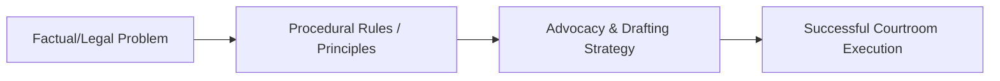

---

type: lecture
lecture: L14
tags: [lecture, litigation-skills]

---
# L14 — Preparation for trial: Fact analysis and strategy

> One-paragraph overview of the litigation skills and principles taught in this chapter.
>
> [!abstract] The arc of this chapter
> **Where we left off:** We explored the previous phase of litigation or litigation foundations.
>
> This chapter covers **Preparation for trial: Fact analysis and strategy**. We look at the problem of how to execute this task, the rules that govern it, and the strategies for successful advocacy.

*Figure: The problem-to-execution chain in this chapter.*

---

## Chapter Content Walkthrough

- Counsel has the duty to bring authorities which are against them to the notice of the judge, even if their opponent does not.
- You are entitled to distinguish adverse authorities on the facts when making submissions to a court, but when giving advice to a client, counsel has to form an objective view.
- Return books you have borrowed from a colleague as soon as possible.

## Chapter 14

Preparation for trial: [[Page-115|Fact analysis]] and strategy

CONTENTS

14.1 Introduction
14.1.1 Fact analysis
14.1.2 Strategy
14.2 Identifying the material facts in issue
14.3 Stage 4: Propositions of fact supporting each legal element (or material fact)
14.4 Stage 5: The evidence to prove each proposition of fact
14.4.1 Analysis of legal documents
14.5 Stage 6: Admissibility, reliability and sufficiency of the evidence
14.5.1 Admissibility of the evidence
14.5.2 Reliability of the evidence
14.5.3 Sufficiency of the evidence
14.6 Stage 7: Developing a [[Page-115|theory of the case]]
14.6.1 What is a "theory of the case"?
14.6.2 The function of the theory of the case
14.6.3 How to develop and formulate a theory of the case
14.7 Stage 8: Trial tactics
14.8 Counsel's trial notebook
14.9 Fact analysis in criminal cases

## 14.1 Introduction

When the case is ready to proceed to trial counsel's personal preparation still has to be completed. Conducting the necessary legal research will be an important part of that preparation. What remains is for counsel to become completely conversant with the facts of the case and to plan a suitable strategy for the trial. This part of the preparation for trial involves two linked processes namely, fact analysis and strategic planning. The aim is to achieve such a high degree of understanding of the facts and evidence that counsel will be able to adopt the best possible tactics for the trial and will be able to deal competently with all the processes and incidents of the trial itself.

### 14.1.1 Fact analysis

Fact analysis is used to determine and test the legal, factual and logical sufficiency of the case. This book uses the proof-making model of fact analysis. The proof-making model is based on logic and legal principles. It can be defined as the process by means of which we harness the evidence to ensure that it is sufficient to support a claim or a defence in legal proceedings.

Fact analysis is a core skill for lawyers. Lawyers rely on fact analysis at every level of practice; it is not unique to the litigation process. It can be used for other legal processes such as drafting a will, registering a patent, applying for a liquor licence and for many other tasks that lawyers perform in their daily practice.

It proceeds in stages, as we see in chapter 1:

Stage 1 Identify the area of law
Stage 2 Identify the [[Page-54|cause of action]] or defence
Stage 3 Identify the legal elements of the claim, charge or defence
Stage 4 Identify the facts supporting each of the legal elements

---

Stage 5 Identify the evidence to prove each of those facts

Stage 6 Consider whether the evidence is admissible, reliable and sufficient

Stage 7 Develop a [[Page-115|theory of the case]]

Stage 8 Develop a strategy for the trial.
The basic steps at Stages 3 to 5 of the proof-making model are represented in the following figure:

**Table 14.1** A schematic model for [[Page-115|fact analysis]]

**Note:** The model demonstrates that: *Firstly*, the legal element to be established has to be supported by sufficient facts. *Secondly*, the facts have to be supported by the evidence. *Thirdly*, the evidence has to be admissible, reliable and sufficient.

The legal elements are determined by the law and discovered by legal research. For example, if the claim is based on a breach of a contract, the law of contract will determine what the legal elements of the claim are and you will find the relevant principles in a textbook or a case dealing with the law of contract. The facts are arrived at as logical deductions from the evidence. The evidence, in turn, is given by witnesses and consists of oral evidence and exhibits. The exhibits may include documentary evidence that can be contained in a variety of different types of documents. Further issues to be taken into account are the admissibility, reliability and sufficiency of the evidence. The law determines what evidence is admissible. The reliability of the evidence is determined by the judge and recorded as findings of fact. The onus and standard of proof (*prima facie*, balance of probability or beyond reasonable doubt) play an important role in determining whether the evidence is sufficient to discharge the onus of proof.

### 14.1.2 Strategy

Your trial strategy will be based on a careful fact analysis and a resourceful consideration of a persuasive theory of the case and suitable tactics to pursue that theory.

Strictly speaking, only the first five stages involve fact analysis; the last two have to do with strategy and trial tactics. Each of these steps is essential for systematic trial preparation; and each complements the others. The complete process can be represented as follows:
**Table 14.2** General scheme for trial preparation based on the Proof-making Model

| Stage | What counsel has to do | Skill involved |
| --- | --- | --- |
| 1 | *Determine the area of law involved* | Legal research. Fact analysis. |
| 2 | *Determine the [[Page-54\|cause of action]] (criminal charge) or defence* | Legal research. Analysis of legal documents. |
| 3 | *Determine the material facts (the legal elements) in issue.* 1 In a civil case, compare the Particulars of Claim (the 'Claim') and the Plea. The issues are the allegations in the Claim which are denied (or not admitted) in the Plea. 2 In a criminal case the issues are all the material facts alleged in the Charge Sheet or Indictment put in issue by a plea of | Legal research. Analysis of legal documents. |

---

| | 'Not guilty'. 3 Ascertain the precise legal content or meaning of each material fact in issue. | |
| --- | --- | --- |
| 4 | *Ascertain the propositions of fact to support each material fact in issue.* 1 These facts are arrived at as deductions from the available evidence. 2 Some facts may also be arrived at as valid deductions from other facts. | [[Page-115\|Fact analysis]]. Analysis of legal documents. |
| 5 | *Determine what evidence is available for each proposition of fact by way of:* 1 oral evidence; 2 exhibits (including documents); and 3 admissions. | Fact analysis. Analysis of legal documents. |
| 6 | *Consider the admissibility, reliability and sufficiency of the evidence.* 1 Deal with all admissibility problems. 2 Consider the reliability of the evidence. 3 Consider whether the available evidence is sufficient, having regard to the incidence of the onus of proof and the standard of proof required (*prima facie*, balance of probability or beyond reasonable doubt). | Fact analysis. Legal research. |
| 7 | *Develop a [[Page-115\|theory of the case]].* 1 Identify the central issue in the case. 2 State your position on that issue. 3 State the main facts supporting your position on the central issue. 4 Identify the opposition's theory. 5 Discredit the opposition's theory. | Logic |
| 8 | *Develop appropriate tactics to pursue the theory of the case.* 1 Decide which witnesses to call. 2 Decide which exhibits to prove. 3 Prepare a timeline for each witness. 4 Anticipate who the other side's witnesses will be. 5 Prepare themes for the [[Page-145\|cross-examination]] of each opposition witness. 6 Prepare an [[Page-131\|opening statement]]. 7 Prepare a closing address (in draft). | Trial tactics. |

The steps taken by counsel in his or her preparation for trial should be recorded in counsel's trial notebook. (See paragraph 14.8.) The use of computers makes it easy to do the analysis with the use of columns and tables. You could be faced with thousands of documents, hordes of witnesses, numerous issues and multiple parties. However, for the type of case that comes before the courts every day, a simple plan that is executed diligently will be sufficient. Remember, although personal computers and litigation support software can help you to record, organise and recall the available information, they cannot do the *thinking* for you. You still have to analyse the information yourself.

The case of our client, Mrs Smith, can be used as our vehicle of instruction. She has sued for the damage to her car. The pleadings are closed, both sides have completed the discovery process and proper expert notices, summaries and other notices have been served. The brief to counsel contains written statements of potential witnesses as well as the police plan and some photographs of the scene and the plaintiff's car. The case is therefore ready to proceed.

The different steps of the fact analysis and strategic planning can now be undertaken to ensure that counsel is also ready for the trial. We do not have to bother too much with Stages 1 and 2 because we know that we are dealing with a delictual claim for damages based on the *actio legis Aquiliae*, but first of all we need to determine what the issues are.

## 14.2 Identifying the material facts in issue

The issues to be decided by the court can be identified by an analysis of the pleadings.

The material facts for a claim have to be set out in the statement of claim (summons, particulars of claim, declaration, counterclaim, third-party claim or interpleader claim), as supplemented by the replication. The material facts for any special defence are set out in the plea.

In a criminal case the material facts are set out in the charge sheet or indictment. When the accused pleads not

---

guilty to the charge, every material fact alleged in the charge sheet or indictment is placed in issue, unless the accused makes formal admissions under section 220 of the Criminal Procedure Act 51 of 1977. (The relationship between the legal elements for a claim or defence and the material facts is explained in chapter 5.)

In a civil case and in [[Page-30|arbitration]] proceedings where pleadings are exchanged, the issues can be identified from the opposing pleadings. The two sets have to be read together. You can ascertain what the issues are by determining whether a material fact set out in the claim has been admitted or denied. If a material fact alleged in the claim is denied (or not admitted), it has to be listed as an issue. If any additional material facts are raised in the plea (for example, [[Page-66|contributory negligence]]), those are also listed as issues, unless they are admitted in a replication. Any further particulars supplied by either party have to be taken into account. The process of analysis to determine the issues can be done in tabular form, as follows:
**Table 14.3** Identifying the issues

| Particulars of claim (See Table 6.1.) | Plea (See Table 7.9.) | Issues |
| --- | --- | --- |
| 1 The plaintiff is Anne Smith, an unemployed widow, who resides at [street address]. | 1 The defendant admits paragraphs 1 and 2 of the particulars of claim ('the claim'). | |
| 2 The defendant is Joe Soap, an adult male, carpenter, who resides at [street address]. | | |
| 3 The plaintiff was at all material times the owner of a [year] Honda motorcar with registration number NPN 2001 ('the plaintiff's car'). | 2 The defendant does not admit any of the allegations in paragraph 3 of the claim. | 1 Whether the plaintiff at all material times was the owner of motor car NPN 2001, a [year] model Honda. |
| 4.1 On [date] and at about 09:30 a collision occurred between the plaintiff's car and another car then being driven by the defendant ('the collision'). | 3 Save as qualified by paragraph 3 of the plea the defendant admits paragraph 4 of the claim. | |
| 4.2 The collision occurred at the intersection of X and Y Streets [name city or town], ('the intersection'). | | |
| 5 The collision was caused by the defendant's negligence. *Particulars of defendant's negligence* | | |
| 5.1 He entered the intersection against the red traffic light. | 4 The defendant denies each allegation in paragraph 5 of the claim. | 2 Whether the defendant drove negligently in any of the aspects stipulated. |
| 5.2 He drove at an excessive speed. | | |
| 5.3 He failed to keep a proper lookout. | | |
| 5.4 He failed to take adequate steps to avoid the collision when he could have done so. | | |
| Particulars of claim (See Table 6.1.) | Plea (See Table 7.9.) | Issues |
| --- | --- | --- |
| 6 As a result of the collision and the defendant's negligence the plaintiff's car was damaged and the plaintiff has suffered damages in the sum of R339 000.00. *Particulars of plaintiff's loss:* | | |
| 6.1 Value of plaintiff's car before the collision R440 000.00 | 5 The defendant admits that motorcar NPN 2001 was damaged in the collision but denies the remaining allegations in paragraphs 6 and 7 of the claim. | 3 If it is proved that the defendant drove negligently, as alleged, whether such negligence caused damage to the plaintiff's car. |
| 6.2 Value of plaintiff's car after the collision R110 000.00 | | 4 Whether the amount of the damages is R339 000.00, made up as alleged. Note that there are a number of facts to prove in order to succeed on these issues. They follow as a matter of law if the facts are proved. |
| 6.3 SUBTOTAL R330 000.00 | | |
| 6.4 Cost of hiring replacement car for 45 days @ R200.00 a day R9 000.00 | | |
| TOTAL R339 000.00 | | |
| 7 In the premises the defendant is liable to pay the sum of R339 000.00 to the plaintiff. | 6 In the event of the plaintiff proving the allegations in paragraphs 3, 5 and 6 of the claim, the defendant pleads as follows: | |

---

| | (a) The plaintiff was also negligent in that: (i) She drove NPN 2001 at an excessive speed. (ii) She failed to keep a proper lookout. (iii) She entered the intersection against the red traffic light. (b) The plaintiff's negligence was also a cause of the collision and any damages she suffered. (c) The plaintiff's damages therefore fall to be reduced by virtue of section 1 of Act 34 of 1956. | 5 Whether the plaintiff has also been negligent. 6 Whether the plaintiff's negligence was a contributory cause of her damages. **Note:** Some of the allegations which have been pleaded in paragraph 6 of the plea are conclusions of law arising from the factual allegations, for example paragraph 6(c). |
| --- | --- | --- |
| 8 Notwithstanding demand, the defendant has failed to pay the sum claimed. | 7 The defendant admits paragraph 8 of the claim but denies being liable. | |

**Note:** Cosmetic changes have been made to the defendant's plea to comply with the style advocated in chapter 7.
In a criminal case the issues are defined by the charge sheet or indictment, coupled with the accused's plea and section 115 statement. Counsel would first identify the material facts for the crime concerned. For example, an indictment on a charge of murder would introduce the following material facts (or elements):

1 the accused
2 on [date]
3 at [place]
4 unlawfully
5 and intentionally
6 killed (Remember, "killed" includes the act, causation and death.)
7 the deceased.

If the accused pleaded not guilty and made no formal admissions, each of these material facts would have to be proved by the prosecution.

The correct identification of the disputed material facts is crucial because all the subsequent stages of counsel's preparation will be aimed at dealing with the issues. If an issue is overlooked, that aim could not be achieved fully.

After the material facts in issue have been identified, their precise legal content or meaning still has to be determined. The law affects the issues in at least three ways. *Firstly*, it determines the precise meaning of every material fact. For example, what is the legal meaning of negligence? (See *Kruger v Coetzee* 1966 (2) SA 428 (A)) Or what is the precise meaning of possession in the context of a spoliation matter? (See *Yeko v Qana* 1973 (4) SA 735 (A)) And doesn't the element of *killing* in a murder case actually incorporate three distinct elements, namely an act, causation and the death (of a human being)? Each of these elements has a particular legal content or meaning. Consult a good textbook on criminal law for the precise answer. *Secondly*, the law determines which party bears the onus of proof and what the standard of proof is. *Thirdly*, the rules relating to the admissibility of evidence and methods of proving disputed material and evidential facts are matters of law. The purpose of this stage of counsel's preparation is therefore to ascertain precisely what has to be proved, by whom and to what standard that proof has to be provided, and what evidential rules are relevant to the issues.

In the case of our hypothetical client, Mrs Smith, there are five separate legal concepts involved in her claim against Mr Joe Soap -

- ownership of the car (vesting in the plaintiff);
- driving a motor vehicle (the *actus reus*) (by the defendant);
- negligence (by the defendant);
- causation; and
- loss (to the plaintiff).

These are the Stage 3 legal elements that have to be satisfied for her claim to succeed. We can now proceed with the [[Page-115|fact analysis]].

---

## 14.3 Stage 4: Propositions of fact supporting each legal element (or material fact)

Each legal element (material fact) in issue has to be established by sufficient facts to support that legal element. That proof can be supplied by admissions of fact or by *(see page 248)* evidence proving the necessary facts. No further proof is necessary when a material fact has been admitted. The facts are obtained from the statements, exhibits and other documents and are also referred to as evidential facts. The evidential facts are called propositions of fact because they have not yet been proved; we propose to prove them by admissions obtained from the other side or by way of the evidence placed before the court.

It is important to remember that courts deal with the facts proved by the evidence. This may not accord with the real or objective truth, a fact which might cause members of the public to question the legal process. What they, and some lawyers, need to understand is that the courts can deal only with the "truth" as disclosed by the evidence. The most important function of a trial lawyer is therefore to put the necessary evidence before the court in such a manner that the court will be able to make a proper finding on the evidence.

The propositions of fact are deduced from the available evidence and from other facts. Assume that you have a witness who can give evidence to the effect that he is a fingerprint expert and that he has lifted a fingerprint from the murder weapon found at the scene of a murder and later matched that fingerprint with one of the accused's fingers. The accused denies ever having been to the scene of the murder. The facts one can deduce from this evidence are that -

- the killer left a fingerprint on the murder weapon;
- that fingerprint matches the accused's fingerprint;
- since no two persons have the same fingerprints, the accused must be the person who had left the fingerprint on the murder weapon;
- the accused has no innocent explanation for the presence of his fingerprint on the murder weapon at the scene; and
- the accused is therefore the person who killed the deceased.

It is important to note that the facts and the evidence are not the same thing. The evidence proves the facts, but the evidence is not necessarily the same as the facts. Witnesses lie, or are mistaken, or are contradicted by other witnesses. Their evidence is therefore not necessarily the truth. The evidence has to be true for the court to be able to find that the facts a witness places before the court are true facts. This is another reason why the evidential facts are stated to be propositions of fact rather than facts.

The law plays a role in the identification of the propositions of fact. For example, statutory and evidential presumptions could help to prove a particular material fact. Is this perhaps a case of res ipsa loquitur where the circumstances are such that an inference of negligence is justified if no explanation were to be given by the defendant? If so, those circumstances would have to be identified as propositions of fact to ensure that you have the necessary evidence to prove them. Similarly, the so-called doctrine of recent possession can help to prove the identity of the thief or murderer where the accused can be linked by recent and unexplained possession of some item used at or taken from the crime scene to the crime. In such a case you should set out to prove the three facts which are necessary to bring this doctrine into operation. They are that -

1 the accused was in possession of an item from the crime scene;
2 shortly after the crime; and
3 the accused does not have a reasonable explanation for his possession of the item at that time.
If these propositions of fact are proven, the logical deduction may be that the accused is the person who committed the crime concerned. Many a thief or murderer has been convicted on the basis of their recent possession of the stolen item or murder weapon. You can prove the material fact (or legal element) concerned by means of facts that allow you to deduce another fact. There may also be other presumptions relevant to the proof to be given in the case. Certain documents (such as birth and marriage certificates) are prima facie evidence of their contents.

Reverting to Mrs Smith's case, the defendant has declined to admit the plaintiff's ownership of the Honda motorcar, NPN 2001. The propositions of fact you can prove in order to establish that the plaintiff was the owner of the car at the time of the collision should be listed. You deduce these propositions from the evidence apparent from your client's statement and from the documents in the brief. The statement reads as follows:

"I went to the Honda dealership in Pinetown. I wanted a car for myself. I bought a [year] Honda from them for cash. We had a short, written contract setting out the terms. I paid by cheque and was given a receipt. The dealer then handed me the keys and the car's registration documents and congratulated me on my purchase."

The supporting documents have been discovered and there are copies in the brief.

On the face of it, if you can prove the propositions set out in Table 14.4, the court ought to find that the plaintiff's ownership of the car has been established. Similarly, on the issue of negligence, you may propose to prove that the defendant travelled at high speed, failed to keep a proper lookout and entered the intersection against the red light. For every other material fact you would similarly muster the supporting propositions of fact.

---

By following this process you can ensure that you get a clear view of the available evidence and exactly what it can prove. This can be set out in a table as follows:

**Table 14.4** Material fact (legal requirement) and propositions of fact

| Material fact to be proved (Legal element identified at Stage 3) | Propositions of fact to support the material fact in issue (Evidential facts - Stage 4) |
| --- | --- |
| 1 The Plaintiff was at all material times the owner of a [year] Honda motor car with registration number NPN 2001. | 1.1 The plaintiff bought the car, a [year] model Honda, from a dealer in motor cars. 1.2 The sale was for cash. 1.3 The purchase price was paid. 1.4 The car was delivered to her by the dealer with the intention of transferring ownership. 1.5 The car was received by her with the intention of acquiring ownership. 1.6 The plaintiff has been in undisturbed possession of the car ever since. |

You can work out what facts the evidence can prove by reading and re-reading the statements and documents with the aim of determining how they can help to prove the material fact in issue. This can be demonstrated by using another example from Mrs Smith's case. She says the following in her statement (Appendix 1):
"As I approached the intersection with X Street, I saw the lights turn green in our favour. I intended to go through the intersection on to the freeway. I was doing about 50 kilometres per hour. The speed limit is 60.
As I entered the intersection, I noticed a car coming at high speed into the intersection from my right. The light must have been red for it. Before I could react, it struck my car on its right hand side. My car spun around and collided with its left hand side against the light pole on the SW corner of the intersection."

This evidence can support the following propositions of fact, which in turn, support the allegation of negligence, which is the material fact we are trying to prove here:

- (i) The intersection is controlled by traffic lights.
- (ii) The traffic lights were working. (We know (i) and (ii) because Mrs Smith saw the lights change.)
- (iii) The light was green for motorists proceeding in Y Street. (Mrs Smith can give that evidence.)
- (iv) The light was red for motorists proceeding in X Street. (This fact is a deduction from (i), (ii) and (iii).)
- (v) The defendant entered the intersection against the red light. (This is another deduction from prior facts.)
- (vi) The defendant did not keep a proper lookout. (This is a deduction. You can reason that, if the defendant had kept a proper lookout, he would have stopped.)
- (vii) The defendant drove too fast. (Mrs Smith can give this evidence.)

If these facts can be proved, you will be able to establish negligence on the part of the defendant. What you have to do next, is to marshal or organise all the evidence to prove each of the propositions of fact your case relies on.

## 14.4 Stage 5: The evidence to prove each proposition of fact

Each proposition of fact has to be proved by admissible and credible evidence. This proof generally consists of admissions, oral evidence and exhibits. In civil cases the defendant usually admits a number of the material or evidential facts and no further proof is then required in respect of those facts. In criminal cases the defence usually makes admissions under section 220 of the Criminal Procedure Act 51 of 1977. The section specifically provides that "such admission shall be sufficient proof of such fact". The oral evidence that is available will be apparent from the statements of the prospective witnesses. The exhibits will likewise have been identified (and obtained).

The next step in the analysis of the facts is to list the individual items of evidence proving each proposition of fact. Take the first proposition of fact, namely that the plaintiff had bought the car from a dealer (proposition 1.1). On what evidence is that proposition based? You could arrange the evidence in support of proposition 1.1 as follows:

| Evidence Stage 5 |
| --- |
| Oral: "I went to the Honda dealership. I bought the car, a (year) model Honda, from them . . ." |
| Exhibits: Contract, receipt. |

---

Admissions: Nil.
You should isolate all the available items of evidence to prove the proposition concerned. The idea is to ensure that each proposition is backed up by sufficient evidence. Remember that a witness may let you down so that you may not be able to prove a particular proposition of fact. For that reason you should ensure that you have as much evidence as possible for each proposition.

An item of evidence could also be proof of more than one proposition, for example, the receipt would also be proof for proposition 1.3 (that the purchase price has been paid). The same applies to propositions; in some instances a proposition can support more than one material fact.
This process of analysis can be set out in a table as follows:

**Table 14.5** Identifying the evidence to prove each proposition of fact

| Material fact (Legal element identified at Stage 3) | Propositions of fact (Evidential facts - Stage 4) | The evidence to prove each proposition of fact (Stage 5) |
| --- | --- | --- |
| 1 The Plaintiff was at all material times the owner of a [year] Honda motor car with registration number NPN 2001. | 1.1 The plaintiff bought the car, a 2003 Honda, from a dealer in motor cars. | Plaintiff: 'I went to the Honda dealership. I bought the car, a [year] Honda, from them . . .' Exhibits: Contract, receipt. |
| | 1.2 The sale was for cash. | Plaintiff: 'I bought the car for cash.' Exhibits: Contract, receipt. |
| | 1.3 The purchase price was paid. | Plaintiff: 'I paid by cheque . . .' Exhibits: Receipt, cheque. |
| | 1.4 The dealer delivered the car with the intention of transferring ownership to her. | Plaintiff: 'The dealer then handed me the keys and the car's registration documents . . .' Exhibits: Registration documents. |
| | 1.5 She received the car with the intention of acquiring ownership. | Plaintiff: 'I wanted a car for myself.' |
| 2 The defendant drove negligently. | 2.1 The intersection is controlled by traffic lights. | Plaintiff: 'As I approached the intersection with X Street, I noticed the lights turn green in our favour.' |
| | 2.2 The traffic lights were working. | Plaintiff: - as for paragraph 2.1. Constable Smith: . . . City Engineer: . . . |
| Material fact (Legal element identified at Stage 3) | Propositions of fact (Evidential facts - Stage 4) | The evidence to prove each proposition of fact (Stage 5) |
| --- | --- | --- |
| | 2.3 The light was green for motorists proceeding in Y Street when Mrs Smith entered the intersection from Y Street. | Plaintiff: - as for paragraph 2.1. |
| | 2.4 The light was red for motorists proceeding in X Street. | This is a deduction from paragraphs 2.1 to 2.3. |
| | 2.5 The defendant entered the intersection from X Street against the red light. | This is a deduction too. |
| | 2.6 The defendant did not keep a proper lookout. | We can deduce this because, if he had been keeping a proper lookout, he would have stopped. |
| | 2.7 The speed limit is 60 kph. | Plaintiff: 'The speed limit is 60.' Constable Smith: . . . |
| | 2.8 The defendant drove too fast. | Plaintiff: '. . . I noticed a car coming at high speed . . .' |

The process continues for each material fact in issue. Propositions of fact are often listed together in clusters. (See propositions of fact 2.7 and 2.8 in Table 6.) If they cannot be clustered together in some logical groupings, they should be set out in chronological order.

There has to be proof for each proposition of fact. In the absence of an admission, evidence is needed to prove

---

the facts. Special care needs to be taken with exhibits. Exhibits must be proved by appropriate witnesses unless they are admitted by the other side. In some cases the chain of custody also has to be proved.

In this example a number of documents were used to prove a proposition of fact, for example, the contract, receipt and registration documents. They are relied on as proof of Mrs Smith's ownership of the car. Special skills are required for the analysis of documentary evidence. This art is called analysis of legal documents and, like [[Page-115|fact analysis]], it is used for many different legal tasks; its use is not confined to the litigation process.

### 14.4.1 Analysis of legal documents

It is an inescapable fact that documentary evidence plays an important part in trials. Many civil cases are dominated entirely by documentary evidence. Those documents are part of the factual matrix of the case and they need to be analysed just as carefully as any other type of evidence. In the course of the preparation of the case, the documentary evidence ought to have been collected, organised and preserved so that they can be produced as admissible evidence at the trial.

Statutes and contracts are analysed according to two branches of the law, known as interpretation of statutes and interpretation of contracts. The interpretation of statutes and contracts raises questions of law. Ascertaining the true meaning of a statute or a contract is therefore not really an exercise in fact analysis but a matter of law. It is only in rare cases that factual evidence is admissible to assist the court in the interpretation of a contract. In such a case the admissible evidence surrounding the conclusion of the contract may include documentary evidence. Those documents would then be subject to the same type of analysis as set out in Table 14.6.

Keep in mind that the analysis of the documentary evidence is not done in isolation; it is done as part of the general fact analysis. Each document has to be analysed in order to gauge its true meaning and import in the case. What does the document mean? How is it relevant? What weight can be attached to it? This can be determined by using the following scheme:
**Table 14.6** Scheme for the analysis of legal documents

| Stage | What to do | How to do it: Ask yourself |
| --- | --- | --- |
| **Analysis of the document** | 1 Establish the nature of the document. | What is the exact nature of this document? (It could be a contract - of which there are many forms, - a will, patent, licence, letter, fax, cheque, certificate, court order, an email, medical report, invoice, delivery note, mortgage, etc. There are many other types of documents. No list will ever be complete.) |
| | 2 Ascertain who executed the document. | 1 Who wrote or signed this document? 2 Who is responsible for its contents? |
| | 3 Determine who the other parties to the document are, if it is a bilateral document. | 1 To whom was the document addressed? 2 Who is the other party to the arrangements set out in the document? |
| | 4 Analyse the document to determine its precise subject-matter. | What is the main purpose or intention of this document? (To let property, to record the details of a marriage, to set out the terms of a licence, to record the terms of a contract, etc.) |
| | 5 Identify the true meaning of the document, having regard to its relevant parts or clauses, the nature of the subject-matter and the chronological context in which the document was executed. | 1 How does the document seek to achieve its main purpose? 2 Does it actually achieve that purpose? 3 If not, what are the shortcomings of the document? |
| **Proof of the document** | 1 Determine how the document is to be proved by witnesses, by admissions or under the provisions of a statute. | 1 Who is to be called as a witness to prove this document? 2 Can the document be admitted by way of an admission? 3 Is the document admissible under the provisions of a statute? (Any one of a number of statutes could apply. The principal ones are the Civil Proceedings Evidence Act 25 of 1965, the Law of Evidence Amendment Act 45 of 1988, the Electronic Transmissions and Transactions Act 25 of 2002 and the Criminal Procedure Act 51 of 1977.) |
| Stage | What to do | How to do it: Ask yourself |
| --- | --- | --- |
| | 2 Consider any admissibility issues there may be. | 1 Is the admissibility of the document affected by the law of evidence generally? 2 Is the document protected by privilege? |

---

| **Consistency of the document** | 1 Check whether the document is internally consistent, whether it contains internal contradictions or shortcomings. | 1 Does the document contain clauses that are inconsistent with other clauses? 2 If so, does the inconsistency detract from the true meaning or purpose of the document? |
| --- | --- | --- |
| | 2 Check whether the document is consistent with the other documents in the case. | 1 Are there any inconsistencies between this document and any other document in the case? 2 If so, how can the inconsistency be reconciled with the client's case or be explained? |
| | 3 Check whether the document is consistent with the general facts or probabilities of the case. | 1 Is the document consistent with the general or inherent probabilities of the case? 2 Do I need to adjust my [[Page-115\|theory of the case]] or is there an acceptable explanation for the inconsistency? |
| **Weight of the document** | Weigh the evidence as contained in the document together with all the other evidence in order to determine whether the totality of the evidence on the point is sufficient. | 1 How is the document relevant? 2 How important is the document in the general context of the case? 3 Is the document sufficient, when considered together with the other evidence, to swing the balance in the client's favour on the relevant issue? |

## 14.5 Stage 6: Admissibility, reliability and sufficiency of the evidence

The strengths and weaknesses of the case begin to emerge as you consider the admissibility, reliability and sufficiency of the evidence. During this stage the process of [[Page-115|fact analysis]] crosses over into strategic planning.

### 14.5.1 Admissibility of the evidence

The court will only receive admissible evidence. However, some inadmissible evidence may later become admissible. In other cases special steps may need to be taken to make the evidence admissible from the outset. Character evidence may become admissible in a criminal trial. Generally the prosecution may not lead evidence of the accused's bad character unless the accused attacks the character of prosecution witnesses or leads evidence of his or her good character. If the prosecution has character evidence available, it will have to be withheld until it becomes admissible. In some cases special steps are needed to persuade the court to allow the evidence, for example, [[Page-92|hearsay]] evidence which can be made to fit into one of the categories set out in section 3 of the Law of Evidence Amendment Act 45 of 1988. So, you should consider specifically, in respect of each item of evidence to be led, whether that evidence is admissible, and if not, what can be done about it.

### 14.5.2 Reliability of the evidence

You will naturally prefer to lead reliable evidence. To be reliable, the evidence has to be internally and externally consistent and in consonance with the general conduct one would reasonably have expected of the witness under the circumstances he or she was faced with. An *internal* inconsistency arises when there is a contradiction between what the witness proposes to say in court and what the same person has said in a prior statement or correspondence. An *external* inconsistency arises when one witness contradicts another witness on the same side. A more subtle inconsistency arises when the evidence of a witness conflicts with the *inherent* probabilities. The conduct of the witness at the time of the events he or she describes has to be looked at carefully. Is the version given by the witness in accordance with the general probabilities of the case? Did he or she behave in the way you would expect ordinary people to behave under the circumstances prevailing at the time of the relevant incident? If not, the evidence of the witness may clash with the inherent probabilities of the case. The purpose of noting inconsistencies and shortcomings of this nature is to search for explanations that would eliminate inconsistencies. Also, be sure to make an informed decision about which witnesses to call. The reliability of the evidence also depends on the circumstances of the case and features such as the general credibility of the witness who gives the evidence, the opportunity to make an accurate observation, bias and interest in the outcome.

### 14.5.3 Sufficiency of the evidence

It is necessary at this stage of the preparation to determine whether the evidence is enough (sufficient) to prove or disprove the relevant matter. The evidence of an eye-witness may be disputed by another eye-witness, for example. You then have to consider what other evidence may be available. Whether the available evidence will be sufficient, is a question that can only be answered having regard to the facts of a given case, the standard of proof required and the incidence of the onus. Consider, in respect of each *(see page 258)* fact you want to prove, what contrary evidence is available and then make an assessment. If any additional evidence is necessary, further enquiries will have to be made to obtain it.

The consideration of the sufficiency of the evidence is a far wider exercise than Table 14.7 below suggests. In the first instance, each item of evidence is considered separately in order to determine whether it is sufficient to prove the proposition of fact it is designed to support. For example, was your witness in a good position to make the observation he is to give evidence? Is there any indication of bias or an interest in the outcome of the case? You have to test each item of evidence just like the judge would. After testing each individual piece of evidence, you also have to weigh the totality of the evidence supporting each material fact in order to ensure that there is enough

---

reliable evidence to discharge the onus of proof or to cast doubt on the other side's case.

Thus you would look at all the evidence relating to the particular material fact, for example, negligence, in order to determine whether the evidence, with all its deficiencies and strengths, is sufficient. You first considered whether the evidence that the light was red, was sufficient; now you have to consider whether all the evidence, put together, is sufficient to prove negligence. The answer depends on the quantity as well as the quality of the evidence.

One way of making an assessment whether the evidence is sufficient to establish a particular material fact, is to make a list of strengths and weaknesses. If there are any weaknesses, you should explore ways to obtain further evidence or evidence that would cure the apparent weakness. In short, you can make a reasonably accurate assessment of the sufficiency of the evidence you have available to establish a particular material fact by isolating and considering the so-called good facts and bad facts. For this reason, it is essential that all the known facts, not only the ones supporting your case, should be included in your analysis at Stages 4 and 5.

**Table 14.7** Considering the admissibility, consistency and sufficiency of the evidence

| Material fact (Stage 3) | Propositions of fact (Stage 4) | The evidence for each proposition of fact (Stage 5) | A (6) | R (6) | S (6) |
| --- | --- | --- | --- | --- | --- |
| 1 The Plaintiff was at all material times the owner of motor car NPN 2001, a [year] Honda. | 1.1 The plaintiff bought the car, a [year] Honda, from a dealer in motor cars. | Plaintiff: 'I went to the Honda dealership. I bought the car, a [year] model Honda, from them . . .' Exhibits: Contract, receipt. | Y Y Y | Y Y Y | Y Y Y |
| | 1.2 The sale was for cash. | Plaintiff: 'I bought the car for cash.' Exhibits: Contract, receipt Admission at Rule 37 conference (paragraph 6 of minutes)*. | Y Y | Y Y | Y Y |
| | 1.3 The purchase price was paid. | Plaintiff: 'I paid by cheque . . .' Exhibits: Receipt, cheque. | Y Y | Y Y | Y Y |
| Material fact (Stage 3) | Propositions of fact (Stage 4) | The evidence for each proposition of fact (Stage 5) | A (6) | R (6) | S (6) |
| --- | --- | --- | --- | --- | --- |
| | 1.4 The dealer delivered the car to her with the intention of transferring ownership. | Plaintiff: 'The dealer then handed me the keys and the car's registration documents . . .' Exhibits: Registration documents. | Y Y | Y Y | Y Y |
| | 1.5 She received the car with the intention of acquiring ownership. | Plaintiff: 'I wanted a car for myself.' | Y | Y | Y |

**Note:** A = Admissible? R = Reliable? S = Sufficient? Y = Yes. N = No.

- It has been assumed for the purposes of the exercise that the defendant was prepared to make such an admission at the Rule 37 conference.

Admissibility problems, contradictions, weaknesses in the evidence, availability problems, references to the evidence of other witnesses and any other noteworthy matters may be dealt with by way of footnotes instead of columns. It is necessary to consider the admissibility and reliability of each item of evidence separately, but you only need to make a note when there is a potential problem. If there had been additional witnesses for these propositions, they would have been identified as the relevant sources and their evidence inserted at Stage 5. Potential objections to the evidence have to be considered and dealt with. When an objection is made during the trial, you will be ready to deal with it if you have done your analysis properly.

The opposition's case should therefore have been covered during our analysis of our own evidence. There could be more than one defence. The defence to some of the material facts could be such that all we need to do is to lead our own evidence. For example, the defendant is unlikely to have any evidence or witnesses on the first material fact in Mrs Smith's case (ownership of the car). But on the question of negligence, and also on the question of

---

causation, the defendant is likely to have his own version of the facts and may even have a special defence. In fact, he has pleaded [[Page-66|contributory negligence]]. (See his plea in Table 7.9.) You can safely conclude that the defences are as follows:

- The defendant does not admit the plaintiff's ownership of the car. While the defendant may not lead contrary evidence, the plaintiff still has to prove her ownership to the required standard of proof.
- The defendant denies negligence and causation and, in the alternative, pleads contributory negligence.
- The defendant denies the quantum of the damages.

The question is this: Do you need any evidence additional to what you have already in order to meet these defences? If so, that evidence has to be secured and preserved for use at the trial. If not, you should identify potential additional sources and forms of evidence that there may be in the case. In a civil case the search for further evidence should be extended to the other side's witnesses and documents. What contributions could they make? Can that information be obtained by way of a request for further particulars or by way of a request for particulars under Rule 37(4)? If so, serve the required notices and force compliance or notify the other side that you intend to interview *(see page 260)* the witness concerned. If none of these means of obtaining additional evidence is available to you, you might have to plan your [[Page-145|cross-examination]] of the opposing witnesses with the aim of eliciting the required evidence from them.

## 14.6 Stage 7: Developing a theory of the case

### 14.6.1 What is a "theory of the case"?

The theory of the case could be defined as a coherent, comprehensive and credible theory which takes account of all the evidence and provides a persuasive answer (the one desired by the client) to the question or issue before the court. It is "the basic, underlying idea that explains not only the legal theory and factual background, but also ties as much of the evidence as possible into a coherent and credible whole. Whether it is simple and unadorned or subtle and sophisticated, the theory of the case is the product of the advocate. It is the basic concept around which everything else revolves." (McElhaney's Trial Notebook 3 ed ABA (1994)) It has to be -

- comprehensive, that is, it includes every known fact, including the disputed facts;
- coherent, in that it provides a consistent and orderly story which is held together by logic and evidence;
- convincing, in the sense of being persuasive and credible; and
- legally sufficient to obtain judgment in your client's favour.

The theory of the case is more than a mere assembling of the evidence or a recounting of the main facts. It tells the story in such a way that it makes sense as an exposition of the facts that satisfies the law as well as common sense. Thus, whether a judge or a stranger should hear our theory of the case, they should both be able to follow it and be persuaded by it. Take this example, in an action for damages for an assault:

1. The issue is whether the defendant acted in self-defence when he stabbed the plaintiff.
2. My position is that the stabbing was unlawful.
3. The parties had been involved in a longstanding dispute over the placement and maintenance of a fence between their properties. One day they met at the fence. They started arguing. The defendant became angry and abusive. Blows were exchanged. Then the defendant pulled out a knife and stabbed the plaintiff, who was unarmed, once in the chest and twice more in the back while the plaintiff was running away.
4. The defendant claims to have acted in self-defence.
5. Even if the stab to the chest could be justified, the stabs to the back when the plaintiff was fleeing could not have been inflicted in self-defence.

### 14.6.2 The function of the theory of the case

The theory of the case provides the framework or strategy for the whole trial. All the crucial decisions and actions of the trial (and some of the pre-trial procedures) will be based on counsel's theory of the case. Your theory, for example, will guide you in your decisions about which witnesses to call, what evidence to lead, what exhibits to produce, what evidence to attack in cross-examination, what points to raise in argument, and so on. In practical terms this theory is an explanation which musters all the available evidence to support the desired conclusion while, at the same time, accommodating or diminishing any unfavourable evidence or fact.
Every step you take in the trial is based on your theory of the case. This requires the fullest understanding of the facts (in the sense of available evidence) and the law which applies to them. It also requires a scrupulous weighing up of all the evidence, determining which items of evidence are favourable to your client and which are not and finding ways to deal with the unfavourable evidence. This depth of understanding can only be acquired by [[Page-115|fact analysis]] according to some logical system like the one dealt with earlier in this chapter.

---

The [[Page-115|theory of the case]] also shapes your tactics for the trial. You will lead only that evidence which supports your theory and attack only the evidence harming it. You would avoid doing anything inconsistent with that theory, for example, if your client's defence is an alibi you would hardly put it to the prosecution witnesses that your client had acted in self-defence. Such a suggestion (to the witnesses) is not compatible (coherent) with your theory and may even destroy it. It is also no use having an incomplete theory, for example, one that does not explain why the accused's fingerprints were on the murder weapon. Your theory has to accommodate or explain the unfavourable evidence or facts; otherwise it is incomplete and unlikely to be accepted in preference to the prosecution theory.

### 14.6.3 How to develop and formulate a theory of the case

Opposing sides will have different, usually diametrically opposing theories. The prosecution's theory may be that the accused was the murderer on the basis that all the available evidence, direct and circumstantial, points to that conclusion. The defence theory may be that it is a case of mistaken identity as the accused had been elsewhere at the time of the murder (and therefore has an alibi). In pursuing its theory, the prosecution will seek to prove, by way of direct or eye-witness evidence, [[Page-100|circumstantial evidence]] or admissions (or any combination of these three types of evidence) that the accused was, in fact, the murderer and that the alibi is false. The defence, on the other hand, will concentrate its efforts on casting (reasonable) doubt on the prosecution evidence and on proving the alibi (as a reasonable possibility). Both sides will take into account the onus of proof and the standard required in a criminal case. The prosecution will try to achieve the standard of proof beyond reasonable doubt; the defence will try to create a reasonable doubt. In the end the court will have to decide which of the two competing theories to accept, having regard to the incidence of the onus and the standard of proof required.

While the instinct you soon develop in practice often leads you to a persuasive theory quite quickly, it is always a good idea to test your theory against a set of guidelines:

- Is your theory consistent with all the known facts? If it isn't, can the theory be adapted to accommodate all the known facts?
- Is your theory credible? Will a judge find it acceptable? You may test it on a colleague or even your spouse and children.
- Can any evidence which may be inconsistent with your theory, be accommodated or discredited?
- Does your theory depend on any additional facts or evidence yet to be obtained?
- Does your theory lead you to the desired conclusion? In other words, is it legally sufficient? It is no use having a wonderful theory and all the evidence to prove it if your client is still going to be unsuccessful.

Each side will rely on some facts that are common to both theories, rely on other facts that are disputed, and dispute certain facts upon which the other side relies for its theory. *(see page 262)* You can also have alternative theories, but they should not be incompatible with each other. For example, in a drunk-driving case, your theory could be that the accused had not been the driver of the car, and in any event that he was not under the influence at the time the car was being driven. Or, in an assault or murder case, the prosecution could contend that the accused had not acted in self-defence, but even if she had, that she had exceeded the bounds of self-defence.

Identify the main issue: The first step towards identifying and formulating your theory of the case is to identify the central issue in the case. In most cases there is a single question to be answered, for example: "Who is the person who committed the robbery?" Where there is more than one question or issue, the theory of the case should answer each question.

Take a position on the main issue: Once the central issue has been identified, you have to take a position on it. This position is what you are going to try to persuade the court to accept as the legal answer to the question at the heart of the case. For example: "The accused is the person who robbed the complainant."

List the best points in favour of your position: Once you have formulated your answer to the central question, you should be able to state the main facts supporting your position in a paragraph or two. In very complex cases this part of the formulation of your theory of the case could be quite involved or detailed. In most cases, however, a short explanation will do. For example: "The accused was identified by two eye-witnesses to the robbery. He was found nearby shortly after the robbery with the complainant's watch in his possession and could give no reasonable explanation for such possession."

Identify the opposition's likely theory: So far, so good, but a theory of the case which does not answer to opponent's likely answer to the central question in the case, is incomplete and unlikely to succeed. You should therefore identify the likely answer to be given by the other side briefly, for example: "The accused claims an alibi for the time of the robbery."

Discredit the opposition's theory: It is not enough to identify the opposition theory. It must be discredited, for example: "The alibi is false and his witness is mistaken or untruthful. The witness is biased, in any event."

The following five steps provide a solid basis for the development and formulation of a theory of the case:

- Identify the central issue in the case.
- State your position on that issue succinctly.
- State the main points supporting you on that position.
- State the opposition's theory.

---

- State the main points defeating the opposition's theory.
**Table 14.8** Examples of opposing theories of the case

| Type of case | Prosecution or plaintiff's theory | Defence or defendant's theory (*) |
| --- | --- | --- |
| Criminal charge of assault | The issue is whether the accused acted in self-defence. The stabbing was unlawful. The accused was not acting in self-defence and, in any event, exceeded the legitimate bounds of self-defence by stabbing the complainant in the back. | The accused acted in self-defence. The wound in the complainant's back was inflicted accidentally when the parties grappled with each other and fell down. |
| Criminal charge of theft by shoplifting | The issue is whether the accused had the necessary *mens rea* for theft. She did. She concealed the item in her handbag to avoid detection. | The accused did not intend to steal the item. She was distracted and absent-mindedly put it in her bag and then forgot to pay for it. She was arrested before she realised her mistake. |
| Civil claim for damage to a car | The issue is whether the defendant was negligent. He failed to stop at the intersection when the light was red against him and that caused the collision. His conduct was unreasonable. | The light was green for the defendant, so that the plaintiff must have entered the intersection against the red light. |
| Civil claim for damages against a surgeon arising from a surgical procedure | The issue is whether the defendant exercised that degree of skill required of a surgeon. He was negligent in that he did not exercise the requisite degree of professional skill and care. This is proved by the consequences of the operation on the plaintiff; some of her facial muscles have been damaged and she cannot raise her left eyelid. | There are inherent risks in all surgical processes. These were fully explained to the plaintiff. The consequences she has suffered fall within the recognised and accepted parameters for the surgery performed on her. |
| Civil claim for defamation | The issue is whether the publication of the defamatory material was justified. The material published by the defendant is *per se* defamatory. It portrays the plaintiff as dishonest. The allegation is false. There was no excuse for publishing it. | The defendant was justified in making that allegation about the plaintiff. He had been dishonest and it was in the public interest that it be published because the plaintiff is a politician currently holding public office. |
| Type of case | Prosecution or plaintiff's theory | Defence or defendant's theory (*) |
| --- | --- | --- |
| Civil claim for specific performance of a contract | The issue is whether the plaintiff had performed his side of the bargain. He had, but the defendant, without any justification, repudiated the contract. There was nothing wrong with the potato seeds sold. | The defendant has justifiably cancelled the contract as the seeds were unfit for the purpose for which they were bought. The seeds are contaminated by a bacterium rendering them infertile. |
| Matrimonial claim for primary cvare of small children | The question before the court is what the best interests of the children demand with regard to their care. The defendant's current circumstances are no good for the children's continued well-being. She has formed a relationship with a known paedophile and there is a real risk that he will abuse the children. It would be far better to place the children with their father, the plaintiff. | It is in the best interests of the children to leave them in the care of the defendant, their natural mother, who has cared quite adequately for them since their birth. While the defendant's partner has a conviction for a sexual offence, he has been rehabilitated and the defendant can protect the children. |
| Civil claim for assault against a police officer | The issue is whether the shooting was lawful. The plaintiff had done nothing wrong. He was walking around the market when he was accosted by a man wielding a gun. He was frightened and ran away. He did not know that the man, now known to have been the defendant, was a police officer. | The defendant was entitled to arrest the plaintiff without a warrant as he had committed the offence of robbery in the presence of the defendant. The plaintiff sought to avoid arrest and ran away. There were no other reasonable or effective means available to arrest the plaintiff, save by shooting him in the leg. |
| Civil claim for re-instatement of an employee | The issue is the validity of the plaintiff's dismissal. He was dismissed unlawfully and without notice. The strike was lawful. The plaintiff was entitled to an opportunity to make representations before he was dismissed. | The plaintiff had taken part in an illegal strike and was dismissed after being given a full opportunity to make representations. |

(*) **Note:** The defence or defendant should reformulate the issue if the plaintiff has put an incorrect slant on it.
A preliminary [[Page-115|theory of the case]] should be developed as soon as possible in order to channel your energies in the

---

right direction and to save costs, but that theory should not be too rigid or specific in the early stages. As new facts, understandings and knowledge become available the preliminary theory may be shaped into a final battle plan. We can call that plan our trial tactics.

## 14.7 Stage 8: Trial tactics

Trial tactics develop logically out of the analysis of the facts and the development of a [[Page-115|theory of the case]]. These prior steps are not taken as an academic exercise in logic but as essential and practical steps in preparing for trial. They assist you in a number of ways to become fully prepared for any eventuality that may arise at the trial.

*Firstly*, you are prepared on the law in that you will have identified the material facts and the precise legal requirements of the claim or defence or charge to be proved. In most cases you would also research the law in order to have case law available for the purpose of referring the court to the law at any stage during the trial, should it become necessary. The starting point for preparation on the law remains the proper identification of the material facts of the claim or charge or defence.

*Secondly*, you will be prepared on the evidence in that you will have identified all the evidence (from witnesses and exhibits) which is available to prove those material facts. In the process of analysing the evidence, you will have become fully acquainted with the strengths and weaknesses of the case. Knowing the strengths and weaknesses of your case will enable you to develop a coherent, comprehensive and persuasive theory that can serve as the framework for the tactics to be employed during the trial.

*Thirdly*, you can thus prepare a strategy or blueprint for the trial so that it is conducted according to a well-worked out scheme or plan of action. Without such a plan the trial may well run as a haphazard, disjointed and confused production of apparently unconnected witnesses and items of evidence. Since the purpose of advocacy is to persuade, it is essential that a persuasive scheme should be used at all times. The strategies to be employed are developed directly out of the theory of the case and the [[Page-115|fact analysis]] that produced it. You could proceed as follows:

- Complete a full analysis of the facts as suggested in Stages 1 to 6.
- Define the theory of the case by careful analysis, as suggested in Stage 7.
- Plan your tactics for every stage of the trial by doing the following:
  - Identify the strengths and weaknesses of the evidence on each disputed material fact separately.
  - List the main evidential facts which tend to help you prove (or disprove) the material facts at the heart of the case. Call them the "good facts" for your side. Then list the facts that would tend to assist the other side. Call them the "bad facts" against your side. Note that the good facts for the one side are almost invariably bad facts for the other. The emphasis is on "almost". Sometimes a fact fits into both theories of the case and in such a case both sides may regard that particular fact as a good fact. The same could apply to a bad fact.
  - Consider and plan carefully:
    - who to call;
    - the sequence of your witnesses;
- the precise evidence to elicit from each witness, including the exhibits to introduce through each witness;
- who the other side's witnesses may be;
- their likely evidence; and
- your [[Page-145|cross-examination]] for each opposition witness, including whether you need to cross-examine at all, and if so, the themes to be covered in cross-examination and the version to be put to them.
- Ensure that your own witnesses are able to produce the good facts in their evidence-in-chief and are prepared to deal with cross-examination by opposing counsel on the bad facts.

The good facts and bad facts are manipulated throughout the trial according to a simple formula as follows -

- you *emphasise* the good facts in the opening address;
- you *prove* the good facts by leading the evidence of your own witnesses;
- you *support* the good facts, if possible, by eliciting favourable evidence in the cross-examination of the other side's witnesses;
- you *diminish*, if you can, any harm done to any of the good facts by the other side's cross-examination of your witnesses by re-examining your witnesses;
- you *minimise* the impact of the *bad facts* by -

---

- asking your own witnesses appropriate questions in their evidence-in-chief or in re-examination, where possible;
- cross-examining the opposing witnesses appropriately;
- you then argue the case by explaining -
  - why the good facts should be accepted as having been proved and why the bad facts should be rejected or ignored;
  - why the court's verdict should be in your client's favour.

**Remember:** The same process is followed by the other side, except that the order in which the defence or defendant has the opportunity to deal with the good facts and bad facts differs, with [[Page-145|cross-examination]] preceding their opening address. The defence or defendant will have their own [[Page-115|theory of the case]] and their own view of what the good facts and bad facts respectively are for the defendant.

It is not suggested for a moment that this is all you need to know about tactics. The fact is that the subject, like most of the subjects covered in the individual chapters of this book, is so vast that a whole book would need to be devoted to it. Even then it will not be possible to cover all possible situations. More advanced advocacy skills will develop in time around these basic processes.

The scheme for trial preparation using the proof-making model of [[Page-115|fact analysis]] is schematically represented as follows:
**Table 14.9** Scheme for Preparation for Trial using the Proof-making model of fact analysis

| Stage 1 | Stage 2 | Stage 3 | Stage 4 | Stage 5 | Stage 6 | Stage 7 | Stage 8 |
| --- | --- | --- | --- | --- | --- | --- | --- |
| Area of law | [[Page-54\|Cause of action]] | Legal elements | The facts | The evidence | Admissible? Reliable? Sufficient? | Theory of the case | Trial tactics |
| | | | | | | | 1 Strengths and weaknesses 2 Further investigations 3 Witnesses to call 4 Exhibits to use 5 Timeline for each witness 6 Identify opposition witnesses 7 Themes for cross-examination of each opposing witness 8 [[Page-131\|Opening statement]] 9 [[Page-174\|Closing argument]] |

## 14.8 Counsel's trial notebook

There are many good reasons for keeping detailed notes of your preparation. The trial may not proceed, in which event your notes will serve you well the second time around. You may not be available for the trial on the new dates, in which event your successor may have the benefit of your preparation. The client should not have to pay twice for the same work. Most of all, the case may be so complicated that you cannot store all the important things you need to remember on scraps of paper or in the recesses of your (fallible) memory.

A separate trial notebook should therefore be kept for each case. It is best managed as a folder with dividers for different topics. This notebook should also serve as your roadmap through the case, including the pleadings, notices, discovered documents and statements. The trial notebook should contain -

- the results of each of the 8 stages outlined earlier;
- an outline of your opening address (see chapter 16);
- a separate section for each witness you intend to call, with a copy of the witness's statement, your timeline for that witness, cross-referenced to relevant material such as statements of other witnesses and documents (see chapter 17);
- a separate section for each opposing witness you anticipate, with notes on the themes for cross-examination, cross-referenced to the statements of your own witnesses and to the discovered documents, and with a note of the facts to put to the witness (see chapter 18);

---

- a draft [[Page-174|closing argument]] in the form of heads of argument (see chapter 19); and
- the legal research and authorities relevant to the case.

The trial notebook is not the same as the trial file or folder referred to in chapter 4. That trial folder serves an administrative function, keeping all the documents of the case together so that they could be used for whatever purpose at a moment's notice, including briefing counsel, preparing a bill of costs and so on. The trial notebook serves a narrower function. It is confined to the incidents of the trial itself. It will have lifted or copied everything which is relevant to the trial process itself from the trial folder, but no more.

Another example of the arrangement of the material in counsel's trial notebook is that suggested by McElhaney's Trial Notebook:

A. A table of contents and index.
B. Counsel's analysis of the case (similar to the seven steps outlined earlier in this chapter).
C. Counsel's analysis of the opponent's case.
C. A formal proof checklist (an analysis which sets out the elements to be proved, the evidence in support of each and the source of that evidence).
D. The [[Page-131|opening statement]].
E. A witness section which includes -

1. a list of witnesses (for both sides);
2. a summary explaining where each witness fits into the greater scheme of the case;
3. an outline or timeline for the evidence of each of your own witnesses;
4. a list of topics for the [[Page-145|cross-examination]] of each opposition witness.
F. A general outline or timeline, dealing with the totality of the events (the "big picture").
G. The documents or exhibits, in chronological order.
H. Legal research and authorities.
I. Closing argument (in draft).

In time, every advocate develops his or her own methods and style in preparing for trial, exactly as he or she does in the other skills and techniques of the litigation process. No two advocates use exactly the same model, but every successful advocate has a system that works. Every system that works includes the steps explained in this chapter. Competent and confident advocacy depends on it.

Note: There is a complete trial-preparation exercise in Appendix 2 at the end of this book.

## 14.9 Fact analysis in criminal cases

The police and prosecutors work together "to produce the evidence to support the charge" in a criminal case. The investigating officer gathers the evidence in the form of witness statements and exhibits and makes a preliminary assessment of the charge the evidence can support and the sufficiency of the evidence. The docket is then submitted to the prosecutor, who analyses the evidence and the law before deciding upon the precise charge or charges to be put to the accused. If there is insufficient evidence, the charge is withdrawn or the docket returned to the police for further investigation. Fact analysis of this kind is being practised every day across South Africa by hundreds of police officers and prosecutors. Fact analysis is part of everyday life for them. Whether they have a set programme or system for their fact analysis is not known, but I venture to suggest that they would at least have to identify the legal elements of the charge and consider whether they have sufficient evidence to prove them. Whatever system they use, prosecutors do some form of fact analysis to enable them to put a coherent, comprehensive and convincing case before the court.

Defence counsel has a considerable advantage over the prosecutor. The prosecution is obliged to make its statements and other types of relevant information available to the defence while there is no similar burden on the defence (with one or two exceptions, notably when the defence is an alibi). Defence counsel is therefore in a position to do a complete fact analysis of the prosecution's case, which includes anticipating the prosecution's [[Page-115|theory of the case]] and predicting the likely tactics to be adopted by the prosecutor. This allows defence counsel to employ two of the most potent weapons in an advocate's armoury, namely preparation and ambush. Counsel can prepare fully so that there are no surprises in the prosecution's evidence. At the same time, counsel can surprise the prosecution witnesses (and the prosecutor) with the defence evidence and theory at the most opportune moment in order to derive the maximum benefit from the situation. The witness will not have had a chance to prepare a response and the prosecutor will have little time to consider the ramifications of the evidence or to prepare cross-examination, to mention but a few benefits. There are some limits to the extent you can use surprise as a tactic, particularly in civil cases where the rules relating to pleading, discovery and [[Page-100|expert evidence]] require full disclosure to the other side. You are also required, in criminal and civil cases, to put your version to opposing

---

---

## Concepts in this lecture

None

## Navigation

Prev: [[L13 - Preparation for trial: Legal research|← Previous Chapter]] · Next: [[L15 - The protocol and etiquette of the courtroom|Next Chapter →]]
