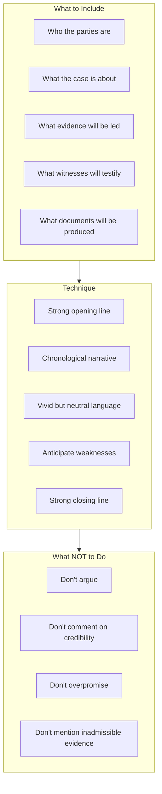

# L16 — Opening statement

> [!abstract] Chapter Overview
> This chapter covers **opening statements** — the first opportunity to present your case theory to the court. Key: preview the evidence without arguing, create a compelling narrative, and establish credibility.

> [!important] The Purpose
> Opening statement is a **preview, not an argument**. Tell the court what evidence will be led — do not argue what it proves.

## Visual Overview

*Figure: Opening statement framework — content, technique, and cautions.*

> [!tip] Structure
> **Plaintiff:** Facts → Legal claim → Evidence to prove → Remedy sought
> **Defendant:** Acknowledged facts → Denied facts → Defence → Evidence to support

> [!tip] Connection
> Follows [[L15 - The protocol and etiquette of the courtroom|courtroom protocol]]. Precedes [[L17 - Examination-in-chief|examination-in-chief]]. Theory anchored in [[L14 - Preparation for trial: Fact analysis and strategy|case strategy]].

---

## Chapter Content Walkthrough

- Forgetting about that [[Page-179|Motion Court]] brief: Try to remember. There aren't many advocates who can say that they have never overlooked a Motion Court appearance. A lot of humble pie may have to be eaten in such a case. The way to avoid embarrassment is to have an infallible system. A digital diary is probably as close to infallible as you can get. But you still have to key in the right information and then consult the diary every morning. It all comes down to your own commitment.
- Completing heads of argument late: This is a bad error. If you are briefed too late to enable you to prepare the heads in time, you should tell the instructing attorney (or client) that the heads will be late and assist in making such arrangements with the opposition and the court as may be required. Don't ignore the problem and pretend that nothing has happened. In a bad case, you may be required to make an application for condonation of the late filing of the heads. If your other commitments (professional or personal) are too much for you to cope with so that you simply do not have the time or energy to prepare the heads in time, you are going to have to re-arrange your priorities. It is unprofessional to accept an instruction if you cannot do the work in time.

## Chapter 16: Opening statement

### CONTENTS

16.1 Introduction
16.2 Purpose of an opening statement
16.3 Structure and content of an opening statement
16.4 Examples of opening statements in a criminal case
16.5 Example of an opening statement in a civil case
16.6 Technique in opening statements
16.7 Protocol and ethics
16.8 Checklist and assessment guide

## 16.1 Introduction

Counsel for the plaintiff has an opportunity to address the court before leading any evidence, and there is a similar opportunity for counsel for the defendant after the plaintiff's case has been closed and before defendant's counsel leads any evidence for the defendant. The same rights are available in a criminal case to the prosecution and defence.

Rule 39(5) provides:

"Where the [[Page-92|burden of proof]] is on the plaintiff, he or one advocate for the plaintiff may briefly outline the facts intended to be proved and the plaintiff may then proceed to the proof thereof."

In terms of Rule 39(6) the defendant's counsel may address the court at the close of the plaintiff's case. Rule 39(9) provides:

"If the burden of proof is on the defendant, he or his advocate shall have the same rights as those accorded to the plaintiff or his advocate by sub-rule (5)."

This takes care of the case where the defendant has the burden of adducing evidence first.

In criminal cases sections 150(1) and 151(1) of the Criminal Procedure Act 51 of 1977 ("the Act") similarly provide for opening statements by the prosecutor and defence respectively.

The opening statement is a neglected step in the litigation process. Its tactical value is often under-estimated and the opportunity to use an opening statement to begin the process of persuasion is often not exploited fully. Lindquist (Advocacy in Opening Statements Litigation Vol 8 No 3) is of the opinion that opening speeches determine the outcome in 50%, and maybe as much as 85%, of cases. The legendary barrister, Sir Norman Birkett ("The Art of Advocacy" American Bar Association Journal Vol 34 (1948)) explained the principle as follows: Fact finders are unlikely to forget their first impressions of the case, even if subsequent [[Page-145|cross-examination]] should weaken the evidence.

Lindquist and Birkett were referring to jury trials and their views should be tempered for the fact that judges are trained not to make up their minds before all the evidence and argument has been considered, but there is an important lesson in their remarks. The opening statement can play an important role in the process of persuasion. In fact, it is the beginning of the process of persuasion by means of oral advocacy.

---

The [[Page-131|opening statement]] is also an important link between the preparation for trial and the production of the evidence. Its importance in the overall context of the trial can be seen as follows:

- The issues are identified by the exchange of pleadings.
- The relevant evidence is identified during the preparation process.
- During the opening address the court is introduced to the issues and the evidence to be led on the issues.
- The evidence is then produced in evidence-in-chief and tested in [[Page-145|cross-examination]].
- In the closing argument, counsel joins everything together in a comprehensive argument that relies for its success on all the prior stages having been conducted properly.

## 16.2 Purpose of an opening statement

The basic purpose of an opening address is to explain to the judge what the case is about to enable him or her to follow the evidence. You give the court an indication what case you intend to establish and how you intend to do so with the evidence at your disposal. At the stage when counsel has the opportunity to open the case, he or she will be fully informed on the facts to be proved, the evidence available to establish those facts, the [[Page-115|theory of the case]] to pursue and the tactics to employ. You will have done a [[Page-115|fact analysis]] and legal research. You will know where the onus lies and precisely what evidence is available and admissible in respect of each issue. The judge, on the other hand, is ignorant of all of this, except for the issues that appear from the pleadings in the court file.

If the judge's ignorance of the facts and evidence of the case were to be relieved piecemeal - by the introduction of each piece of evidence through the individual witnesses and documents - the judge might get a skewed view of the case. The judge may not follow the evidence at all. The more difficult the case, the less likely the judge is going to be able to follow. If, however, the judge were to have been placed fully in the picture in a brief but well-structured opening address, he or she will have a better grasp of the issues and the importance of each piece of evidence as it is introduced.

The purpose of an opening address is to facilitate the process of persuasion. In order to persuade the judge to return findings of fact favourable to your client, you have to put the judge in the picture, so to speak, so that the significance of each item of evidence will be apparent to the judge when you produce that evidence. The process of persuasion starts with the opening address.

The opening address is not an argument. It is an opportunity to outline the facts intended to be proved. The emphasis is on brevity. The opening address may not stray outside of the facts which are made relevant by the pleadings, but should be a brief outline of those facts rather than a detailed discussion. The length and content of the opening address are determined by the exigencies of the particular case.

According to Johannes van der Linden, the purpose of an opening address is to make the judge "welgezind, opmerksaam of leerzaam", that is, "well-disposed, attentive and informed". How you achieve these aims, depends on structure and content.

## 16.3 Structure and content of an opening statement

For an opening address to be informative and persuasive, it has to have a logical structure. To be informative, your opening address needs to tell a plain story in clear language. It must also put all the important parts of the story in their proper context; there must be order and there must be clarity. To be persuasive, your story must be told in *(see page 289)* such a way that everything is relevant and falls into place naturally, without argument or long explanations. The story must be enticing and create an eager anticipation to hear the evidence. It must give a hint of interesting things to come.

The structure for an opening address for the plaintiff or the prosecution differs from that of the defendant or defence in minor aspects only - the same principles apply to both. At the stage when the opening address begins, counsel for the parties will have announced their appearances and formalities (like the duration of the trial and who has the duty to begin) will have been decided. The following structure can be adopted by counsel for the plaintiff and also by counsel for the defendant where the defendant has the duty to begin:

- At the commencement of the opening address, state what the [[Page-54|cause of action]] is, for example:

"M' Lady, this is an action for damages for personal injuries arising from a motor collision."

"M' Lord, this is an action for a permanent interdict and damages arising from the unlawful use of confidential information by the defendant in breach of a contractual provision, alternatively in breach of the principles of the actio legis Aquiliae."

- State the material facts of the claim (or defence, if the defendant is opening in a case where the defendant bears the onus of proof).

---

- Identify, in summary form, the issues between the parties by reference to the pleadings.
- Indicate the extent to which the issues have been reduced by any subsequent agreement, such as at the Rule 37 conference.
- Indicate where the onus of proof lies on the relevant issues and what has been agreed between the parties in this regard. If there is any dispute about where the onus lies, tell the judge. (The parties were supposed to discuss this at the Rule 37 conference.)
- Summarise the facts for the plaintiff (or the defendant, if the defendant is opening). During this part of the opening address, the facts which constitute the proof upon which the court will ultimately be asked to rule in the plaintiff's favour are given in chronological order. The facts should be stated simply, without adornment, so that they are allowed to speak for themselves. Argument and exaggeration are to be avoided. The tone is moderate, even understated. Arrangement and order are crucial. This is particularly so where the facts and documents of the case are numerous and a chronological arrangement is necessary for a proper understanding of the matter. The time to create this order in the mind of the judge is during the opening address, even if it means that the chronology has to be set out in a written schedule.
- Identify the witnesses you will call and summarise the evidence each will give. Deal with the oral and documentary evidence very briefly.
- Indicate to what extent, if any, the evidence of particular witnesses or the contents of relevant documents are common cause. If necessary, hand in bundles of documents that are to go in by consent. Explain any agreement with regard to the content of the documents.

### 16.4 Examples of opening statements in a criminal case

The opening address for the prosecution in a criminal case in the Magistrates' Court could be structured as follows:

(Pretend you are the judge and answer the following question at the end of this exercise: 'Do I now have a fair idea what this case is about and how counsel intends to prove the case?')
**Table 16.1** [[Page-131|Opening statement]] for the prosecution (in terms of section 150 of Act 51 of 1977)

| What to do | Comment | How to do it |
| --- | --- | --- |
| State the charge. | 1 Give the section of the act concerned precisely, including the subsection. 2 Then give the common term for that offence, for example, 'driving under the influence' or 'unlawful borrowing'. | 'May it please Your Worship. The accused is charged with one count of theft. The State alleges that he stole a backpack worth R150.00 from Three Rings Sports on 12 December last year.' |
| State where the onus of proof lies and what the standard of proof required is. | The onus is usually on the prosecution, and the standard is proof beyond reasonable doubt. | 'The onus of proving his guilt beyond reasonable doubt rests on the State.' |
| State the elements (material facts) for the offence charged. | This requires the type of analysis done in preparation for trial. (See chapter 14.) | 'The elements of the offence are that 1 the accused 2 on 12 December last year 3 at Three Rings Sports in [name of town] 4 unlawfully 5 and with the intention to steal it 6 removed a backpack (from Three Rings Sports) 7 belonging to Three Rings Sports or in its lawful possession.' |
| Briefly state the facts. | 1 Concentrate on what the accused did. The case is about the accused's actions. 2 Describe the sequence of events. Maintain a chronological sequence. 3 Ensure that the facts which undermine the anticipated defence are given. 4 Understate your case. | 'This is what happened: Three Rings Sports is a self-service store. The accused came into the store carrying a similar backpack to the one stolen. He walked over to the rack where backpacks were displayed. He put his own backpack down on the floor and selected a backpack after handling a number of the backpacks on the rack. He then slung the backpack he had selected over his shoulder and walked around inside the store, looking at other items. This went on for about 7 minutes. Then he walked past the till point at the door and out the store with the backpack still slung over his shoulder. He was stopped by a store detective. The price tag, marked R150.00, attached to the backpack's strap was concealed under the strap. The accused then said that he was sorry and that he had made a mistake. The accused's own backpack was opened in his |

---

| | | presence. It contained an old newspaper. The police were called and he was taken away by them. When he was charged at the police station, the accused handed over his possessions and he was found to have only R45.00 in cash on him.' |
| --- | --- | --- |
| What to do | Comment | How to do it |
| --- | --- | --- |
| State the anticipated defence and the facts disproving it or casting doubt upon it. | 1 Do not over-emphasise the defence. Emphasise the facts undermining it instead. 2 Don't argue the case! You can do that later. | 'The defence appears to be that the accused had accidentally slung the wrong backpack over his shoulder. It is anticipated that the element in issue is going to be mens rea, the intent to steal. Evidence will be led to show that, the two backpacks are quite dissimilar and that the accused also apologised as soon as he was stopped outside the store.' |
| Name the witnesses to be called. | 1 Give the names of the witnesses you intend to call in the order you will call them. 2 Stick to an order that will maintain the sequence of events. 3 Try to give the occupation or standing of each witness. | 'I intend to call two witnesses. They are Miss Irene Delamere, a store detective employed by Three Rings Sports, and constable Simon Reddy of the [name] Police Station.' |
| Briefly summarise the evidence to be given by each witness. | 1 Give a brief summary of what each witness will say. 2 Understate. Promise less with the intention of delivering more. 3 Be accurate or your witness will be discredited. 4 Keep it short and sweet. | 'Miss Delamere will say that she was in the store, circulating among customers, keeping an eye out for shoplifters, when she saw the accused entering the store. She watched the accused from beginning to end, and saw the things I have already alluded to. It was to her that the accused apologised. She will further tell the court that the accused offered no further explanation for his conduct. Constable Reddy will tell the court that he took the accused into custody and charged him at the police station. As part of the booking procedures the accused's possessions had to be surrendered for safekeeping. The accused had a watch and a small wallet containing R45.00. These were listed and put in the safe with other prisoners' possessions. The two backpacks were marked and entered in the Exhibits Register.' |
| What to do | Comment | How to do it |
| --- | --- | --- |
| Tell the court what admissions have been made (or are to be made) under section 220 by the defence. | 1 Admissions should preferably be written out and signed by the accused or his or her counsel. 2 Give defence counsel an opportunity to confirm that the relevant facts are admitted. | 'The defence has made certain admissions under section 220 of the Act. They have been reduced to writing in the section 115 statement and are that - 1 the backpack, to be introduced as Exhibit 2 in these proceedings, is the property of Three Rings Sports; 2 its value is R150.00; 3 the accused had no right to remove it from the store.' |
| Tell the court what exhibits will be produced by consent or through a witness. | If agreement has been reached, make sure that you state accurately what has been agreed. It is not enough to tell the court that a particular exhibit is going in by consent. Describe the exhibit and tell the court on what basis it is going in. | 'There are two exhibits to be produced by consent. The first is the accused's backpack. It is common cause that the accused entered the store with this backpack and left it behind. It is brown, made of polyester fibre, about 45 cm by 30 cm by 20 cm, and has two separate compartments which are closed with zippers. The backpack is torn in several places. May it be marked as Exhibit 1? The second is the backpack belonging to Three Rings Sports and which the accused left the store with. It is red, about 45 cm by 30 cm by 20 cm and has two main compartments and two side pockets, all closing with drawstrings. It has the store's price tag attached to one of the shoulder straps. May it be marked as Exhibit 2?' |
| Call your first witness. | | 'May it please Your Worship, I now call my first witness, Miss Irene Delamere.' |

Is the prosecution case now relatively clear? Do you know what the issues are? Do you know what evidence to expect from the prosecution witnesses? Do you have an idea of the significance of the exhibits? If the answer is 'Yes' to each of these questions, the [[Page-131|opening statement]] will have achieved its aims.

---

The same principles apply broadly to the accused's opening address, except that, by the time the prosecution closes its case, defence counsel will have had to put the accused's version to witnesses when he or she cross-examined them, and there may even have been a detailed statement under section 115 of the Act. The defence case will therefore already have been made known. The accused's opening address is therefore likely to be short compared to that of the prosecutor, but that may not always be the case.
**Table 16.2** [[Page-131|Opening statement]] for the defence (in terms of section 151 of Act 51 of 1977)

| What to do | Comment | How to do it |
| --- | --- | --- |
| Tell the court you intend to call witnesses. | 1 You have no right to make an opening statement unless you intend to call witnesses. 2 If you have no witnesses to call, you have to close your case and the trial proceeds to the closing argument phase. | 'May it please Your Worship, I intend to call witnesses.' |
| Explain what the defence is and isolate the issue(s). | 1 The defence has to relate to one or more of the elements of the charge. 2 Isolate the relevant one(s) and tell the court what they are. 3 Use plain language and ordinary terms. | 'Your Worship, this is a case of an unfortunate mistake rather than deliberate wrongdoing. The accused did not intend to steal the backpack; he simply mistook it for his own.' |
| Acknowledge the onus and standard of proof. | 1 Mention where the onus lies. Remind the court that the prosecution has to prove its case beyond reasonable doubt. 2 Magistrates don't really need or like to be reminded of this. | 'As my learned friend has indicated, the onus is on the prosecution to prove the elements of the offence, including the mens rea element, beyond reasonable doubt.' |
| Briefly state the facts. | 1 Concentrate on the defence version. Make sure you cover the defence. Understate. 2 Don't argue. Let the facts speak for themselves. 3 Keep it simple. 4 Try to make an impact with an important fact that cannot be denied. 5 Make sure that the bad facts are dealt with. A short explanation will suffice. | 'Your Worship, the accused suffers from colour-blindness. His particular type of colour-blindness makes it impossible for him to get a driver's licence because he cannot distinguish between brown and red. The accused went to the store to buy a new bag as his old backpack was torn. He had a newspaper in the backpack. He had kept it because it had job advertisements he intended to follow up. In fact, he wanted a new bag rather than a backpack as he thought a bag might be more in keeping with the position he was seeking. He found the rack with backpacks and handled some of them. He must have put his own backpack on the floor, but cannot recall that. He moved on to the bag counter and found nothing to his liking. He left the store thinking he had his own backpack over his shoulder. He never intended to steal the backpack. The rest the court knows already.' |
| What to do | Comment | How to do it |
| --- | --- | --- |
| Name the witnesses to be called. | Try to give an indication of the occupation or standing of each witness. | 'I intend calling the accused and also his family doctor, Dr Ivan Stone.' |
| Briefly summarise what each witness will say. | 1 Give a brief summary of what each witness will say. Understate. Promise less with the intention of delivering more. 2 Be accurate or your witness will be discredited. 3 Keep it short and sweet. | 'The accused will give evidence in accordance with what I have said earlier. He will also tell the court of instances in the past when his condition has caused him embarrassment. He once had to sit out during an important rugby match when the opposition team arrived and sported brown jerseys which he could not distinguish from his own side's red ones. He will also tell your Worship that the backpack, Exhibit 2, looks the same as Exhibit 1 to him. He had not noticed any difference in weight or texture as the store's backpack was filled with crumpled paper.' He had no intention of stealing the backpack and is quite distressed as a result of what has happened. He apologised because he was embarrassed by his mistake. He was told that the store had a policy to prosecute and thought there was no purpose in explaining how the mistake had occurred.' |

---

| | | 'Dr Stone will tell the court that he has been the accused's family's doctor since before the accused was born. He actually delivered the accused. He will tell the court that the accused's mother is a carrier of the gene causing colour-blindness and that the accused's condition was diagnosed when he went to school at age six.' |
| --- | --- | --- |
| Call your first witness. | If the accused is to be a witness, he has to be called first. | 'May it please Your Worship, I now call the accused.' |

### 16.5 Example of an opening statement in a civil case

In civil cases there is a greater need for an opening statement because the issues are usually more complex and the documentary exhibits are often so plentiful that they have to be bound in large bundles, none of which the judge will have seen before the trial commences. The procedures prescribed for Rule 37 conferences may also have to be dealt with as most judges require counsel to demonstrate that the parties have made a serious effort to comply with all facets of Rule 37. With the [[Page-75|exception]] of extraordinary cases, the judge will only be allocated to the case after the roll call. The judge will know nothing about the case before the opening statement.
**Table 16.3** An opening statement in a civil case

| How to do it | Comment |
| --- | --- |
| 'May it please the Court. M' Lord, this is an action for damages arising from a motor collision.' | 1 Be brief. |
| 'The issues between the parties as they appear from the pleadings are - (a) whether the plaintiff was at the material time the owner of a Honda motorcar with registration number NPN 2001; (b) whether the collision which occurred on [date] at the intersection of X and Y Streets between that motor vehicle and a motorcar driven by the defendant was caused by negligence on the part of the defendant in any of the respects pleaded; (c) whether the reasonable cost of repair to the plaintiff's car, and consequently the plaintiff's damages, was the sum of R339 000.00, made up as set out in paragraph 6 of the Particulars of Claim; (d) whether there was [[Page-66\|contributory negligence]] on the part of the plaintiff.' | 1 If necessary, refer the judge to the pages and paragraphs in the pleadings where the allegations are set out in detail. |
| 'M' Lord, the other issues on the pleadings were eliminated at the Rule 37 conference. I refer M' Lord to paragraph 5 of the Minute of the Rule 37 conference which is already before M' Lord.' | 1 If the issues were reduced at the Rule 37 conference, refer the judge to the paragraphs in the pleadings and in the minute of the conference. |
| 'I intend calling three witnesses on behalf of the plaintiff: (a) The plaintiff on all the issues, but particularly on how the collision occurred; (b) Mr Z from [name of garage], who will give evidence that the car was sold to the plaintiff in January, [year] without reservation of ownership and that ownership passed to the plaintiff at the time of the sale; and (c) Mr Y, a panelbeater who is called as an [[Page-100\|expert witness]], who will give evidence of the reasonable cost of repair and the pre- and post-collision values of the plaintiff's car.' | 1 Identify the witnesses to be called and give an indication of their roles in the case. 2 If necessary, elaborate a little to inform the judge what the witness will say. |
| How to do it | Comment |
| --- | --- |
| 'An aerial photograph has been taken of the intersection where the collision occurred. It has been agreed, in terms of paragraph 5 of the minute of the Rule 37 conference, that the witnesses may refer to that aerial photograph and rely upon it as depicting the scene of the collision correctly as it was at the time. I hand that up as Exhibit 'A'.' | Deal with exhibits one by one. In complex cases with bundles of documents you may have to take the judge through the bundle step by step to allow the judge to absorb the basic details of the evidence. |
| 'In summary, M' Lord, the plaintiff's evidence will be that she entered the intersection from Y Street moments after the light had changed in her | |

---

| *favour. She then saw another car entering the intersection at speed from her left. The defendant, who admits he was the driver of that car, did not stop and collided with the left-hand side of the plaintiff's car.* *The details of the scene are apparent from the aerial photograph before M' Lord. I shall point out the relevant details when I lead the plaintiff's evidence.* *'It is common cause, M' Lord, that the road from which the defendant entered the intersection is X Street and that the traffic lights were functioning properly. The plaintiff's case is therefore that the defendant was negligent in not stopping at the red light, in failing to keep a proper lookout and in driving too fast for the prevailing circumstances.'* | 1 The evidence of the main witness should be outlined briefly, particularly with regard to the main issue. 2 It is usually helpful to the judge if counsel were to point to relevant features on the exhibits while giving this narrative. |
| --- | --- |
| *'If it pleases M' Lord, I now call the plaintiff as my first witness.'* | |

This structure deliberately differs from the earlier ones in order to demonstrate that there is no fixed structure for opening statements.

## 16.6 Technique in opening statements

There are a few simple principles to apply to an [[Page-131|opening statement]] in order to achieve its aims without transgressing the rules:

- Tell a simple, logical story with a clear beginning and end. While an appeal to the emotions is permitted, it should be very subtle.
- Make it interesting. In order to capture the attention of the judge the opening statement has to be interesting in its content and interesting in the way it is delivered. While your [[Page-174|closing argument]] may have to be forceful or pleading, as the case requires, an opening statement should be enticing, teasing the judge along the path you intend to traverse with the evidence and thus to the result you wish to achieve for your client.
- Be accurate. If your witness gives a version that differs from what was said in your opening statement, the witness may be discredited through no fault of theirs.
- Avoid comment and argument. In fact, apart from it being inappropriate, introducing argument before the evidence could be confusing. Allow the facts to speak for themselves. Sometimes the facts, properly marshalled, speak louder than any argument you may be able to muster.
- Avoid complexity. Keep it simple because you want the judge to understand and to be persuaded.
- Avoid prolixity. Slow, sure and short should be your motto. Conciseness, simplicity and moderation should be aimed for.
- Understate your case whenever possible. Understate your case as the witnesses may not come up to your expectations.
- Don't over-elaborate. You don't want the judge to anticipate all of the evidence. He or she may lose interest. You want to keep the judge interested throughout the trial; to achieve that you have to keep giving new information. And your witness may give a slightly different version. Do not tie the witness down in advance with too much detail.
- You have to sound sincere. Making eye contact with the judge is especially important. To be able to do that, you will need to know precisely what your case is about. Reading from notes will sound wooden and unconvincing.
- Strong points against your side may be dealt with in your opening statement, but only if you can. Otherwise they should be left alone as you will only flatter them. In some cases it will be necessary to anticipate the defence. The facts nullifying that defence should then be dealt with in the opening statement to soften their impact.
- Judges frequently ask questions during counsel's opening statement, seeking clarification or further detail, sometimes even to express a *prima facie* view or to question the validity of an aspect of counsel's statement. Such questions should be dealt with immediately because they indicate areas of concern that you can then turn in your client's favour by giving a suitable explanation. The judge should be watched carefully during your opening statement as his or her attitude could give a strong indication of how they see the case. But do not let the judge distract you from your overall function, which is to present an opening statement which introduces the case to the judge as fully as the circumstances require.
- Treat the opening statement as if it were a promise or undertaking you give to the judge about the manner in which you are going to satisfy the [[Page-92|burden of proof]], if you act for the plaintiff, or the manner in which you are going to cast doubt on the plaintiff's case, if you act for the defendant. You keep the promise by leading the relevant evidence. A discussion of the evidence is therefore an inevitable part, perhaps the most important part, of the opening statement.

---

- If you act for the defendant, you should pay careful attention to the other side's [[Page-131|opening statement]] as there are potential gains to be made by your own client. For example, the evidence may not come up to what was promised in the opening statement; it might even contradict it. You may also gain a better understanding of the plaintiff's case, enabling you to reconsider your [[Page-115|theory of the case]], to change your tack in [[Page-145|cross-examination]] or to call additional witnesses. Some cases even settle as soon as the opening statement has been completed because the defendant then, for the first time, gets sufficient detail of the plaintiff's case for counsel to be able to persuade the defendant to settle.

> [!warning] 16.7 Protocol and ethics

- While some authors advocate the use of peroration, or rhetoric, in an opening statement, that does not mean argument. The furthest you can legitimately go, is to recapitulate the points already made, perhaps with a statement that, "On these facts it will be submitted that the accused lacked the necessary mens rea for the offence." Put this way, the statement does not contain argument but puts the facts in their legal context.
- It is counsel's professional duty to make the most of the opportunity to open the case. Don't waste the opportunity.
- Counsel should not include material in the opening address which he or she knows to be untrue or inadmissible.
- Counsel should not mention a "fact" in the opening statement he or she is not in a position to support by proof in the form of a witness to be called or documents to be introduced.

## 16.8 Checklist and assessment guide

If this book were to be used as a teaching guide or prescribed work for advocacy exercises, the following checklist may be used to prepare for the exercises, to serve as an assessment guide, or to serve as a marking guide.

If the checklist were to be used as a marking guide, the best way to go about the matter is to allocate a grade to each student or pupil whose performance is being assessed as follows:

C = Competent (meaning that the performer has attained the desired standard of competency in respect of the skill involved).

NYC = Not yet competent (meaning that the performer has not yet reached the desired standard).
Table 16.4 Checklist for opening statement for plaintiff's counsel

| | Skill involved | Competent/ Not yet competent |
| --- | --- | --- |
| 1 | Stating the [[Page-54\|cause of action]]/charge. | |
| 2 | Stating the issues (the legal elements of the cause of action/charge that are disputed). | |
| 3 | Referring to any pre-trial agreement affecting the issues (R37 minute etc). | |
| 4 | Dealing with the onus of proof, and if necessary, the duty to begin. | |
| 5 | Stating the facts briefly, without overstating. | |
| 6 | Avoiding argument or inadmissible material. | |
| 7 | Identifying the defence, without flattering it. | |
| 8 | Advising the court of the witnesses to be called by the plaintiff/ prosecutor. | |
| 9 | Briefly summarising the evidence to be given by each witness. | |
| 10 | Advising the court of any formal admissions made by either party. | |
| 11 | Introducing any exhibits to be admitted by consent, including bundles of documents. | |
| 12 | Avoiding reading, and speaking at audible level and pace. | |
| 13 | **Protocol:** - [ ] Practising SOLER principles (Shoulders square, Open stance, Leaning slightly forward, making Eye contact, Relaxed posture). - [ ] Maintaining eye contact with the judge. - [ ] Speaking at appropriate volume and pace. | |

---

---

## Concepts in this lecture

None

## Navigation

Prev: [[L15 - The protocol and etiquette of the courtroom|← Previous Chapter]] · Next: [[L17 - Examination-in-chief|Next Chapter →]]
