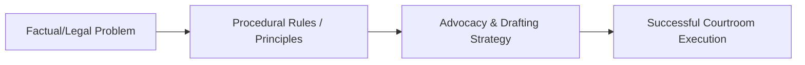

---

type: lecture
lecture: L17
tags: [lecture, litigation-skills]

---
# L17 — Examination-in-chief

> One-paragraph overview of the litigation skills and principles taught in this chapter.
>
> [!abstract] The arc of this chapter
> **Where we left off:** We explored the previous phase of litigation or litigation foundations.
>
> This chapter covers **Examination-in-chief**. We look at the problem of how to execute this task, the rules that govern it, and the strategies for successful advocacy.

*Figure: The problem-to-execution chain in this chapter.*

---

## Chapter Content Walkthrough

| - [ ] Addressing the court with proper deference. | |
| --- | --- |
| - [ ] Ensuring that only one counsel is standing at any time. | |
| - [ ] Addressing the court from the correct location, not moving about the courtroom. | |

**Table 16.5** Checklist for [[Page-131|opening statement]] for defendant's counsel

| | Skill involved | Competent/ Not yet Competent |
| --- | --- | --- |
| 1 | Telling the court that the defendant/defence will be calling witnesses. | |
| 2 | Identifying the defence(s). | |
| 3 | Isolating the issues in respect of each defence. | |
| 4 | Reminding the court of the incidence and standard of proof, if necessary. | |
| 5 | Stating the facts of the defence case briefly, without overstating. | |
| | Skill involved | Competent/ Not yet Competent |
| --- | --- | --- |
| 6 | Avoiding argument or inadmissible material. | |
| 7 | Advising the court of the witnesses to be called by the defendant/defence. | |
| 8 | Briefly summarising the evidence to be given by each witness. | |
| 9 | Avoiding reading, and speaking at audible level and pace. | |
| 10 | **Protocol:** - [ ] Practising SOLER principles (Shoulders square, Open stance, Leaning slightly forward, making Eye contact, Relaxed posture). - [ ] Maintaining eye contact with the witness. - [ ] Speaking at appropriate volume and pace. - [ ] Addressing the court with proper deference. - [ ] Ensuring that only one counsel is standing at any time. - [ ] Addressing the court from the correct location, not moving about the courtroom. | |

## Chapter 17

[[Page-136|Examination-in-chief]]

### CONTENTS

17.1 Introduction
17.2 Restrictions on examination-in-chief
17.2.1 Relevance
17.2.2 Materiality
17.2.3 Admissibility
17.2.4 Leading questions
17.3 Planning the structure and content of the examination-in-chief
17.4 Style of questions in examination-in-chief
17.5 Briefing the witness
17.6 Technique in examination-in-chief
17.7 Demonstration exercise
17.8 Protocol and ethics
17.9 Checklist and assessment guide

---

## 17.1 Introduction

Every party in a trial has the right to call witnesses to give evidence on the questions before the court. The evidence given by a witness while being questioned by counsel for the party who has called the witness, is called 'evidence-in-chief' and the process of adducing that evidence, is called '[[Page-136|examination-in-chief]]'. The purpose of the examination-in-chief is to place the evidence the witness can give on the issues before the court. This is by far the most important phase of the trial. By their examination-in-chief each of the parties can put forward their own version of the facts, answer their opponent's version of the facts, and bolster their witnesses.

The skill of examination-in-chief requires sound knowledge of the rules of evidence, a firm grasp of the facts and the law pertaining to the case and the ability to extract all the material evidence from the witness without asking leading questions.

## 17.2 Restrictions on examination-in-chief

Examination-in-chief is probably the most difficult skill to learn of all the techniques of trial advocacy. The reason is not hard to find. The evidence-in-chief a party may adduce is subject to a number of restrictions. The main restrictions relate to the *content* of the evidence. The evidence has to be relevant in its content, material in its substance and admissible in its form.

The main restriction on the way the evidence is *produced* is the rule that counsel has to conduct the examination-in-chief without asking leading questions. Counsel has to allow the witness to tell the story, to provide the important details, to give the difficult explanations, all without counsel suggesting the answers. Witnesses are only human. They forget important details, get scared or overwhelmed by the atmosphere of the court, become uncommunicative, become talkative, even change their evidence and make silly mistakes. Counsel has to be able to cope with all of this.

### 17.2.1 Relevance

The evidence has to be relevant to an issue before the court. There are two aspects to this. The *first* is that there has to be some issue to be decided or some question to be answered by the court. The *second* is that the evidence must be relevant in the sense of being helpful to the court in deciding that issue or answering that question.
You therefore have to analyse the pleadings (or their equivalent in a criminal case) to identify the material facts in issue. (See chapter 14.) You also have to analyse the facts of the case to determine which propositions of fact ('evidential facts') can be advanced to prove those material facts. If the evidence can be shown to be helpful to the court to decide a particular issue, it is relevant. If by reason of logic, (a combination of experience and common sense), the evidence supports a particular inference or conclusion, it is relevant. For example, we know from experience and [[Page-100|expert evidence]] that every person on earth has a unique set of fingerprints. We also know that we leave an imprint of our fingerprints on things we touch. Therefore, if the accused's fingerprints are found on the deceased's dressing table, common sense tells us that the accused must have touched that dressing table at some stage. That piece of evidence, combined with other evidence, may then support the conclusion that the accused had killed the deceased.

Because relevance is based on logic, you should be able to explain why a particular fact or item of evidence is relevant. If you have done a proper [[Page-115|fact analysis]] using the proof-making model when you prepared for the trial, you ought to be in a position to give such an explanation. You should be ready, at every stage of the trial, (and also on appeal, if necessary), to explain why the evidence you are seeking to adduce or have adduced through your witnesses, is relevant. The question you have to be able to answer at any stage of the trial is this: 'How does this piece of evidence help the court to answer the question before it?'

### 17.2.2 Materiality

For evidence to be material, it has to be relevant and important. Evidence is important if it has a significant role to play to support counsel's [[Page-115|theory of the case]]. Some evidence, although relevant, has so little value that you would not bother to adduce it. Other items, on the other hand, would be so significant that you would regard them as vitally important for your theory of the case to prevail over that of the opposition. Material evidence is not necessarily the same as essential evidence, although there are instances when an item of evidence could be so crucial as to make the difference between winning and losing.

The rules of evidence do not require evidence to be material; it merely has to be relevant and must not be excluded by virtue of some other rule. Counsel will decide what evidence to adduce in support of the claim or defence and in making that decision, decides what items of evidence to discard. The decision is based on one's tactics. The question is often: 'How important is this piece of evidence to my case?' The test for materiality depends on your theory of the case. If the evidence is important enough to support one of the best points supporting your client's case, or to answer the opposition's case, then it is material.

---

### 17.2.3 Admissibility

The general rule is that relevant evidence is admissible unless there is a specific rule or basis for its exclusion. It appears that the best evidence rule is at the root of the exclusionary rules relating to [[Page-92|hearsay]] evidence, opinion evidence, character evidence and similar-fact evidence. However, there are exceptions to all the exclusionary rules. Evidence may also be excluded, in the discretion of the court, if its probative value is outweighed by the prejudice its admission might cause. The rules of evidence play a large part in the process of [[Page-136|examination-in-chief]]. It is simply not possible to lead evidence-in-chief without a decent grasp of the rules of evidence. Counsel has to avoid inadmissible *(see page 305)* evidence. The time to make the necessary assessment is during the preparation for trial, but you may have to re-assess the admissibility of the evidence as events during the trial may affect its admissibility.

The following categories of evidence may not be admissible, depending on the facts:

- Secondary evidence, that is, evidence which offends against the best evidence rule, for example, a written document is the best evidence of its contents; a copy is not.
- Hearsay evidence, that is, evidence which depends for its cogency on the credibility of a person who is not a witness or a party in the proceeding.
- Character evidence, that is, evidence relating to the character of a party or witness, as opposed to evidence of the events in issue.
- Opinion evidence, that is, evidence in the nature of an inference of fact drawn by the witness from other facts or circumstances.
- Similar fact evidence, that is, evidence to the effect that a person's actions in the past tend to show that he or she behaved in similar fashion on the occasion in issue.
- Highly prejudicial evidence of little probative value, that is, evidence which proves little but has the capacity to cause prejudice out of proportion to its weight.
- Improperly obtained evidence, such as a confession obtained by torture.

(See chapter 20 for a more detailed discussion of evidence.)

### 17.2.4 Leading questions

There are two main reasons why leading questions - questions that suggest their own answer - are disallowed in examination-in-chief. The first is that the facts have to be provided by the witnesses, not the lawyers. The second is that the value of the evidence depends to a large measure on the way the witness behaves while giving the evidence. If counsel were allowed to suggest the facts to his or her own witnesses, the court would not be in a good position to determine how much the witness really knows or how to gauge the credibility of the witness.

Leading questions are nevertheless permitted to -

- establish a foundation for further evidence;
- refresh a witness's memory;
- question hostile witnesses;
- help children, mentally handicapped witnesses and other witnesses who may have difficulties with understanding or communication;
- clarify the evidence already given; and
- save time and costs when the questions relate to matters not in issue between the parties.

## 17.3 Planning the structure and content of the examination-in-chief

The success of your examination-in-chief depends on systematic preparation and flawless execution. A deficiency in either can have adverse consequences for the client. The examination-in-chief of each witness has to be planned very carefully to ensure that you can elicit all the favourable evidence from the witness with maximum impact. As with *(see page 306)* the rest of your trial preparation, you should make notes for inclusion in counsel's trial notebook. There should be a separate section for each witness. You should then:

- Identify your goals and objectives for each witness: The main objective of your examination-in-chief should be to enhance your client's case by establishing the important facts upon which your [[Page-115|theory of the case]] depends. The test for each witness is therefore, "What can this witness contribute to support my theory of the case?" The [[Page-115|fact analysis]] you undertook when you prepared for the trial will go a long way towards answering this question. (See chapter 14.)
- Plan a structure for the examination-in-chief of each witness: There is more to examination-in-chief than asking the witness to tell his or her story. The story has to be told in such a way that it is complete and convincing. To achieve that, there has to be a logical beginning, a main narrative and an ending. The usual structure for evidence-in-chief is -

---

- introduce the witness;
- qualify the witness;
- deal with pre-arranged topics;
- lead the evidence on each topic in chronological order;
- complete the main evidence of the witness; and
- if necessary, deal with the other side's version.

- Introduce the witness to the judge by way of a few introductory questions: What are the full names of the witness? Where does he or she live? What does he or she do for a living? These questions also help to settle the witness down and develop a little confidence. You may prefer to give the witness a chance to speak and to answer some easy questions before getting to the important evidence. You could ease the witness into the process by asking questions that require progressively more input from the witness.

- Qualify the witness by asking questions to demonstrate that the witness can contribute admissible evidence: Usually it is enough to put the witness at the scene of the events at issue. Take the witness to the scene or beginning of their narrative by a direct but non-leading question such as, "Where were you on 15 June last year at nine thirty in the morning?" This will focus the attention of the witness specifically on the incident you want to explore. You will have briefed the witness and he or she will know what the case is about, why they are at court and what their evidence has to cover. So the answer is likely to be what you want: "I was in First National Bank at the corner of A and B Streets." If the witness is called as an expert in, for example, a personal injuries case, you could ask, after having established his or her expertise: "Did you examine the plaintiff for the purpose of making an assessment of his injuries and their consequences?" This is not a leading question because it does not suggest the answer. It would fall within the [[Page-75|exception]] relating to the establishment of a foundation for further evidence in any event.

- Arrange the subject-matter in separate topics, if possible: Then exhaust the evidence on a given topic before moving on to the next. In the example given in the previous paragraph, you might proceed by asking the witness precisely what examinations were carried out, when that was done, and what the witness found. That might be your first topic. You may then proceed from topic to topic, for example, from the injuries suffered to the prognosis for recovery in the future, then to the treatment received in the past and their cost and lastly to the treatment required in *(see page 307)* the future and the anticipated cost of that treatment. Each topic has to be kept in a separate compartment to make the evidence easy to follow and to ensure that you extract all the relevant evidence.

- Lead the evidence sequentially: This is done so that the witness is able to tell the story in chronological order. Your preparation will tell you what the important facts are. It is your function to guide the witness by your questions so that each of the important facts is dealt with in sequence. Ensure that the evidence is complete and that the witness tells the whole story. If the witness skips over an important piece of evidence, don't allow the witness to continue on the basis that you can always deal with it later. Bring the witness around to the evidence you want to elicit with an appropriate question. Witnesses often race ahead in the narrative and leave out important details in the process. If you allow this to happen, the evidence will be fragmented and less convincing.

- Deal with the other side's version, if not yet covered: Once your witness has completed that part of the evidence-in-chief establishing your client's version of the events at issue, you may want your witness to comment on the other side's version. When you act for the plaintiff, you may have to do this in anticipation of a particular version being given since you will know what to expect from the pleadings, the discovered documents or from what your own witnesses have told you. If you want to take the sting out of the anticipated [[Page-145|cross-examination]] you may ask your witness questions dealing with the other side's version during the [[Page-136|examination-in-chief]] rather than in [[Page-160|re-examination]]. This is a tactical decision to be made according to the merits of the case you have to deal with. You may, for example, anticipate a question in cross-examination and minimise its impact by asking your witness: "What would you say if it were suggested by my learned friend that the traffic light was red for you and not for the defendant?" Such a question could also remove the element of surprise.

- Plan your questions so that you will achieve your goals and objectives: Concentrate on what the witness saw, heard, smelled, felt or tasted at the time of the events under consideration. If necessary, ask the witness what he or she thought at the time. If the robber put a knife to the witness's throat and said, "Give me your wallet or I'll kill you", your next question may well be, "And what went through your mind when he said that?"

- Prepare a timeline for the evidence of each witness: Incorporate the use of [[Page-100|demonstrative exhibit]]s and physical demonstrations in that timeline. A timeline is a chronological outline of the evidence of a witness. You can create a timeline by extracting all the important pieces of evidence a witness can give from the witness's statement and the documentary evidence and arranging them in chronological order. The timeline can also be as a prompt. When a point can be made better by the use of demonstrative exhibits or a physical demonstration, both counsel and the witness need to be fully prepared to deal with these special procedures; otherwise the effort to make the case better, could backfire badly. The witness may point out the wrong position on the police plan or point out a distance that is inherently improbable. Some witnesses need help to mark something as simple as a diagram; others are uncomfortable dealing with photographs. Assuming that the appropriate exhibits have been prepared, the witness still needs to be briefed so that both counsel and the witness are able to produce the relevant evidence effectively and with maximum persuasion. (See chapter 12 for a discussion of the preparation of demonstrative exhibits and chapter 20 for the presentation of such

---

evidence.)

- Anticipate the topics of [[Page-145|cross-examination]] and [[Page-160|re-examination]] for the witness: This will allow you to brief him or her fully. The likely areas of cross-examination should have been identified during your preparation for trial. Those areas should be explored with the witness when the witness is briefed before giving evidence. Whether an explanation is to be given in the course of the evidence-in-chief, rather than in re-examination, depends on counsel's judgment. The other side may not be aware of the weakness. If they raise it, it can always be dealt with in re-examination, you may argue. Whichever way you decide in a given situation, remember that it is generally counter-productive to ask too many questions about the topic because that would tend to exaggerate the difficulty. The topics for cross-examination should be the topics upon which you are most likely going to be required to re-examine the witness. In some cases a telling reply can be prepared for re-examination, when you and your witness will have the last word, but that telling reply may never be made if the opposition does not cross-examine on the point. You may therefore have to consider leading that telling evidence in your [[Page-136|examination-in-chief]] instead.

- Anticipate objections: Stage 6 of your trial-preparation process (see chapter 14) should have alerted you to any possible objections. Once a potential objection has been identified, you can plan your questions to avoid the objection by, for example, laying the proper foundation for the evidence. If there is a good response to be made, you may be able to respond to the objection promptly. (See chapter 20.)

## 17.4 Style of questions in examination-in-chief

The basic style for examination-in-chief is that of an interrogative dialogue. There is a discussion between counsel and the witness in which counsel plays the role of questioner and the witness is allowed to tell his or her own story. Counsel enquires and the witness gives the facts. To ensure that the story is truly that of the witness and not counsel's, counsel is not allowed to ask leading questions. A leading question is one that suggests the answer. Another reason why the evidence should be led without leading questions is that leading questions make it more difficult for the judge to make an assessment of the character and credibility of the witness and the reliability of the evidence. You need to give the judge a reasonable opportunity to hear your witness speak and tell his or her story in his or her own words. This cannot be done very well if the witness merely says yes or no to all your questions.

The questions in examination-in-chief will mainly be open questions and closed but non-leading questions. An open question leaves it to the witness to decide what information to supply with the answer, even to choose the subject. For example, asking the witness, "What happened on 15 June last year?" does not confine the witness to any particular subject or even to a place and exact time. Such a question is usually of little help to the witness or the court. Closed questions specifically direct the attention of the witness to the subject, such as "Where were you on 15 June last year at 09h30? Who else was there? What did you see?" None of these questions suggests the answer so they are closed, non-leading questions. It doesn't take much to turn them into closed, leading questions. "On 15 June last year at 09h30, were you not in First National Bank at the corner of A and B Streets, [town or city]? Wasn't your brother, Peter, with you? Didn't you see three men rob the teller?" Each of these questions contains the answer or suggests the answer to the witness.

A good way to keep questions specific but non-leading is to start the question with an interrogative word. We start our question with words we usually associate with a question, *(see page 309)* like "where", "when", "what", "who", "which", "how", and "why". These words allow you to ask simple, closed, non-leading questions. Conversely, questions which start with a verb are often leading: "Did you . . . ?", "Was . . . ?", and "Could you see . . . ?".

The funnelling technique (see chapter 1) is quite useful in examination-in-chief. You start with an open question and then direct the witness by way of closed questions to more specific topics. You may lead your witness as follows in a collision case:

Q. What happened while you were travelling along?

A. I saw a car approaching from our left just as we were about to enter the intersection of Y and X Streets.

Q. What was the colour of the car?

A. . . .

Q. What make of car was it?

A. . . .

Q. How many people were there in it, as far as you could see?

A. . . .

The first question is an open question; the last three questions are closed but non-leading questions, each directing the witness to a specific topic.

## 17.5 Briefing the witness

---

The preparation for the [[Page-136|examination-in-chief]] involves both counsel and the witness. The one must know what to expect from the other. The successful execution of the process depends as much, if not more, on the skills of counsel than the ability of the witness to convey what he or she has witnessed. You should prepare carefully for the briefing in advance but keep in mind that the process is dynamic. You should not be too rigid in the programme that you set.

Witnesses have to be prepared for the task, or ordeal, of giving evidence. Prospective witnesses are justifiably apprehensive about what is going to happen in court. They know they are going to be asked questions but they do not know by whom and what type of questions. They usually don't understand fully what the case is about or where their evidence fits in. They might know to expect [[Page-145|cross-examination]] but they may see it as some clever lawyer trying to trip them up. They also do not know what they should do if they don't understand the question or don't know the answer. Unless you are a prosecutor in a busy magistrates' court, you will have an opportunity to remove these concerns when you prepare your witnesses for the trial. It is unfair to witnesses to expect them to give evidence without having been properly briefed. It is also unfair to the client, who is entitled to have his or her case presented in the best possible light.

Briefing, or preparing, a witness is not the same as telling the witness what to say. Briefing the witness means telling the witness what to expect when he or she is in the witness box and helping the witness to prepare for the questioning. The briefing session should take place in calm, unhurried circumstances, preferably your office or counsel's chambers. The following matters may legitimately be discussed with your witnesses during the briefing session:

- Some people have objections to the taking of the oath and may take an affirmation instead. This option should be explained to the witness. When you call a witness who has expressed the preference to take the affirmation, you should tell the judge of the witness's election as soon as the witness is called.
- The consequences of taking the oath or affirmation should be explained to the witness without unduly worrying the witness. It is enough to tell the witness that the evidence has to be under oath (to ensure that people tell the truth) and that perjury is usually punished quite heavily.
- You should tell the witness what to do when called into court and later at court show them where the witness box is so that they do not come into court bewildered by the strange setting. Show the witness where to go and tell him or her that the oath will be administered first and to wait for the questions.
- Witnesses don't know who to look at and what to call the judge. You may tell your witness to look at you when you are asking a question but to look up at the judge when answering. The judge should be addressed as "M' Lord" or "M' Lady". A magistrate should be addressed as "Your Worship."
- The sequence of the questioning by counsel must be explained to the witness. You will ask questions first, then your opponent may cross-examine before you may ask some questions in [[Page-160|re-examination]]. The judge may ask questions at any stage.
- You should take your witness through his or her evidence-in-chief. There should be a structure to it (which was dealt with earlier). It may be a good idea to give the witness at taste of things to come by asking the questions as you would in court. Have a trial run. That means non-leading questions, slow pace and strict sequencing. All documents and exhibits the witness has to deal with in their evidence have to be shown to the witness so that he or she is familiar with them. Care should be taken that the witness knows what questions you intend to ask about those facts you have previously identified as good facts and also those you have marked as bad facts. If the witness is likely to need help to refresh his or her memory from contemporaneous notes or statements, ensure that they know the procedure and that the relevant documents are at hand during their evidence.
- You are entitled to tell the witness what line you expect will be taken in cross-examination without telling the witness how to respond to it. It is appropriate to ask the witness, "If they ask you . . . what will you say?" It may be a good idea to explain to your witness that the style of questioning in cross-examination differs from that of examination-in-chief; that the questions may be suggestive and that he or she should listen carefully to what is being suggested before responding.
- Witnesses often do not know what to say when they do not understand the question, or don't know the answer or have forgotten something. Explain that it is quite in order to ask for the question to be repeated. Tell them that they should not guess or speculate when they don't know the answer and that they are quite entitled to say that they have forgotten something or don't know.
- You may tell the witness not to argue with the judge or your opponent.
- The witness should answer the question as briefly as possible. Explanations should only be given when asked for. A common failing on the part of witnesses is to try and answer what they perceive to be the point behind the question. Warn the witness not to fall into this trap.
- Tell the witness that you will object if improper questions are asked by opposing counsel.
- So far as demeanour and dress are concerned, advise your witness to be conservative in both.
- Before the witness leaves, ensure that the witness knows the trial date and exactly where and at what time

---

you will meet at court on the day their evidence is to be taken.

## 17.6 Technique in examination-in-chief

The main difficulty in leading the evidence-in-chief is to maintain control of the witness and the flow of information. Even the best advocates may stumble when they have to lead the evidence of a particularly difficult witness. Here are a few guidelines to help you to maintain control:

- Control and guide the witness by signposting. Signposts on the road tell us where the road is leading us to, how far we have to go and so on. The signposting used as a technique in advocacy serves a similar purpose; it signals to the witness where we want him or her to go. There are various ways to give this kind of signal to the witness. You may say, when you want to introduce a new topic, "I now want to ask you some questions about what happened after the robbers left the bank." The more difficult aspect is to control the witness from question to question during the main narrative of the events. This is best done through a simple technique called piggybacking or "looping back", as it is called by American lawyers. How it works, is described in detail in the demonstration of the technique of examination-in-chief which appears later in this chapter. In essence it means that each question is grafted onto the previous answer. You are thus able to guide the witness directly to the precise evidence you want from him or her without suggesting the answer.
- Maintain control of the witness by not asking loose or vague questions which would allow the witness to ramble on or to digress. "What happened next?" is a loose question which may allow the witness to digress or miss the point. Concentrate instead on action. Asking, "How did you react?" or "What did he do when you said that?" is more specific and more likely to elicit the answer you want.
- Listen attentively to the answer, then frame the next question on the basis of that answer. The process of question and answer is dynamic, like a game of tennis. You have to play the ball returned to you; each ball has to be played on its own merits. A common complaint from judges is that lawyers ask questions but don't react appropriately to the answers. You should be able to justify each question when you ask yourself: "Why am I asking this question of this witness at this time?"
- Be firm with the witness without being overbearing. If the witness goes beyond what you have asked, stop the witness, firmly but politely, and tell the witness that you want to go a little slower or that you want more detail.
- Use simple, everyday language. Don't use clichés, colloquialisms or slang. Ask, "Where did you go from there?" rather than, "Where did you proceed to from that point?" Ask, "What did you see?" rather than, "What did you observe?" Avoid big words. Use language the witness can understand.
- Speak slowly and clearly. Set the tone and pace you want the witness to adopt by example. Watch the judge too. Is he or she taking notes? Make sure the judge has time to note all the important evidence. Aim to control the flow of information from the witness to the judge. If you go too fast for either of them, you will have failed in the most important function of the examination-in-chief.
- Avoid questions which are likely to elicit inadmissible evidence, for example, inadmissible [[Page-92|hearsay]], character, speculative or opinion evidence. Avoid questions that are *(see page 312)* likely to elicit unfavourable evidence, including evidence that might undermine one of your other witnesses.
- Ask simple, short questions which elicit only one fact at a time. The answer to the question should be a sentence or a short paragraph, not an essay. The question should therefore be so specific that it invites a short, direct answer.
- The person in the hot seat is the witness. It is surprising how few lawyers are aware of the fact that people don't enjoy giving evidence. Witnesses are uncomfortable in the strange surroundings of the courtroom. It may be home to the lawyer but to the witnesses it is foreign territory. Add to that the formidable power and imposing figure of the judge in full regalia and counsel in their robes and the picture becomes clear. So you should go out of your way to make the ordeal easier for your witnesses. This can be achieved by adopting a few simple, but effective techniques:
- Avoid asking multiple or compound questions (two or more questions rolled into one, or a question asking for more than one fact). Object if your opponent confuses your witness by asking such questions.
- Don't interrupt the witness unless it is absolutely necessary, for example, when it is clear that the witness has misunderstood the question.
- Avoid asking a question in such a way that it signals to the witness, and the judge, that you don't believe the witness or doubts the evidence. ("How certain are you?" "What makes you so sure?" "Really?")
- Do not comment on the answers or repeat the answers. ("That's right. OK, Fine, Yes, I see. Sure. Thank you. Yeah, right!")
- Make eye contact with the witness. Watch what the witness is doing. You may find that the witness is looking at the wrong document or exhibit. Help the witness.
- Use visual aids and demonstrations to make things easier for the witness. Instead of asking the witness to describe the scene, show the witness the agreed diagram or plan and then ask: "Please look at the plan and describe what you can see of the intersection from your front veranda." This should help the witness to focus on

---

the scene and to give an accurate description.

- Don't ask questions with your nose buried in the brief or the witness's statement. Do not read questions from a prepared list. Use a timeline and the piggyback method instead and focus on the key points to be covered by the witness. Adopt a stance and attitude with your shoulders square, an open stance, leaning slightly forward, making eye contact and being generally relaxed.

## 17.7 Demonstration exercise

The technique and principles of [[Page-136|examination-in-chief]] are demonstrated in the following exercise. The facts are apparent from the statements of two witnesses, the victim of a robbery and a police officer. Let's pretend we are prosecuting counsel in the criminal trial. (You can run the same exercise as counsel for the plaintiff in the civil action, claiming damages for assault.)
The victim's statement reads as follows:

### Statement of James Donald Weir

My full names are James Donald Weir. I live at [street address] and work at [employer] at [street address] as a shift manager. We make shoes for the local and export markets.

On the 30th November [year] I came on shift at 7 o'clock in the morning. I parked my car in the employees' parking lot in front of the factory. I came off duty at 5 o'clock in the afternoon and went to my car. It was early summer and the sun was still shining. As I approached my car there were no other people in sight. I took my keys out of my pocket when I was next to my car at the driver's door. I bent down to put the key in the lock. The next moment I felt someone grab me from behind. I immediately started struggling and tried to throw him off, but he held me quite firmly, pinning my arms against my sides. I twisted and turned and tried to bash my attacker against the side of my car, but he tripped me and we fell over. I landed face down on the ground with my attacker on top of me. I continued to struggle, but he suddenly said: 'Watch it, I've got a knife and I'll use it if I have to.' I felt something sharp against my back, just above my waist. I immediately stopped struggling. He then said: 'All I want is your money and credit cards. Don't get hurt for nothing. Give it to me.' He then took my wallet from my back pocket. I tried to get a look at his face but he said, 'Don't look at me. Keep your face down.' I again tried to look up but the next moment I felt a sharp pain in my back on the left hand side. He then said, 'Look what you've made me do now. Don't be stupid.' I then did what I was told and lay still, face down. He then let go of me and I heard him run off in the direction of [street].

I got up and saw a man running away from me. It was a white man, about 1,70 metres tall and I estimate his weight at about 75 kilograms. He was wearing blue denim jeans and a white T-shirt. His hair was brown and long in the back. He spoke English but I got the impression from his accent that he might be Afrikaans speaking. I think I'll be able to recognise his voice if I heard him speak again.

I tried to run after him and screamed for help, but I collapsed in the car park. Some of my co-employees then came to my assistance and one of them called the police. The police wanted to know if anything had been taken from me and I said my wallet, a photo of my wife and children, my driver's licence, my Visa credit card and R350 in cash. This was conveyed to the police in my presence. I was told to go to the police station to make a statement. This statement was later taken in hospital. I was taken to the factory's emergency room first and from there to hospital for emergency surgery as it turned out that I had been stabbed and that my left lung had been punctured. I was in hospital for a week and off work for a month.

The day after I was released from hospital, I was called to the police station for a voice identification parade. Ten men were behind a screen. I could not see them. Each one was asked to read the words my attacker had spoken and which I have set out earlier in this statement. I was asked to indicate if I recognised the voice of my attacker. The Inspector in charge first told me that my attacker might not be on the parade and that I should listen to all the voices first and be careful that I am certain before I identified anyone. I listened to all the voices but as soon as I heard number seven I recognised the voice of my attacker. After listening to the rest of the voices, I told the Inspector that number seven was definitely the voice of my attacker. The police then brought number seven out from behind the screen. It was a young white man with long brown hair, about 1,70 metres tall and about 75 kilograms. He was wearing blue denim jeans and a whitish T-shirt and a denim jacket. I don't know his name.

I identified my wallet with all its contents intact at the police station the same day and they were given back to me.
The police officer's statement reads as follows:

### Statement of Alson Khuzwayo

My full names are Alson Khuzwayo. I am a Detective Inspector in the South African Police Service, stationed at [police station].

---

On the 30th November 2006 at about 17h10 I was driving an unmarked police car along [street] in [suburb] towards [suburb]. I was on duty, having been to [suburb] to trace a suspect in another matter. As I drove past the Clermont Shoe Company's factory, I saw a gathering in the parking area in front of the building. I saw a man being assisted towards the building. I drove on towards [suburb]. About three hundred metres further towards [suburb], I came across a young man running on the left side of the road with his back to me. At the same time I heard a report on my police radio to the effect that a man had been robbed a few minutes earlier in [suburb] and that the attacker had last been seen running up [street] in the direction of [suburb], and was a white man wearing blue jeans and a white T-shirt.

I then caught up with the running man and as he matched the description I had heard, I stopped ahead of him, got out of the car and stood in front of him. When he came closer I shouted, "Stop! Police!" He then ducked into a vacant lot and ran off. I chased after him and shouted to some workers further on to stop him. They grabbed him and held on to him until I got there. I asked him why he was running away. He swore at me and called me a pig. I told him that I was a police officer, that I had information that he had committed a robbery at the Shoe Company and that I was placing him under arrest. I took his arm. He did not resist. I warned him in terms of the Judges Rules. He kept silent. I patted him down to ensure that he didn't have any weapons and found two bulky items in his pockets. The first was an Okapi clasp knife with a brown handle and single blade of about 6 centimetres. The other was a brown leather wallet. I inspected the knife. There was some sticky, reddish stuff on it. I thought it could be blood. I opened the wallet and found a driver's licence issued to James Donald Weir, a Visa credit card with the same name, a photograph and some cash which I later counted. It was R350.

I put the suspect in my car, drove to the police station and charged him with robbery. The substance on the knife was analysed by a technician in the laboratories of the Department of Health. It was human blood. The technician's affidavit is filed as A4.

I later traced the complainant to the hospital. He identified his wallet, Visa card and the photograph of his family. After the complainant had been released from hospital, I arranged a voice ID parade. The complainant identified the voice of the suspect I had arrested (the accused) as the voice of the man who had robbed and stabbed him. I then charged the accused.

With these two statements you can now prepare the [[Page-136|examination-in-chief]] of our main witness, Mr Weir. You should cover the material facts relating to the incident itself as well as the anticipated defence, namely that the accused was not the attacker and had been identified by mistake. Your [[Page-115|theory of the case]] is that the accused was the robber. You have direct evidence - voice identification - as well as [[Page-100|circumstantial evidence]] - he fits the description of the attacker, was in the vicinity of the attack shortly after the attack, had possession of the stolen items, had a knife with human blood on it and did not deny his involvement. The material facts (legal requirements) for the crime of robbery are that:

1 the accused
2 on [date]
3 at [place]
4 unlawfully
5 and intentionally
6 and by means of an assault (the application of force to the person)
7 upon Mr Weir
8 stole (the taking of a movable, corporeal thing owned or possessed by another with the intention to deprive him permanently of it)
9 from Mr Weir.

There could be a debate about whether "assault" and "stole" shouldn't be broken down into lesser components, but it is enough for your purposes to leave them as they are. Some of the material facts can be proved directly, with your witness dealing with them specifically, but unlawfulness and intention are proved as inferences from the main facts.

The first step in preparing the evidence-in-chief is to create a timeline or outline which lists the important facts we want the witness to cover in order to establish the material facts, with some emphasis on the identification of the robber. (The events which form part of this timeline are material in the sense of being important items of evidence needed to make the prosecution version persuasive.) You can list or highlight the key words or phrases in the margin of the statement as -

- date, time and place (factory parking lot)
- grabbed from behind
- struggled
- arms pinned to sides

---

- tripped, fell down
- face down, attacker on top
- continued struggling
- attacker spoke, said had a knife (accent?)
- felt something sharp against his back
- stopped struggling (why?)
- attacker spoke again, said wanted money and credit cards
- took wallet (description and contents?)
- tried to look at attacker
- was stabbed
- attacker spoke again
- ran away towards [street]
- saw white, 1,7 m, 75 kg's, brown hair, long at the back, denim jeans and white T-shirt
- hospital
- date, time and place (police station)
- identified wallet and contents
- voice identification
- injuries.

After having briefed Mr Weir, you will probably call him as your first witness at the trial. The accused has pleaded not guilty and made no admissions and no statement under section 115 of the Criminal Procedure Act 1977 (explaining his plea).
**Table 17.1** Example of [[Page-136|examination-in-chief]]

| Questions and answers | Comment |
| --- | --- |
| Q. *Mr Weir, where do you live?* A. [address]. Q. *And where do you work?* A. *I work at Clermont Shoe Company in [address].* Q. *What sort of work do you do?* A. *I am a shift manager.* | 1 These questions introduce the witness to the judge, to enable him/her to make a general assessment of Mr Weir's station in life. 2 The questions also give Mr Weir an opportunity to get used to answering questions. |
| Q. *What does that entail?* A. *I am in charge of all the operations in the factory during my shift.* Q. *I assume you manufacture shoes?* A. *Yes, for export and for the local market.* Q. *What hours do you work?* A. *I work the day shift, which is from seven in the morning till five in the afternoon.* Q. *How do you get to work in the morning?* A. *I drive my car.* Q. *Where is it parked while you're at work?* A. *In the employees' parking lot in front of the factory.* | 1 The questions move from the general introduction towards the scene of the incident naturally and without leading questions. 2 All of this evidence could probably be adduced without objection by way of leading questions, but the advantages mentioned at 1 and 2 in the previous section would be lost. |
| Q. *Was the 30th November [year] a working day for you?* A. *Yes.* Q. *Did you go to work that day?* A. *Yes.* Q. *At what time did you go to work?* A. *I was there at ten to seven.* Q. *How did you get there?* A. *I went by car as usual.* Q. *What did you do with your car when you got there?* A. *I parked it in the employees' parking lot and locked it.* Q. *What did you do after you had locked the car?* | These may sound like leading questions but they are not because they do not suggest the answer. The fact that a yes or no answer can be given does not necessarily mean that the question is a leading one. |

---

A. I went to my office and started working.
Q. Until what time did you work that day?

| Questions and answers | Comment |
| --- | --- |
| A. I **knocked off** at five in the afternoon. Q. Where did you go when you **knocked off**? A. I went to **my car** in the parking lot. Q. What did you do **when you got to your car**? A. I took my keys from my pocket and **bent down to insert the key** in the lock on the driver's door. Q. What happened when you **bent down to insert the key**? A. I was **grabbed from behind** by someone. Q. How did you react when **you were grabbed from behind**? | 1 We employ the technique I call piggybacking here. The previous answer is used to *create* the next question. The question is *grafted* onto the answer. 2 I keep answer and question together (with the answer first) for demonstrative purposes. 3 The words borrowed from the answer are in bold print. |
| A. I started **struggling** with him to throw him off. Q. What happened during the **struggle**? A. He pinned my arms against my sides. **I tried to shake him off** and to bash him against my car but he tripped me and we **fell down**. Q. How did you try to **shake him off**? A. I twisted and turned. Q. In what position did you land when you **fell down**? | 1 The second question is put to ensure that the witness gives a *complete* account. Compare what he said in his statement. 2 The third question is grafted onto a prior answer, not necessarily the one immediately preceding the question. This is quite permissible. |
| A. I was **face down** with the guy who attacked my **on top of me**. Q. What did you do when you were **in that position**? A. I continued to struggle with him. Q. What happened during that time? A. **He said:** "Watch it, I've got a knife and I'll use it if I have to." Q. Did you notice anything when **he said** that? | 1 It is not necessary to use the exact words of the witness. What is important is that you should use the *fact* the witness has given. 2 When the witness gives a demonstration, you have to ensure that it is recorded. You should get the witness to confirm what you have recorded. |
| A. I felt something sharp against my back, **just here**. Q. You **indicate** on your back, just above the waist, on the left side? A. Yes. Q. How did you react when he said he had a knife, and would use it if he had to and you felt something sharp against your back? A. I immediately **stopped struggling**. Q. What did he do when you **stopped struggling**? | The first question is grafted onto a number of prior answers. |
| Questions and answers | Comment |
| --- | --- |
| A. **He said** that all he wanted was my money and credit cards. Q. Did he **say anything else** at that time? A. Yes, **he said** something like: "Don't get hurt for nothing. Give it to me." Q. How did you react to what **he had said**? | 1 The witness did not give the full statement made by the attacker. You have to elicit the missing piece before you continue with the narrative. 2 "Did he say anything else at that time?" is not a leading question because it does not suggest the answer. |
| A. I lay completely still. Q. What did your attacker do next? A. He **took my wallet** from my back pocket. Q. Did you resist in any way when he **took your wallet**? | |
| A. No. Q. Why did you not resist? A. I was afraid that he would stab me. Q. Could you describe your wallet and its contents? A. It is brown leather wallet, folding type, and it had my driver's licence, credit card, a photograph of my family and R350 in cash at the time. Q. What did you do after he **had taken your wallet**? A. **I tried to get a look at him**. Q. How did he react when **you tried to look at him**? A. **He said:** "Don't look at me. Keep your face down." | 1 You therefore have to lead the witness carefully to establish that he gave up the struggle "as a result of" the threat made by his attacker. 2 This evidence is important for the purpose of matching it to the evidence to be given by the next witness. 1 The witness is "controlled" very strictly, one of |

---

| Q. What did you do when **he said** that? | the main advantages of the piggybacking method. It also makes it clear to the witness that counsel is actively listening to the evidence. |
| --- | --- |
| A. I still **tried to get a look at his face**. | |
| Q. How did your effort to get a **look at his face** turn out? | |
| A. He must have **stabbed me** because I felt a sharp pain in my back and I later had to have an operation. He'd punctured my lung. | 2 Other advantages of this method are that it avoids leading questions and allows counsel to maintain eye contact with the witness. |
| Q. Was anything said by either of you after you were **stabbed**? | |
| A. Yes, **he said**: 'Look what you've made me do now. Are you stupid?' | 3 Witnesses quickly warm to this process and often begin to add some relevant material on their own. |
| Q. How did you react to **that statement**? | |
| A. I just **lay still**, face down. I was in a lot of pain. | |
| Q. What did he do as you were **lying there**? | Note that his evidence (of what his attacker said) does not match his statement word for word. The discrepancy is slight and not worth clearing up. |
| A. I heard him **run away** towards Shepstone Road. | |
| Q. What did you do when you heard him **run away**? | |
| Questions and answers | Comment |
| --- | --- |
| A. I **looked** up. | If you want to take the witness out of the strict sequence of events, you should signal your intention to the witness and the judge. Note: You can mark the piggyback phrases from here on as an exercise. |
| Q. What did you see when you **looked** up? | |
| A. I saw a man **running away**. | |
| Q. Please describe the man you saw running away. | |
| A. It was a white guy, about 1,75 metres tall and about 70 kilograms. He was wearing denim jeans and a white T-shirt. Blue denims. | 1 It is permissible to follow a course which concentrates on your [[Page-115\|theory of the case]], in this instance that the accused was the robber, in preference to a strict chronological sequence which includes relevant but less important material. |
| Q. What happened after he'd run away? | |
| A. I tried to run after him but I collapsed and some of my workmates came to help me. They took me to first aid and I was then taken to hospital by ambulance. | 2 You may prefer to deal with the identification of the accused before dealing with the complainant's injuries and their consequences. |
| Q. Mr Weir, I'll return to your injuries and what happened at the hospital later. I want to ask a few questions about your attacker and your wallet first. | |
| A. OK. | The question starting with 'Did you . . .' is not a leading question because it does not suggest the answer. |
| Q. Did you ever see your wallet again? | |
| A. Yes, at the police station. | |
| Q. How did that come about? | |
| A. When I came out of the hospital a week later I was called to the police station and the Inspector who is sitting outside showed it to me. | |
| Q. Did you recognise it? | |
| A. Yes. I've had that wallet for a long time. Plus my driver's licence, credit card and a photograph of my wife and children were still in it. Even the money was still all there. | By now, the witness is clearly anticipating the next question. He should have said 'Yes', but he anticipated the next question, 'How . . .' |
| Q. What became of the wallet? | |
| A. The Inspector gave it back to me. | |
| Q. Did you ever see the person again who had taken your wallet from you in the parking lot and stabbed you? | |
| A. Yes. | 1 Identification evidence has to be handled with care. Where the identity of the criminal is in issue, there may be evidence of his or her identification at the scene, at an identity parade or other later occasion and in court. (You may call these three stages Scene ID, Secondary ID and Dock ID.) |
| Q. When and where did you see him again? | |
| A. At the police station when I went to fetch my wallet. | |
| Q. Under what circumstances did you see him at the police station? | 2 Identification evidence should be produced with the utmost care to ensure that all three stages of identification, if applicable, are established. |
| A. When the police came to see me in hospital, they asked if I thought I would recognise his voice and I said yes. They then set up a voice identification parade where I recognised his voice. They then brought him out from behind the screen. | |
| Q. Please describe how the identification parade was conducted. | |
| Questions and answers | Comment |
| --- | --- |
| A. I stood on one side of a screen. They said there were ten guys on the other side and each of them would speak the words I heard my attacker speak. I would then have to try and identify the voice of my attacker, if he was on the | 1 The circumstances under which the Scene ID and the Secondary ID were made should be |

---

| parade. He was, he was number seven. When they had all finished speaking, I told the police it was number seven. Q. Did you know the man who was number seven in the parade? A. No, but he matched the description I had given the police, white, with brown hair, longish in the back, about 1.7 metres tall, about 75 kilograms and he was even wearing blue denims and a white T-shirt. | established too in order to prove the correctness of the identification. 2 Generally speaking, identification evidence could be direct evidence, [[Page-100\|circumstantial evidence]] or an admission or confession. In some cases all three types of evidence will be available. |
| --- | --- |
| Q. Do you see that person here today? A. Yes. Q. Could you please point him out? A. Yes, it's him over there, in that box, the accused. Q. Your Worship, may it be noted that the witness identified the accused? By the Court: Yes, carry on. | This identification process is essential for every criminal trial where the identity of the perpetrator of the crime is in issue. The evidence of criminal activity has to be linked to the accused appearing before the court. A Dock ID is therefore essential. |
| Q. Mr Weir, I'd like to return to the injuries you suffered. What injuries did you suffer? A. . . . Q. You said earlier that you were taken to hospital. What treatment did you receive? A. . . . | 1 Signposting is used to indicate a change of direction. 2 The complainant's injuries and their consequences are relevant to sentence. |
| Q. Thank you, Mr Weir, I have no further questions. Please remain where you are to answer any questions my learned friend or His Lordship may have. | When you say, "I have no further questions", your witness often leaves the witness box, no doubt relieved that the ordeal is over. Then they feel foolish when they are called back. So it may be helpful to them if you were to indicate what they are expected to do. |

The witness in this example gave evidence of a simple event, all too common you might say, without having to look at documents or other exhibits. The witness was also well educated, composed and prepared. You will not always have witnesses of this calibre. You may have cases with difficult witnesses, hostile witnesses, children, witnesses who can't remember essential details which are set out in their statements, witnesses who just can't remember, witnesses who have to refer to large numbers of documents or exhibits and [[Page-100|expert witness]]es whose evidence you can hardly follow yourself. The basic techniques for [[Page-136|examination-in-chief]] are the same for all these scenarios, but you would obviously prepare to overcome the anticipated difficulties. You may also have to contend with an opponent who interferes with the flow of your examination-in-chief by making one objection after the other, sometimes to the form of the question and sometimes to the answer that is given. The special techniques for these difficulties are dealt with in chapter 20.

All too often counsel lead their witnesses from a statement. They look at the statement and try to find the next question there. The statement of the witness, of course, does not present you with the questions you can ask in order to elicit the relevant evidence. The questions have to be worked out by you, as counsel, and they have to be good questions. They can only be good questions if they elicit all the material evidence sequentially and without asking leading questions. The examination-in-chief can be made a lot easier if you use a timeline that can act as a prompt for your questions.

This can be done as follows, using the statement of Detective Inspector Alson Khuzwayo:
**Table 17.2** Example of the use of a timeline in examination-in-chief

| Statement of the witness | Timeline | Examination-in-chief |
| --- | --- | --- |
| On the 30th November [year] at about 17:10 I was driving an unmarked police car along [street] in [suburb] towards [suburb]. I was on duty, having been to [suburb] to trace a suspect in another matter. As I drove past the Clermont Shoe Company's factory, I saw a gathering in the parking area in front of the building. I saw a man being assisted towards the building. | **30/11/[year]** **17:30** **[street]** **driving Clermont shoe gathering** **man assisted** | Q. Where were you at about 17:30 on 30/11/[year]? A. [street], [suburb]. Q. What were you doing? A. Driving past Clermont Shoe Co. Q. What happened when you were driving past Clermont Shoe Co? A. I saw a gathering in the parking area and a man being assisted towards the building. Q. Where did you go from there? |

---

| I drove on towards [suburb]. About three hundred metres further towards [suburb] I came across a young man running on the left side of the road with his back to me. At the same time I heard a report on the police radio to the effect that a man had been robbed a few minutes earlier in [suburb] and that the attacker had last been seen running up [street] in the direction of [suburb], and it was a white man wearing blue jeans and a white T-shirt. | **drove on running man police report robbery [suburb] suspect in [street] white/blue jeans/T-shirt** | A. *I drove on towards [suburb].* Q. *What did you see as you were driving?* A. *A man running on the left side.* Q. *What else happened at that time?* A. *I heard a report on the police radio that there had been a robbery and that the suspect had run up [street] towards [suburb].* Q. *Was there any description of the suspect?* A. *Yes, they said it was a white man wearing blue jeans and a white T-shirt.* |
| --- | --- | --- |

The technique used here is to phrase each question in such a way that the piggyback method is employed but in such a way that the important evidence previously identified during the preparation phase and highlighted in the timeline is elicited from the witness. As the witness gives the evidence, items covered can be marked off in the timeline. Any item in the timeline not covered by the witness has to be elicited by an appropriate question before you move on to the next item in the timeline. It is of the utmost importance that the evidence should be complete and chronological.

> [!warning] 17.8 Protocol and ethics

- Allow the witnesses to tell their own story, both in consultation when you brief them and in court when you lead their evidence.
- Avoid any suggestion, in court and in briefing the witness, which is calculated to induce the witness to suppress evidence or to deviate from the truth.
- You should not ask leading questions of your own witnesses because that is likely to detract from the value of their evidence, to the detriment of your client.
- After your witness had been sworn in, you may not speak to your witness about the matter until he has completed his evidence. Only in most unusual circumstances, which will have to be disclosed to your opponent and if he or she does not agree, to the judge, will you be allowed to consult with your witness after [[Page-145|cross-examination]] has started. In such a case, you should disclose to your opponent what you want to discuss with the witness, and you may have to agree to your opponent being present during the discussion.
- Don't show any impatience or disappointment when the witness is unhelpful or slow. Patience and empathy are required when dealing with people of lesser talent.
- Ensure that the evidence is given in such a way that it can (and is) recorded accurately. This may mean slowing down in a court where the proceedings are recorded manually. Demonstrations and descriptions given by your witnesses have to be translated into spoken words for the record. "The witness has indicated about ten paces, M' Lord."
- Your witness has to remain at court unless excused by the judge. Ask witnesses in advance if they want to be excused and then ask the judge for permission when the [[Page-160|re-examination]] has been completed (and the judge does not have any questions).

## 17.9 Checklist and assessment guide

If this book were to be used as a teaching guide or prescribed work for advocacy exercises, the following checklist may be used to prepare for the exercises, to serve as an assessment guide, or to serve as a marking guide.

If the checklist were to be used as a marking guide, the best way to go about the matter is to allocate a grade to each student or pupil whose performance is being assessed as follows:

- C = Competent (meaning that the performer has attained the desired standard of competency in respect of the skill involved).
- NYC = Not yet competent (meaning that the performer has not yet reached the desired standard).
Table 17.3 Checklist for [[Page-136|examination-in-chief]]

| | Skill involved | Competent/ Not yet competent |
| --- | --- | --- |
| 1 | Preparing a timeline for each witness | |

---

---

## Concepts in this lecture

None

## Navigation

Prev: [[L16 - Opening statement|← Previous Chapter]] · Next: [[L18 - Cross-examination|Next Chapter →]]
