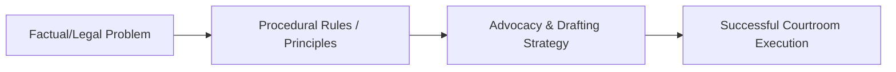

---

type: lecture
lecture: L18
tags: [lecture, litigation-skills]

---
# L18 — Cross-examination

> One-paragraph overview of the litigation skills and principles taught in this chapter.
>
> [!abstract] The arc of this chapter
> **Where we left off:** We explored the previous phase of litigation or litigation foundations.
>
> This chapter covers **[[Cross-examination]]**. We look at the problem of how to execute this task, the rules that govern it, and the strategies for successful advocacy.

*Figure: The problem-to-execution chain in this chapter.*

---

## Chapter Content Walkthrough

| 2 | Ensuring that the witness has been briefed properly | |
| --- | --- | --- |
| 3 | Introducing the witness | |
| 4 | Qualifying the witness | |
| 5 | Controlling the witness by signposting and piggybacking | |
| 6 | Asking clear questions | |
| 7 | Asking non-leading questions | |
| 8 | Asking simple questions eliciting one fact at a time (as opposed to compound questions) | |
| 9 | Ensuring that all gestures and demonstrations are recorded | |
| 10 | Listening to the answers and responding appropriately | |
| 11 | Avoiding inadmissible evidence | |
| 12 | Eliciting the evidence in a logical order | |
| 13 | Eliciting all the relevant evidence | |
| 14 | Handling exhibits appropriately | |
| 15 | **Protocol:** - [ ] Practising SOLER principles (Shoulders square, Open stance, Leaning slightly forward, making Eye contact, Relaxed posture) - [ ] Maintaining eye contact with the witness - [ ] Speaking at appropriate volume and pace - [ ] Addressing the court with proper deference - [ ] Ensuring that only one counsel is standing at any time - [ ] Addressing the court from the correct location, not moving about the courtroom - [ ] Responding appropriately to objections | |

## Chapter 18: Cross-examination

### CONTENTS

18.1 Introduction18.2 Aims of cross-examination
 18.2.1 Constructive cross-examination: Eliciting favourable evidence
 18.2.2 Destructive cross-examination: Discrediting the evidence
 18.2.3 Destructive cross-examination: Discrediting the witness
 18.2.4 Discrediting evidence given by another witness and discrediting another witness18.2.5 The duty to put your version18.2.6 Parading your case18.3 Restrictions on cross-examination
 18.3.1 Cross-examination on the merits
 18.3.2 Cross-examination to credit
 18.3.3 Provisos18.4 Failure to cross-examine18.5 Structure of cross-examination18.6 Technique in cross-examination
 18.6.1 Confrontation
 18.6.2 Probing
 18.6.3 Suggestion (insinuation)
 18.6.4 Undermining
 18.6.5 Special techniques18.7 [[Page-136|Examination-in-chief]] and cross-examination compared18.8 Examples of cross-examination to a theme
 18.8.1 Cross-examining to Observation
 18.8.2 Cross-examining to Memory
 18.8.3 Cross-examining to Recounting

---

18.8.4 Cross-examining to Bias
18.8.5 Cross-examining to Interest
18.8.6 Cross-examining to Prejudice
18.8.7 Cross-examining to Corruption
18.8.8 Cross-examining to Prior convictions
18.8.9 Cross-examining to Prior bad acts
18.8.10 Cross-examining to Prior inconsistent statement
18.8.11 Cross-examining to Reputation
18.8.12 Cross-examining to Put your case

18.9 Protocol and ethics

18.10 Checklist and assessment guide

## 18.1 Introduction

Every party to a trial has the right to question witnesses called by any other party, and, in the case of a witness called by the judge, may question the court's witness, subject to the permission of the court. This type of questioning is almost invariably adversarial in nature because the witness would not have been called unless he or she had something to contribute against the interests of the party cross-examining. This does not mean that it is open season on the witness. Treating the witness with courtesy is not inconsistent with skilful, powerful and penetrative [[Page-145|cross-examination]].

There are two main types of cross-examination. The one is constructive; you strengthen your own case by eliciting evidence which is favourable to your client's case from the opposing witnesses. The other is destructive; you attack the reliability of the evidence given by or the credibility of the opposing witness.

## 18.2 Aims of cross-examination

Cross-examination is done for "gain" and for "duty". You cross-examine opposing witnesses in order to make your own case better; this is cross-examination for gain. You also have to put your own version of disputed facts to opposition witnesses so that they may comment on them; this is cross-examination for duty. The aims of cross-examination are pursued through questions which -

- elicit favourable evidence for your side;
- test or discredit the reliability of the evidence-in-chief of the opposing witness;
- destroy or undermine the credibility of the opposing witness who is giving evidence;
- destroy or undermine the reliability of evidence given by a witness other than the one being cross-examined or the credibility of a witness other than the one being cross-examined;
- put your version of disputed facts to the other side's witnesses who can comment on those facts; and
- "parade" your case.

Cross-examination is thus a tool of persuasion; it is used in an effort to have your own side's [[Page-115|theory of the case]] accepted and the other side's theory rejected. While it is a useful tool to discover the truth, the value of cross-examination should not be over-estimated. *(see page 326)* Often your cross-examination will show very little gain for the effort you have put in. Cases are not always decided on what happened during cross-examination. The important evidence for both sides will have been given in evidence-in-chief. Don't bet the family farm on what you may gain in cross-examination. Ensure that your side's case is presented fully in the evidence-in-chief and regard what you may gain in cross-examination as a bonus.

### 18.2.1 Constructive cross-examination: Eliciting favourable evidence

Opposing witnesses are often able to confirm parts of your own case or to fill gaps in it. There are further advantages for your client if you should succeed in eliciting favourable evidence from opposing witnesses. You may even be able to cultivate the notion that there is no real dispute between what your witnesses will say, or have said, and what the witness under cross-examination says. So your first priority in cross-examination should be to elicit favourable evidence from the opposing witnesses.

However, eliciting favourable evidence from an opposing witness is a delicate operation. Your planning should have been done thoroughly so that you have an accurate idea of what you can reasonably expect the witness to concede. You should also know what the risks are. You will have to apply a little psychology and a lot of tact. You have to -

- be courteous to the witnesses;
- lead the witness gently to the answers you want by asking leading questions; and

---

- bank the good answers. Many an effort to obtain favourable evidence have been unsuccessful because the cross-examiner asked a question too many.

When you have elicited the favourable evidence you want from the witness, you reach the stage where you have to consider your next move. Is there anything else to gain from questioning the witness further? Will further [[Page-145|cross-examination]] devalue the benefits gained so far? Whether you will proceed to destructive cross-examination will depend on your on-the-spot assessment of the situation. Sometimes the value of the gains you have made thus far is so high that you will bank those answers and sit down. Sometimes you are going to conclude that you have received so little from the witness that there is nothing of substance to lose by attacking the evidence and the witness. Proceed with caution. A bird in the hand is worth two in the bush.

### 18.2.2 Destructive cross-examination: Discrediting the evidence

There is an important difference between discrediting a witness and discrediting the evidence given by a witness. Discrediting the evidence does not require an attack upon the person giving it. You don't always have to attack the veracity, character or integrity of the witness in order to cast suspicion on his or her evidence. People perceive events differently and from different vantage points; they remember things differently, have differing views of what is important, and have varying skills in communicating what they have witnessed. The result is that there are often discrepancies in the evidence unrelated to any attempt to mislead. Attacking the personal integrity of a witness in these circumstances is not only unlikely to achieve results but may even be unethical.

That does not mean that you cannot impeach the reliability of the evidence. You can still diminish the value of the evidence by clever and subtle questioning which highlights the facts and circumstances which make the evidence unreliable or less reliable, even if the witness were to be regarded as honest. He or she could be "honestly mistaken". The *(see page 327)* witness is far more likely to concede that than that he or she had been dishonest. And the court is far more likely to make a similar finding. So you have to think of ways to demonstrate to the court that the evidence is unreliable. Witnesses may only give evidence of what they observed, what they can remember, and what they can recount in their own words. You may therefore ask questions which test observation, memory and ability to recount what they have observed and remember:

- Observation: What were the circumstances under which the witness saw, heard or experienced what he or she has recounted to the court? Were those circumstances conducive to an accurate perception or recollection? Is what the witness experienced the complete story or just part of it? Could someone else, from a different vantage position, have experienced things differently?
- Memory: Did the witness have any particular reason to take notice of the events at the time? Was there any reason to remember what happened? Did the witness make any note or statement when the events were still fresh in his or her mind? How long after the event was the witness first asked to recall the events? How good is the witness's memory? Has the recollection of the events by the witness been tampered with by someone who suggested facts to him or her?
- Recounting: Is the witness telling the story in his or her own words? Did the witness perhaps hear another witness recount what they had seen? Worse still, did the witness perhaps sit in while other witnesses were interviewed or briefed by the opposing advocate or attorney?

At the end of this stage of the cross-examination you should make a value judgment on the proceedings thus far to decide whether it is necessary to attack the credibility of the witness. It may not be necessary if the evidence the witness has given has been discredited thoroughly or has little impact on the case as a whole. An attack on the witness has to be seen as the last resort.

### 18.2.3 Destructive cross-examination: Discrediting the witness

Cross-examination for the purpose of discrediting the witness is destructive; it attacks the witness directly and personally. It places the cross-examiner and the witness at odds with each other. That does not mean the cross-examination has to be aggressive or unpleasant. The more subtly you can do this, the better. The questions asked in this phase would suggest or pursue the notion that the witness is not worthy of credence for reasons like the following:

- Bias: Bias means that the witness has an irrational predisposition in favour of one side. The witness may have shown, or may show, as a result of subtle cross-examination, that he or she has a bias against your client or side or a motive to be untruthful. Suggestive questions may explore or expose this bias or motive, with the ultimate aim of showing that the witness should not be believed or that less weight should be attached to their evidence.
- Prejudice: A witness is said to be prejudiced against one side in the litigation if he or she has an irrational predisposition against that side.
- Interest: If the witness has an interest in the outcome of the trial, their evidence may well be accorded less weight.
- Corruption: If a witness has accepted a bribe or some other advantage for giving evidence, you will have to expose that. You will have to be careful though, because you may not make allegations of fraud or corruption without just cause, meaning that you have some evidential basis to support your suggestion of corruption.
- Prior convictions: If the witness has a prior conviction for an offence involving dishonesty, you may cross-

---

examine to that effect. If the witness denies having been convicted, you may lead evidence to prove the prior conviction.

- *Bad character demonstrated by prior bad acts:* It is not necessary for the witness to have been convicted of a crime for his or her past acts to be relevant to their credibility. For example, a witness who has rendered a false income tax return may be cross-examined on that subject.
- *Prior inconsistent statements:* A prior inconsistent statement may have been made by the witness in a document which is available to you, for example, in a statement taken by the police, in a letter written to your client, and even in the pleadings or in an affidavit made in the course of interlocutory proceedings between the parties. An inconsistent statement may also have been made orally, out of court, or even in the witness box. You may cross-examine the witness of such inconsistencies. The technique for dealing with prior inconsistent statements is explained in paragraph 20.4.
- *Discrepancies:* A common but not infallible indication that a witness is untruthful, is that the witness contradicts himself or herself, or contradicts another witness. The theory is that a witness who is telling the truth will be consistent in the version he or she gives, while an untruthful witness has to make up a story, remember it and repeat it accurately. This is not always so easy. So your [[Page-145|cross-examination]] may be designed to elicit discrepancies or to expose and exploit discrepancies. Once a discrepancy has been exposed, you have to decide whether you are going to leave it there and raise it in argument later, or whether you are going to confront the witness with it. If you bank the answers for use in argument, an explanation may be elicited in [[Page-160|re-examination]]. If, on the other hand, you choose to confront the witness directly with the discrepancy, the witness may give a perfectly acceptable explanation. Each case will have its own answer. When in doubt, leave the point for argument. You should be able to argue better than the witness can explain.
- *Inherent improbability:* Sometimes the evidence given by a witness is free of internal discrepancies and does not contradict what other witnesses have said, but the version given is generally inconsistent with documents produced as exhibits or with the inherent probabilities of the case or even with the witness's own conduct. When cross-examining a witness in such a situation, you should try to elicit or highlight such an inconsistency without giving the witness an opportunity to explain or elaborate.
- *Reputation:* The witness may have a reputation for dishonesty. If you intend to lead evidence to that effect, you have a duty to put it to the witness.

### 18.2.4 Discrediting evidence given by another witness and discrediting another witness

You could employ some subtle cross-examination to discredit evidence given by another opposition witness or to discredit a witness other than the one being cross-examined. The questions you would ask would tend to expose or suggest bias, an interest in the outcome, discrepancies involving the other witness, an inappropriate attitude to the oath or truth or a reputation for untruthfulness on the part of the other witness. You could also undermine the evidence of another witness by exposing or suggesting that he or she did not have a good opportunity to observe or was forgetful. Ask yourself how believable the evidence of another opposition witness is in the light of what this witness says.

### 18.2.5 The duty to put your version

One of the fundamental rules of trial is that you have to put as much of your case to individual opposing witnesses as they can reasonably be expected to be able to answer. There are three qualifications to this rule. The *first* is that you have to put to the witness only that part of your version on which the witness is able to comment. The *second* is that you only have to put that part of your own witnesses' version which conflicts with the evidence of the witness under cross-examination. The *third* is that you do not have to put any version to the witness if you are not going to call witnesses to dispute the version given by the witness.

This is something prosecutors often forget.

### 18.2.6 Parading your case

When nothing else is to be gained from a witness, you may in some instances be able to make your own case look better by putting those parts of it with which the witness is likely to agree to an opposition witness. If you have a very strong case, you may make the tactical decision to parade your case to the first opposition witness to whom it can logically be put for comment. If the witness agrees with the salient points of your case, the other side may capitulate, and even if they do not, the details of your case will have been fixed in the mind of the judge at an early stage. You parade your case for impact and you should therefore ensure that the witness agrees with every fact you put to him or her; otherwise the impact may be negative, emphasising that the witness disagrees with your version rather than the opposite.

## 18.3 Restrictions on cross-examination

Questions may be allowed in cross-examination if they serve any of the purposes discussed earlier, subject to a number of provisos. Keep in mind that the court has an overriding discretion to disallow questions even if they are otherwise in order. A general distinction is drawn between cross-examination on the merits (testing the reliability of

---

the evidence) and [[Page-145|cross-examination]] testing the credibility of the witness, or cross-examination to credit, as it is sometimes called.

### 18.3.1 Cross-examination on the merits

Questions are allowed on all matters in issue before the court; whether the accused was the one who had stabbed the deceased, whether the light was red when the defendant entered the intersection and so on. The cross-examiner may also ask questions which elicit favourable evidence for his or her side, even if the witness has given no evidence on the subject-matter of the question in their evidence-in-chief. The merits include the precise circumstances of the event or incident in question and questions which paint the incident in a different light are not only permissible, they are an example of good technique.

Favourable evidence the cross-examiner elicits for his or her side has to be admissible. Inadmissible evidence does not become admissible merely because it is given by a witness called by the other side. Conversely, however, if the question elicits inadmissible evidence which is adverse to the cross-examiner, that evidence will stand (subject to its value being assessed by the court in reaching its decision) unless the answer is not a proper response to the question which had been asked. Inadmissible [[Page-92|hearsay]] and *(see page 330)* confessions or admissions often become admissible as a result of a careless question put by a cross-examiner. So be aware of this risk.

The merits include the reliability of the evidence, as opposed to the credibility of the witnesses. The reliability of the evidence is tested by questions testing the ability of the witness to observe accurately, to remember, and to recount accurately and dispassionately what he or she has seen or experienced. For example, where the identity of the person who committed a crime (or other act) is in issue, the cross-examiner may ask questions to test the accuracy of the identification by the witness. Topics which would typically be covered in such a case (and be allowed) include -

- whether the witness had known the person identified previously;
- the circumstances under which the identification was made, including the state of lighting, the duration of the observation, the distance the witness was from the scene, the amount of stress or fear involved, the accuracy of any description of the person identified given by the witness after the event, any subsequent identification of that person by the witness under controlled circumstances such as a police identification parade, and so on;
- whether the witness has been influenced in his or her identification; and
- the distinguishing features of the person identified.

### 18.3.2 Cross-examination to credit

Questions which attack or cast doubt upon the credibility of the witness are allowed in cross-examination. Wide latitude is allowed when the questions relate to the honesty and integrity of the witness. Often the cross-examiner is the only one who has any idea where the questions are going. The following areas may be explored to test the credibility of the witness:

- The conduct of the witness may contradict his or her evidence.
- The witness is prejudiced or has a bias or interest adverse to the cross-examining side, or has a motive to be untruthful.
- The witness has previous convictions for offences involving dishonesty.
- The witness has previously been guilty of dishonesty, although not of the kind involving a conviction.
- The witness has made a prior inconsistent statement.
- The witness has a reputation for untruthfulness.

### 18.3.3 Provisos

There are many risks involved in cross-examination. The witness may give damaging answers; the witness may withstand cross-examination so well that the evidence gains in credibility or you may find that you simply have no material to question the honesty of the witness. These problems are compounded by the following circumstances:

- The Rules of Ethics of the Bar and the Law Society prohibit attacks on the character and integrity of a witness unless you have express instructions and reasonable grounds for doing so.
- If you attack the character of an opposition witness or cross-examine them about their previous convictions, your own client's character and previous convictions may be explored by the other side.
- While you will be allowed to repeat questions, even questions which had been asked in the evidence-in-chief, the court will stop you if you go too far. Repeating questions or evidence is allowed only up to a point, determined by the disposition of the judge.
- Oppressive, insulting, abusive, sneering and unduly sarcastic cross-examination will not be allowed. Insisting that the witness answer the question with a "yes" or a "no" when the witness wants to add something or answer differently is oppressive and should not be allowed. The oath taken by witnesses requires them to tell

---

the truth, "the whole truth", and nothing but the truth. A simple yes or no answer doesn't always tell the whole truth. The witness should therefore be entitled to explain by answering "Yes, but . . ." or "No, and . . ." You may even be able to use the explanation which is offered to expose bias or to elicit a contradiction or improbability in the evidence.

- The answers given to questions relating to credit are final. You are not allowed to lead evidence to dispute the evidence given by the witness in this regard. There are two exceptions where evidence in rebuttal may be led to disprove the evidence of the witness. The first is evidence of bias, interest, prejudice or corruption, and the second is evidence of previous convictions.

## 18.4 Failure to cross-examine

If you intend to lead evidence to contradict the witness or intend to argue that the witness's evidence should not be accepted, you have the duty to cross-examine the witness on the disputed facts. The idea is to give the witness an opportunity to explain or to answer your side's version of the facts. There is a grave risk in not cross-examining an opposing witness; the court may accept their evidence, especially because their evidence was not disputed in [[Page-145|cross-examination]].

Sometimes the evidence given by a witness is so obviously false or so far-fetched that it is beyond credence; it may not be necessary to cross-examine the witness in such a case. But make sure the judge shares your view that the evidence is beyond credence; don't run unnecessary risks. It doesn't take much time to tell the witness that his or her version is untrue, improbable or far-fetched. When in doubt, put your version to the witness and say that you have no further questions.

## 18.5 Structure of cross-examination

The structure or approach of your cross-examination will be determined by the tactics or strategy you have planned for the case or for the particular witness. At the preparation stage, your planning will be provisional only, because you have to listen to the evidence the witness actually gives when being examined-in-chief before you can decide upon your approach. The evidence has to be as it is given, from moment to moment, and you can only finally plan your approach when you have considered the impact of the evidence the witness has given. If your preparation has been thorough, you should be in a good position to make this assessment quickly and accurately. You may then come to the conclusion, for example, that the witness has not hurt your case as badly as you originally anticipated. You may then even decide that there is nothing to gain by cross-examining the witness. Or you may decide to elicit favourable evidence without discrediting the witness in any way.
Anticipate who the other side will call as their witnesses and think of possible themes for their cross-examination. You need themes for each witness. The following themes may be applicable:

- Constructive cross-examination -
- Favourable facts.
- Destructive cross-examination -
- observation;
- memory;
- recounting;
- bias, interest, prejudice, corruption;
- prior convictions;
- prior bad acts;
- prior inconsistent statements; and
- bad reputation.

### Putting your case

The following structure for your cross-examination may be helpful:

- Cross-examination is selective and covers only those topics chosen by counsel. Evidence-in-chief, on the other hand, has to be complete, with the witness telling the whole story from beginning to end. You therefore determine the topics or themes for cross-examination and the order in which to raise them.
- The general sequence would be -
- first, to attempt to elicit favourable evidence, (including evidence which discredits another witness) from the witness;

---

- then, to consider whether there is anything to be gained by testing the reliability or correctness of the other evidence the witness has given;
- if there is still a need to discredit the witness after that, to proceed with caution in your attempt to discredit the witness; and
- last, to put your side's version of those disputed facts on which the witness should be able to comment.
- Counsel has to make an assessment of the situation continuously, from question to question, depending on how successful the [[Page-145|cross-examination]] has been. The approach to further cross-examination and the need for it are determined by answers to questions such as:
- How much have I got from the witness?
- How badly do I need what I've got already from this witness for my case?
- What are the risks if I were to carry on? What can go wrong?
- How important is this witness in the grand scheme of the case anyway?
- What are the chances of my actually gaining more by carrying on?

## 18.6 Technique in cross-examination

Your technique in cross-examination has to be adapted not only for the particular case, but also for the particular witness. In short, your [[Page-115|theory of the case]] and the evidence *(see page 333)* already given by the witness will determine what line of cross-examination you will follow and what style you will adopt. Your purpose will be to enhance your client's case by achieving one or more of the purposes of cross-examination explained earlier.

Professor Irving Younger listed ten precepts to be applied by the novice cross-examiner:

1 Be brief.
2 Ask short questions using plain words.
3 Ask only leading questions.
4 Do not ask a question if you do not know the answer.
5 Listen to the answer.
6 Do not argue with the witness.
7 Do not allow the witness to repeat adverse evidence against your side.
8 Do not allow the witness to explain (never ask *why*).
9 Avoid asking a question too many.
10 Save your explanations for the [[Page-174|closing argument]].

Individual styles of cross-examination could be characterised as "scornful", "stern", "formal", "informal", "familiar" or even "mischievous" cross-examination. Whatever style suits you, remember that it has to be employed with subtlety. Throughout the cross-examination, counsel will introduce fresh themes without clear links giving away the purpose behind the questions.

There are various ways to pursue these goals. Munkman (*The Technique of Advocacy* (1991)) is of the view that there are four main techniques to be adopted by a cross-examiner. They are "confrontation", "probing", "insinuation" (or "suggestion") and "undermining". Munkman is quick to point out that these techniques go hand in hand, and that undermining may even be subsumed in the others. Others treat the subject differently, preferring to illustrate cross-examination techniques by way of anecdotal examples. However, Munkman's classification is useful when planning and executing your cross-examination.

### 18.6.1 Confrontation

The technique of confrontation is used when the cross-examiner has the ammunition to demonstrate that the evidence given by the witness is incorrect (discrediting the evidence) or untrue (discrediting the witness). The witness is therefore confronted with all the contrary evidence, piece by piece, with the aim of discrediting the evidence-in-chief or the witness. The idea is that the witness should be confronted with facts he or she cannot deny. For obvious reasons, this approach can only work where you have strong evidence to support the facts put to the witness.

The facts have to be put one by one so that each question suggests only one fact. The cumulative impact of the facts is important, so you need to put all the relevant facts to the witness. The idea is to put the questions in such a way that the witness has to answer in the affirmative or disclose bias or dishonesty. It is common to find, when this style of cross-examination is used, that the witness starts giving "explanations" instead of straight answers to the questions. This is because the witness soon catches on to what the cross-examiner is trying to achieve and tries to prevent that. Therefore, if a fact suggested by you is denied by the witness, you may have to resort to "probing"

---

questions to discredit *(see page 334)* the answer and then continue putting the other facts you wish to confront the witness with.

**Table 18.1** Confrontation as a technique in [[Page-145|cross-examination]]

**The facts:** A ballistics expert gives evidence in a criminal trial. The accused is charged with murder and the issue is whether he had fired the shots deliberately. Altogether 10 shots were fired. In the expert's opinion, the accused had moved around the room while firing the shots. This opinion is based on the places where the individual shell casings were found after the shootings. The defence version is that the accused had fired all the shots from one position while in a state of sane automatism.

**The aim of the cross-examination:** To discredit the expert's opinion and the prosecution theory (that the accused "deliberately" moved around while mowing down the victims) by showing that the shell casings are more likely to finish up in random positions when ejected from the pistol.

Q. You based your opinion on the positions of the various shell casings?
A. Yes.
Q. The floor of the room was tiled, as we can see in the photograph, Exhibit B?
A. Yes.
Q. The walls of the room were bare?
A. Yes.
Q. There were various items of furniture in the room, as we can also see from that photograph?
A. Yes.
Q. The shell casings would have been ejected at a speed of 3 metres a second, your tests have shown?
A. Yes.
Q. They could have hit one or more of the walls and one or more of the items of furniture before coming to rest on the floor?
A. Yes.
Q. The bounce of these objects could not be predicted with any degree of accuracy, could it?
A. I don't entirely agree with that.
Q. Where an individual shell casing finally came to rest under those circumstances is entirely random, isn't it?
A. I don't think so.
Leave the rest for argument.

There are three separate steps in this sequence:

- the expert is "committed" to the reasons for his opinion;
- he is "confronted" with facts he cannot deny; and
- when he resists the conclusion the cross-examiner seeks, the cross-examiner leaves the point for the [[Page-174|closing argument]]. At that point you may conduct an experiment, dropping the shell casings from the hand, to show that they scatter when they hit the floor.

### 18.6.2 Probing

Probing questions inquire into the details of the version given by the witness in order to test its truth or to expose it as wrong or to cast doubt on it. The aim is to discover and expose weaknesses in that version. These weaknesses may consist of discrepancies, improbabilities and other flaws in the evidence.

Probing questions are often open questions, or closed but non-leading questions. This contrasts with the conventional wisdom that questions in cross-examination should always be leading questions. However, the witness has to be given some rope to *(see page 335)* hang himself. Probing questions may even invite explanations, which would usually also be avoided, but in this instance the explanations are sought in order to expose weaknesses. For the same reason, you may ask probing questions when you don't know what the answer will be - a danger generally to be avoided in cross-examination. The risks inherent in this situation must be carefully considered before asking a series of probing questions Do the risks (of eliciting unfavourable answers and evidence) outweigh the possible gains (discrediting the evidence or witness)?

Probing questions asked in quick succession - not really much of a prospect when you have to speak through an interpreter - may be used to keep the witness off balance and to ensure that, if the witness is making things up, there is insufficient time to be too successful at it. It isn't always possible to prepare probing questions in advance, and you have to be ready to seize the opportunity to ask probing questions when it becomes necessary. To be ready for this, you need to know your case very well, to listen carefully and critically to the evidence of each witness, and to have sound judgment. If you have prepared a proper [[Page-115|fact analysis]] using the proof-making model, you should be as well prepared as you can hope to be.

**Table 18.2** Probing as a technique in cross-examination

**The facts:** The accused has been charged with a housebreaking and theft that occurred

---

on the 12th August [year] at 04:00. His defence is an alibi and he has given notice that he intends to call his mother to support the alibi. He gave evidence-in-chief to the effect that he was asleep in his bed at home at the relevant time.

**The aim of the [[Page-145|cross-examination]]:** To probe into the details of the alibi in order to discredit it and to obtain material to undermine the alibi witness.

Prosecutor. *You first heard that the police were looking for you on 31st August [year]?*

A. *Yes.*

Q. *You heard that they were looking for you in connection with a burglary on 12th August [year]?*

A. *Yes.*

Q. *And you then went to the police station three days later with your mother?*

A. *Yes.*

Q. *You must have told your mother why the police were looking for you?*

A. *Yes.*

Q. *And you then must have discussed where you had been on the night of the 12th?*

A. *Yes.*

Q. *At what time did you go to bed that night?*

A. *...*

Q. *Who else was at home at the time?*

A. *...*

Q. *What did you do before you went to bed, say from about 7pm onwards?*

A. *...*

Q. *Let's go through that slowly, step by step. I want to know what you did, what time it was when you did each of these things, who was present at each stage and what they did.*

A. *Okay.*

Q. *What did you have for dinner?*

A. *...*
Q. *Did you have anything to drink?*

A. *...*

Q. *Who else was at the dinner table?*

A. *...*

Q. *At what time did dinner finish?*

A. *...*

The first few questions may undermine the accused and his witness. The remaining questions are designed to find details to compare with the evidence of the next witness.

### 18.6.3 Suggestion (insinuation)

Facts may be suggested to the witness in such a way that the events are put in a different light. The purpose is to establish a version that is more favourable to the cross-examiner's side. You put a different "spin" on the facts. This technique relies heavily on leading questions that suggest additional facts or circumstances putting a slightly different spin on the events. Suggestion as a technique for cross-examination does not work well when the evidence of the witness is diametrically opposed to what is suggested. In such a case confrontation would be a more suitable technique to use.

Suggestion would therefore be used where -

- there are only slight differences between the evidence and what you want to suggest is the truth; and
- you can make small, incremental gains by suggesting one fact at a time to the witness, preferably including (or repeating) two or more facts the witness has already given for every new fact suggested, so that the cumulative effect of all the evidence puts a different slant on the matter.

Suggestive questions can be asked forcefully or gently. The stronger the underlying material (on which the suggestive questions are based), the firmer you can be in suggesting them as facts. However, where your material is sketchy or doubtful, you may have to be more diffident in your suggestions and lead the witness along gently. Subtlety, rather than aggression, may be the style to adopt in such a case.

**Table 18.3** Suggestion as a technique in cross-examination

**The facts:** The facts are given in chapter 15 in the opening addresses of the prosecutor and defence counsel. The store detective has given evidence to the effect set out in the prosecution's [[Page-131|opening statement]]. The prosecution theory is that the accused "exchanged" his old backpack for a new one, and implemented a deliberate plan to steal by nonchalantly walking out the door without paying, and when confronted by the detective, apologised for his actions.

**The aim of the cross-examination:** To suggest additional facts which may put a

---

slightly different slant on the store detective's evidence, namely that the conduct of the accused is also consistent with a honest mistake having been made.

Defence counsel. The accused took the backpack off the rack in full view of the store's staff, including yourself?

A. Yes.

Q. His own backpack was on the floor at his feet, wasn't it?

A. Yes.

Q. He then examined the store's backpack thoroughly, didn't he?

A. Well, uhm.
Q. What I mean is that he held it up, opened its various pouches and looked inside its separate compartments.

A. Yes, he did.

Q. He had to use both hands for that, didn't he?

A. Yes.

Q. Then, still in full view of everyone, he walked over to the rack where briefcases were displayed?

A. Yes.

Q. And then, after slinging the store's backpack over his shoulder, he examined a few of those too?

A. Yes.

Q. And then he put them all back on the rack and walked to the door of the store?

A. Yes.

Q. And he still had the store's backpack over his shoulder?

A. Yes.

Q. He walked straight past you and the cashier at the till point?

A. Yes.

Q. And out the door?

A. Yes.

Q. From what you have said so far, he did all of this quite openly?

A. Yes, but that was part of his plan, I think.

Q. And when you confronted him outside, you said: "Pardon me, but you haven't paid for that backpack."

A. Yes.

Q. And he said: "I'm sorry, it's a mistake."

A. Yes.

Q. That was all he said, wasn't it?

A. Yes.

Q. So you cannot deny that he meant he had made a mistake in thinking that he was carrying his own bag, can you?

What has been suggested here is that the accused had slung the backpack over his shoulder when he needed both his hands to examine the briefcases. This fact, coupled with others, could be used in argument to contend that the accused had slung the backpack over his shoulder thinking it was his own, had not noticed any difference in colour, texture or weight, and that his mind was on the briefcases when he did so. Another useful fact elicited (suggested) in this exchange is that the accused acted openly. The last question is an example of a risky question, the "question too many" against which Professor Younger has cautioned.

### 18.6.4 Undermining

Undermining questions would, typically, be aimed at the aspects discussed earlier in this chapter, such as -

- the opportunity, or lack of opportunity, to observe;
- the accuracy of the recollection of the events by the witness;
- the accuracy of the recounting of the events by the witness;
- bias, prejudice, interest or corruption;
- the presence of discrepancies and inconsistencies in the evidence of the witness, as apparent from prior inconsistent statements, the evidence of other witnesses, and any documentary evidence;
- the general (or inherent) probabilities of the case; and
- the character of the witness, as apparent from prior convictions, other prior bad acts or his or her reputation.

Using confrontation, probing and suggestion, the cross-examiner would attempt to undermine the impact of the

---

evidence or the witness.

**Table 18.4** Undermining the witness

| **The facts:** The facts are given in the opening addresses of counsel for the prosecution and defence in chapter 15. The accused is alleged to have stolen a backpack. Consider his defence, as put by his counsel in the defence [[Page-131\|opening statement]]. |
| --- |
| **The aim of the [[Page-145\|cross-examination]]:** To "parade" the prosecution case in order to undermine the defence case. |
| Prosecutor. *So you put your own backpack on the floor?* |
| A. Yes. |
| Q. *And you then took a similar backpack from the rack?* |
| A. Yes. |
| Q. *One you were not going to buy because you actually wanted a different type of bag?* |
| A. Yes. |
| Q. *And then you slung the store's backpack over your shoulder?* |
| A. Yes. |
| Q. *And you left your own, tattered backpack on the floor?* |
| A. Yes. |
| Q. *The two bags are quite different, aren't they?* |
| A. Yes, but I did not notice that at the time. I thought I was carrying my own. |
| Q. *And you went to the rack where other types of bags were displayed?* |
| A. Yes. |
| Q. *But you did not select any of them?* |
| A. Yes. |
| Q. *You then walked out of the store without buying anything at all?* |
| A. Yes. |
| Q. *You did not have enough money on you to pay for the backpack, did you?* |
| A. No. |
| Q. *You've been embarrassed previously by your colour-blindness?* |
| A. Often, and for a long time. |
| Q. *You must have learnt, over the years, to be extra careful then in order to avoid such embarrassment?* |
| A. I've tried. |
| Q. *You didn't, on this occasion, take any particular care to ensure that you did not make a mistake?* |
| A. No. |

The prosecution's case is that the defendant's conduct is suspicious. The first part of the cross-examination is designed to undermine the defendant's version by parading the facts which make that version appear suspicious. The last three questions are designed to undermine it further by raising additional facts which reduce any sympathy the judge might feel towards the accused. The very last question may be the question that allows the witness to give a convincing explanation.

### 18.6.5 Special techniques

Cross-examining difficult witnesses can test the skills of an Edward Carson and the patience of a saint. Some witnesses lie. Others are obtuse and evasive. Some tell the *(see page 339)* truth and your cross-examination doesn't make a dent in their evidence or credibility. An expert may be too clever for your best efforts. (On the cross-examination of experts, see chapter 20.) The court may be unsympathetic to counsel saddled with the unenviable task of having to cross-examine the witnesses in an unpopular case, for example, to cross-examine the complainant in a rape case or a small child in almost any case. Your cross-examination in these (and similar) cases will have to be planned very carefully.

Perhaps a few pointers can help:

- Cross-examine only for gain or for duty. If there is nothing to gain and nothing to put to the witness, don't ask any questions. Ask yourself: "Did the witness hurt my [[Page-115|theory of the case]]?" If not, say, "I have no questions, thank you", and sit down.
- A great deal of planning, patience and subtlety is usually required to expose an untruthful witness. The facts need to be investigated and analysed carefully in advance to find weaknesses in the evidence of the witness or angles for attack to diminish the credibility of the witness. A carefully constructed sequence of questions, based on sound underlying materials, will have to be implemented without any haste. You may have to use a clever mix of confrontation, probing and suggestion. Comparing what the witness has said in his or her statement (if available to you), or in evidence-in-chief or in a document or what another witness has said with their evidence is essential, as untruthful witnesses are seldom entirely consistent. Do a detailed [[Page-115|fact analysis]]. Prepare themes for the cross-examination of the witness.
- If the witness doesn't answer or insists on giving a long explanation, not asked for by you, put the question

---

again, if necessary. Use the same words and the same tone of voice for impact. If the witness eventually answers, you may ask why that answer had not been given the first time you asked the question. Perhaps the witness was playing for time while thinking of an answer? Or perhaps the witness is eager to find an explanation? Probe these possibilities with suitable questions.

- Adjust your style of questioning for the particular witness. Remember the saying that a timid witness may be terrorised, a fool outwitted, an irascible man provoked and a vain man flattered. None of these styles should be apparent. For example, neither flattery nor provocation is likely to be successful if it is obvious. And you won't be allowed to terrorise the witness, so you will have to find another way to deal with the timid witness.
- [[Page-145|Cross-examination]] is part of the process of persuasion. It is generally counterproductive to adopt an unsympathetic or hard line when cross-examining victims of crime or children.
- Don't flatter the witness by continuing an unrewarding cross-examination. You cannot cross-examine bullet-holes out of a corpse, entries out of books or fingerprints off a dressing table.
- Stop when you have made sufficient gains. Bank the good answers. Many a good cross-examination has been ruined by a question too many, often a "Why . . ." question. Do not cross-examine on a favourable answer; the witness may retract it or reduce its value. Don't ask for explanations. Asking, "Why . . . ?" is just looking for trouble.
- Keep the questions short, asking for or suggesting one fact at a time.
Table 18.5 A question too many

**The facts:** The issue was whether a tow truck operator had disconnected the drive-shaft of a Volvo truck before towing it after a breakdown. The driver of the Volvo and his assistant gave evidence to the effect that the tow operator started towing the Volvo and about 2 or 3 kilometres later stopped at the side of the road and disconnected the drive-shaft. By that time the gearbox of the Volvo had been damaged. The assistant gave evidence that the drive-shaft had been removed next to a sugar cane field. The defendant's version was that the drive-shaft had been disconnected at the commencement of the towing operation, not when the tow truck stopped next to the sugarcane and that the purpose of that stop had been to conduct a routine check to see if the tow was secure.

**The aim of the cross-examination:** To discredit the witness or his evidence.

Defendant's counsel. *When the tow truck stopped you saw the driver and his assistant come to the Volvo?*

A. Yes.
Q. *You then went into the sugarcane field?*
A. Yes.
Q. *And you spent some time there?*
A. Yes.
Q. *You did not actually see them take the drive-shaft off, isn't that so?*
A. *No, I did not.*
Q. *Why did you say then in your evidence-in-chief that they took the drive-shaft off while you were in the sugarcane field?*
A. *Well, when I came back from the sugarcane, I saw them packing up their tools in the tool box and pick up the drive-shaft from under our truck. Then they put the tool box and the drive-shaft on their truck.*

The last question undid all the good results the prior cross-examination had achieved.

- If your cross-examination does not achieve any gains for your side, terminate it quickly. If your case is not getting any better, you have no business continuing asking questions that are more likely to make it worse. Your opponent may argue, to good effect, that, "The witness was subjected to lengthy, searching cross-examination by experienced counsel and did not deviate from his evidence, contradict himself or disclose any bias towards the accused."
- Don't argue with the witness and don't give explanations. If the witness raises argumentative matter, ask the witness to restrict his or her answers to the facts. Ask your questions in such a way that you invite facts rather than argument or explanations.
- The fact that the witness has been disbelieved in another case, is of little or no value to discredit the witness. Some judges may allow a question to that effect, but there are too many imponderables to be sure that the previous finding was correct. This kind of cross-examination may even be inadmissible.
- It is a good tactic to end the cross-examination on a high note. The high note may be agreement by the witness with a number of your side's facts, put as propositions to the witness, or it could be the exposure of a glaring discrepancy, or raging bias against your side. The high note is best achieved when you can parade those of your side's facts the witness can, and will, confirm. When you have hit the high note, sit down.

---

## 18.7 Examination-in-chief and cross-examination compared

**Table 18.6** Examination-in-chief and cross-examination compared

| Examination-in-chief | Cross-examination |
| --- | --- |
| Inquisitive questions are used, with the answers known or expected by the questioner. | Insinuating (suggestive) questions are used, with the answers not necessarily known to the cross-examiner. |
| Questions may not be leading and are aimed at getting the witness to give his or her own version. | Mostly leading questions, designed to elicit the desired answer, are asked. |
| Interrogative words are used to introduce questions: 'Who', 'what', 'where', 'how', 'which', 'why' and 'Please describe . . .'. | The tone is suggestive and accusatory: 'You went to the house, didn't you?' or 'Didn't you . . . ?' |
| There is a chronological arrangement, except when a particular topic needs to be dealt with out of turn. | The arrangement is topical, with chronological sequencing within themes or topics. |
| Strict sequencing allows witness to be at ease. | A mixed approach is followed to keep the witness off balance. |
| The aim is to keep the case simple. | The aim is to sow suspicion and confusion. |
| Comprehensive, covering all the material facts on which the witness can contribute evidence. | Selective, covering only the material fact or facts in issue, and attacking selected items of evidence. |
| It is not required to put the opponent's version, but you may do so in anticipation. | You are required to put your side's version of disputed facts to appropriate witnesses. |
| Questions progress from open questions to closed but non-leading questions. | Questions progress from open questions introducing the topic, to closed, leading questions. |

## 18.8 Examples of cross-examination to a theme

There has to be a purpose to your cross-examination. There can be a meaningful purpose only if you have identified the correct theme or themes to pursue, and then adopt the correct technique. It could be done as follows:

### 18.8.1 Cross-examining to Observation

The witness gave evidence identifying the accused, who is charged on a count of robbery. The incident had taken place at night.

Q. *You were looking at the scene through your window on the first floor?*

A. *Yes.*

Q. *It was dark outside, except for one street light?*

A. *Yes.*

Q. *That street light was behind the two men you saw in the alley?*

A. *Yes.*

Q. *Their faces must have been in the shadow?*

A. *...*

### 18.8.2 Cross-examining to Memory

The witness is called as an alibi witness.

Q. *You were not interviewed by the police after the incident?*

A. *No.*

Q. *The incident happened more than a year ago?*

A. *Yes.*

Q. *And you were told for the first time that you were needed as a witness last week, when the accused's attorney called you and asked you if you could remember the events of that weekend more than a year ago?*

A. *Yes.*

---

Q. And you then had to try to remember precisely what weekend that was, and what you could remember of it?

A. . . .

### 18.8.3 Cross-examining to Recounting

The witness was provided with information by the police.

Q. You were told by the police that they had caught the culprit?

A. Yes.

Q. And they told you they had caught an Indian man with bushy hair?

A. Yes.

Q. So you went to the identity parade expecting there to be an Indian man with bushy hair in the line-up?

A. . . .

### 18.8.4 Cross-examining to Bias

The witness was a passenger in the same car as the plaintiff when they were stopped by the police.

Q. You told the court that the police were harassing the accused?

A. Yes.

Q. And they had harassed you too, on a prior occasion, hadn't they?

A. Yes.

Q. You don't like the police, do you?

A. . . .

### 18.8.5 Cross-examining to Interest

The witness has a claim against the same defendant arising from the same collision.

Q. You were also injured in the collision?

A. Yes.

Q. You also have a pending claim against the Road Accident Fund?

A. Yes.

Q. And if the RAF were found liable in this action, your prospects of obtaining a favourable settlement would improve, would they not?

A. . . .

### 18.8.6 Cross-examining to Prejudice

The witness has suffered at the hands of criminals before. Now she gives identification evidence in a housebreaking matter.

Q. Your own flat has been burgled a few times, hasn't it?

A. Yes.

Q. You are sick and tired of these people breaking into people's homes and getting away with it, aren't you?

A. Who isn't?

Q. So you would like to see this accused being brought to book?

A. . . .

### 18.8.7 Cross-examining to Corruption

The witness has been paid to give evidence.

Q. You insisted on being paid to come and give evidence?

A. Yes.

Q. And the plaintiff readily agreed to pay?

---

A. No, he first said he would send me a subpoena, but later he agreed to pay me.

Q. Yes, but that was only after your response that your evidence would be very unhelpful if he did not pay, wasn't it?

A. . . .

### 18.8.8 Cross-examining to Prior convictions

The witness has prior convictions.

Q. You were convicted of theft by shoplifting on [date] in the Magistrates' Court in [town], were you not?

A. . . .

### 18.8.9 Cross-examining to Prior bad acts

The witness has submitted false VAT returns to the South African Revenue Service.

Q. When you sold the business you represented the turnover during the preceding year to have been R50 000 per month?

A. Yes, I said so.

Q. But your VAT returns reflect a turnover of only R25 000 per month during that year, is that not so?

A. . . .

Q. You either rendered false returns to SARS or you deceived the plaintiff. Which was it?

A. . . .

### 18.8.10 Cross-examining to Prior inconsistent statement

See paragraph 20.4

### 18.8.11 Cross-examining to Reputation

You intend calling a witness who will say that the witness under [[Page-145|cross-examination]] has a reputation for untruthfulness.

Q. You have lived in the X community all your life?

A. Yes.
Q. And the people of that community must know you well?

A. I suppose so.

Q. What would you say if a member of that community were to give evidence to the effect that you have a reputation for being untruthful in your interactions with members of that community?

A. . . .

### 18.8.12 Cross-examining to Put your case

Your case is that the witness had not been present during the events concerned.

Q. I suggest that you were not living in that community at the time.

A. No, that is not true.

Q. In fact, you were living in [town] at the time the deceased was killed here in [town]. Is that not the truth?

A. No.

> [!warning] **18.9 Protocol and ethics**
>
> Attacking the character of a witness is not to be undertaken unless you have firm instructions and good grounds for such a course. There are limits to the extent to which the character of witnesses can be attacked. They are set out in the Bar's Rules of Ethics and the Law Society's Rules and Rulings. If you attack the character of an opposing witness, your own client's character may be attacked.
> It is unethical for counsel to attribute fraud, dishonesty or other improper behaviour to third parties in open court when they are not witnesses or parties at the trial and don't have a chance to respond to the allegations. When such allegations have to be made the names of the persons against whom they are to be made should be written on a note and given to the judge instead.

---

- Counsel should not argue against the credibility of a witness without having cross-examined the witness on the disputed version.
- It is unethical for counsel to misstate prior evidence in [[Page-145|cross-examination]]. Don't twist or interpret what the witness has said. If prior evidence has to be repeated, use the exact words the witness used. (You should have made notes of them for precisely this purpose.)
- It is unbecoming of counsel to abuse witnesses. Keep sarcasm and sneering in check.

## 18.10 Checklist and assessment guide

If this book were to be used as a teaching guide or prescribed work for advocacy exercises, the following checklist may be used to prepare for the exercises, to serve as an assessment guide, or to serve as a marking guide.

If the checklist were to be used as a marking guide, the best way to go about the matter is to allocate a grade to each student or pupil whose performance is being assessed as follows:

C = Competent (meaning that the performer has attained the desired standard of competency in respect of the skill involved).

NYC = Not yet competent (meaning that the performer has not yet reached the desired standard).
Table 18.7 Checklist for cross-examination

| | Skill involved | Competent/ Not yet competent |
| --- | --- | --- |
| 1 | Preparing themes for the cross-examination of each witness | |
| 2 | Asking short, leading questions | |
| 3 | Asking clear questions | |
| 4 | Asking one question at a time and allowing the witness to answer | |
| 5 | Avoiding arguing with the witness | |
| 6 | Avoiding questions resulting in inadmissible evidence | |
| 7 | Asking simple as opposed to compound or multiple questions | |
| 8 | Ensuring that all gestures and demonstrations out are recorded | |
| 9 | Listening to the answers and responding appropriately | |
| 10 | Avoiding commenting on the answers | |
| 11 | Exploring one theme at a time | |
| 12 | Eliciting favourable evidence where appropriate | |
| 13 | Following the correct procedure for putting a prior inconsistent statement | |
| 14 | Avoiding repeating adverse evidence | |
| 15 | Questioning only on topics relevant to the cross-examiner's [[Page-115\|theory of the case]] | |
| 16 | Challenging the witness on all disputed facts within the witness's knowledge | |
| 17 | Putting the cross-examiner's case to the appropriate witnesses | |
| 18 | **Protocol:** - [ ] Practising SOLER principles (Shoulders square, Open stance, Leaning slightly forward, making Eye contact, Relaxed posture) - [ ] Maintaining eye contact with the witness - [ ] Speaking at appropriate volume and pace - [ ] Addressing the court with proper deference - [ ] Ensuring that only one counsel is standing at any time - [ ] Addressing the court from the correct location, not moving about the courtroom - [ ] Responding appropriately to objections | |

---

---

## Concepts in this lecture

[[Cross-examination]]

## Navigation

Prev: [[L17 - Examination-in-chief|← Previous Chapter]] · Next: [[L19 - Re-examination|Next Chapter →]]
