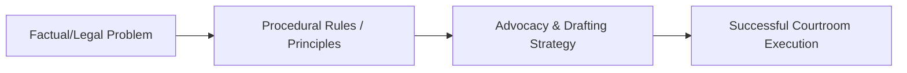

# L19 — Re-examination

> One-paragraph overview of the litigation skills and principles taught in this chapter.
>
> [!abstract] The arc of this chapter
> **Where we left off:** We explored the previous phase of litigation or litigation foundations.
>
> This chapter covers **Re-examination**. We look at the problem of how to execute this task, the rules that govern it, and the strategies for successful advocacy.

*Figure: The problem-to-execution chain in this chapter.*

---

## Chapter Content Walkthrough

# Chapter 19
## Re-examination

CONTENTS

19.1 Introduction
19.2 Restrictions on re-examination
19.3 Purpose of re-examination
19.3.1 Repairing damage to the evidence-in-chief
19.3.2 Rehabilitating the witness whose credibility has been impeached
19.3.3 Clarifying evidence which has been obscured by [[Page-145|cross-examination]]
19.4 Technique in re-examination
19.5 Protocol and ethics
19.6 Checklist and assessment guide
### 19.1 Introduction

Parties are entitled to re-examine their own witnesses after the completion of cross-examination. Re-examination is done -

- to repair damage inflicted on your case during cross-examination of your witness;
- to rehabilitate a witness whose integrity or credibility has been adversely affected by cross-examination;
- to clarify evidence which has been muddled by cross-examination; and
- to answer new evidence elicited during cross-examination.

It follows that there is no need for re-examination if none of these purposes will be served by re-examining the witness.

### 19.2 Restrictions on re-examination

There are three restrictions on the right to re-examine:

1 The witness may only be re-examined on matters arising from the cross-examination.
2 Leading questions are not allowed; you are subject to the same rules with regard to the form of the questions as you are when leading the evidence-in-chief.
3 The re-examination is not to be a mere repetition of the evidence-in-chief.

### 19.3 Purpose of re-examination

#### 19.3.1 Repairing damage to the evidence-in-chief

If the evidence-in-chief of your witness has been undermined in cross-examination, you may be able to repair the damage in re-examination. However, this situation is pregnant with risk. An unsuccessful attempt to repair the damage is likely to remind the judge of the success of the cross-examination. It is therefore important to weigh up the risks against the possible benefits before you embark on this course.

The need to repair damage could arise in a variety of circumstances. New evidence elicited in cross-examination could damage your case. Inadmissible evidence may also become admissible as a result of cross-examination, allowing you to lead evidence you *(see page 348)* could not produce as evidence-in-chief. For example, if your witness is cross-examined on part of a document that would otherwise have been privileged, the whole document becomes admissible. In such a case, your witness may be re-examined on those parts of the document that are favourable to your case.

Table 19.1 Eliciting a favourable explanation

---

**The facts:** The facts are set out in Table 18.5, where it is demonstrated how a question too many could undo the good results of prior [[Page-145|cross-examination]]. Counsel should have refrained from asking the last question, which allowed the witness to give a convincing explanation. Assume that opposing counsel had refrained from asking that question. You now have the opportunity to elicit the same evidence.

**The aim of the [[Page-160|re-examination]]:** To elicit the explanation from the witness, whose evidence would otherwise be totally discredited.

Q. *You said in your evidence that the tow truck driver and his assistant disconnected the drive shaft there next to the sugarcane field. What makes you think they did that?*
A. *When I came from the sugarcane, I saw them pack up their tools in the tool box, pick up the drive shaft from under our truck and put the tool box and drive shaft on their truck.*

### 19.3.2 Rehabilitating the witness whose credibility has been impeached

It may be necessary, but not always possible, to rehabilitate your witness when his or her credibility has been damaged by the cross-examination. An explanation may be given for an apparent discrepancy or other inconsistency or improbability. The situation is also fraught with risk; you do not want to remind the judge of the discrepancy, inconsistency or improbability only to demonstrate that you have no explanation for it. Some witnesses simply cannot be rehabilitated, especially those who have been caught lying or exhibiting strong bias. In such a case it is best to feign indifference and to pass on the opportunity to re-examine. Remember:

All the King's horses and all the King's men,

Couldn't put Humpty Dumpty together again!

**Table 19.2:** Rehabilitating a witness with previous convictions

**The facts:** The witness's previous convictions, including previous convictions for fraud and theft, are exposed by cross-examination.

**The aim of the re-examination:** To rehabilitate the witness.

Q. *You have admitted to various previous convictions.*
A. *Yes.*
Q. *How old were you when you committed these offences?*
A. *I was in my twenties.*
Q. *How long ago was your last conviction?*
A. *Twelve years.*
Q. *How long were you in prison?*
A. *Eighteen months.*
Q. *What have you done with your life since then?*
A. *I started studying while in prison and completed my matric just before my release. I got a job, with the help of the Prisons Department. I'm still working for the same company. I also got married and I have two children.*
Q. *Have you been in trouble with the law since your release from prison twelve years ago?*
A. *No.*

### 19.3.3 Clarifying evidence which has been obscured by cross-examination

Cross-examination often deliberately sows confusion. If there is a way to remove the confusion, you must do so in re-examination. There may be gaps in the narrative or some document may have been left out so that the story told by the witness is disjointed and incomplete. Ambiguous answers may also need to be clarified. Say the witness is asked how many persons were present at a given place and the answer is, "A couple". While the cross-examiner may choose to leave the matter there, you may want to know precisely what the witness means by "a couple". Does the witness mean "two" or "a few"?

**Table 19.3** Clarifying the evidence

**The facts:** The plaintiff has been cross-examined on two letters written by him on the same day but to different provincial government officials, the first to a low ranking official and the second, written an hour later, to a member of the Executive Council. The letters contain conflicting proposals for the development of a property. The cross-examiner suggested that the plaintiff had deliberately tried to deceive the provincial officials.

**The aim of the re-examination:** To clarify the evidence by showing the context in which the two letters were written and to explain why they contain conflicting proposals.

Q. *You've admitted that the two letters contain conflicting proposals for the development of your property and that they were written the same morning.*
A. *Yes.*
Q. *Can you explain why the proposals you made differ?*

---

A. Yes. What happened was this. When I wrote the first letter, I was angry. I faxed it off to Province immediately after my secretary had finished typing it. Then I sat down and had a cup of coffee. While I was doing that, I realised that I was fighting with a junior official who was probably only following orders from his superiors. I then telephoned him and apologised for the tone of my letter.
During the conversation he told me that it was not necessary for me to make a donation of part of my land to the municipality in order to get permission to develop the rest of the land. All Province was interested in was that the sensitive parts of the land should be protected and that my development proposals should address that issue. I asked him what he thought I should do. He said I should write to the MEC and modify the proposal. He would keep the other letter on file but would not act on it. So I wrote the second letter to the MEC with the new proposal.

**Note:** You should ask for an explanation only when you are certain that the witness can give a good one.

## 19.4 Technique in re-examination

The basic technique for re-examination is the same as for leading evidence-in-chief, with some notable differences. For example, while the evidence-in-chief would be elicited in such a way that the "whole story" is told in chronological order, re-examination is "topical" in the sense that it deals only with topics (themes) which were raised in [[Page-145|cross-examination]]. Further, while the evidence-in-chief could be planned in advance with a fair *(see page 350)* amount of precision, re-examination is more dynamic. While you could prepare to some extent for re-examination during the preparation stage when you considered possible angles of cross-examination, you will have to wait for the cross-examination to be completed before you can make a final decision about whether to re-examine at all, and if so, on what topics.

Your decision and its implementation will depend on the following principles and tactical considerations:

- The most important consideration is whether the cross-examination has hurt your case or your witness. If no harm has been done, there is no need for re-examination unless the cross-examination opened the opportunity to lead further evidence that is favourable to your side.
- If your case or witness has been harmed but the re-examination is not likely to repair the harm, there is no purpose in re-examining.
- There is some benefit to be gained from a confident, "I have no further questions, thank you, M' Lady." The judge may wonder whether she has imagined the harm done by the cross-examiner since your approach suggests there was none.
- If you are in doubt whether you can improve your case, you should not re-examine.
- If you do decide to re-examine, there are two golden rules to obey: The *first* is that you have to know that the witness will respond with a favourable answer. The *second* is to keep the re-examination short and convincing.
- Since re-examination is arranged by topic, it is necessary to indicate to the witness what that topic is. The topic has to arise from the cross-examination, so you may have to refer the witness to what he or she has said in cross-examination in order to focus his or her attention on the topic you want to pursue. The technique was demonstrated in the three examples given earlier in this chapter and proceeds in three steps: *First*, remind the witness what he or she has said while under cross-examination. *Two*, allow the witness a moment to recall that evidence. *Three*, ask the questions you want to ask arising from that earlier evidence.

> [!warning] 19.5 Protocol and ethics

The same principles apply as for [[Page-136|examination-in-chief]].

## 19.6 Checklist and assessment guide

If this book were to be used as a teaching guide or prescribed work for advocacy exercises, the following checklist may be used to prepare for the exercises, to serve as an assessment guide, or to serve as a marking guide.

If the checklist were to be used as a marking guide, the best way to go about the matter would be to allocate a grade to each student or pupil whose performance is being assessed as follows:

C = Competent (meaning that the performer has attained the desired standard of competency in respect of the skill involved).

NYC = Not yet competent (meaning that the performer has not yet reached the desired standard).
**Table 19.4** Checklist for re-examination

---

---

## Concepts in this lecture
None

## Navigation
Prev: [[L18 - Cross-examination|← Previous Chapter]] · Next: [[L20 - Special procedures|Next Chapter →]]
