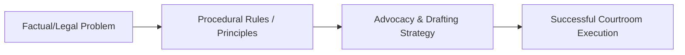

---

type: lecture
lecture: L20
tags: [lecture, litigation-skills]

---
# L20 — Special procedures

> One-paragraph overview of the litigation skills and principles taught in this chapter.
>
> [!abstract] The arc of this chapter
> **Where we left off:** We explored the previous phase of litigation or litigation foundations.
>
> This chapter covers **Special procedures**. We look at the problem of how to execute this task, the rules that govern it, and the strategies for successful advocacy.

*Figure: The problem-to-execution chain in this chapter.*

---

## Chapter Content Walkthrough

| | Skill involved | Competent/Not yet competent |
| --- | --- | --- |
| 1 | Re-examining only when necessary | |
| 2 | Using the three-step process of asking questions: - [ ] Remind the witness what he or she has said under [[Page-145\|cross-examination]] - [ ] Give the witness a moment to remember - [ ] Ask the question | |
| 3 | Asking clear questions | |
| 4 | Asking non-leading questions | |
| 5 | Avoiding argumentative matter | |
| 6 | Avoiding unnecessary repetition | |
| 7 | **Protocol:** - [ ] Practising SOLER principles (Shoulders square, Open stance, Leaning slightly forward, making Eye contact, Relaxed posture) - [ ] Maintaining eye contact with the witness - [ ] Speaking at appropriate volume and pace - [ ] Addressing the court with proper deference - [ ] Ensuring that only one counsel is standing at any time - [ ] Addressing the court from the correct location, not moving about the courtroom - [ ] Responding appropriately to objections | |

## Chapter 20

## Special procedures

CONTENTS

20.1 Introduction
20.10.1 Exceptions to the [[Page-92|hearsay]] rule
20.10.2 Exceptions to the opinion rule
20.10.3 Exceptions to the character rule
20.10.4 Exceptions to the similar-fact rule
20.2 Exhibits
20.3 Inspections in loco
20.4 Prior inconsistent statements
20.5 Refreshing memory
20.6 Hostile witnesses
20.7 [[Page-100|Expert witness]]es
20.7.1 Preparation
20.7.2 [[Page-136|Examination-in-chief]] of an expert witness
20.7.3 Cross-examination of an expert witness
20.8 Objections
20.9 Identification evidence (in criminal cases)
20.9.1 Introduction
20.9.2 Prosecuting counsel
20.9.3 Defence counsel
20.10 Common admissibility issues
20.11 Protocol and ethics

## 20.1 Introduction

Special techniques are necessary for certain incidents of the trial. Examination-in-chief and cross-examination skills

---

are incomplete unless the questioner is proficient in dealing with -

- exhibits;
- inspections in loco;
- prior inconsistent statements;
- a forgetful witness who needs to refresh his or her memory;
- hostile witnesses;
- [[Page-100|expert evidence]];
- objections;
- identification evidence (in criminal cases); and
- common admissibility issues.

## 20.2 Exhibits

The nature and importance of exhibits as evidence is discussed in chapters 4 and 12. Exhibits are relied on because they form part of the evidence (real and documentary exhibits) or help the witness to explain or the court to understand the evidence ([[Page-100|demonstrative exhibit]]s). Real and documentary exhibits have been described as "links in the chain of proof". It stands to reason that exhibits have to be admissible as evidence before they can be introduced. You would introduce an exhibit when it helps your side to prove or disprove a fact in issue. Whether the exhibit is introduced or relied upon during [[Page-136|examination-in-chief]] or [[Page-145|cross-examination]] depends on the circumstances of the case. Either way, you need to prepare for the moment during the trial when you have to refer a witness to the exhibit concerned. If it is your own witness, you will have briefed the witness on the procedure you intend to use when questioning the witness about the exhibit.

Exhibits cannot speak for themselves. In the absence of an admission by the opposing party, every exhibit has to be proved by cogent evidence given by a credible witness. Some examples may make the principles clear.

- An object like a knife, used in an assault, should be introduced or produced by a witness who can give first hand evidence to identify it as the weapon used, for example:
- "This is the knife I saw the accused use when he stabbed the deceased."
- Documentary exhibits have to be proved by the persons who executed them or received them, or who can otherwise authenticate them. Their evidence could be as follows:
- "This is a copy of the letter I wrote. I posted the original and kept this copy."
- "I received this letter from the plaintiff. I recognize his signature."
- "This is a drawing of the house we built for the plaintiff. I did not prepare it but my draughtsman did so under my supervision."
- Official documents such as birth, death and marriage certificates may be proved by mere production, although they are usually handed in through a witness in any event.

Q. Mrs X, is the document I now show you your birth certificate?

A. Yes.

- Demonstrative exhibits should be proved by the person who prepared them.
- "I prepared a plan of the scene. The document I have here is the original."
- "I made notes of my observations on the usual post mortem form, Form Health 1, as I proceeded during the examination of the body. This is the form I completed."
- "I took these photographs of the plaintiff's injured leg."

Whether an exhibit which is otherwise admissible may be used during the trial, depends also on procedural questions such as whether it has been discovered properly and whether there has been compliance with statutory requirements laid down in, for example, the Civil Proceedings Evidence Act 45 of 1965. In practice, the parties often reach agreement on the admissibility of exhibits without further proof. Where the exhibits are mainly documents, they are usually introduced by way of an agreed bundle with an associated agreement on the status of the documents in the bundle. The way an exhibit is handled during the evidence also depends on whether the exhibit has already been proved by being introduced by consent or through prior evidence (of the witness or a prior witness) or not. If the exhibit has been proved (by admission or through a prior witness), counsel is entitled to show the witness the exhibit and to ask the witness admissible questions on it. It is generally not necessary to ask for the court's permission to show the exhibit to the witness, but you must remember that you have to stay at the bar. You hand the exhibit to the usher who takes it to the witness and puts it before him or her.

---

**Table 20.1** Handling an exhibit which has already been proved

| What to do | How to do it |
| --- | --- |
| **Step 1:** Show the exhibit to the witness. | Q. *Could you please look at the letter, exhibit A14? Mr Usher, could you please take the exhibit to the witness?* A. *I have it. What do you want to know?* |
| **Step 2:** Allow the witness to become familiar with it. | Q. *Please read the letter and tell Her Ladyship whether you wrote that letter.* A. *Yes, I recognise it. I wrote it.* |
| **Step 3:** Ask the witness such questions as you have with regard to the exhibit or its contents. | Q. *In that letter you said . . .* |

Questions of the nature used in this example could be asked either in [[Page-136|examination-in-chief]] or in [[Page-145|cross-examination]]. You should identify the exhibit and give the witness an opportunity to get acquainted with it before asking further questions about it. That way the accuracy of the record is maintained and the evidence is more likely to flow naturally.

If the exhibit is disputed (or not admitted) and needs to be proved, a different procedure would have to be followed. Generally speaking, the witness should first describe the exhibit, from memory, before being shown the exhibit. The evidence should also prove the chain of custody. How did the exhibit get from the place where the events occurred to the courtroom? Who had custody of it? Is it still in the same condition? If the witness did not have possession of the exhibit throughout that period, other witnesses may have to be called to establish the chain of custody.

**Table 20.2** Proving an exhibit formally, through a witness

| What to do | How to do it |
| --- | --- |
| **Step 1:** Ask the witness to describe the item. | A. *The accused then ran away but he left the knife he had used behind. It was still in the complainant's side.* Q. *Did you do anything about the knife?* A. *Yes, I pulled it out.* Q. *Describe the knife please?* A. *It was an Okapi knife with a brown handle and a blade of about 8 centimetres. It had the accused's initials carved on the handle.* |
| **Step 2:** Ask the witness what happened to the item after the incident. (Did the police take possession of it? Did someone else keep it? Who? How did it get from there (where the incident occurred) to here (in court)?) | Q. *What happened to the knife after that?* A. *I handed it to the investigating officer when he came to the house that evening.* |
| **Step 3:** Show the exhibit to the witness. | Q. *Could you please look at the item I show you now? Mr Usher, could you please show the witness this item?* A. *(Witness looks at item placed on the witness box.)* |
| **Step 4:** Ask the witness to describe it. (The description should match the earlier description.) | Q. *Please describe the item handed to you.* A. *It is an Okapi knife just as I have described. Look, here are the accused's initials on the handle.* |
| **Step 5:** Give the exhibit the next number for exhibits. Use a letter of the alphabet for a document and a number for other things. | Q. *May the exhibit be marked as Exhibit 1, M' Lord? I intend calling the investigating officer to give evidence that this is the knife the witness handed over to him and that it is still in the same condition.* By the Court: *Proceed.* |
| **Step 6:** Ask the witness the questions you want to ask about the exhibit. | Q. *Had you ever seen the knife, Exhibit 1, before that night when the accused stabbed the complainant?* A. *Yes, many times. The accused always used it when we went fishing.* |

The first phase of the process involves a description by the witness of the item he or she saw at the scene. The second phase involves the identification of that item in court. It is crucial to get a full description from the witness

---

before the item is shown to the witness in court.
If the exhibit is a document, you should ensure that a good copy is available to your opponent as soon as the exhibit is handed to the witness so that your opponent can object immediately if necessary. The original of a document should be shown to your opponent and handed to the judge after it has been given a number. A copy should be available for the witness if further questions are to be asked on the document. Your opponent should be given a set of your documents in a bundle before the witness gives evidence. You do not want any distractions while you are conducting the [[Page-136|examination-in-chief]].

[[Page-100|Demonstrative exhibit]]s are dealt with slightly differently.

**Table 20.3** Proving a demonstrative exhibit, a medical report

| What to do | How to do it |
| --- | --- |
| **Step 1:** Refer the witness to the relevant exhibit. | Q. *Doctor, did you make any notes when you examined the complainant?* A. *Yes.* |
| **Step 2:** Allow the witness to produce the exhibit (or show it to the witness). | Q. *Where did you make the notes and where are they now?* A. *I made them on the form we know as a JBB and I have it here with me now.* |
| **Step 3:** Ensure that the exhibit is proved properly and give it the next exhibit number. | Q. *When did you make those notes?* A. *As the examination progressed.* Counsel. *M' Lord, I have given my learned friend a copy and I ask leave to hand a copy to Your Lordship. I have taken the liberty to mark it as Exhibit 'F'.* By the court: *Proceed.* |
| **Step 4:** Ask such questions as you have with regard to the exhibit. | Q. *Could you please read your notes to the court?* |

The original should be handed in as the exhibit to be kept as part of the trial record because it is the primary or best evidence. The witness may read from a true copy or may hand the original in as an exhibit at the end of his or her evidence.

Witnesses are frequently asked to point out features on an exhibit or to mark positions on them. Features should preferably be marked or identified on a copy rather than the original. If you follow this procedure, the marked copy should be numbered Exhibit 'B.1' (if it is a copy of Exhibit 'B') and any further copies could be numbered in similar fashion, 'B.2', 'B.3' etc. If the witness points at a feature on the exhibit, that demonstration has to be recorded. Thus the point of impact may be marked on a plan or photograph.

**Table 20.4** Recording a demonstration by the witness

| What to do | How to do it |
| --- | --- |
| **Step 1:** Allow the witness to give the demonstration (or make the pointing out or mark the exhibit). | Q. *Please look at the police plan, Exhibit 'A'. Mr Usher, could you please show the witness Exhibit 'A'? (Pause while the witness studies the plan.) Do you understand what the plan depicts?* A. *Yes, I recognise the scene.* |
| | Q. *Are you able to mark the point where the two cars collided with each other?* A. *Yes.* Q. *Please mark the point of impact as accurately as you can with an X.* A. *(The witness marks the plan.)* |
| What to do | How to do it |
| --- | --- |
| **Step 2:** Show opposing counsel and the court what the witness has demonstrated, pointed out or marked. | Q. *Mr Usher, could you please take the exhibit to my learned friend and show him where the witness has put the mark?* (The plan is shown to counsel.) Q. *Could you also show Her Ladyship where the witness has marked the plan?* (The plan is shown to the Judge.) |

---

| **Step 3:** Place the demonstration 'on the record' by putting it in words. | Q. *M' Lady, the witness has marked a point on the eastern side of [street], within the intersection.* By the Court: *Yes, carry on.* |
| --- | --- |

## 20.3 Inspections in loco

While the main purpose of an inspection *in loco* before the trial is to enable counsel to become fully acquainted with the facts in order to present them persuasively, an inspection *in loco* during the trial has dual purposes. The first is to acquaint the judge with the facts for a better understanding. (Inspections prior to trial are dealt with in chapter 12.) The second is to allow witnesses to give demonstrations and to point out things that form part of their own observations during the events giving rise to the trial.

The preparation for an inspection should be done well before the hearing. If your own witnesses are able to point out relevant features at the scene, they should be taken to the scene and properly briefed so that they know what to expect and how to conduct themselves during the inspection. You should ensure that a camera, tape measure and any other necessary equipment are available. Transport and accommodation may have to be arranged in advance. Special permission may likewise have to be obtained to gain access to the site. Most of all, you should anticipate what the inspection is capable of revealing to the court and prepare so that you can expose those features (or discredit them, if they are against your case).

Whether the judge is to attend an inspection, is in the discretion of the court. An inspection may be held at any time during the proceedings but will not be held so late that the parties no longer have the opportunity to adduce evidence on it or to deal with the judge's observations. The judge is entitled to rely on the observations he or she has made at an inspection. Care should therefore be taken during the inspection that the important features of the scene are pointed out to the judge, preferably by a suitable witness. While the court attends to the inspection, it functions as a court. The protocols and ethics of trials apply as if the court is sitting in a formal session, even though the inspection may be held at the lowest level of a gold mine, kilometres below the surface, or at a waterfall high up on the Drakensberg.

The parties have an opportunity at the scene to ask their witnesses to point out relevant places and features; these should be recorded one by one for inclusion in a schedule or list. Plans and photographs may also be prepared or taken during the inspection. Once the inspection has been completed, the practice is for the parties to prepare an agreed schedule of the observations made and the demonstrations given at the scene. Some judges may prefer to read their own list of observations into the record when the court reconvenes at its usual seat and to give each of the parties an opportunity to agree with them, to challenge their observations and to suggest additions to the list. This is a time for tactful intervention if the judge does not see matters exactly like you do.
Witnesses may be examined and cross-examined on the features of the scene and anything pointed out or demonstrated by them during the course of the inspection. What is pointed out at the scene is not necessarily evidence; the demonstration must be recorded and confirmed when the witness is under oath.

**Table 20.5** Confirming a demonstration given at an inspection

| What to do | How to do it |
| --- | --- |
| **Step 1:** Ask the witness a closed but non-leading question to set the stage. | Q. *You were present at the scene this morning when the court inspected it?* A. *Yes.* |
| **Step 2:** Refer the witness to the observation, demonstration or aspect pointed out. Make sure you state the facts correctly. | Q. *You were asked to indicate where you were when the two cars collided with each other?* A. *Yes.* Q. *And you pointed out a spot in front of the restaurant?* A. *Yes.* |
| **Step 3:** Ask the questions you have for the witness on that score. | Q. *Could you tell the court what you noticed while you were at that spot?* A. *...* |

## 20.4 Prior inconsistent statements

The prior statements of a witness are not generally admissible as evidence, subject to one or two exceptions. If the witness has made a prior statement that is consistent with his or her evidence, that statement may not be used as evidence unless it is suggested in [[Page-145|cross-examination]] that the version given by the witness is a recent fabrication. The statement may then be used to counter that suggestion. On the other hand, the rule that the answers given by the witness on matters of credit are final is subject to this [[Page-75|exception]]: if the witness can be shown to have made a prior inconsistent statement, that statement may be proved to attack the credibility of the witness.

The purpose of confronting a witness with a prior inconsistent statement is to undermine the credibility of the

---

witness. If such a prior inconsistent statement is admitted (or proved when the witness has denied making it), the court may (not must) find the witness to be unreliable. Whether the court believes the witness nevertheless will depend on the circumstances of the case, including any explanation the witness has given for the inconsistency. So the idea is not to ask for an explanation, if you are the cross-examiner. However, you will ask for an explanation (if you know there is a good one) in [[Page-160|re-examination]] if it is your own witness who has contradicted himself.

A prior inconsistent statement may have been made orally or in writing. In either case, the witness may be cross-examined on that statement and if the witness denies having made the statement concerned, evidence may be led in rebuttal to prove the statement. The opportunity typically arises in criminal cases but it is not limited to criminal cases, where the defence has copies of the statements of prosecution witnesses and a witness departs from his or her statement. The technique for the use of a prior inconsistent statement to discredit the witness requires a lot of concentration, a bit of guile and a degree of assertiveness. You have to know the case materials well enough to recognise that there is a discrepancy; you may even have elicited the discrepancy with intelligent [[Page-145|cross-examination]].
**Table 20.6** Using a prior inconsistent statement to discredit the witness

| What to do | How to do it |
| --- | --- |
| **Step 1:** Commit the witness to the version which departs from the statement. This closes all escape routes and pins the witness down. | Q. *So the man you saw holding up the teller wore glasses and had a beard and a ponytail?* A. *Yes.* |
| **Step 2:** Contrast that version with the version previously given by the witness. | Q. *Wasn't it a clean-shaven man with short hair?* A. *No.* |
| **Step 3:** Suggest the witness has previously given a different description. | Q. *Didn't you previously describe the man as clean-shaven with short hair?* A. *No.* |
| **Step 4:** Establish that the witness has made a prior statement and identify that statement. | Q. *You made a written statement to the police immediately after the robbery?* A. *Yes.* Q. *Please look at the document the usher shows you now. Look at the signature at the foot of the last page. Is this the statement you made to the police?* A. *Yes.* Q. *And you made this statement the same day of the incident when the facts were still fresh in your mind?* A. *Yes.* |
| **Step 5:** Confront the witness with the conflicting passage. | Q. *Please read the passage starting with 'I got a good look at the man'.* A. *It says: 'I got a good look at the man. It was a white man, about 30 years old, about 80 kilograms and 1,75 metres. He was clean-shaven with short hair and wore glasses.'* |
| **Step 6:** Resist asking a question too many. You might prefer not to ask this last question and to leave the point for argument. | Q. *In your evidence today you said the man had a beard and a ponytail. In your statement you said he was clean-shaven and had short hair. One of those statements must be untrue, mustn't it?* A. *Well . . .* |

**Note:** If the witness at any stage of this series of questions admits that he or she has given a different version previously, you should carefully consider whether there is anything to be gained by asking any more questions. The purpose of the questions is to demonstrate that the witness has given contradictory versions. Once that has been established, any further questions you put may allow the witness to give an acceptable explanation for the apparent discrepancy.

If the witness denies having made the prior statement or having said what is recorded in it, you will be allowed to lead evidence in rebuttal. You should then call the person who took the statement (or heard the words being spoken if you are relying on an oral statement) to prove that the witness had made the prior statement and that it accurately reflects what he had said.

Note that section 190(2) of the Criminal Procedure Act 51 of 1977 allows the parties to a criminal case to prove a prior inconsistent statement in respect of their own witnesses. It is not necessary to go the length of proving the witness to be hostile to the party calling him or her in such a case.

---

## 20.5 Refreshing memory

It happens frequently that witnesses forget important details when they give evidence. The registration number of the car used by the robbers for their flight, the identity number of a child who has been injured in a motor collision, what was said during a telephone conversation; these are the type of details witnesses often cannot recall with any degree of accuracy. Yet there are equally frequently reliable documents recording such details. In some cases the document has been issued or prepared by a third person, like the details recorded in an identity document. In other cases the witness created the document, for example, when the registration number of the robbers' car is written down on a cigarette box by an eye witness. Witnesses also give detail that is recorded in their statements to the police or to attorneys shortly after an event when the events are still fresh in their mind. The relevant information could equally be in a file note, in the correspondence or in a photograph; it could be in virtually anything that may help the witness remember. It does not have to be a statement or even a note made by the witness personally.

Witnesses are not allowed to read their evidence from prepared statements. Yet, it is obvious that the courts would not receive all the available evidence if witnesses were not allowed to refresh their memory. To this end, refreshing the witness's memory is allowed and there is a procedure that can be followed to elicit the details required from the witness.

There are some evidential requirements to be met before a witness will be allowed to refresh his or her memory from a document or statement:

- First, the witness once had the fact or evidence to be adduced in evidence, in his or her memory. If the witness never "knew" the fact concerned, there is no memory to refresh.
- Second, the witness cannot recall that memory. This inability could be long term, or it could be the result of the anxiety of having to give evidence. Either way, the witness first has to exhaust his or her memory before he or she will be allowed to refresh his or her memory.
- Third, there is something which may help the witness to recall the relevant information or detail required. It stands to reason that there must be something from which the witness can refresh his or her memory. The accuracy of the note or recording has to be established.
- Fourth, the note or statement or other recording must have been made reasonably contemporaneously, meaning during or shortly after the relevant observation or incident and when the witness still had an independent and accurate recollection of the fact concerned.
Table 20.7 Refreshing memory

| What to do | How to do it |
| --- | --- |
| **Step 1:** Exhaust the witness's memory of the fact required first. | A. *When the robbers drove off, I saw the registration number of their car and wrote it on the palm of my hand.* Q. *What was the number you saw and wrote down?* A. *I can't remember any more.* |
| **Step 2:** Establish that there exists a record of the fact he or she cannot recall. | Q. *Is there anything that might help you remember the number?* A. *Yes. I made a statement at the police station and the number was written down in the statement.* |
| **Step 3:** Establish that the note or statement was made when the events were still fresh in the mind of the witness. | Q. *When did you make that statement?* A. *The same morning.* Q. *Where was the note you had written on your hand when you made that statement?* A. *It was still visible on the palm of my hand.* Q. *What did you do with the information written on the palm of your hand when you made the statement?* A. *I copied it to the statement.* |
| **Step 4:** Ask the witness whether he would like to refresh his or her memory. | Q. *Would you like to refresh your memory from the statement?* A. *Yes, please.* |
| **Step 5:** Ask the judge for permission to use the statement before the statement is shown to the witness. Your opponent has to be given an opportunity to object. | Q. *M' Lord, may the statement be shown to the witness?* By the Court: *Does counsel for the defence have any objection?* Defence counsel: *No, I don't M' Lord.* By the Court: *Carry on.* |
| | Q. *Mr S, could you please look at this* |

---

| **Step 6:** Let the witness identify the note or statement. | *document. Is this the statement you were referring to?* A. Yes. |
| --- | --- |
| **Step 7:** Give the witness a chance to find the relevant part. Then ask the witness about the relevant fact. | Q. *Please find the passage where the car's registration number is reflected and tell us what the number was.* A. *The number was ...* |

If a witness has refreshed his or her memory from a privileged document or statement, the whole of that document becomes available to the other side for [[Page-145|cross-examination]]; in other words, the privilege is lost. The document itself does not become evidence. If the document is handed in as an exhibit, it becomes evidence not of the truth of its contents but for the purpose of confirming or undermining the credibility of the witness. It appears that a witness may refer only to part of a document and, if necessary, cover up the rest of it, in which event the privilege attaching to the rest of the document may be protected. (This question has not been finally resolved.)

These principles do not apply to documents used for refreshing the witness's memory before the witness starts giving evidence. The witness may refresh his or her memory from any document before entering the witness box, whether the witness prepared or executed the document or not, and such documents retain the privilege that might attach to them. Therefore, if you don't want the opposition to have access to a privileged document, you should perhaps ensure that your witness's memory is refreshed before he or she enters the witness box.
Police officers (and similarly placed witnesses) are usually allowed to refresh their memory from their notebooks or diaries without having to exhaust their memory first. There are two reasons for this. The *first* is that they have so many cases that it would be unreasonable to expect them to give their evidence from memory alone. The *second* is that they are required to keep notes for the purpose of ensuring that their evidence is accurate. Usually there is no objection to them referring to their notes, nor should there be. District surgeons fall in the same category of witnesses. They perform hundreds of injury examinations (recorded on form J88), post mortem examinations (recorded on form Health 1) and sobriety examinations (recorded on a similar form). It would be unfair to expect them to give their evidence from memory. Such documents also fall under the provisions of Part VI of the Civil Proceedings Evidence Act 25 of 1965 and section 222 of the Criminal Procedure Act 51 of 1977. These provisions allow for the use of contemporaneous records at the trial. It is recognised that contemporaneous records that are created when the witness had no motive to be untruthful are more likely to be accurate than the witness's memory. When you intend to call such witness, you should prepare copies of the contemporaneous note or form for the court and for the other side.

The court has a discretion whether to allow or disallow the application to refresh memory; it will generally only allow refreshing memory if the fact concerned is relevant to the issues in the case rather than the credibility of the witness.

## 20.6 Hostile witnesses

A party is not permitted to cross-examine their own witness unless the witness is declared hostile. A hostile witness is one who is unwilling to tell the truth for the benefit of the party who has called him or her. There must be more to it than the mere fact that the evidence given by the witness does not suit or please the party calling the witness. Even a prior inconsistent statement made by the witness may not be enough to persuade the court that the witness is hostile, although in practice that is often the decisive factor. Whether a witness is hostile to the party calling him or her, depends on factors such as the demeanour of the witness, the relationship between the witness and the parties or other witnesses in the case, the general circumstances of the case and any prior inconsistent statements made by the witness. The demeanour of witnesses may be the decisive factor; the demeanour of the witness in the witness box often mirrors what is in their hearts. It is often said that the witness must display a hostile *animus* towards the side calling him or her.

If there are good grounds for the suspicion that your witness is hostile to your side, an application may be made to the court to declare the witness hostile. The court has to be persuaded by the party making the application, so you had better get your evidence and argument ready before you rise to make the application. You may consider making the application in the absence of the witness if you think the witness might gain an advantage over you (as cross-examiner) if he or she has heard your argument. The effect of the order is that you may then cross-examine the witness. To this end, all the techniques and principles discussed in chapter 18 are applicable. From a tactical point of view, an application to declare the witness hostile should only be made if there are reasonable prospects of gaining some advantage by cross-examining the witness. When the witness demonstrates his or her hostility, it will probably be too late to do anything to prevent the harm the witness has done, or is going to do. You are thus left having to discredit the witness completely. The nature of the cross-examination of a hostile witness is therefore often confrontational and without any pretence at being subtle. The aim is to undermine *(see page 363)* the credibility of the witness and the process is destructive. It can be emotionally draining too. You should not expect to achieve much more than showing that the witness is untruthful or biased.

Care should be taken in the preparation stage that potentially hostile witnesses are identified in advance. Avoid calling them if you can. If a witness won't even speak to you before the trial when you tell them the purpose of the interview and whom you represent, it may be that the witness feels some hostility towards your client. Such a witness can seldom help your case and has the potential to do it a lot of harm. However, there may be a case where you have to call the witness to prove something no other witness can prove for you. Then you should be

---

prepared to extract what you want with subtlety and to control the potential damage the witness can do as far as you can.

## 20.7 Expert witnesses

Examining and cross-examining expert witnesses require very specific advance preparation. The selection of an appropriate expert and how to brief an expert is discussed in chapter 12. The requirements of a notice and a summary under Rule 36(9) are discussed in chapter 11. Once those steps have been taken, counsel has to prepare for the [[Page-136|examination-in-chief]] of his or her own expert witness and the [[Page-145|cross-examination]] of any expert witnesses to be called by the other side.

### 20.7.1 Preparation

The steps taken by the parties are dictated by the fact that each will (or should) have its own expert witness or witnesses to examine-in-chief and opposition expert witnesses to cross-examine. Both processes require a full understanding by counsel of the facts and the technical complexities of the [[Page-100|expert evidence]] to be adduced. This applies to both civil and criminal cases. In civil cases the rules lay down certain procedural requirements for expert evidence. Generally speaking, you will do the following in a High Court case:

- Ensure that you understand your side's expert's report. Ensure that you similarly understand the Rule 36(9)(b) summary of the other side's expert. If you can't understand what the expert witnesses have to explain to the court, you will be unable to lead their evidence or to cross-examine effectively.
- Ensure that you can put the expert's opinion and reasons in lay terms. If you cannot do this, you are unlikely to be effective in persuading the court that your side's evidence and opinions should be accepted in preference to the other side's opinions.
- Read into the subject. Ask your own expert to provide you with helpful reading material to help you to gain a broad understanding of the subject-matter of the expert evidence. In most cases this would not be too taxing. It could be a simple driving case where you may have to read a little on the effects of alcohol on humans, absorption and excretion rates, and the tests doctors do to determine whether a person is under the influence of alcohol or not. It could, however, be far more difficult (and intriguing) than that.
- Ensure that the underlying facts are capable of being proved. An opinion is only as good as the facts supporting it.
- Ensure that you understand the reasons for every opinion and that you are able to convey the gist of the opinion and its supporting reasons to the court. Use charts, graphs, maps and photographs to make this easier or more convincing.
- Ask your expert to help you prepare your cross-examination of the opposing experts. Ask your expert for a list of questions, if you think that will help.
- Help your expert to prepare a written report which may be used as the basis of the evidence to be given by him or her. Obtain the agreement of the other side to use this report. Such a report may serve as the summary in terms of Rule 36(9)(b).
- Prepare a written curriculum vitae for your expert. This should include his or her academic qualifications, practical experience and publications. This may shorten the examination-in-chief considerably.

These processes may be adopted so far as they may be appropriate to criminal trials.

### 20.7.2 Examination-in-chief of an expert witness

The evidence-in-chief of an expert witness usually goes through three phases. The first is the introduction of the witness and the establishment of his or her expertise. The second phase covers the facts, including any facts the expert can depose to from personal knowledge. The facts upon which the expert is to base his or her opinions have to be spelled out in some detail in order to establish a proper evidential and logical basis for the opinions. In the third phase the expert's opinions and the reasons for those opinions are laid before the court. The structure for the examination-in-chief is as follows:

- Introduce the witness by name, occupation and residence.
- Establish the academic and other qualifications of the witness, including membership of professional bodies.
- Establish the practical experience of the witness in the field or science concerned.
- Establish the reputation of the witness in the relevant field or science by reference to any publications emanating from his or her pen.
- Ask the witness about his or her expertise in respect of the precise subject under scrutiny by the court.
- Allow the witness to state all the relevant facts upon which his or her opinions are to be based. If necessary, state the facts as hypotheses or assumed facts, to be proved by other witnesses.

---

- Ask the expert for his or her opinions and ensure that the reasons for each opinion are given fully.
- Put any contrary views to the expert for his or her comment. Ensure that the expert gives the reasons for any further opinions expressed during this phase.
- If appropriate, ask the expert what his or her opinion would be if the facts were different. In this situation you should be careful not to undermine your own expert or any of your other witnesses.

### 20.7.3 Cross-examination of an expert witness

Cross-examination of an expert witness requires even more detailed preparation than [[Page-136|examination-in-chief]]. The basic principles of cross-examination (see chapter 18) should be applied very strictly when you have to cross-examine an expert. The dangers of a question too many, of arguing with the witness and of failing to control the witness, are all magnified as you will probably be dealing with a witness who is your intellectual superior. The cross-examination of an expert witness should therefore be undertaken with tact, courtesy, detailed preparation, strict control and equal measures of patience and guile.
An attack upon the expert's evidence can be directed towards four main areas. The *first* is the status of the witness as an expert. Is he really an expert in the particular field or science? Nowadays there are fields of expertise within fields of expertise. Is she as well qualified as your side's expert? Does he know your expert? Perhaps he was a student of your own expert? The *second* is to attack the facts and assumptions upon which the expert has based the opinions you want to discredit. Did the opinion take into account all of the known facts? If not, do the facts not taken into account make a difference? The *third* is to attack the opinions and reasons given by the expert. This will require a complete mastery of the subject and a good deal of help from your own expert. The *fourth* is to attack the witness personally on the grounds of bias, interest or even dishonesty. Such cases are rare because parties usually do not call expert witnesses who will be open to attack on these grounds. And they should not either!

**Table 20.8** Cross-examination of an expert to demonstrate bias or interest

**The facts:** The following cross-examination occurred in a Magistrates' Court when an expert witness gave evidence in support of the accuracy of a speed-trapping device in a criminal case. The accused had relied on the speedometer of his aging pick-up truck.

**The aim of the cross-examination:** To demonstrate bias on the part of the expert witness.

Q. *This device was sold to the traffic department by the ABC company, wasn't it?*
A. *Yes.*
Q. *You own shares in ABC and you are a director of ABC?*
A. *I don't see what that has to do with this case.*
By the Court. *Please answer the question.*
A. *Yes, I do and I am a director.*
Q. *The agreement between ABC and the municipality contains a clause in terms of which ABC guarantees the accuracy of the device, doesn't it?*
A. *Yes.*
Q. *And ABC undertook to provide [[Page-100|expert evidence]] of the accuracy of the device if its accuracy were to be questioned in any prosecution for speeding?*
A. *Yes.*
Q. *And you have given evidence in many cases, across the length and breadth of the country, that the ABC device is absolutely reliable and accurate?*
A. *Yes.*
Q. *And you have also given evidence in many other cases where other speed-trapping devices had been used, have you not?*
A. *Yes.*
Q. *And in those cases you have consistently given evidence for the defence to the effect that the speed-trapping devices of your company's competitors were unreliable and inaccurate?*
A. *That has nothing to do with this case.*
Q. *Please answer the question. My learned friend will object and His Worship will stop me if I ask you inappropriate questions.*
A. *Okay, but they **are** unreliable.*
Q. *And in those cases other experts gave evidence supporting the accuracy and reliability of those other devices, didn't they?*
A. *Yes.*
Q. *And the same experts have attacked the ABC device, in and out of court, as being unreliable and inaccurate, haven't they?*
A. *Yes, but they are wrong.*
Q. *It seems that each manufacturer supports its own device through evidence like your own and denigrates the devices of every competitor, doesn't it?*

---

A. It might seem like that, but that is not the whole picture.
Q. If this court were to hold that your company's device is not accurate and reliable, your company will in all likelihood lose its custom as no traffic department can afford to use a device which has been discredited. What comment do you have on my suggestion?
A. The device is accurate. The rest is speculation.

## 20.8 Objections

Objections are usually aimed at -

- the form of the question;
- the evidence it seeks to introduce;
- inadmissible evidence; or
- evidence which is introduced without a proper foundation having been established.

The first requires sound knowledge of the rules of trial; who may ask what sort of questions and why. The other three require a good working knowledge of the rules of evidence.

Objections are made in a few crisp steps. They are not the focus of the trial. You proceed as follows:

- Rise to your feet. You cannot make an objection while seated or from a slouched position. Your opponent has to sit down when you rise to object.
- Say that you have an objection. Your first words should to the effect that: "M' Lady, I object . . ." Shouting, "Objection!" from a seated position may be acceptable in America but it is not acceptable in South Africa.
- Explain your objection by stating what it is you are objecting to and giving the reason for the objection briefly, for example:
  - "... on the grounds that the question is leading";
  - "... on the ground that the question seeks to elicit [[Page-92|hearsay]] evidence";
  - "... on the ground that this is opinion evidence without a foundation for such evidence having been laid".
- Avoid long explanations and argument. If the objection is good, the judge will see that very quickly. If a long explanation is required, the objection may not be so good.
- Sit down and give your opponent a chance to answer. Listen carefully to the justification put forward. You have the right to reply. If you intend to reply, rise to your feet again as soon as your opponent sits down, otherwise the judge may give a ruling before you can respond.
- Wait for the ruling.
- Acknowledge the ruling. Rise and say, "As the Court pleases."
- Act on the ruling. If the ruling goes against you, allow your opponent to carry on. Don't raise the same objection again unless there are additional grounds for a fresh objection. If an objection against your own question is upheld, implement the ruling by changing course. If your question is disallowed because it was in an offensive form, change the form of the question. If the objection was against evidence you tried to introduce, don't try to lead that evidence again.

Objections have to be made in a calm, courteous and reasoned manner. Don't attack your opponent and don't address him or her directly. Be prompt and brief. While you *(see page 367)* have the right to object to questions put by the judge, the situation calls for tact. If your objections are overruled, one after the other, you may create the impression that you are bickering or that you have such a bad case that you have no choice but to raise petty objections. Judges know when to ignore slight infringements of the rules of the game. You should object only if it is necessary to advance your case or to protect it. Often an entire trial is conducted without any objections at all, simply because both counsel know what is important and what is not; they don't infringe in respect of matters which are important to the other side. By the same token, they don't object when, for example, leading questions which help to speed things up are asked on matters not in issue. While it is technically possible to object during an opening address or [[Page-174|closing argument]], objections to what has been said or done during the opening or argument can usually be dealt with when your opponent sits down and you get a turn to speak or argue.

You should not use an objection as a tool to upset your opponent or a witness. Spurious objections to achieve those ends are not only irritating; they may also alienate the judge. It is also unethical to raise points without any merit knowingly.
Table 20.9 Objections to questions and evidence, and phrasing the objection

| To the form of the question | To the subject-matter of the question | To inadmissible evidence | To evidence lacking foundation |
| --- | --- | --- | --- |

---

| The question is leading. | The question misstates the prior evidence. | This evidence is not the best evidence. | No foundation has been laid for this opinion. |
| --- | --- | --- | --- |
| The question is argumentative. | The question assumes a fact not yet in evidence. | This evidence is [[Page-92\|hearsay]]. | This exhibit is not admissible as evidence because the chain of custody has not been established. |
| The question is confusing. | The question is hypothetical. | This evidence is not relevant to the issues (or credit). | It is not permissible for my learned friend to pursue this line of questioning because this version has not been put to my witnesses. |
| The question is unintelligible. | My learned friend is cross-examining his own witness. | The prejudice the introduction of this evidence is likely to cause outweighs its probative value. | This evidence is not admissible because the records are computer records which have not been proved as required by the Electronic Communications and Transactions Act 25 of 2002. |
| The question contains more than one proposition. This is a compound question. | The question calls for speculation on the part of the witness. | This evidence is inadmissible character evidence. | These documents are not admissible because the defendant has not discovered them in terms of Rule 35. |
| There is no question here, only a statement. | The question calls for a conclusion the witness is not qualified to draw. | The witness is not an expert and an expert opinion is called for. | This evidence is in the nature of [[Page-100\|expert evidence]]. I object because the plaintiff has not served a notice and summary as required by Rule 36(9). |

Some evidential issues relate to the weight of the evidence rather than its admissibility; in such a case there is no cause for an objection. On the contrary, objecting to such evidence may flatter its importance. It is perhaps wise to regard objections as interruptions of the proceedings to be avoided, if at all possible. Use your right to object sparingly; object only when you are certain that you are right and that there is something to gain.

Responding to an objection requires a similar approach. If a question can legitimately be put in another way, do so, even if you think the question was a proper one. An argument over a single question is hardly worth the effort and can be very distracting. It is usually better to direct the attention to the evidence, even if it means asking the question in another way. Avoid questions that are likely to provoke an objection, if you can. But do not give up your right to put relevant evidence before the court simply because your opponent objects, or may object. Defend your position firmly but politely. Some objections can be dealt with by referring the court to an [[Page-75|exception]] to the general rule or principle. In other cases you may have to lay the foundation for the evidence objected to.

## 20.9 Identification evidence (in criminal cases)

### 20.9.1 Introduction

The identity and thus the identification of the accused as the offender is often the only defence to a criminal charge. It is an 'all-or-nothing' defence in the sense that the accused can hardly raise any other defence in conjunction with it. The identification of the accused as the offender is also fraught with difficulties, ranging from human frailty to outright dishonesty. Observation skills, memory and the ability to recount what has been observed differ greatly between persons and a witness could easily be 'honestly' mistaken.

One of the problems with the leading of identification evidence is that the accused is there in the dock for all the world to see and the witness might easily be tempted to say it was him (or her) that the witness saw at the scene. The defence and the prosecution would both do well to study the commentary on section 37 of the Criminal Procedure Act 51 of 1977 in Kruger *Hiemstra's Criminal Procedure* at 3-7 to 3-12. Consider the following dictum from *S v Mthetwa* 1972 (3) SA 766 (A):

Because of the fallibility of human observation, evidence of identification is approached by the Courts with some caution. It is not enough for the identifying witness to be honest: the reliability of his observation must also be tested. This depends on various factors, such as lighting, visibility, and eyesight; the proximity of the witness; his opportunity for observation, both as to time and situation; the extent of his prior knowledge of the accused; the mobility of the scene; corroboration; suggestibility; and, of course, the evidence by or on behalf of the accused. The list is not exhaustive.

The prosecution will find in the factors mentioned in *Mthetwa's* case the circumstances to prove in order to aid in the identification of the accused as the offender while the defence will look to those same circumstances for an opening to undermine the reliability of the identification. Special techniques have to be used by both sides when dealing

---

with identification evidence.

### 20.9.2 Prosecuting counsel

Seen from a prosecutor's perspective, the identity of the accused as the offender may be proved by one or more of the following:

- Admissions or confessions made by the accused.
- Primary observation by an "eye witness" at the scene (This includes voice identification.)
- Subsequent identification by the eye witness (at a properly conducted parade).
- Dock identification.
- [[Page-100|Circumstantial evidence]].

Admissions and circumstantial evidence will be led in the usual way, but a special procedure is necessary to lead the evidence of the primary identification, subsequent identification and the dock identification. The prosecutor can hardly expect to get away with: "So is the accused the man you saw stabbing the deceased?" That would be a grossly leading question. It would also undermine the worth of the prosecution witness.

In order to lead the evidence of the eye witness to maximum effect, his or her evidence has to be broken down into three separate stages with each stage receiving due attention. It can be done by asking non-leading questions as follows:

Stage 1: Scene or primary identification:

Q. What was/were the visibility/the lighting conditions at the scene at that time?
A. It was clear daylight.
Q. Which way was the man [don't call him the accused yet] facing in relation to you when you saw him stabbing the deceased.
A. He was facing me.
Q. How far apart were you?
A. From here to you, about four paces I would say.
Q. Please describe the man.
A. It was a white man, about 1.75 metres tall. He had a tidy, trimmed sort of beard and he had blondish hair. He was about 20 to 25 years old.
Q. What else did you notice about the man?
A. His nose was skew. I thought it had been broken.
Q. For how long did you have sight of him, face to face?
A. I would say half a minute. Then he turned and ran away.

Stage 2: Subsequent identification:

Q. Did you ever see him again?
A. Yes.
Q. Did you attend an identity parade at the police station on [date]?
A. Yes.
Q. Were you able to identify anyone in the line-up?
A. Yes.
Q. Who was it?
A. The man I had seen stabbing the deceased.
Q. Did you point anyone out at the parade?
A. Yes, the same man.

Stage 3: Dock identification:

Q. Would you be able to recognise that man again?
A. Yes.
Q. Do you see him here today?
A. Yes.
Q. Can you point him out?
A. It is that man sitting over there, in that box.

---

Q. Describe him please.
A. White guy, blondish hair, about 25 years old. But he has shaved his beard.
Q. Describe what he is wearing.
A. Blue jacket, white shirt, red tie.

At this stage you place on record what has happened by saying: Your Worship, may it be recorded that the witness has identified the accused in the dock? (It is only from this point on that you may refer to the accused as "the accused") while leading the evidence of this witness.)

### 20.9.3 Defence counsel

The defence will approach the identification evidence with two things in mind. The first is to ensure that the prosecutor does not stray from the three-stage procedure explained above. The second is to cast doubt on the identification evidence and witness by cross-examining to the themes identified for each witness during the preparation for trial. Those themes will have to come from one or more of the following:

Themes that test the reliability of the identification evidence

- Observation
- Memory
- Ability to recount.

Themes that attack credibility of the witness

- Bias, interest, prejudice, corruption
- Prior convictions
- Prior bad acts
- Prior inconsistent statements
- Bad reputation.

Of these themes the first, observation, is the one most likely to produce results. People are very easily mistaken with regard to the identification of another person, as everyone who has ever waived at a stranger thinking that it was someone they knew will know. (I once asked a class of 16 students with LLB degrees whether there was anyone who had not made such an error and not one hand went up.) To pay due regard to the possibility of an honest mistake, the so-called Turnbull-checklist has evolved. It derives its name from Q v Turnbull [1977] QB 224 where the following was said:

Whenever the case against the accused depends wholly or substantially on the correctness of one or more identifications of the accused which the defendant alleges to be mistaken, the Judge should warn the jury of the special need for caution before convicting the accused in reliance of the correctness of the identification or identifications. (at 228-229)

How long did the witness have the accused under observation?

At what distance?

In what light?

Was the observation impeded in any way, as for example by passing traffic or the press of people?

Had the witness ever seen the accused before?

How often?

If only occasionally, had he any special reason for remembering the accused?
How long elapsed between the original observation and the subsequent identification to the police?

Was there any material discrepancy between the description given to the police by the witness when first seen by him and his actual appearance?

[A]ll these matters go to the quality of the identification evidence. If the quality is good and remains good at the close of the accused's case, the danger of mistaken identification is lessened; but the poorer the quality, the greater the danger. (at 552)

For defence counsel each of the items on the Turnbull-checklist is a potential theme for [[Page-145|cross-examination]].

## 20.10 Common Admissibility Issues: Introduction

Evidential questions arise regularly during the [[Page-136|examination-in-chief]] and cross-examination of witnesses. The evidential questions that may arise can be anticipated during the preparation for trial so that you are ready to deal with them. However, not every point and not every answer given by a witness can be accurately predicted. For

---

those eventualities you need to know the law of evidence reasonably well. In the absence of such knowledge, a rudimentary table serving as an emergency aid may have to be relied upon. Whether you think you know the law of evidence or not, you should not go into a trial without a good textbook on the law of evidence in your briefcase.

The basic or primary rules of evidence consist of one fundamental rule and five exclusionary rules, each with a number of exceptions. Then there are a number of subsidiary rules.

The fundamental rule is that evidence has to be relevant to an issue in the case to be admissible. Relevance, in this context, means no more than that the evidence proves, or tends to prove, the existence or absence of a fact in issue. Relevance is a question of logic, not law. Once evidence is admissible on this basis, it has to be admitted unless it is excluded by one of the exclusionary rules.

The five exclusionary rules are the rules against -

- [[Page-92|hearsay]] evidence;
- opinion evidence;
- character evidence;
- similar-fact evidence; and
- highly prejudicial evidence of little probative value.

Evidence may also be excluded because it has been obtained improperly, but that subject is too wide to be covered in this book.

Each of the exclusionary rules is subject to a number of exceptions. Evidence amounting to opinion, character or similar-fact evidence has to be excluded unless it falls within one of the exceptions. Hearsay evidence may be excluded, depending on whether the provisions of the Law of Evidence Amendment Act 45 of 1988 have been complied with. Previously hearsay evidence had to be excluded unless it fell within an [[Page-75|exception]]. In the case of highly prejudicial evidence of little probative value, the court has a discretion to allow or disallow such evidence, the decision in each case depending on the facts.

### 20.10.1 Exceptions to the hearsay rule

You have hearsay evidence when witness A tells the court what another person, B, who is not a witness or party in the proceedings, has observed or experienced. Thus A tells *(see page 373)* the court what B has told him he, B, has seen, heard, smelled, tasted or felt. Hearsay evidence is inadmissible only if it is tendered to prove the truth of what B has said to A. In short, in hearsay evidence the cogency of the evidence depends on the credibility of a person other than the witness. There is a lot to be said for the view that hearsay evidence is no longer excluded but is admissible subject to the provisions of section 34 of the Law of Evidence Amendment Act 45 of 1988. This Act has to be studied very carefully as it dramatically changed the traditional basis upon which hearsay evidence is treated.

There are many traditional exceptions to the hearsay rule. The most important ones are:

- In criminal cases admissions and confessions made by the accused are admitted (provided they are not excluded for other reasons).
- Generally, admissions which are against the interests of the speaker are admitted.
- Dying declarations are admitted.
- Statements which are inextricably part of the events, the so-called res gestae, are admitted. (Res gestae is not truly hearsay evidence.)
- Similarly spontaneous, contemporaneous exclamations are admitted.
- Statements which are adduced to prove the state of mind of a person are admitted. So are statements that are necessary to explain the sequence of events. In such cases the statements are not adduced for the purpose of proving the truth of what was said.
- Statements which fall within the exceptions allowed by the Civil Proceedings Evidence Act 25 of 1965 are admitted, subject to compliance with the provisions of that Act.
- Similarly, statements which fall within the exceptions allowed by the Criminal Procedure Act 51 of 1977 are admitted.
- The Law of Evidence Amendment Act 45 of 1988 allows the court, in its discretion, to admit hearsay evidence under various circumstances and on compliance with certain basic safeguards.

### 20.10.2 Exceptions to the opinion rule

The distinction between opinion evidence and evidence of an observation is somewhat blurred, but one could say that an opinion is a conclusion drawn from known or proven facts. The existence of another fact is deduced from the known or proven facts by a process involving logic, experience and special knowledge or skills. Thus a fingerprint expert can state, as a matter of opinion, that no two persons have the same fingerprints, not even identical twins. These experts can say this by virtue of their special training and experience; if the converse were true, why haven't

---

they found two persons with identical prints yet after a century of applied fingerprint science?

The traditional reason for not admitting opinion evidence is that it is for the witnesses to give the facts and for the judge to form opinions based on those facts. However, it is now accepted that there may be good reasons for admitting opinion evidence in particular cases. The test is that the evidence must be helpful to the court. Opinion evidence passes that threshold when it is -

- the opinion of a suitably qualified expert;
- the opinion of a lay person on a matter well within ordinary human experience, usually relating to the identity, emotional or physical state or character of a person; and
- evidence of reputation.

## 20.10.3 Exceptions to the Character Rule: Introduction

Character evidence is evidence about the nature and qualities of a person, as opposed to evidence of that person's actual conduct during the events under consideration. Character evidence is usually introduced to show a propensity to behave in a particular way, whether it is to commit crimes or simply to tell lies. Thus the boy who cried "Wolf!" was not believed because he had lied previously even though there really was a wolf on that occasion. As this fable demonstrates, it is illogical and even dangerous to try and determine the facts by giving undue weight to the character of the witnesses or participants. So character evidence is generally excluded except that -

- in a criminal case, the accused is allowed to lead evidence of his or her good character, in which event the prosecution is given an opportunity to rebut that evidence and to cross-examine the witnesses who give it by suggesting that the accused is of bad character;
- in a criminal case, where the accused may attack the character of prosecution witnesses, in which event his or her own character becomes relevant and may be attacked;
- generally, the character of witnesses may be relevant to establish or diminish their credibility and therefore such evidence may be admitted for that purpose;
- in defamation cases the character of the plaintiff may be relevant to the quantum of damages to be awarded; and
- in seduction cases the character of the plaintiff may be relevant to the question whether she was a virgin at the time and evidence on that score may be admitted to disprove the evidence (or to displace the presumption) of virginity. (It is doubtful whether seduction cases will survive the gender equality principles of the Constitution and you may never have a seduction case.)

## 20.10.4 Exceptions to the Similar-Fact Rule: Introduction

Similar-fact evidence is evidence of other events or acts which tend to prove that the event or act under scrutiny occurred in a similar way, or, put another way, it is evidence which shows a propensity to behave in a certain way. It is mostly used to rule out innocent explanations for suspicious events. This can perhaps be explained best with reference to Smith's case. Smith's wife (by a bigamous marriage - he was still married to another woman) drowned in her bath. Smith, when charged with her murder, contended that she had suffered an epileptic fit and then drowned. However, a number of Smith's previous wives had also died in their baths under similar circumstances shortly after marrying Smith. Each wife had property that fell to Smith upon her death. None had any prior history of epilepsy. Don't these circumstances suggest that the last Mrs Smith's death was not an accident? The similarities between the three cases were so striking that one had to conclude that there was something sinister in all of them.

However, similar-fact evidence focuses the attention on the prior events rather than the current case, much the same as happened with the little boy who cried wolf. The dangers of relying on such evidence are obvious. For that reason the similar-fact evidence must have high probative value before it will be admitted. If the prejudice the introduction of similar-fact evidence may cause would be too great, having regard to its value, it may be disallowed even if it were otherwise relevant. The circumstances of the prior cases are usually said to be of "close or striking similarity" to the current one, or *(see page 375)* that "striking peculiarities" are present in all the cases, or that "uniquely similar" methods, systems or courses of conduct were present.

Where similar-fact evidence is admitted, it usually tends to -

- prove a strikingly similar design, system or modus operandi;
- rebut a defence; and
- establish the state of mind with which something was done.

A sound working knowledge of these basic rules of evidence allows you to respond quickly and appropriately when you have to make an objection or have to respond to one. Here are some examples of responses to objections:
Table 20.10 Examples of responses to objections

| Facts | Objection | Response | Comment |
| --- | --- | --- | --- |

---

| A policeman gives evidence that he stopped the car in which the accused was travelling after receiving information that the bank robbers were fleeing in a particular car. | [[Page-92\|Hearsay]]. | *"M' Lord, the evidence is not adduced to prove the truth of the statement, but to establish the sequence of events and also the state of mind of the witness."* | Evidence tendered to prove something other than the truth of the statement is allowed where it is relevant to the state of mind of the person receiving the statement or to the sequence of events. |
| --- | --- | --- | --- |
| A witness gives evidence that the bank teller said, "Please don't shoot me", to the person in the front of the queue. The witness did not see any firearm. | Hearsay. | *"M' Lady, the statement was a spontaneous exclamation forming part of the res gestae."* | Spontaneous exclamations forming part of the events don't fall under the hearsay rule. The spoken word forms part of our every day conduct and cannot logically be excluded from our description of relevant events. |
| | Relevance. | *"M' Lord, in my submission the evidence is relevant because . . ."* | If an objection is made on the basis that the evidence is not relevant (to the issues or to credit) you should be ready to explain why the evidence is relevant. |
| The witness refers to a copy of a document. | Not the best evidence. | *"M' Lady, the original has been lost. I will establish a proper foundation for the evidence."* | A copy of the document may be used if the original has been lost (or destroyed) and cannot be found after a diligent search. The provisions of the Civil Proceedings Evidence Act 25 of 1965 may also apply. |
| The prosecutor attacks the character of the accused. | Character evidence. | *"M' Lord, the defence opened the accused's character to scrutiny when it suggested, in cross-examining the prosecution witnesses, that the accused was of good character."* | Evidence of the accused's bad character may be led if the accused suggests that he is of good character or attacks the character of prosecution witnesses. |
| Facts | Objection | Response | Comment |
| --- | --- | --- | --- |
| The witness gives evidence that the driver of the insured bus had been intoxicated in a case where the issue is negligence. | Opinion, the witness not being an expert. | *"M' Lady, this is a conclusion which lay persons are capable of drawing. The factual basis and reasons for the opinion will be given."* | Many of our observations are really opinions we have formed on the basis of particular facts and some experience. The court may or may not allow this type of opinion evidence, depending on the circumstances. |
| The witness refers to something you want to hand in as an exhibit. | The chain of custody has not been established. | *"M' Lord, I intend to call X as my next witness. He will say that he received the item from the witness at the scene, has kept it ever since, brought it to court today, and that it is still in its original condition."* | If an exhibit is to be used as real evidence, it has to be shown that it is in the same condition it had been at the material time. |
| Counsel re-examines on something that was not raised in [[Page-160\|re-examination]]. | The evidence does not arise from a matter raised in [[Page-145\|cross-examination]]. | *"I beg M' Lady's pardon. I should have led this evidence in-chief. I ask for leave to adduce this evidence and concede that my learned friend would be entitled to cross-examine afresh."* | If you have made an error, concede it and try to retrieve the situation. |

> [!warning] 20.11 Protocol and ethics

The protocol and ethics for the special techniques and skills discussed in this chapter are essentially the same as for [[Page-136|examination-in-chief]] and cross-examination. The following points may be emphasised:

- [[Page-100|Expert witness]]es have a duty to the court and are not to be partisan. It is counsel's duty to ensure that their expert witnesses are aware of their duty to the court.
- Objections should be used sparingly. Objections should not be made merely to annoy an opponent or

---

---

## Concepts in this lecture

None

## Navigation

Prev: [[L19 - Re-examination|← Previous Chapter]] · Next: [[L21 - Closing argument|Next Chapter →]]
