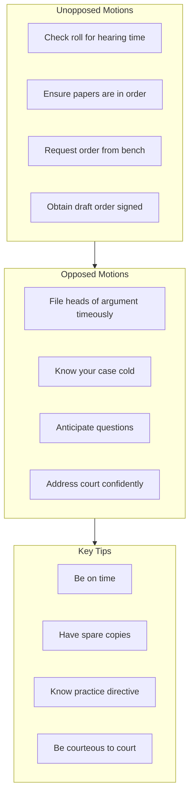

# L22 — Motion Court

> [!abstract] Chapter Overview
> This chapter covers **Motion Court practice** — where applications are heard. Key topics: unopposed motions, opposed motions, procedural requirements, and advocacy techniques.

> [!important] Motion Court vs Trial Court
> Motion Court decides applications on **paper** (affidavits). Trial Court decides on **oral evidence**. Different skills required.

## Visual Overview

*Figure: Motion Court procedure and tips.*

> [!tip] Unopposed Motion Checklist
> - Notice of motion in order
> - Founding affidavit in order
> - Supporting affidavits attached
> - Certificate of urgency (if urgent)
> - Draft order ready
> - Cost endorsement prepared

> [!tip] Connection
> Motion Court hears applications drafted per [[L10 - Drafting applications|L10]]. Advocacy builds on [[L23 - Persuasive advocacy: Substance and style|persuasive skills]] and [[L21 - Closing argument|argument technique]].ful advocacy.

*Figure: The problem-to-execution chain in this chapter.*

---

## Chapter Content Walkthrough

If the checklist were to be used as a marking guide, the best way to go about the matter would be to allocate a grade to each student or pupil whose performance is being assessed as follows:

C = Competent (meaning that the performer has attained the desired standard of competency in respect of the skill involved).

NYC = Not yet competent (meaning that the performer has not yet reached the desired standard).
**Table 21.5** Checklist for [[Page-174|closing argument]]

| | Skill involved | Competent/ Not yet competent |
| --- | --- | --- |
| 1 | Stating the issues accurately | |
| 2 | Dealing with the onus and standard of proof | |
| 3 | Marshalling the evidence in support of the [[Page-115\|theory of the case]] - [ ] naming the witness - [ ] briefly reminding the court of the evidence given by the witness - [ ] incorporating the exhibits in the argument | |
| 4 | Dealing with the issues one at a time | |
| 5 | Dealing appropriately with the opponent's argument by distinguishing it and discrediting it | |
| 6 | Dealing with the law and integrating it into the argument | |
| 7 | Avoiding unnecessary quotations from authorities | |
| 8 | Citing authorities correctly | |
| 9 | Using examples and illustrations appropriately | |
| 10 | Discussing the relief claimed | |
| 11 | Making use of written heads of argument | |
| 12 | **Protocol:** - [ ] Practising SOLER principles (Shoulders square, Open stance, Leaning slightly forward, making Eye contact, Relaxed posture) - [ ] Maintaining eye contact with the judge - [ ] Speaking at appropriate volume and pace - [ ] Addressing the court with proper deference - [ ] Ensuring that only one counsel is standing at any time - [ ] Addressing the court from the correct location, not moving about the courtroom | |

## Chapter 22

[[Page-179|Motion Court]]

> *The Motion Court is a paper court. But it is no paper tiger!*
>
> — Anonymous advocate

### CONTENTS

- 22.1 Introduction
- 22.2 Function of the Motion Court
  - 22.2.1 Unopposed matters
  - 22.2.2 Interlocutory applications
  - 22.2.3 Substantive applications
- 22.3 Preparation for a Motion Court appearance
- 22.4 Urgent applications
- 22.5 Opposed applications
- 22.6 Counsel as curator ad litem

---

22.7 Protocol and ethics

22.8 Checklist and assessment guide

## 22.1 Introduction

Proceedings in the [[Page-179|Motion Court]] (or Chamber Court, as it is sometimes called) differ from proceedings in other courts in many ways. The advocacy in Motion Court is non-adversarial in the sense that the proceedings are not opposed by the defendant or respondent and there is no appearance by counsel on behalf of the defendant. Counsel's duty to raise matters that are adverse to his or her case is higher than where the defendant is represented. Judges take a more active part in the debate and often take an adversarial stance to the applicant in order to test the validity of counsel's submissions. Cases are also dealt with in a hurry; there is usually a long list of cases for the day and the judge may even have been allocated a trial to hear as soon as the Motion Court finishes its work.

There is a hustle and bustle and excitement about the proceedings in the Motion Court that can be quite disconcerting for onlookers, especially if they are clients with current matters before the court. Counsel hold multiple briefs, people come and go as cases are called and are disposed of in quick succession, lawyers have whispered, last-minute discussions about settlements, postponements and the terms of consent orders. Every now and then the unexpected happens; a defendant turns up to argue the matter in person or asks for an adjournment to obtain legal advice. Things can, and do, go wrong in so many ways. The return of service is mislaid, the papers are defective, counsel does not have a complete set of papers; the list is endless. The best laid plans of mice and men . . . The presence of so many advocates, attorneys, candidate attorneys and law-office clerks means that any blunder is made in front of one's peers and is soon discussed in the common rooms of the Bar and the legal firms in town. The Motion Court is not a good place to make a fool of yourself.

The Motion Court also deals with some opposed matters, ranging from opposed applications for postponements to substantive applications that are defended. So there remains an element of adversarial advocacy, but the overwhelming atmosphere is that of non-adversarial advocacy. The Motion Court is also distinguished from the Trial Court in that the procedures in the Motion Court are not designed to resolve disputes of fact by *(see page 398)* way of oral evidence. In this sense, the Motion Court is a 'paper court'. If evidence is required in a contested matter, that evidence is (usually) taken at a later date in a setting similar to a Trial Court.

## 22.2 Function of the Motion Court

The Motion Court hears mainly three categories of cases.

### 22.2.1 Unopposed matters

When proceedings are served on the defendant (or respondent) and they do not defend the claims that are made, the plaintiff can proceed to judgment in the absence (or default) of the defendant. A judgment is necessary if the plaintiff is to enforce the claim by making use of the execution process provided by the rules. The registrar has the power to grant default judgment in certain cases. The variety of the cases that could come before the Motion Court as default judgments is limited only by the imagination. The proceedings could have been instituted by way of a summons or by way of notice of motion. The orders sought could range from a simple judgment for the payment of the purchase price of goods to an order presuming a person to have died (with ancillary orders with regard to the distribution of the estate). The distinguishing feature of this type of Motion Court matter is that the proceedings are served on a named or nominal defendant who has the right to oppose the relief claimed. It is only when no notice of opposition is given within the time allowed by the rules or the Act that the matter proceeds by default in the Motion Court.

### 22.2.2 Interlocutory applications

The Motion Court also deals with procedural matters where the intervention of the court is anticipated from the outset or where it becomes necessary for the proper conduct of the proceedings. A summary judgment application, for example, anticipates that the court will be required to make an order, whether the application is to be granted or refused. In other interlocutory applications the court may make orders with regard to the *status quo* pending the resolution of the main proceedings. Applications for extensions of time, to compel discovery or the delivery of further particulars, are further examples of interlocutory applications.

### 22.2.3 Substantive applications

We use the term 'substantive applications' to refer to those cases where notice of motion procedure is the prescribed procedure and cases where, even though action procedure could be used, final relief is claimed in notice of motion proceedings. Applications for orders under Rule 57 (for the appointment of curators for persons under disability) or Rule 58 (interpleader proceedings) have to be brought by way of application. In such cases, the procedures are prescribed by the Rules. Where final relief is claimed by way of notice of motion proceedings, the relief claimed could be extremely diverse. An application for judgment on a settlement could be made instead of instituting a fresh action. Sequestration and other insolvency related orders are usually sought by way of notice of

---

motion proceedings. These applications end up in the [[Page-179|Motion Court]], whether they are opposed or not. If they are not opposed, they are dealt with as default judgments. If they are opposed, they eventually reach the stage where they are ready for an opposed *(see page 399)* hearing. The date for the opposed hearing may be fixed at a time when the matter is on the Motion Court roll and the matter is then adjourned to the opposed roll for a particular day. In some cases the matter makes its first appearance on the opposed roll after the filing of a notice of set down. Whichever route the matter takes to reach the opposed roll, the court hearing the matter will be a Motion Court.

## 22.3 Preparation for a Motion Court appearance

As with all other aspects of advocacy, competent and confident Motion Court advocacy is the product of systematic preparation. In a Motion Court matter, more than any other matter, the devil is in the detail. Judges take an extremely technical approach to unopposed Motion Court matters, probably because of the inherent dangers in the situation where the defendant does not appear to question the claim or to raise technical defences.

The general principles applicable to Motion Court matters are to be found in the High Court Rules, known as the Uniform Rules. The law, as found in statutes, decided cases and textbooks, also plays a role, as it does in all forms of litigation. You also have to comply with any relevant Practice Directives issued by the Judges President for their respective divisions.

The cases heard in the Motion Court range in their level of difficulty from the relatively simple to the extremely complex. Since this book is not designed as a model for advanced advocacy skills, the examples that follow are typical cases that could be expected on the Motion Court list of any of the High Courts any day of the week. The emphasis is on the kind of cases in which the more junior advocates or attorneys would be engaged.

The basic rules with regard to methods of service, time limits or what constitutes a proper summons or other founding document, are set out in the Rules and in decided cases and counsel has to be acquainted with them. Every Motion Court brief should be scrutinised very carefully to establish whether those requirements have been met. Counsel should also consider the consequences of non-compliance; not every error is fatal. Further, in every case the underlying [[Page-54|cause of action]] also has to be considered against the branch of the law applicable, for example, the Divorce Act 70 of 1979 in a divorce matter and the Insolvency Act 24 of 1936 in a sequestration case.

There have also been extensive reviews of and changes to the law relating to credit agreements and consumer protection over the last ten years. Even a simple ejectment of an overstaying tenant or a defaulting mortgagee has now become a major (and money-spinning) endeavour (in my view, as a result of an Supreme Court of Appeal decision that is obviously wrong). Many other procedures that were previously simple and uncomplicated are beset by numerous technicalities, with possible defects in the procedure ranging in seriousness from simple errors that may be condoned to constitutional shortcomings that may vitiate not only the procedure - summary judgment, for example - but the underlying contract or the right to enforce it in a particular way. Various divisions of the High Court, the Supreme Court of Appeal and even the Constitutional Court have given directives with regard to the content of a summons, an application for default judgment or an application for summary judgment. The law is developing as fast as the law reports are published. Dealing with such matters is not within the import of this chapter or this book. For guidance in that regard you will have to consult a specialist publication on motion court practice such as Joffe High Court Motion Procedure: A Practical Guide LexisNexis, a work on consumer protection law, the statutes concerned and the *(see page 400)* law reports. That said, I include the necessary cautions in the examples below where appropriate.

The Constitution also plays a large part in what happens in the Motion Court. Many practices that were previously taken for granted are now unconstitutional.

Consider, for example, these recent developments:

- In Sebola v Standard Bank [2012] ZACC 11 (7 June 2012) the Constitutional Court held that it was sufficient for the purposes of section 129(1) of the National Credit Act 34 of 2005 to allege and prove that the requisite notice had been despatched to the defendant consumer by registered mail. Since postal items sometimes end up at the wrong post office, the court requires proof that the notice has been delivered to the correct post office. That proof is usually provided by attaching a "track-and-trace" report to the papers. But what does one do when the post office reports that the postal item (containing the notice) has been returned to the sender because it had not been claimed?
- In Munien v BMW Financial Services 2010 (1) SA 549 (KZD) Wallis J (as he then was) held that 'provided the credit provider delivered the notice in the manner chosen by the consumer in the agreement and such manner was one specified in s 65(2)(a), it is irrelevant whether the notice in fact came to the attention of the consumer.' Rossouw v First National Bank 2010 (6) SA 439 (SCA) followed the same approach.
- The question is whether Sebola has overruled the principles in Munien and Rossouw. In order to answer the question you will have to look for guidance in cases that came before the courts after Sebola. There you will find Nedbank Ltd v Analene Binneman Case No 7241/11 WCHC 21 June 2012 (Griesel J) where the judge held that Sebola did not overrule Munien and Rossouw.
- However, in ABSA Bank Limited v Bhekani Ernest Mkhize Case No 4084/2012 (KZD) 6 July 2012 (Olsen AJ) the court held that the majority judgment in Sebola did not "sanction ignoring conclusive evidence that the section 129 notice did not reach either the consumer or the consumer's correct address ..."

So what are you to do now? The question has not been authoritatively answered. You cannot let the matter rest there. You should anticipate further developments and continue to research the law on every occasion you receive

---

a brief in a matter where these issues are or may be relevant.

The upshot of all of this is that in every [[Page-179|Motion Court]] matter counsel now has to consider the constitutional and substantive provisions that may be applicable with far greater attention to detail than was possible only a year or two ago.

You must also keep other developments in mind. Consider, for example, whether substituted service via Facebook would be acceptable. There is a judgment on the issue, *CMC Woodworking Machinery (Pty) Ltd v Pieter Odendaal Kitchens Case No 6846/2006 (KZD) 3 August 2012 (Steyn J)*.

You will have noticed that the *Nedbank, ABSA Bank and CMS Woodworking Machinery* cases are at the time of publication of this book still unreported cases. No doubt they will be reported in the law reports in due course, but practising in the motion court means that you will have to keep abreast of developments as they occur and not wait for the law reports. Motion court briefs arrive a few days before the hearing (and often on the morning of the hearing). You don't have the luxury of researching the law at your leisure as you might when you have a trial brief. It is therefore essential that you should have a *(see page 401)* good system to keep abreast of the legal principles applicable to the usual kinds of matters that come before the motion court.

In the examples that follow I have left out matters of protocol, such as saying, 'May it please the court' and 'As the Court pleases'. The special protocols of the Motion Court are dealt with later in this chapter. (For the general protocols of the courtroom, see chapter 15.) The style of counsel's presentation should also take account of the customary protocols of the particular division of the High Court as there are local customs that may not be known to outsiders. The examples to follow have to be adjusted for the individual style of counsel too.

**Note 1:** In all the examples the documents in counsel's brief are copies, unless otherwise stated. (The attorney setting the matter down should ensure that the originals are in the court file.)

**Note 2:** In all cases where more than one defendant is sued counsel should ensure that the basis of their liability, whether joint or joint and several, is set out in the summons or other founding document.

**Table 22.1** Provisional sentence (unopposed)

| Documents in the brief | Preparation checklist | What to say |
| --- | --- | --- |
| 1 Original instructions. 2 Provisional sentence summons. 3 Return of service. 4 The original of the liquid document sued upon. 5 Notice of set down. | 1 Does the summons comply with Rule 8 in all respects? 2 Has a copy of the liquid document sued upon been attached? 3 Has there been proper service in terms of Rule 4? 4 Have the correct number of days been given to oppose in terms of Rule 8(1) and section 27 of the Act, and have they elapsed? 5 Is the document sued upon, a liquid document? 6 Has a proper [[Page-54\|cause of action]] been pleaded? 7 Are the rate and date of interest justified? 8 Is any special order for costs justified by the liquid document or the facts pleaded? 9 Any Constitutional issues? Substantive law issues? | 'M' Lord, I appear for the plaintiff. There has been proper service of the provisional sentence summons. I surrender the original document sued upon.' Hand the document to the usher and wait for the judge to have an opportunity to inspect or read it. 'I submit that a proper case for provisional sentence has been made out and I move for an order as set out in paragraphs 1, 2 and 3 of the summons.' |

**Table 22.2** Default judgment (without evidence)

| Documents in the brief | Preparation checklist | What to say |
| --- | --- | --- |
| | 1 Does the summons comply with Rule 17? 2 Has there been proper service in terms of Rule 4? 3 Have the correct number of days been given to defend in terms of Rule | 'M' Lady, I appear for the plaintiff. There has been proper service of the summons on the defendant. The defendant is in default. The papers are in order. I ask for judgment as claimed, |

---

| 1 Original instructions. 2 Summons. 3 Return of service. 4 Notice of set down. | 19 and section 27 of the Act, and have they elapsed? 4 Has a proper [[Page-54\|cause of action]] been pleaded? 5 Are the rate and date of interest justified? 6 Is any special order for costs justified by the facts pleaded? 7 Any Constitutional issues? Substantive law issues? | *with the interest in paragraph (b) to run from the date of service, being . . .* **Note:** Where the summons does not disclose the date from which the defendant has been *in mora*, interest from the date of service may be claimed since the service constitutes a demand. |
| --- | --- | --- |

**Table 22.3** Default judgment (with evidence)

| Documents in the brief | Preparation checklist | What to say |
| --- | --- | --- |
| 1 Original instructions. 2 Summons. 3 Return of service. 4 Notice of set down. 5 Statements or affidavits by witnesses to prove damages. 6 The original and 2 copies of each documentary exhibit. (The original is for the judge and the copies are required for the witness and counsel.) | 1-6 As per Table 22.2. 7 Does the evidence prove the amount of the damages? 8 As far as the evidence is opinion evidence, is the witness an expert who can give admissible opinion evidence on this issue? 9 Any Constitutional issues? Substantive law issues? **Note:** In some cases proof by affidavit is accepted. | *'M' Lord, I appear for the plaintiff. Evidence is necessary to prove the damages and I ask that the matter stand down for that purpose until after matter number . . . on the list.'* When the matter is recalled later: *'M' Lord, this is the matter which stood down for evidence. There has been proper service on the defendant. I intend to call two witnesses. My first witness is . . .'* Then call the witnesses and lead their evidence. When the evidence has been completed, ask for judgment. |

**Table 22.4** Summary judgment (unopposed)

| Documents in the brief | Preparation checklist | What to say |
| --- | --- | --- |
| 1 Original instructions. 2 Summons. 3 Notice of intention to defend. 4 Summary judgment application (notice and affidavit). 5 Proof of service. | 1 Does the summons comply with Rule 17? 2 Has a proper cause of action been pleaded? 3 Is the claim one in respect of which summary judgment can be granted under Rule 32(1)? 4 Has the application been served in time (within 15 days from the date of notice of intention to defend)? 5 Does the application comply with the requirements of Rule 32(2) and (3)? 6 Is the interest claim in order, with regard to both the rate of interest and the date from which it is claimed? 7 Is any special order for costs justified by the facts pleaded? 8 Any Constitutional issues? Substantive law issues? | *'M' Lady, I appear for the plaintiff. This is an application for summary judgment. The application was served on the defendant (or the defendant's attorneys, as the case may be) on [date] and there has been no response. I submit that the papers are in order and ask for judgment as claimed in paragraphs . . . of the notice of application.'* |

**Table 22.5** Summary judgment (consent order)

| Documents in the brief | Preparation checklist | What to say |
| --- | --- | --- |

---

| 1. 1 Original instructions, including the original consent to the order to be taken, if in writing. 2. 2 Summons. 3. 3 Notice of intention to defend. 4. 4 Summary judgment application (notice and affidavit). 5. 5 Proof of service. 6. 6 Defendant's opposing affidavit. | 1. 1-6 As per Table 22.4. 2. 2 Does the defendant's affidavit disclose a defence? 3. 3 Is there an agreement between the parties to take the usual order? | *'M' Lord, I appear for the plaintiff. This is a summary judgment application. I ask that the usual order refusing summary judgment be granted by consent.'***Note 1:** The 'usual order' is one refusing the application for summary judgment, granting leave to defend and reserving the costs for decision by the court due to hear the trial. **Note 2:** If the matter is to be argued, counsel would arrange a date for the hearing of the matter on the opposed list with the registrar and adjourn the application to that date, with the costs of the current hearing reserved. |
| --- | --- | --- |

**Table 22.6** Application for substituted service

| Documents in the brief | Preparation checklist | What to say |
| --- | --- | --- |
| 1. 1 Original instructions. 2. 2 Notice of motion and affidavits. 3. 3 If proceedings have already been instituted, the pleadings or application papers.**Note 1:** The usual order is for leave to serve all processes by a specified method or methods of substituted service and for the costs of the application to be costs in the cause (to be dealt with as costs in the main case). | 1. 1 Is the notice of motion in order? 2. 2 Are the founding and supporting affidavits in order? (Have they been attested properly?) 3. 3 Do the affidavits make out a proper case for substituted service by meeting the requirements of Rule 5(2) -     - - nature and extent of claim?     - - grounds ([[Page-54\|cause of action]])?     - - jurisdiction?     - - manner of service proposed?     - - defendant's last known whereabouts?     - - enquiries made to find him/her?     - - time for defending?     - - Form 1 of First Schedule to be used? | *'M' Lady, I appear for the applicant. This is an application for directions with regard to substituted service. I submit the papers make out a case for the orders sought and if your Ladyship is satisfied, I ask for an order as set out in paragraphs . . . of the notice of motion.'***Note 2:** Edictal citation is very similar. In a substituted service case the defendant is in the Republic; in an edictal citation case the defendant is outside the Republic. Rule 5(2) applies to both procedures. |

**Table 22.7** Divorce trial (unopposed)

| Documents in the brief | Preparation checklist | What to say |
| --- | --- | --- |

---

| 1. 1 Original instructions. 2. 2 Summons and particulars of claim. 3. 3 Family Advocate's report. 4. 4 Return of service. 5. 5 Original and copy of marriage certificate. 6. 6 Original and copy of any written settlement agreement. 7. 7 Amended order prayed.**Note:** The last 2 items are required only if there has been an agreement between the parties. | 1. 1 Do the summons and particulars of claim comply with Rules 17 and 18? 2. 2 Has there been personal service in terms of the longstanding practice? 3. 3 Have the correct number of days been given to defend in terms of Rule 19 and section 27 of the Act, and have they elapsed? 4. 4 Has a proper [[Page-54\|cause of action]] been pleaded for each claim? 5. 5 Does the court have jurisdiction as contemplated by section 2 of Act 70 of 1979? | *'M' Lady, I appear for the plaintiff. The summons was served on the defendant personally on [date]. . . He/she is in default and I call the plaintiff.'* Then call the plaintiff and any further witnesses who may be required. The plaintiff should cover the following matters (assuming an ordinary case) in his/her evidence - - - the names of the parties; - - the particulars of the marriage, with the original certificate to be handed in; - - the basis for the court's jurisdiction (domicile or residence - section 2 of the Act); |
| --- | --- | --- |
| Documents in the brief | Preparation checklist | What to say |
| --- | --- | --- |
| | 1. 6 Do the details on the marriage certificate match those pleaded? (Is an amendment necessary?) 2. 7 Does the available evidence prove all the matters of which the court must be satisfied, particularly with regard to the welfare of the children? 3. 8 Have the Family Advocate's concerns been met? 4. 9 Are the orders asked for in the proper form? 5. 10 Is an amended order necessary? | - - the names, gender and birth dates of their minor children, if any; - - the irretrievably breakdown of the marriage and the reasons for the breakdown (section 4 of the Act); - - the basis (justification) for any guardianship, custody or access claims; - - the basis for any maintenance claims; - - the basis for any property claims; any agreement settling any of the claims, with any written agreement to be proved and handed in. **Note:** Some leniency is allowed with regard to leading questions, but counsel should take their cue from the court and from more experienced colleagues. |

**Table 22.8** Rule 43 application (opposed)

| Documents in the brief | Preparation checklist | What to say |
| --- | --- | --- |
| 1. 1 Original instructions. 2. 2 Summons and particulars of claim. 3. 3 Notice in terms of Form 17 of the First Schedule and affidavit. 4. 4 Copy of opposing affidavit. | 1. 1 Does the notice comply with Form 17? 2. 2 Is the affidavit 'in the nature of a declaration?' 3. 3 What are the issues? 4. 4 What is my argument on each issue? 5. 5 What orders am I going to seek, having regard to the facts and my opponent's likely argument? | *'M' Lord, I appear for the applicant.'* Wait for the opponent to announce his or her appearance. *'This is an opposed Rule 43 application. We are ready to proceed.'* The judge will give an indication whether you may start, and if he does, present your argument as in any other opposed motion, but be brief as Rule 43 applications do not lend themselves to detailed argument on disputed issues. |

---

'May it please M' Lord. My submissions are as follows . . .'
**Table 22.9** Sequestration application (unopposed and at provisional order stage)

| Documents in the brief | Preparation checklist | What to say |
| --- | --- | --- |
| 1. Original instructions. 2. Notice of motion and affidavits. 3. Return of service, where service is required. 4. Acknowledgement of receipt of a copy of the papers by the master or his local representative. 5. The bond of security. 6. If the notice of motion did not call upon the registrar to set the matter down, the notice of set down. | 1. Is the notice of motion in order? 2. Are the founding and supporting affidavits in order? (Have they been attested properly etc?) 3. Has there been proper service on the respondent (where required), on his/her spouse (where applicable) and the master or his/her representative? 4. Is the security certificate valid and current? (Has it perhaps become stale? Check time limits.) 5. Does the applicant have the required *[[Page-41\|locus standi]]* to bring the application?     - liquidated claim?     - nature, cause and amount of claim sufficiently set out?     - claim over 50 Pounds? (Rand equivalent?)     - the nature and value of any security? 6. Jurisdiction - is the respondent domiciled or does he/she own property within the jurisdiction? 7. Are the respondent's date of birth and identity number given in the papers? If not, is there an acceptable explanation for the omission? 8. Is the respondent's marital status given? If married, the names, identity number and date of birth of his/her spouse must be given. 9. Is there proof of an act of insolvency or of actual insolvency? (Check the Act and case law for the requirements.) | *'May it please M' Lord, I appear for the applicant. This is an application for a provisional sequestration order. There has been proper service of the papers on the respondent, his wife and the master.* *The master's report has been filed. There is nothing of relevance there.* *I submit with respect that the papers make out a case for the orders sought.* *There has been an act of insolvency in that the respondent has admitted in writing that he is unable to pay his debts, which on the papers exceed his assets by approximately Rx.* *There is a demonstrable benefit to creditors in that the respondent has assets valued at Ry that should bring in a not negligible dividend to creditors after the costs of the sequestration process have been met.* *Those assets are now under attachment in execution proceedings for various judgments taken by other creditors. It is necessary that those processes be halted so that all creditors can share in the proceeds.'* **Note 1:** The test for a provisional order is whether, at a *prima facie* level, a case has been made out for the sequestration of the respondent. **Note 2:** On the return day the test is whether, on a 'balance of probability', a case has been made out. In practice these cases often turn on proof of actual or presumed (by way of an act of insolvency) insolvency and proof of advantage to creditors. |
| Documents in the brief | Preparation checklist | What to say |
| --- | --- | --- |
| | | **Note 3:** Sequestration matters require more research than most other [[Page-179\|Motion Court]] briefs. Counsel's preparation should include a reading of the |

---

| 10 | Is there a demonstrable advantage to creditors? (Check the Act and case law for the legal and factual requirements.) | relevant sections of the Act and case law on what constitutes actual and presumed (by way of an act of insolvency) insolvency, benefit to creditors and the court's ultimate discretion. |
| --- | --- | --- |
| 11 | Are there any matters to be brought to the court's attention for the exercise of its discretion? (For example, if it is a 'friendly' sequestration.) | **Note 4:** Section 4A of the Act contemplates service on the South African Revenue Service and on a Labour Union representing employees of the insolvent. The affidavit should disclose whether there is such a union and service will have to be effected on SARS and the union concerned in appropriate cases. |

**Table 22.10** Urgent application (unopposed and called out of turn)

| Documents in the brief | Preparation checklist | What to say |
| --- | --- | --- |
| 1 Original instructions. 2 Notice of motion and affidavits. 3 Return of service, if any. 4 Certificate of urgency. | 1 Are the notice of motion and affidavits technically in order? 2 Are proper grounds for urgency set out in the affidavit? (See Rule 6(12)) - - why should the judge dispense with the usual forms? - why should the judge dispense with the usual service? - why is the matter urgent? - what prejudice will the applicant suffer if the matter were to be dealt with in accordance with the usual procedures? 3 Is a case made out for the relief sought? 4 Has there been a full disclosure of all relevant matter? | *'M' Lady, I appear for the applicant. This is an urgent application. It does not appear on the court's list for today.* *I would like an opportunity to address M' Lady on the question of urgency in an endeavour to persuade M' Lady that the matter is so urgent that it would be appropriate to hear it out of turn and for that purpose to enrol it. May I hand the court file up to M' Lady?* At this juncture the judge is likely to ask if the matter can't wait until she has had a chance to read the papers. Present the case when the judge is ready. **Note:** It is customary to deal with the question of urgency before the merits of the application. |

## 22.4 Urgent applications

While Rule 6(12), decided cases on it, and the commentary in the standard textbooks are fairly comprehensive in their guidance on how to handle an urgent application, each division of the High Court has its own preferred or prescribed ways. There are often set practices known only to the local legal fraternity. Urgent applications therefore require the strictest compliance with the principles set out in the rules and case law as well as the practice directions and customs of the court where the application is to be made.

Because urgent applications are often made in the absence of the respondent, the duty of disclosure is heavy. Care should be taken that the court is given all the facts, including those militating against the applicant. The duty to disclose adverse factual matter and cases relates also to the grounds of urgency. Most divisions require counsel to certify that the matter is so urgent that the usual forms and service may be dispensed with and that the applicant would suffer prejudice which a hearing in due course cannot eliminate or compensate for. This is done by way of a certificate signed by counsel. The certificate has to accompany the papers when they are issued and served. The form of the certificate of urgency varies from province to province. Counsel should certify at least the following -

- that, in counsel's opinion, the papers disclose such grounds of urgency that the usual forms of service and service may be dispensed with; and

---

- that, in counsel's opinion, the papers disclose that the applicant would suffer prejudice which cannot be eliminated or compensated for at a hearing in the ordinary course.

**Table 22.11** Urgent spoliation application (opposed)

| Documents in the brief | Preparation checklist | What to say |
| --- | --- | --- |
| 1 Original instructions. 2 Notice of motion and affidavits. 3 Return of service, if any. 4 Certificate of urgency. 5 Opposing affidavits, if any. 6 Original and copies of counsel's own heads of argument. The judge and opposing counsel should be given the original and a copy respectively, as soon as practicable. 7 Respondent's heads of argument, if any. | 1 Are the notice of motion and affidavits technically in order? 2 Are proper grounds for urgency set out in the affidavit? (See Rule 6(12)) - - why should the judge dispense with the usual forms? - why should the judge dispense with the usual service? - why is the matter urgent? - what prejudice will the applicant suffer if the matter were to be dealt with in accordance with the usual procedures? 3 Is a case made out for the relief sought? (undisturbed possession and unlawful dispossession) | *'M' Lord, I appear for the applicant.'* Wait for your opponent to announce his/her appearance. *'This is an opposed application for a spoliation order. We are ready to proceed.'* Presumably arrangements have been made to argue the matter at this time. If the judge indicates that you may proceed, present your argument. *'May it please M' Lord. I have prepared heads of argument and I ask leave to hand them up. I have given my learned friend a copy.'* |
| Documents in the brief | Preparation checklist | What to say |
| --- | --- | --- |
| | 4 Is the prayer in order? (restoration of possession *ante omnia*) 5 Are there factual issues that cannot be resolved on affidavit evidence? If so, should the matter be referred to oral evidence to resolve those issues? 6 What are the issues? 7 What is my argument on each of the issues? 8 What orders am I going to seek, having regard to the facts and my opponent's likely argument? | Hand the original to the usher and wait until he has handed your heads to the judge. Make sure the judge does not want to read them first before you proceed with your argument. It is preferable to deliver your heads to the judge before the hearing. *'My submissions are as follows . . .'* |

## 22.5 Opposed applications

Some [[Page-179|Motion Court]] matters are likely to be opposed from the outset. A summary judgment application, for example, is likely to be opposed as the defendant will already have indicated an intention to defend the action by delivering a notice of intention to defend. Even if there has been no advance indication of opposition, virtually any Motion Court matter could be opposed at the last moment. Many an advocate has risen to ask for a judgment or order thinking that there would be no opposition only to hear a voice saying:

> *'M' Lord, I appear for the defendant. The defendant wishes to oppose the provisional sentence proceedings. I have been instructed to apply for an adjournment to enable the defendant to deliver an opposing affidavit. The defendant tenders the costs occasioned by the adjournment.'*

Counsel then has the dilemma of having to make a decision on his or her feet. Should I consent to the adjournment? Do I have a mandate for that? Is this a case where I should insist that the defendant should make a formal application for condonation or should I accept the reasons given by defendant's counsel for the failure to comply with the rules?

---

The preparation and presentation of an opposed motion go through a number of stages. The papers have to be complete before the registrar or the [[Page-179|Motion Court]] judge will allocate a date for the hearing of argument. This requires that all the affidavits for both sides have been filed. The court file has to be put in order. The bundle containing the notice of motion, the founding and supporting affidavits, the opposing affidavits and the replying affidavits has to be paginated. Care has to be taken that all the exhibits referred to in the affidavits are included and are legible. If any document is not legible, a typed transcript has to be made and included. An index has to be prepared and the whole lot bound in a bundle according to the practice of the court concerned. Both counsel have to have sets of papers identical to those in the court file; otherwise the argument could become quite farcical. It happens more often than you would imagine. A notice of set down should be filed and served on all interested parties. Proof of service should be put in the court file.

In some divisions a short note (three to five pages) is required explaining what the issues are, how long it is estimated the argument will take to complete, what counsel's *(see page 410)* main points are, and what relief will be asked for. The note should also identify the parts of the record that need not be read by the judge and are not necessary for the decision. A Practice Directive emanating from the Judge President's office is usually the basis for these requirements. You should therefore ensure that there has been compliance with the Practice Directive of the relevant division. The note, known as the "practice note" or short heads, does not take the place of your heads of argument.

Opposed applications are argued on the papers, like appeals. The processes involved in preparing for the hearing, preparing heads of argument and in the presentation of the argument are therefore similar to those for appeals. (See chapter 25.) The order of the presentation of argument is that counsel for the applicant argues first, then counsel for the respondent, with counsel for the applicant having a right of reply. If the onus is on the respondent, the order is reversed with respondent's counsel having the right of reply.

The preparation of an argument for an opposed motion relies on the following preliminary steps:

- Ensure that the papers are complete. You should have the notice of motion, founding affidavits, opposing affidavits and replying affidavits, together with all exhibits attached to the affidavits as annexures. If any interlocutory orders have been made in the course of the application, those should be included in the bundle. The papers should be paginated and supplied with an index. The applicant's attorney bears responsibility for this task.
- Read the papers thoroughly and identify allegations in the founding affidavits which are disputed. Make notes in the margin of the page and paragraph numbers where the contrasting allegations appear. This will make it easier for you to find relevant passages when you are on your feet arguing the matter.
- Identify and list the main issues. Are they questions of law or questions of fact?
- If there are disputes of fact, consider very carefully whether the matter can be argued on the papers as they stand. If you think the matter ought to go to oral evidence for factual issues to be resolved, approach your opponent and enquire whether agreement on that subject could be reached. If so, prepare a consent order referring the matter to oral evidence. You will need to stipulate the issues and the witnesses to be called and cross-examined. A question that rears its head very frequently in opposed applications, is whether there are real disputes of fact that cannot or should not be resolved on affidavit evidence. What constitutes a real dispute and what the court ought to do in such a case, has been the subject of a number of reported decisions and discussions in textbooks. Different divisions of the court have slightly different approaches too. Counsel should be aware of the relevant principles and approach each opposed application as if the point may be taken by the judge or by opposing counsel. Remember, even if opposing counsel does not take the point, the judge may still raise it.
- If the matter is to be argued, prepare heads of argument along the lines you would use for an appeal. (See chapter 25 for an example.)

## 22.6 Counsel as curator ad litem

The courts rely heavily on advocates and attorneys for assistance in matters where persons are, or may be, incapable of managing their own affairs as a result of their being of unsound mind. In such cases an advocate or attorney is appointed under Rule 57 as curator ad litem to the "patient" in order to conduct an independent investigation of the *(see page 411)* circumstances of the case and to report to the court what that investigation has unearthed. An analogous situation arises where a minor lacks a guardian and cannot bring proceedings without assistance. In such a case the courts again rely on advocates and attorneys to investigate the matter as curator ad litem and to report to the court.

The appointment of the curator ad litem is usually only for the purpose of investigating and reporting to the court. In the case of a patient who is found to be incapable of managing his or her affairs, the court usually appoints a second person as curator bonis to manage the patient's affairs. It is customary, although not obligatory, for the curator bonis to be an attorney or accountant. In the case of a minor lacking the capacity to institute proceedings unassisted, the court usually appoints an advocate to act as curator ad litem in the proposed action. Such an order is made only if it appears that there is a prima facie case in the proposed action.

The procedure for the appointment of a curator ad litem is to make application to the court on notice of motion. The strict procedures set out in Rule 57 have to be followed for cases involving persons of unsound mind. The first part of the application is interlocutory in form and substance, but at the second stage the application is a substantive one. Counsel has to investigate the matter as soon as possible after the appointment and file a report

---

setting out the details of that investigation and counsel's recommendations with regard to the underlying questions. Counsel has to appear at the hearing to give such further assistance to the court as he or she may be able to.

The following checklist may be used for the *curator ad litem*'s report in a Rule 57 application:

- Ensure that there is a valid order for your appointment and that you have a brief.
- Check whether the applicant has complied with the requirements of Rule 57 generally and particularly with regard to the following, which should appear from the supporting affidavits -
  - - the *[[Page-41|locus standi]]* of the applicant;
  - - the grounds for jurisdiction;
  - - the patient's personal details (age, gender);
  - - the patient's assets and liabilities;
  - - the patient's physical state of health;
  - - the relationship between the applicant and the patient;
  - - the reasons why it is suggested the patient is of unsound mind and incapable of managing his or her own affairs;
  - - details of any proposed *curator bonis* (name, occupation, address);
  - - the consent to act by the proposed *curator bonis*;
  - - evidence of the patient's mental condition, to be given by a person or persons who know the patient well;
  - - a declaration by such person(s) of their interest, if any, in the application with full details of their interest, where applicable;
  - - the evidence of at least two medical practitioners, of whom at least one should be an alienist (a psychiatrist who specialises in the legal aspects of mental illness), who have recently examined the patient in order to ascertain his or her mental condition;
  - - whether the medical practitioners concerned are related to the patient or have an interest in the application; and
- their opinions and reasons for suggesting the patient is of unsound mind and unable to manage his or her own affairs.

The *curator ad litem* should make such independent inquiries as are necessary to establish whether the evidence set out in the founding affidavits is true and should report to the court if any discrepancies or shortcomings are detected in the evidence placed before the court by the applicant.

- Visit the patient and conduct an interview with him or her and with those persons under whose care the patient is. This includes doctors, nurses, family and friends; anyone who has daily contact with the patient and has the responsibility to take care of the patient's daily needs. Ensure that -
  - - you identify the patient against his or her identity document or passport;
  - - you have a full interview with every caretaker;
  - - you question each caretaker about the patient's condition over the period they have known the patient (get the patient's life history, if necessary);
  - - you make notes of what is said and revealed to you;
  - - you treat the patient with extreme care and sensitivity;
  - - you are never alone with the patient - try to have a caretaker with no family ties to the patient or the instructing attorney or a clerk present; and
  - - you get as much information as you can about the patient's condition, assets and liabilities, any adverse interest any member of the patient's family may have, and the prognosis of the doctors on the case.
- Make such further inquiries as you think necessary to enable you to get a clear and complete picture of the patient's physical and mental condition, as well as his or her estate and the need to administer that estate on their behalf. Visit the patient again if necessary; make it a surprise visit if you have any suspicion that the family or caretakers are hiding something from you.
- Investigate the suitability of the proposed *curator bonis*.
- Check whether the powers proposed to be granted to the *curator bonis* are relevant to the case and whether the order complies with the requirements laid down by the courts for such orders. (See *Ex parte Hulett*

---

1968 (4) SA 172 (D). There are similar cases in each division.)

- Write your report.
- Deliver the report to the registrar and a copy to the applicant's attorney as soon as you can. There is usually a *rule nisi* with a return date. Don't be late with your report.
- Appear on the due date, ready to answer any questions the judge might have, and deal with any additional evidence the applicant may have put up by way of further affidavits. Remember, you represent the patient. Advance the patient's case as you think the circumstances require. When in doubt about any matter, raise it pertinently and let the judge decide.

> [!warning] 22.7 Protocol and ethics

- The two most important protocols of the [[Page-179|Motion Court]] are the result of the absence, in the first instance, and the presence, in the second instance, of other lawyers. The absence of a lawyer representing the defendant places an additional burden on counsel for the plaintiff to ensure that all relevant authorities and points - including those *(see page 413)* that are against his or her client - are brought to the notice of the judge. The presence of so many other lawyers - be they advocates, attorneys or candidate attorneys - means that some arrangement needs to be made with regard to their seating and the order in which matters are called. There are other protocols to observe.
- Counsel's duty to make a full disclosure of adverse authorities and facts is higher in unopposed matters than in defended cases. The reason is that in defended proceedings the judge has the benefit of counsel's argument on both sides of the case. Each side would point to weaknesses in the other side's case and draw attention to supporting authorities. In an unopposed matter there is the danger that adverse authority or points may escape the notice of the judge. Counsel appearing for the plaintiff is therefore saddled with the ethical duty, not only to bring any adverse facts and authorities he or she is aware of to the attention of the judge, but actively to search for them.
- The traditional seating arrangements for the Motion Court are that the more senior practitioners sit in the front row of the bar and junior members behind them. When the front row is fully occupied and a more senior member of the profession arrives, you will find that someone in the front row gives up his or her seat.
- Counsel appear in their cases in the order determined by the court roll for the day. Some judges make an [[Page-75|exception]] for Senior Counsel and call upon them to state what business they have before the court and then deal with their cases out of turn. This ancient privilege of Senior Counsel is falling into disuse in most divisions.
- When a matter is called and there is no appearance by counsel some judges will allow, or call upon, the most senior practitioner present to find out why there is no appearance. Often the brief is lying unattended on someone's table. Other judges strike the matter off the roll, as they are entitled to do, and some go as far as to require an affidavit by the attorney to explain why there was no appearance.
- Advocates and attorneys are entitled to enter the Motion Court and to leave according to the requirements of their briefs. Those who are due to appear in the first few cases on the roll should be in court before the judge enters. It is customary to bow upon arrival and also when leaving while the court is sitting.
- It is customary for some counsel to remain in court until the judge has left. There should always be at least two practitioners in court, so counsel in the second last matter sometimes has to remain until the court has dealt with the last matter on the list. Judges often excuse counsel if the last matter is going to take time. The request to be allowed to leave should be made as soon as it becomes clear that the last matter is going to take some time.
- Raising a matter that is not on the roll, or an urgent application, or a matter lower down on the list, is allowed in limited circumstances. Ordinarily such matters should wait their turn, or wait until the end of that part of the roll dealing with unopposed matters. If a matter is called out of turn, there should be a request for permission to call the matter out of turn. It is usually sufficient to say:

"M' Lady, I ask leave to call this matter out of turn. It should have been on the list but as a result of an error in the registrar's office it is not. The matter is simple and there would be no inconvenience to anyone if it were dealt with now."

Exercise care, however, as the judge or other counsel may resent what they could perceive as a selfish approach. It is better to wait a few minutes than to annoy them.

- Special arrangements may be made to call your matters first if you have to appear in another case "at the request of the court". This means *pro Deo* cases and nothing *(see page 414)* else. A brief in the trial court is not an excuse. If the Motion Court list is divided between two courts, affected counsel are usually given an opportunity to call their matters in the one court right at the outset and then to depart for the other. You should arrange for your matters in the other court to stand down in the meantime.
- Matters requiring evidence are usually placed at the end of the unopposed list. However, it may be necessary to lead evidence of the amount of the damages in a default judgment application. In such an event counsel should ask that the matter stand down to be called again after the last matter not requiring evidence (usually just before the divorce matters).
- Opposed matters are dealt with last, except for applications for postponements and extensions of time, which are usually dealt with as they arise. If an argument becomes too involved, the judge may well stand the

---

---

## Concepts in this lecture

None

## Navigation

Prev: [[L21 - Closing argument|← Previous Chapter]] · Next: [[L23 - Persuasive advocacy|Next Chapter →]]
