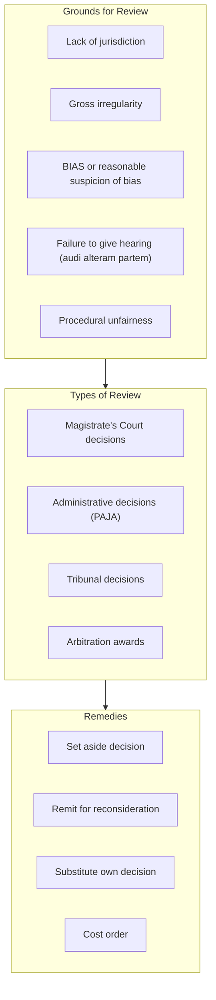

# L24 — Reviews

> [!abstract] Chapter Overview
> This chapter covers **reviews** — proceedings to set aside administrative decisions or lower court judgments. Key grounds: irregularity, lack of jurisdiction, procedural unfairness.
<!-- -->
> [!important] Review vs Appeal
> **Review:** Attacks the PROCESS (irregularity in proceedings)
> **Appeal:** Attacks the OUTCOME (wrong judgment)

## Visual Overview

*Figure: Review grounds, types, and remedies.*

> [!warning] Time Limits
> PAJA reviews: 180 days from decision (or from when reasonably became aware). Court reviews: within reasonable time.
<!-- -->
> [!tip] Connection
> Reviews differ from [[L25 - Appeals|appeals]] — review attacks process, appeal attacks outcome. Both require [[L13 - Preparation for trial: Legal research|legal research]] and strong written argument.ful advocacy.

*Figure: The problem-to-execution chain in this chapter.*

---

## Chapter Content Walkthrough

| Overbearing, brusque argument.                                                                         | Moderation in language, tone, gesture and facial expression.                                                                                          | Subtlety beats aggression in the art of persuasion.                                                                                                                                                                                                                             |
| ------------------------------------------------------------------------------------------------------ | ----------------------------------------------------------------------------------------------------------------------------------------------------- | ------------------------------------------------------------------------------------------------------------------------------------------------------------------------------------------------------------------------------------------------------------------------------- |
| Ignoring the judge.                                                                                    | Engaging and watching the judge, making eye contact.                                                                                                  | Use your *antennae* to be aware of the atmosphere of the court - watch the judge very carefully. You can sometimes "feel" whether the judge is with you or against you. When you sense that the judge is against you on the point, try to find another way to persuade him/her. |
| Making bad objections.                                                                                 | Objecting sparingly, and only when the objection is good.                                                                                             | If you make too many bad objections the judge will get used to ruling against you and may even start thinking that you have no answer and therefore are concentrating your efforts towards running interference.                                                                |
| Putting forward a plainly untenable submission.                                                        | Making points you can substantiate.                                                                                                                   | A patently bad point has the tendency to detract from the value of your good points.                                                                                                                                                                                            |
| Exaggeration: *"The defendant's conduct was absolutely and completely unreasonable and unforgivable."* | Understatement: *"I submit that the defendant's conduct does not quite measure up to the standard of the reasonable man."*                            | An understated argument tends to act as an invitation to the judge to take the point a little further; overstatement often acts as a challenge.                                                                                                                                 |
| Begging: *"I crave the leave of the court to show the witness the police plan."*                       | Confident assertiveness: *"Please look at the police plan. Now . . ."*                                                                                | Assert your rights quietly. You don't need the court's permission for everything you do. It's your case. Take control of it. Crawling or begging is unbecoming and a waste of time.                                                                                             |
| Using useless fillers: *"With respect . . ." "I respectfully . . ." "With the greatest respect . . ."* | Economical use of words: *"I submit . . ."*                                                                                                           | Don't say "with respect" too often. If you say it too often, no one will believe that you mean it. Respect is better shown by conduct than by words anyway.                                                                                                                     |
| Referring to authority before making the point. *"In the case of . . ."*                               | Making your submission first and then referring to the authority to support it. *"I submit that . . . In support of that submission I rely on . . ."* | Make the point your own by telling the judge what you submit before using the authority. If the judge questions your submission, the authority can be used.                                                                                                                     |
| Truculence, when a ruling goes against you: *"Well, so be it then."*                                   | Grace, when a ruling goes against you: *"As M' Lord pleases."*                                                                                        | Everyone hates a bad loser. Judges are no [[Page-75\|exception]].                                                                                                                                                                                                               |

## Chapter 24: Reviews

### CONTENTS

- 24.1 Introduction
- 24.2 Grounds of review under section 24
- 24.3 Procedure for review under Rule 53
  - 24.3.1 The notice of motion
  - 24.3.2 The founding affidavit
  - 24.3.3 The supplementary notice and affidavit
  - 24.3.4 Answering and replying affidavits
- 24.4 The hearing of a review
- 24.5 Protocol and ethics

## 24.1 Introduction

A review is an inquiry by the High Court into the decision of a lower court or of an administrative body to determine whether the decision taken on review has been arrived at properly. It differs from an appeal mainly in that an appeal is concerned with the question whether the decision was right while a review focuses on the way the decision was arrived at.

There are other important differences between appeals and reviews.

---

**Table 24.1** Reviews and appeals compared

| Appeals                                                                                                  | Reviews                                                                                                                |
| -------------------------------------------------------------------------------------------------------- | ---------------------------------------------------------------------------------------------------------------------- |
| Full rehearing on the merits; was the decision right?                                                    | Limited rehearing; was the correct procedure followed?                                                                 |
| Limited to the material before the court *a quo*.                                                        | Extraneous material may be placed before the court.                                                                    |
| Strict time limits for noting and prosecuting the appeal.                                                | Review must be brought within a reasonable period. There may nevertheless be prescribed time limits.                   |
| Appeal procedure; see chapter 25.                                                                        | Action, Rule 53 or, in urgent cases, Rule 6 procedures.                                                                |
| Suspends operation of judgment unless the court orders otherwise.                                        | Does not suspend the judgment unless the court orders otherwise.                                                       |
| Generally limited to judgments of courts of law.                                                         | Also applies to decisions of public bodies and statutory bodies.                                                       |
| Special leave to appeal (see chapter 25) required for a further appeal (to the Supreme Court of Appeal). | Leave of the High Court hearing the review required for an appeal to its Full Court or to the Supreme Court of Appeal. |

There are three main types of review under the common law. These were identified as such in the frequently cited case of *Johannesburg Consolidated Investments Co v Johannesburg Town Council* 1903 TS 111 as -

- the process in terms of which the proceedings of lower courts are brought before the High Court in order to expose a grave irregularity or an illegality which may have occurred in the course of the proceedings;
- the process in terms of which the exercise of a statutory duty by a public body is scrutinised in order to expose a disregard for the principles regulating that duty or a gross irregularity or an illegality in the performance of the duty; and
- the process in terms of which the High Court may exercise the power granted by statute to review the proceedings of statutory bodies.

These categories have now been overtaken by the Constitution of the Republic of South Africa, 108 of 1996 and the statute enacted pursuant to it. Every lawyer should be aware of the influence of the Constitution. Its provisions permeate every aspect of the law and affect administrative law perhaps more than other branches of the law. There can be no doubt that the provisions of section 33 of the Constitution encompass the grounds of review under section 24(1) of the Supreme Court Act 59 of 1959 ("the Act"). But the Constitution's reach into administrative matters is far deeper. Section 33 reads as follows:

"Just administrative action

33 (1) Everyone has the right to administrative action that is lawful, reasonable and procedurally fair.
(2) Everyone whose rights have been adversely affected by administrative action has the right to be given written reasons.
(3) National legislation must be enacted to give effect to these rights, and must -

1. provide for the review of administrative action by a court or, where appropriate, an independent and impartial tribunal;
2. impose a duty on the state to give effect to the rights in subsections (1) and (2); and
3. promote an efficient administration."

The Promotion of Administrative Justice Act 3 of 2000 was enacted to give effect to the provision of the Constitution that national legislation be passed to provide for administrative action that is lawful, reasonable and procedurally fair. This Act has become known as PAJA and should be studied very carefully. It has far reaching implications for review proceedings, not only in the procedural sense, but also in respect of the substantive law covering the review of administrative action. All reviews are now reviews under PAJA even when there is a provision for a review under another statute. In the example below PAJA covers the grounds of review provided by section 24 of the Act. Note that PAJA lays down time limits.

Having regard to the broad nature of the provisions of the Constitution and PAJA and the types of review identified in the *Johannesburg Consolidated Investments* case, there is a vast array of decisions that may be taken on review. Nevertheless, in each case the first inquiry will be whether the act or decision of the person or body concerned falls within the ambit of "administrative action" as contemplated by the Constitution and PAJA. You should not commence review proceedings before you have studied PAJA and carefully considered its implications for your review.

Some reviews are brought by way of action, some by way of the procedure prescribed by Rule 53, some by way of application procedure prescribed by Rule 6 and some may be brought as a matter of urgency, with or without interlocutory orders preserving the *status quo* pending the outcome of the review. The skills necessary for the drafting of review papers by way of action and application procedures are covered in chapters 5 to 10. In this chapter, the focus will be on reviews under section 24 of the Act and the procedure under Rule 53.

---

## 24.2 Grounds of review under section 24

Section 24(1) of the Act identifies four grounds upon which the proceedings of an "inferior court" may be brought on review before the High Court (having jurisdiction). They are -

- the absence of jurisdiction on the part of the court;
- an interest in the cause, bias, malice or corruption on the part of the presiding judicial officer;
- a gross irregularity in the proceedings; and
- the admission of inadmissible or incompetent evidence or the rejection of admissible or competent evidence.

The precise meaning of each of these grounds is beyond the scope of this work. They should be determined by careful research of the legal principles involved.

An "inferior court" is generally any court which has to keep a record of the proceedings before it, other than a division of the High Court. The Magistrates' Court, the Maintenance Court, the Children's Court and the Small Claims Court (see, for example, section 46 of the Small Claims Court Act 61 of 1984 for the special grounds for reviewing that court's proceedings) are all included in the category but not the Court of the Patents Commissioner.

## 24.3 Procedure for review under Rule 53

A special procedure is prescribed for reviews by Rule 53. This procedure can be summarised as follows:

- The review proceedings have to be directed to the magistrate or court who made the decision and to all other parties affected. The parties affected could include persons and officials other than the original parties before the inferior court. For example, in a maintenance case the maintenance officer should be joined.
- The proceedings have to be brought by way of a notice of motion that -
  - calls upon the respondents to show cause why the decision or proceedings should not be reviewed and set aside;
  - calls upon the magistrate or presiding officer to dispatch a copy of the record of the proceedings together with such reasons as he or she is required or desires to give and to notify the applicant that he or she has done so;
  - sets out the decision or proceedings sought to be reviewed; and
  - is supported by an affidavit setting out the grounds and the facts and circumstances upon which the applicant relies.
- Within ten days of the record being made available to the applicant, the applicant may deliver a notice and a further affidavit supplementing (amending, varying or adding to) the notice of review and founding affidavit.
- The respondents may oppose the review by giving notice of their intention to do so and by delivering answering affidavits.
- The applicant in turn may deliver replying affidavits.

### 24.3.1 The notice of motion

The notice of motion prescribed by Rule 53(1), is similar to the so-called long form of notice of motion (Form 2(a)) used in applications under Rule 6. That form has to be adapted to allow compliance with the requirements of Rule 53.
Table 24.2 Notice of Motion in terms of Rule 53(1)

| Text of Notice of Motion                                                                                                               | Comment                                                                                                                                                                                                                                                                                                                                                                                                              |
| -------------------------------------------------------------------------------------------------------------------------------------- | -------------------------------------------------------------------------------------------------------------------------------------------------------------------------------------------------------------------------------------------------------------------------------------------------------------------------------------------------------------------------------------------------------------------- |
| [DESCRIPTION OF COURT as prescribed] Case no 901/[year] In the matter between: LOGAN NAIDOO and LOURENS BUYS NO THE DIRECTOR OF PUBLIC | 1 The case heading reflects that the proceedings are in the High Court. 2 The presiding officer and all affected parties have to be named in the notice of motion. 3 The magistrate in this example is cited in his capacity as magistrate; the abbreviation NO is for *nomine officio*. 4 The Attorney-General is cited as representative of the State; it was a party to the criminal proceedings taken on review. |

---

| PROSECUTIONS, (PROVINCE) SECOND RESPONDENT                                                                                                                                                                 | 5 The Attorney-General may be cited by name followed by NO, but it is customary in some divisions to cite him or her by reference to the office rather than the person. |
| ---------------------------------------------------------------------------------------------------------------------------------------------------------------------------------------------------------- | ----------------------------------------------------------------------------------------------------------------------------------------------------------------------- |
| NOTICE OF MOTION IN TERMS OF RULE 53                                                                                                                                                                       |                                                                                                                                                                         |
| To: The Registrar [address] And to: Lourens Buys NO First Respondent Magistrates' Court [physical address] And to: The Director of Public Prosecutions, KwaZulu-Natal Second Respondent [physical address] |                                                                                                                                                                         |

| Text of Notice of Motion                                                                                                                                                                                                                                                                                                                                                                                                                                                                                                                                                                                                                                                                                                                         | Comment                                                                                                                                                                                                                                                                                                                                                                                                                                                                                                                                       |
| ------------------------------------------------------------------------------------------------------------------------------------------------------------------------------------------------------------------------------------------------------------------------------------------------------------------------------------------------------------------------------------------------------------------------------------------------------------------------------------------------------------------------------------------------------------------------------------------------------------------------------------------------------------------------------------------------------------------------------------------------ | --------------------------------------------------------------------------------------------------------------------------------------------------------------------------------------------------------------------------------------------------------------------------------------------------------------------------------------------------------------------------------------------------------------------------------------------------------------------------------------------------------------------------------------------- |
| TAKE NOTICE THAT the applicant, on a date and at a time to be arranged with the Registrar, intends to apply to this Honourable Court for the following orders -                                                                                                                                                                                                                                                                                                                                                                                                                                                                                                                                                                                  | 1 It is customary for reviews of this nature to be set down by arrangement between the registrar and the parties. 2 Special arrangements usually have to be made because the review will ordinarily be heard by two judges.                                                                                                                                                                                                                                                                                                                   |
| (a) that the proceedings before the first respondent under [place] case no. 789/[year] in which the first respondent convicted the applicant of theft and sentenced him to three years imprisonment, be reviewed and set aside; (b) that the conviction and sentence of the applicant in those proceedings be set aside; (c) that the matter be referred back to the Magistrates' Court for rehearing on the basis that section 112(1)(b) of the Criminal Procedure Act 51 of 1977 has to be complied with; (d) that the costs occasioned by any opposition to this application for review be paid by the respondent who opposes it; (e) that such other relief as seems appropriate to this Honourable Court be granted pursuant to the review. | 1 The relief should be specific to the facts of the case. The court and the affected parties should know precisely what is to be done if the review were to be successful. 2 It is unlikely that costs will be awarded against either respondent, but if they should unnecessarily oppose the review, they may be ordered to pay the costs caused by their opposition; but even that requires special circumstances to be present. 3 This is one of the few cases where I can see justification for a prayer for other or alternative relief. |
| TAKE NOTICE FURTHER THAT: (i) The respondents are called upon to show cause before this Honourable Court, on the date and at the time so arranged, why the relief set out in paragraphs (a) to (e) above should not be granted. (ii) The first respondent is required to dispatch a copy of the record of the proceedings before him under case no. 789/[year], together with any reasons he desires to give, to the registrar of this Honourable Court within 15 (fifteen) days of service of this application upon him and to notify the applicant that he has done so.                                                                                                                                                                        | See Rule 53(1).                                                                                                                                                                                                                                                                                                                                                                                                                                                                                                                               |

| Text of Notice of Motion                                                                                                                                                                                                                                                                                                                                                                                                                                                                                                                                                           | Comment                                            |
| ---------------------------------------------------------------------------------------------------------------------------------------------------------------------------------------------------------------------------------------------------------------------------------------------------------------------------------------------------------------------------------------------------------------------------------------------------------------------------------------------------------------------------------------------------------------------------------- | -------------------------------------------------- |
| TAKE NOTICE FURTHER THAT the applicant will rely on his affidavit annexed to this notice in support of the review.                                                                                                                                                                                                                                                                                                                                                                                                                                                                 | All affidavits to be relied upon should be listed. |
| TAKE NOTICE FURTHER THAT the any respondent who wishes to oppose this application for review is required to - 1. deliver notice to the applicant that he intends so to oppose within 15 days after receipt by him of the notice of motion; 2. in such notice to oppose appoint an address within 8 kilometres of the office of the registrar at which he will accept service of all process in such proceedings; 3. within 30 days after the expiry of the time referred to in Rule 53(4) deliver any affidavits he may desire in answer to the allegations made by the applicant. | See Rule 53(5).                                    |

---

Dated at [place] this 15th day of July, [year].

Signature Applicant's attorney's name (printed)

Booyse and Partners Applicant's Attorneys [address and details as per Rule 6(5)(b)] Ref: LNaid/012

### 24.3.2 The founding affidavit

The basic principles for affidavits generally apply to review applications. As for any other founding affidavit, the affidavit should provide the evidence for every item of relief claimed in the notice of motion.

**Table 24.3** Founding affidavit

| Text of affidavit (Case heading as in the notice of motion)                                                                                                                                                                                                                                                                                                                                                                                                                                                                                                                    | Comment                                                                                                                                                                                                                                                        |
| ------------------------------------------------------------------------------------------------------------------------------------------------------------------------------------------------------------------------------------------------------------------------------------------------------------------------------------------------------------------------------------------------------------------------------------------------------------------------------------------------------------------------------------------------------------------------------ | -------------------------------------------------------------------------------------------------------------------------------------------------------------------------------------------------------------------------------------------------------------- |
| FOUNDING AFFIDAVIT OF LOGAN NAIDOO                                                                                                                                                                                                                                                                                                                                                                                                                                                                                                                                             |                                                                                                                                                                                                                                                                |
| I, Logan Naidoo, declare under oath:                                                                                                                                                                                                                                                                                                                                                                                                                                                                                                                                           |                                                                                                                                                                                                                                                                |
| 1. I am the applicant in these proceedings. I am an adult male, shop-fitter, currently residing in [name and address of prison].                                                                                                                                                                                                                                                                                                                                                                                                                                               |                                                                                                                                                                                                                                                                |
| 2. The facts deposed to in this affidavit are within my personal knowledge save where the context indicates otherwise.                                                                                                                                                                                                                                                                                                                                                                                                                                                         |                                                                                                                                                                                                                                                                |
| 3. The first respondent is Lourens Buys, a male, regional magistrate in the employ of the Department of Justice at the Magistrates' Court, [name of court and address]. The first respondent is cited in his capacity as regional magistrate presiding at the trial referred to in the following paragraphs.                                                                                                                                                                                                                                                                   |                                                                                                                                                                                                                                                                |
| 4. The second respondent is the Director of Public Prosecutions for the Province of [name of province], who is cited in his capacity as such and whose offices are at [physical address].                                                                                                                                                                                                                                                                                                                                                                                      |                                                                                                                                                                                                                                                                |
| 5. On 1 July, [year] I was arrested in [place] on a charge of car theft by a member of the South African Police Service whose name I cannot remember. Immediately before I was arrested, I was a passenger in a car driven by a friend, Peter Williams. I was told by the police officer who arrested me that the car had been stolen. I was then locked up at the [name of] Police Station.                                                                                                                                                                                   | The court should be told enough of the background of the case to be able to assess whether there has been a miscarriage of justice. This may involve an explanation for the applicant's being implicated in the crime, as well as an explanation for his plea. |
| 6. The next day, 2 July, [year], I was allowed to contact my mother after being told that I would be taken to court in [town/city] that morning. I spoke to my mother on the telephone and asked her to arrange for an attorney to represent me at court. I was then taken to court with other prisoners, including Peter Williams. I asked him what was going on and he said that he had taken the car from his neighbour's yard. I had not known this when I met him at his home earlier on the day of our arrest. I was under the impression that it was his brother's car. |                                                                                                                                                                                                                                                                |

| Text of affidavit                                                                                                                                                                                                                                                                                                                                                                                                                  | Comment |
| ---------------------------------------------------------------------------------------------------------------------------------------------------------------------------------------------------------------------------------------------------------------------------------------------------------------------------------------------------------------------------------------------------------------------------------- | ------- |
| 7. We were lodged in the cells below the courts at the Magistrates' Court at [address] at about 09:00. I waited for my mother to come to see me but she did not arrive. Neither did any attorney.                                                                                                                                                                                                                                  |         |
| 8. At about 11:30 Peter Williams and I were called into a courtroom by a policeman. We were told to stand in the dock and the charge was read to us. We were accused of theft of a car. Peter Williams was asked to plead first and he pleaded guilty. I thought I was guilty because I had been found in the car and pleaded guilty too. I was too scared to ask the magistrate to wait for my mother to arrive with an attorney. |         |
| 9. The magistrate, whose name I later learned was Mr Lourens Buys, the first respondent, then asked us some questions. I have no independent recollection of the questions and the specific answers we gave, but I do remember that we were asked if we had taken the car. Williams and I both admitted to that. I thought that was the appropriate answer because we did not have permission to use the car.                      |         |
| 10. The first respondent then said that he found both of us guilty of theft and, after asking us a few more questions, sentenced each of us to two years imprisonment. I have been in [name] Prison since.                                                                                                                                                                                                                         |         |
| 11. My attorney came to see me in prison late in the evening that day. I have since, through him, obtained a copy of the charge                                                                                                                                                                                                                                                                                                    |         |

---

| sheet (J 15) and a transcript of the proceedings, and I attach a copy of the charge sheet as annexure 'A' and a copy of the transcript as annexure 'B'. I point out that neither has been certified correct. The first respondent is required under Rule 53(1) to despatch the record of the proceedings to the registrar and I assume the first respondent will advise the court whether the transcript provided to me by the clerk of the court is accurate.                         |                                                                                                                                                                                                                                                                           |
| -------------------------------------------------------------------------------------------------------------------------------------------------------------------------------------------------------------------------------------------------------------------------------------------------------------------------------------------------------------------------------------------------------------------------------------------------------------------------------------- | ------------------------------------------------------------------------------------------------------------------------------------------------------------------------------------------------------------------------------------------------------------------------- |
| 12. My attorney has explained to me that the first respondent was obliged, by virtue of section 112(1)(b) of the Criminal Procedure Act 51 of 1977, to question me to ascertain whether I admitted the allegations in the charge to which I had pleaded guilty. My attorney has further explained to me that one of the material allegations required for theft is that I should have intended to deprive the owner of the car of it permanently. I had no such intention at the time. | 1 The irregularity relied upon should be identified and the material facts and evidence recounted. 2 The narration may, in some respects, sound like a series of submissions, but that style of laying bare the deficiencies of the procedure under attack is acceptable. |

| Text of affidavit                                                                                                                                                                                                                                                                                                                              | Comment                                                             |
| ---------------------------------------------------------------------------------------------------------------------------------------------------------------------------------------------------------------------------------------------------------------------------------------------------------------------------------------------- | ------------------------------------------------------------------- |
| 13. The transcript of the proceedings shows that the first respondent asked the following question (of both me and Williams): 'Were you going to sell it, or just leave it where you finished using it? What were you going to do with it? Or had you not decided yet? Well, there is no reply.'                                               |                                                                     |
| 14. I can recall waiting for Williams to reply first and that I was uncertain whether it was my turn to speak. Before I could say anything, the first respondent pronounced us guilty as charged.                                                                                                                                              |                                                                     |
| 15. I have been advised and I respectfully submit that the first respondent should not have been satisfied that I admitted all the material facts or elements of the crime of theft and that he should, therefore, not have found me guilty.                                                                                                   |                                                                     |
| 16. I respectfully submit further that the first respondent's failure to comply with section 112(1)(b) of the Criminal Procedure Act constitutes a gross irregularity in the proceedings as contemplated by section 24(1)(c) of the Supreme Court Act 59 of 1959.                                                                              | The precise legal category or ground of review should be specified. |
| 17. I deny having intended to steal the car. I realise now that I should have pleaded not guilty. I respectfully submit that the first respondent should, after proper questioning as envisaged by section 112(1)(c) of the Criminal Procedure Act, have recorded a plea of not guilty and that the trial should have proceeded on that basis. |                                                                     |
| 18. In the premises I humbly pray for an order as set out in the notice of motion.                                                                                                                                                                                                                                                             |                                                                     |
| Dated at (place) this 14th day of July, [year]. *Signature* Applicant's name (printed) + full attestation clause completed and signed by a commissioner of oaths (probably a prison officer)                                                                                                                                                   |                                                                     |

### 24.3.3 The supplementary notice and affidavit

If, once the record and the magistrate's reasons have been delivered, it should turn out that there are other or further grounds for review, those grounds will have to be set out in a supplementary notice and a supplementary affidavit by the applicant may be required.

### 24.3.4 Answering and replying affidavits

Answering and replying affidavits in a review follow exactly the same format and style as answering and replying affidavits in application proceedings under Rule 6. (See chapter 10 in this regard.)

## 24.4 The hearing of a review

Reviews under Rule 53 are heard, if the decision taken on review is that of an inferior court, by a bench consisting of two judges. The matter is argued in similar fashion as appeals from the Magistrates' Court to a Provincial Division. The procedures and protocols relating to heads of argument, set down and argument of an appeal apply. Urgent reviews can be brought by way of the application procedure under Rule 6 and are often heard by a single judge, even when opposed. So are reviews brought by way of action.

---

---

## Concepts in this lecture

None

## Navigation

Prev: [[L23 - Persuasive advocacy|← Previous Chapter]] · Next: [[L25 - Appeals|Next Chapter →]]
