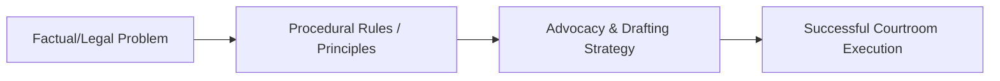

---

type: lecture
lecture: L28
tags: [lecture, litigation-skills]

---
# L28 — Index

> One-paragraph overview of the litigation skills and principles taught in this chapter.
>
> [!abstract] The arc of this chapter
> **Where we left off:** We explored the previous phase of litigation or litigation foundations.
>
> This chapter covers **Index**. We look at the problem of how to execute this task, the rules that govern it, and the strategies for successful advocacy.

*Figure: The problem-to-execution chain in this chapter.*

---

## Chapter Content Walkthrough

notice of motion or application, 164, 171-173
notice of opposition, 176
protocol and ethics, 188
substantive application
 examples, 162, 398-399
 interlocutory application distinguished, 161
 steps when drafting, 168-170
 *text of pleading*, 171-177
table of comparison, 163
urgent application see Urgent application

### Application to strike out

[[Page-75|exception]] distinguished, 149, 157
irregular proceedings, 149, 156
scandalous, vexatious or irrelevant matter, 149, 155-156
table of comparison, 157

[[Page-30|Arbitration]], 46-48

Archaic words, 422

### Assault

[[Page-115|theory of the case]], 260, 263, 264

### Assembling evidence

[[Page-100|demonstrative exhibit]]s, 216-219
experts see [[Page-100|Expert witness]]
inspecting documents and examining exhibits, 213-214
inspections *in loco*, 215-216
medical file, 213
overview, 209
preservation of evidence, 211
prosecutor's position, 223-224
protocol and ethics, 224
sample client (Mrs Smith), 212-213
sources of evidence, 210
types of evidence, 209-210
witness consultations, 211-213

Attorney-and-client privilege, 7

Authority to act, 17

## B

### Ballistics expert

[[Page-145|cross-examination]], 334

### Bias

cross-examination, 327, 342 expert witness, 365-366

### Brief to counsel

trial preparation exercise, 481-485

Bowing, rising, standing, 276

### Burden of proof

[[Page-92|advice on evidence]], 194

## C

Capacity to sue or be sued, 91

### Cause of action

*meaning*, 83 types of, 97

Certificate of urgency, 176-177, 408

Cession, 138

### Character evidence

cross-examining to prior bad acts, 328, 343
exceptions to rule, 374
exclusionary rule, 305, 372

---

Charge in criminal case
annexure to Form J15, 482
constitutional requirements, 123
murder, 123
objection, 158-160
statutory requirements, 123, 159-160
summons, charge sheet or indictment setting out, 83, 95, 123
theft, 124

[[Page-100|Circumstantial evidence]], 10, 210

Citation of legal authorities, 282-283

Citation of parties, 91-93

Claim, 83

Close of pleadings, 147

Closed questions, 9, 308-309

[[Page-174|Closing argument]]
checklist and assessment guide, 395-396
dealing with issues in turn, 382-384
discrediting opposition argument, 392
order of closing addresses, 380-381
planning and development, 379
protocol and ethics, 394-395
purpose, 379
shoplifting exercise, 491
structure, 381-382, 428
style and tactics, 393-394
submissions of fact, 385-387, 429
submissions of law, 388-391, 429

Closing file, 475-476

Combined summons, 95

Company
address, 92
citation, 92
service on, 92

Compliance application, 177

Compromise, 53, 138

Confession and avoidance
estoppel as, 87
examples, 130
plea, 82, 130-131
replication, 147

Confidentiality, 7

Confronting witness, 333-334

Constitution
just administrative action, 438
[[Page-179|Motion Court]] practices, 400-401
notice of charge in criminal case, 123

Consultation or conference with counsel, 21-22

Contemporaneous records, 362

Contractual claim
[[Page-54|cause of action]], 97
fraud as defence, 125
material facts, 86-87
special procedural requirements, 97, 127

Contribution third-party claim, 112-117

[[Page-66|Contributory negligence]]
negligent driving claim, 136, 259
pleading, 136
request for further particulars, 199-200

Corruption [[Page-145|cross-examination]], 327, 343

---

Costs

defendant's claim, 134

Counsel see Advocate

Counselling client see Advising and counselling client

Counterclaim

delivery with plea, 127
sample client (Mrs Smith), 108-112
text of pleading, 109-111
when used, 82, 95

Court directions or permission

application for, 177

Court etiquette and protocol

addressing judge/court, 275-276
addressing other lawyers, 278-279
announcing appearance, 275
bowing, rising, standing, 276
cell-phones, 284
citation of legal authorities, 282-283
counsel's duties to court and client, 273-274
counsel's rights, 274
difficult judges, 277-278
double-dating, 285
dress code, 282
entering and exiting court, 276
failing to put essential part of case to opposing witness, 285
introducing self to judge, 275
losing cases, 284
mistakes, 284-286
overview, 273
practical advice, 283-284
relationship between defence counsel and prosecutor, 280-281
relationship with court staff, 281-282
relationship with judge
away from court, 277
in court, 275-276
visiting in chambers, 276-277
relationship with other lawyers
away from court, 279-280
in court, 278-279
senior counsel, junior counsel and instructing attorney, 280
relationship with witnesses, 281

Credibility evidence, 210

[[Page-145|Cross-examination]]

aims, 325-325
ballistics expert, 334
character attacks, 330
checklist and assessment guide, 344-345
confrontation, 333-334
constructive, 325, 326, 332
destructive, 325, 326-328, 332
discrediting evidence, 326-327, 328
discrediting witness, 327-328
duty to put own version, 329
eliciting favourable evidence, 326
evidence in rebuttal, 331
[[Page-136|examination-in-chief]] compared, 341
[[Page-100|expert witness]], 364-366
failure to cross-examine, 331
for gain or for duty, 325-326
hostile witness, 362-363
inadmissible evidence adverse to cross-examiner, 329-330
on the merits, 329-330
parading own case, 329
probing, 334-336
protocol and ethics, 344
putting case, 332, 344
question too many, 337, 340
repeating questions, 331, 339
restrictions on, 329-331
structure, 331-332
suggestion/insinuation, 336-337
techniques, 332-340
ten precepts, 333
to bias, 342

---

to corruption, 327, 343
to credit, 330
to interest, 342
to memory, 327, 342
to observation, 327, 341
to prejudice, 327, 342
to prior bad acts, 328, 343
to prior convictions, 328, 330, 343
to prior inconsistent statements, 328, 343, 358-359
to recounting, 327, 342
to reputation, 328, 343-344
undermining, 337-338
untruthful witness, 339
yes or no answers, 331

Curator ad litem, 177, 410-412, 414

D

Damages for personal injuries
special procedural requirements, 97, 127

Decided cases
citation, 282-283
source of law, 231

Declaration
liquidated claim, 95
sample client (Mrs Smith), 104-108
text of pleading, 105-107

Defamation
denial, 130
[[Page-115|theory of the case]], 263

Default judgment, 398, 402

Defence
meaning, 83, 125-126
denial distinguished, 125-126
drafting plea see Plea
examples, 126

Delictual claim
[[Page-54|cause of action]], 97
claim for damages, 97
material facts, 85

[[Page-100|Demonstrative exhibit]]s see Exhibits

Denial
defence distinguished, 125-126
pleading, 130

Determination by independent third party or expert, 48-49

Dhlumayo principles, 460

Dilatory plea, 138

Direct evidence, 10, 209-210

Discovery
application to compel, 178-183
legal elements, 178
text of notice of application and affidavit, 179-183

Discrepancies in testimony, 328

Divorce
adultery alleged, 97
[[Page-179|Motion Court]] preparation, 404-405
Rule 43 application
Motion Court preparation, 405
when used, 178
statement of claim, 97

Documentary evidence
[[Page-92|advice on evidence]], 195-196
analysis, 254-256

---

assembling, 213-214
documentary and real exhibits distinguished, 71
medical report, 356
preservation and safekeeping, 71-72
proving, 353-354, 356
scheme for organising, 214
trial bundle, 214, 354, 356

Dress code, 282

## E

E-mail communication, 35

Employee re-instatement, 264

English law sources, 233

Enrichment claim, 97

Entry in investigation diary, 42

Estoppel

legal elements, 87
raised in replication, 144-146
*text of pleading*, 145-146

Evidence

admissibility *see* Admissibility of evidence
[[Page-92|advice on evidence]] *see* Advice on evidence
assembling *see* Assembling evidence
character evidence *see* Character evidence
[[Page-100|circumstantial evidence]], 10, 210
contemporaneous records, 362
credibility evidence, 210
direct evidence, 10, 209-210
discrediting, 326-327, 328
exclusionary rules, 304-305, 372
exhibits *see* Exhibits
[[Page-100|expert evidence]] *see* [[Page-100|Expert witness]]
[[Page-115|fact analysis]] and strategy, 257-260
[[Page-92|hearsay]] evidence, 305, 372-373
identification evidence, 369-371
improperly obtained, 305
indirect evidence, 210
materiality, 304
objections, 366-369, 375-377
opinion evidence *see* Opinion evidence
oral evidence *see* Oral evidence; Witness
preserving *see* Preservation of evidence
prior sexual experience or conduct, 24-25
proving each proposition of fact, 250-254
real evidence, 69
relevance, 303-304, 372
reliability and sufficiency, 257-260
reliability evidence, 10
secondary evidence, 305
similar fact evidence, 305, 374-375
supporting evidence, 84, 85
types of, 209-210

Evidential facts, 85

Ex parte application, 163, 164

[[Page-136|Examination-in-chief]]

admissibility of evidence, 304-305
briefing witness, 309-311
checklist and assessment guide, 323-324
[[Page-145|cross-examination]] compared, 341
demonstration exercise, 312-323
expert witness, 364
leading questions, 305, 308
materiality, 304
protocol and ethics, 323
purpose, 303
relevance, 303-304
restrictions on, 303-305
structure and content, 305-308, 428

---

style of questions, 308-309

technique, 311-312

### Exception

appeal against decision, 151

application to strike out distinguished, 149, 157

documents constituting pleadings, 149-150

form, format and style, 152

nature and purpose, 82, 127, 149, 150

orders available, 151

procedure, 151

protocol and ethics, 160

question of law, 150

text of pleading, 153-154

when taken, 150-151

### Exhibits

[[Page-100|demonstrative exhibit]]s, 71, 75

documentary and real exhibits distinguished, 71

handling exhibit already proved, 354-355, 429

models, 197, 218, 219

notice of intention to use, 197, 210

numbering, 356

photographs, 197, 217-218, 219

plans, 197, 216-217, 219

preservation, examination and analysis, 71-72

proving

formally, through witness, 355

generally, 219, 353-354

handling exhibit already proved, 354-355

medical report, 356

purpose, 75, 353

recording demonstration by witness, 356-357

### Expert witness

acceptance or rejection of evidence, 220

admissibility of evidence, 220

[[Page-92|advice on evidence]], 196-197

briefing, 76, 221

[[Page-145|cross-examination]], 364-366

[[Page-136|examination-in-chief]], 364

expert notices and summaries, 197, 201-204

field of expertise, 220

finding and retaining, 75-76

interviewing, 21, 24

need for, 196-197

opinion evidence, 75, 210, 220, 373

persons constituting, 219

preparation for examination-in-chief, 363-364

problems to anticipate, 222

protocol and ethics, 378

report, 221-222, 485

selection, 220-221

text of summary, 202-204

types of [[Page-100|expert evidence]], 75, 219-220

Explanation or qualification, 133, 143, 144

### Expropriation action

text of expert summary, 202-203

F

### Fact analysis and strategy

admissibility, reliability and sufficiency of evidence, 257-260

defence analysis of prosecution case, 269-270

identifying material facts in issue, 244-247

legal documents, 254-256

overview, 72-73

proof-making model, 11-15, 241-243

propositions of fact supporting each legal element/material fact, 247-250

evidence proving, 250-254

prosecutor, by, 72-73, 269, 270

record-keeping, 244

sample client (Mrs Smith), 11-16, 245-246, 247, 249-250

shoplifting exercise, 487-488

strategy, 242

[[Page-115|theory of the case]] see Theory of the case

---

trial tactics, 265-267

*[[Page-47|Facta probanda]]* and *probantia* distinguished, 84

Facts of case

analysis see [[Page-115|Fact analysis]] and strategy
establishing in chronological order, 7-10

Fees

advising client, 78
counsel, 78
initial consultation, 7

Filing of official documents, 41

Firm

citation, 92
execution against named proprietor, 92

Fraud

legal elements, 125

Funnelling technique, 9-10, 309

Further particulars

order compelling delivery, 86
Rules of Court, 85, 199
text of request for particulars, 199-200

Further statements, 74

G

Gender neutral language, 423

Grammar, 422-423

H

Heading of criminal case, 90

Heads of argument

appeals, 459-465
drafting, 392
late filing/completion, 286

[[Page-92|Hearsay]] evidence

meaning, 372-373
exceptions to rule, 372-373
exclusionary rule, 305, 372

Hostile witness, 362-363, 378

Hyberbole, 422

I

Identification evidence

case law, 369
defence, 371-372
prosecution, 369-371
*Turnbull* checklist, 371-372

Improperly obtained evidence, 305

Indemnification

third-party claim, 112-117

Indictment see Charge in criminal case

Indirect evidence, 210

Inspections in loco, 215-216, 357-358

Instructing attorney, 280

---

Instructions from client, 431

Insurance claim

- declaration, 104-108
- pre-existing disease, 389-391
- sample client (Mrs Smith), 104-108
- submission on point of law, 389-391

Interest in outcome of trial

- [[Page-145|cross-examination]], 327, 342

Interim interdict, 178

Interlocutory application

- examples, 162, 398
- [[Page-179|Motion Court]], 398
- notice of application, 164
- procedural application
  - application to compel discovery, 178-183
  - examples, 177
  - text of notice and affidavit, 179-183
- status quo application
  - examples, 178
  - Mareva injunction, 184-188
- substantive application distinguished, 161

Interpellatio, 68

Interpleader claim

- procedure, 117
- text of pleading, 118-120
- when used, 95, 117

Interpreter

- [[Page-92|advice on evidence]], 199
- interviewing through, 27-28

Interview by defence in criminal case

- accused, 26
- prosecution witnesses, 27

Interview by prosecution in criminal case

- complainant/victim of crime, 23-24
- minors, 25
- overview, 22-23
- police and [[Page-100|expert witness]]es, 24
- sex crimes, 24-25
- supporting witnesses, 24

Interviewing client in civil case

- active listening, 10
- advocate and professional/lay clients, 21-22
- afterwards, 20
- concluding, 17
- confidentiality, 7
- conflicts of interest, 7
- dealing with preliminary matters, 7
- establishing facts in chronological order, 7-10
- example, 4
- fees, 7
- funnelling technique, 9-10
- giving preliminary advice, 16-17
- initial [[Page-115|fact analysis]] and preliminary theory of case, 10-16
- initial problem and goal identification, 5-6
- meeting and exchanging pleasantries, 5
- note-taking, 7
- objectives, 4
- overview, 3-4
- protocol and ethics, 28
- structure, 4, 428
- summary, 18-19
- types of question, 9
- venue, 3

Interviewing witness in civil case

- advocate in presence of attorney, 20
- expert witness, 21
- opposing witness, 21
- protocol and ethics, 28
- safeguards against contaminating evidence, 20

---

Irregular proceedings, 149, 156

Issues

meaning, 84

issue of fact, 84

issue of law, 84

issue of mixed fact and law, 84

J

Judge

addressing, 275-276

bowing, rising, standing, 276

difficult judges, 277-278

encountering away from court, 277

entering and exiting court, 276

introducing self to, 275

recusal, 278

visiting in chambers, 276-277

Judgment in favour of the defendant, 134

Junior counsel, 280

Jurisdiction

meaning, 96-97

challenging, 126

statement of claim, 96-97

Just administrative action, 438

L

Language and communication skills

bad habits, 425-426

document as a whole, 424

paragraphs, 423-424

presentation skills, 430

sentences, 422-423

speaking in court, 430-434

spoken and written English, 421-422

structure, 427-429

words, 422, 425-426

Late filing of heads of argument, 286

Latent defect, 132, 133

Law journals, 231

Law libraries, 235

Law reports, 231, 235, 236

LAWSA, 230

Leading questions, 9, 305, 308

Leave to appeal see Appeal

Legal elements see Material facts

Legal research

applying law to facts, 234-235

classification of problem (legal analysis), 226-229

foreign sources, 233

general sources, 230-231

IT systems, 235-236

law libraries, 235

"must have" books

criminal practice, 238

general practice, 236-237

narrowing down, 232

online sources and CD-ROMS, 236

organising library research, 229-230

overview, 225-226

protocol and ethics, 238-239

---

recording results, 234
Roman-Dutch authorities, 232, 237-238
specific sources, 231-232
stages, 226
whether sources still current, 233

Letter of advice, 33-35

Letter of demand, 67-69

Letter of repudiation, 69

Liquid document, 121

Liquidated claim, 95

*Lis alibi pendens*, 138

*Litis contestatio*, 147

*[[Page-41|Locus standi]]*

*meaning*, 91, 96

challenging, 126

statement of claim, 96

Loss of support

Road Accident Fund claim see Road Accident Fund claim

## M

*Mareva* injunction

English law, 184-185

founding affidavit, 186-187

nature and purpose, 178, 184

notice of application, 187-188

South African law, 185-186

Marital status of woman, 92

Maritime claim

citation of parties, 93

Material facts

*meaning*, 84-85

*actio legis Aquiliae*, 84

contractual claim, 86-87

discovery, 178

drafting plea, 127-128

estoppel, 87

*[[Page-47|facta probanda]]* and *probantia* distinguished, 84

failure to plead, 85-86, 88, 127

fraud, 125

identifying facts in issue, 244-247

murder, 84-85, 87-88

particulars of claim see Particulars of claim

pleading, 85-86, 132-133

propositions of fact supporting, 247-250

*rei vindicatio*, 86

sample client (Mrs Smith), 98-104

shoplifting exercise, 486

theft, 124

Materiality of evidence, 304

Matrimonial claim for primary care of children, 264

[[Page-30|Mediation]], 49-53

Medical examination, 196

Medical negligence, 263

Medical opinion, 210, 219

Medical report, 356, 485

Memorandum

advice per, 35

prosecutor's, 41-42

---

Minister

citation, 93

Minor

assistance in legal proceedings, 91
evidence through intermediary, 25
interviewing, 25

Minute

advice by prosecutor, 41-42

Misjoinder, 96, 138

Mixed claim, 97

Models, 197, 218, 219

Memory

[[Page-145|cross-examination]], 327, 342
refreshing, 360-362, 429

[[Page-179|Motion Court]]

application for substituted service, 404
calling matter out of turn, 407, 413
checklist and assessment guide, 414-415
counsel as curator ad litem, 410-412, 414
default judgment, 402
developing constitutional and substantive issues, 400-401
divorce trial (unopposed), 404-405
duty of disclosure, 413
entering and exiting, 276, 413
forgetting to appear, 286
generally, 397-398
interlocutory applications, 398
matters heard, 398-399
non-appearance by counsel, 413
notice to defendant consumer, 400
opposed application, 409-410
order of appearance, 413-414
practice and procedure, 399-400
pro Deo cases, 413-414
protocol and ethics, 412-414
provisional sentence (unopposed), 401
Rule 43 application (opposed), 405
seating arrangements, 413
sequestration application, 406-407
substantive applications, 398-399
summary judgment, 403
Trial Court distinguished, 397-398
unopposed matters, 398
urgent application, 407-409

Motor collision

negligent driving claim see Negligent driving claim
Road Accident Fund claim see Road Accident Fund claim

Murder

charge, 123
doctrine of recent possession, 248-249
further statements, 74
legal elements/material facts, 84-85, 87-88
propositions of fact, 248
similar fact evidence, 374
[[Page-115|theory of the case]], 73

N

Namptissement proceedings, 121

Negligent driving claim

admissibility, reliability and sufficiency of evidence, 258-260
allegation not admitted, 131-132
[[Page-174|closing argument]], 383-384
[[Page-66|contributory negligence]], 136, 259
denial or defence, 125-126, 259
expert summary, 204
further statements, 74
[[Page-131|opening statement]], 297-298
particulars of claim, 98-103

---

plea, 135-137
propositions of fact, 249-250
evidence proving, 251-254
[[Page-115|theory of the case]], 73, 74, 263

[[Page-30|Negotiation]]

advantages, 54
agreement following, 60-61
alternatives where unsuccessful, 60
analysis of facts, law and client's objectives, 56-57
anticipating opposition's case, 57
authority to act, 59
common mistakes, 61
competitive style, 54-55
compromise or settlement, 53-54
conduct of, 58-60
co-operative style, 55
positional approach, 55-56
preparatory notes, 57-58
problem-solving approach, 55
protocol and ethics, 66
skills required, 53-54
steps, 54
styles, 54-56
without prejudice basis, 59-60

Non-joinder, 96, 138

Noter-up, The, 230

Notice of motion or application

forms, 164
review proceedings, 439-442
spoliation application, 171-173

o

Oath or affirmation, 309-310

Objection to charge, 158-160

Objections

procedure and phrasing, 366-369, 429
protocol and ethics, 378
responses to, 375-377

Observation

[[Page-145|cross-examination]], 327, 341

Office décor, 5

Open questions, 9, 308-309

[[Page-131|Opening statement]]

checklist and assessment guide, 300-302
civil case, 296-299
criminal case, 287
defence case, 293-295
prosecution case, 289-293
importance, 287-288
protocol and ethics, 300
purpose, 288
Rules of Court, 287
shoplifting exercise, 490-491
structure and content, 288-289, 428
technique, 299-300

Opinion evidence

meaning, 210
exceptions to rule, 373
exclusionary rule, 305, 372
[[Page-100|expert witness]] see Expert witness
lay witness, 220

Opposed application, 409-410

Oral advice and counselling in litigation, 31-33

Oral advice to complainant, 42-43

---

Oral evidence

[[Page-92|advice on evidence]], 194-195
nature of, 69

Oratory, 420-421

P

Paragraphs, 423-424

Particulars of claim

form, 89
material facts to be pleaded, 85-86
negligent driving causing damage to vehicle, 98-103
Road Accident Fund claim, 103-104
sample client (Mrs Smith), 98-104
text of pleading, 89, 100-102
unliquidated claim, 95

Partnership

citation, 92
third-party claim, 113-116

Personal injuries claim

Road Accident Fund claim see Road Accident Fund claim
special procedural requirements, 97

[[Page-186|Persuasive advocacy]]

meaning, 417, 418
devices, 418
language and communication skills, 421-426
overview, 417-419
style (oratory), 420-421
substance, 419-420

Photographs, 197, 217-218, 219

Piggybacking, 9, 311, 317-320, 323

Plans, 197, 216-217, 219

Plea

admission, 129
allegation not admitted, 131-132
confession and avoidance, 130-131
defence and denial distinguished, 125-126
denial, 130
explanation or qualification, 133
form and content, 128-129
material facts, 132-133
nature and purpose, 125
prayer, 133-134
preliminary matters to consider, 126-127
protocol and ethics, 141
[[Page-66|special pleas]], 138-140
steps when drafting, 127-128
text of pleading, 135-137

[[Page-30|Plea and sentence agreement]], 64-65

Plea explanation in criminal case, 83, 140-141

Pleadings

addresses of parties and Registrar, 89-90
admitted facts, 82
advice on evidence, 193
allegations in the alternative, 89
amendment, 90
application to strike out see Application to strike out
citation of parties, 91-93
close of pleadings, 147
counterclaim see Counterclaim
criminal case, 83, 90, 140-141
documents constituting, 149-150
exceptions see [[Page-75|Exception]]
form and contents, 88-90
functions, 81-82
language and style, 88-90
National Bar Examinational syllabus for legal writing, 79-80

---

numbered paragraphs, 88
plea see Plea
prayer for relief, 83-84, 89
precedents, 94
protocol and ethics, 94
rebutter, 82, 147
rejoinder, 82, 147
replication, 82, 143-146
signature, 89-90
statement of claim see Statement of claim
structure of set of pleadings, 82-83
surrebutter, 82, 147
surrejoinder, 82, 147
tactical denial, 94
terminology, 83-84
title, 88

Posture, 431-432

Prayer

*meaning*, 83-84
plea, 133-134
statement of claim, 98
wording, 89

Prejudice

[[Page-145|cross-examination]], 327, 242

Preparation for trial

[[Page-92|advice on evidence]] see Advice on evidence
assembling evidence see Assembling evidence
[[Page-115|fact analysis]] and strategy see Fact analysis and strategy
legal research see Legal research
protocol and ethics, 207-208
stages, 191

Preparing to commence action

[[Page-100|demonstrative exhibit]]s, 75
fact analysis and preliminary theory of case, 72-76
fees, 78
finding and retaining experts, 75-76
letter of demand or repudiation, 67-69
overview, 67
preservation of evidence, 69-72
trial folder, 76-78

Prescription

interruption, 144
[[Page-66|special plea]], 138-140
*text of pleading*, 139

Preservation of evidence

exhibits, 71-72, 211
importance, 69, 211
overview, 69, 211
witnesses, 70, 211

President

citation, 93

[[Page-100|Pre-trial conference]] see Rule 37 conference

Price of goods claimed, 94

Prior bad acts

cross-examination, 328, 343

Prior convictions

cross-examination, 328, 330, 343

Prior inconsistent statements, 328, 343, 358-359

Probing questions, 334-336

Procedural application

examples, 177
*text of notice and affidavit*, 179-183
to compel discovery, 178-183

Professional journals, 231

---

Proof-making model of [[Page-115|fact analysis]], 11-15, 241-243

Prosecutor

advice

entry in investigation diary, 42
memorandum or minute, 41-42
oral advice to complainant, 42-43
written opinion, 40
[[Page-92|advice on evidence]], 205-207
alternative dispute resolution, 64-65
assembling evidence, 223-224
closing file, 476
fact analysis, 72-73, 269, 270
interviews see Interview by prosecution in criminal case
[[Page-30|plea and sentence agreement]], 64-65
relationship between defence counsel and, 280-281

Protocol and ethics

advice and counselling, 43
affidavits, 188
alternative dispute resolution, 65-66
appeals, 473
assembling evidence, 224
[[Page-174|closing argument]], 394-395
[[Page-145|cross-examination]], 344
[[Page-136|examination-in-chief]], 323
exceptions, 160
[[Page-100|expert witness]], 378
hostile witness, 378
interviews, 28
legal research, 238-239
[[Page-179|Motion Court]], 412-414
objections, 378
[[Page-131|opening statement]], 300
pleading, 94
pleas, 141
preparation for trial, 207-208
reviews, 446
speaking in court, 430-431
statements of claim, 124

Provisional sentence

Motion Court preparation, 401
summons
prescribed form, 121
text of summons, 122
when used, 96, 121

Q

Question of law, 150

R

Ranking of advocates and attorneys, 279

Real evidence, 69

Real exhibits, 71-72

Rebutter, 82, 147

Recounting

cross-examination, 327, 342

[[Page-160|Re-examination]]

checklist and assessment guide, 350-351
clarifying evidence, 349
purpose, 347
rehabilitating witness, 348-349
repairing damage to evidence-in-chief, 347-348
restrictions on, 347
technique, 349-350

Rei vindicatio, 86

---

Rejoinder, 82, 147

Relevance of evidence, 303-304, 372

Reliability evidence, 10

Replication

form and content, 143
nature and purpose, 82, 143
text of pleading, 145-146
when used, 143-144

Reputation

[[Page-145|cross-examination]], 328, 343-344

Res gestae, 373

Res ipsa loquitur, 248

Res judicata, 82, 134, 138

Review

meaning, 437
answering and replying affidavits, 446
appeal distinguished, 437
common law, 437-438
founding affidavit, 443-445
text of founding affidavit, 443-445
hearing, 446
inferior court, 439
notice of motion, 439-442
text of notice of motion, 440-442
procedure, 439-446
protocol and ethics, 446
right to just administrative action, 438
statutory grounds, 439
supplementary notice and affidavit, 446

Road Accident Fund claim

[[Page-115|fact analysis]], 12-15
independent examination of persons or things, 196-197
medical examination, 196
particulars of claim, 103-104

Roman-Dutch authorities

citation, 273
source of law, 232, 237-238

Rule nisi, 164

Rule 37 conference

[[Page-92|advice on evidence]], 197-198
objects, 222
preparation for, 222-223
Rule 37(4) notice and reply, 200-201
timing, 223
venue, 223

Rule 43 application, 178, 405

S

Sample client (Mrs Smith)

advice during initial interview, 33
counterclaim by defendant, 108-112
declaration for purposes of insurance claim, 104-105
establishing facts in chronological order, 7-10
[[Page-100|expert witness]]es, 76
fact analysis and [[Page-115|theory of the case]], 11-16, 245-246, 247, 249-250
further statements, 74
identification of legal issues, 6
insurance claim, 104-108
medical file, 213
negligent driving claim see Negligent driving claim
negotiating with hospital, 58-59
potential witnesses, 212-213
Road Accident Fund claim see Road Accident Fund claim
scenario, 4
text of statement and attorney's comments, 477-480

---

Scandalous, vexatious and irrelevant matter, 88, 90, 127, 149, 155-156

Secondary evidence, 305

Section 115 statement, 482

Security for costs, 48

Senior counsel, 280

Sentences, 422-423

Separation of issues, 151

Sequestration application, 406-407

Set-off, 127

Settlement

[[Page-92|advice on evidence]], 197-198

Sex crime

advice to complainant, 43

evidence of prior sexual experience or conduct, 24-25

Shoplifting

[[Page-174|closing argument]], 386-387

[[Page-145|cross-examination]], 336-337, 338

opening address for prosecution, 289-293

[[Page-115|theory of the case]], 263

trial preparation exercise, 481-492

Signposting, 139, 144, 173, 179, 311, 320, 420, 424, 471

Similar fact evidence

exceptions to rule, 374-375

exclusionary rule, 305, 372

Simple summons, 95

Speaking in court

basic principles, 430

making submissions, 432-434

place to speak from, 430

protocol, 430-431

voice, posture, speech, 431-432

what works and what does not, 434

Special leave to appeal, 453-455

[[Page-66|Special pleas]], 138-140

Specific performance, 264

Spoliation application

drafting substantive application, 169-170

notice of motion, 171-175

*text of affidavit*, 173-175

*text of pleading*, 171-172

notice of opposition, 176

urgent application, 176-177, 408-409

State

service on, 93

State Attorney

written opinion, 40

Statement of claim

[[Page-54|cause of action]], 97

compliance with special procedural requirements, 97-98

counterclaim, 95, 108-112

criminal case, 96, 123-124

form and content, 96-98

interpleader claim see Interpleader claim

jurisdiction, 96-97

liquidated claim, 95

*[[Page-41|locus standi]]*, 96

material facts see Material facts

nature and purpose, 82, 95

particulars of claim see Particulars of claim

parties, 96

prayer, 98

---

protocol and ethics, 124
provisional sentence summons *see* Provisional sentence summons
structure, 428
third-party claim *see* Third-party claim
unliquidated claim, 95

Status quo application
examples, 178
*Mareva* injunction, 184-188

Statutes
citation, 282 source of law, 231

Statutory claim, 97

Submissions
language and communication skills, 430-431, 432-434
of fact, 385-387, 429
of law, 388-391, 429
on appeal, 429, 464

Substituted service application for, 404

Suggestive questions, 336-337

Summary judgment, 177, 398, 403

Summons, 83

Surrebutter, 82, 147

Surrejoinder, 82, 148

## T

Tautology, 422

Textbooks
citation, 283
'must haves'
criminal practice, 238
general practice, 236-237
source of law, 231

Theft
charge, 124
doctrine of recent possession, 248-249
legal elements, 124
shoplifting *see* Shoplifting

[[Page-115|Theory of the case]]
*meaning*, 10, 260
alternative theories, 262
assault against police officer, 264
criminal assault, 260, 263
defamation, 263
[[Page-100|demonstrative exhibit]]s, 75
function, 260-261
further statements, 74
matrimonial claim for primary care of children, 264
medical negligence, 263
murder, 73
negligent driving, 73, 74, 263
re-instatement of employee, 264
sample client (Mrs Smith), 11-16
shoplifting, 263, 489
specific performance, 264
steps when developing, 261-262
trial tactics, 265-267, 489
unlawful dismissal, 264

Theses and other academic writings
citation, 283
source of law, 231

Things, 71-72

Third-party claim

---

partnership matter, 113-116
procedure, 112
text of pleading, 114-116
when used, 83, 95, 112, 117, 127

Timelines, 212, 307, 315, 321-323

Transcript of evidence
[[Page-92|advice on evidence]], 198

Transnet
citation, 93

Trial
[[Page-174|closing argument]] see Closing argument
court etiquette and protocol see Court etiquette and protocol
[[Page-145|cross-examination]] see Cross-examination
[[Page-136|examination-in-chief]] see Examination-in-chief
[[Page-131|opening statement]] see Opening statement
preparation for see Preparation for trial
[[Page-160|re-examination]] see Re-examination

Trial folder, 76-78

Trial notebook, 268-269, 486-492

Trial tactics, 265-267, 489

Trust
citation, 92
representation by trustees, 91, 92

Turnbull checklist, 371-372

U

Undermining questions, 337-338

Uniform Rules of Professional Ethics of the GCB
interviewing opposing witness, 21
interviewing prosecution witness, 27

Unlawful arrest
confession and avoidance, 130-131

Unlawful dismissal, 264

Unliquidated claim, 95

Urgent application
certificate of urgency, 176-177, 408
comparison with other forms of application, 163
duty of disclosure, 408
[[Page-179|Motion Court]] preparation, 407
spoliation application (opposed), 408-409

V

Valuation of business or property, 48

W

Without prejudice discussion, 279

Without prejudice [[Page-30|negotiation]], 59-60

Witness
addressing, 281
approaching, 430
bias, 327, 342
briefing, 309-311
consultations, 70, 211-213
corruption, 327, 343
counsel's relationship with, 281
credibility, 210

---

[[Page-145|cross-examination]] *see* Cross-examination
details, 70
discrediting, 327-328
[[Page-136|examination-in-chief]] *see* Examination-in-chief
expert *see* [[Page-100|Expert witness]]
hostile, 362-363, 378
interest in outcome of trial, 327, 342
interviewing in civil case, 20-21, 22
interviewing in criminal case
 by defence, 26-27
 by prosecution, 22-25
memory, 327, 342, 360-362
oath or affirmation, 309-310
observation, 327, 341
prejudice, 327, 342
prior bad acts, 328, 343
prior convictions, 328, 330, 343, 348-349
prior inconsistent statements, 328, 343, 358-359
recounting, 327, 342
[[Page-160|re-examination]] *see* Re-examination
reputation, 328, 343-344
statements, 70, 211-212, 482-485
timeline, 212, 307, 315, 321-323

Words, 422, 425-426

Words and Phrases, 231

Written opinion

advocacy distinguished, 36
analysis, 38
conclusion, 39
discussion, 37-38
general comments, 39-40
headings, 40
introduction, 37
nature and purpose, 36
practical steps, 36-37
State Attorney etc, 40
structure, 428

---

---

## Concepts in this lecture

None

## Navigation

Prev: [[L27 - Appendices|← Previous Chapter]] · Next: End →
