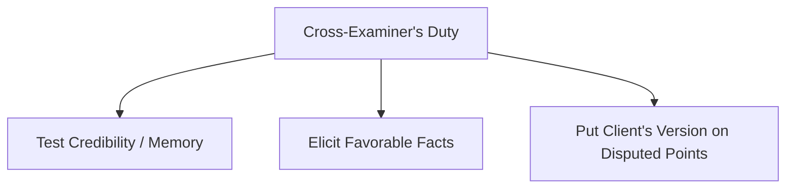

# Cross-examination

## Formal definition

The questioning of a witness called by the opposing party during a trial. Its purposes are to test the credibility and reliability of the witness, and to elicit facts favorable to the cross-examiner's case.

## In simple words

> [!tip] In simple words
> Questioning the other side's witness to show their story is unreliable, inconsistent, or supports your version instead.
>
> **Analogy:** Stress-testing a bridge. You apply weight to find the weak spots.

## Why we need it

It is the primary tool for exposing falsehoods and errors in testimony. Under South African trial rules, counsel has a strict **duty to put their version** to the witness on disputed facts during cross-examination.

## Visual

*Figure 5: The three pillars of cross-examination.*

## Related

[[Examination-in-chief]] · [[Re-examination]] · [[Witnesses]] · [[Theory of the Case]]

## Source

Chapter 18 (Page 194)
