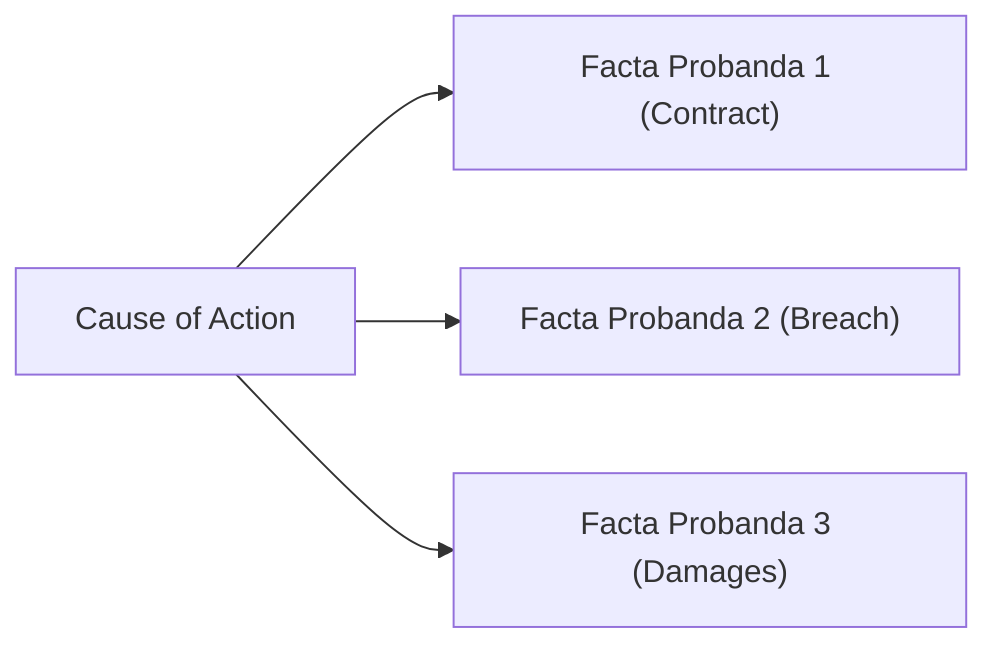

# Facta Probanda

## Formal definition

The material facts which a party must allege and prove in order to establish a cause of action or a defense. They represent the essential legal ingredients of a claim or defense.

## In simple words

> [!tip] In simple words
> The list of key facts you must prove to win your case, like showing that a contract exists, was breached, and caused you loss.
>
> **Analogy:** The recipe ingredients. You must list all of them to make the cake, but you do not need to show the cooking process yet.

## Why we need it

To define the issues in dispute clearly so that the opposing party knows exactly what case they have to meet. It keeps the pleadings clean and free of unnecessary evidence. Excluding facta probanda makes a pleading excipient (vague and embarrassing).

## Formulas

![[f- Pleadings Drafting Rules]]

## Visual

*Figure 1: Facta Probanda as structural pillars of a Cause of Action.*

## Related

[[Facta Probantia]] · [[Cause of Action]] · [[Pleadings]] · [[f- Pleadings Drafting Rules]]

## Source

Chapter 05 (Page 54)
