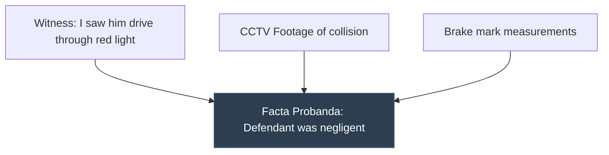

# Facta Probantia

## Formal definition

The evidence or secondary facts by which the material facts (facta probanda) are proved in court. They include witness statements, documents, and physical exhibits.

## In simple words

> [!tip] In simple words
> The actual evidence (like a witness's testimony or a signed email) that you use in court to prove your key facts.
>
> **Analogy:** The photos or video showing you mixing the ingredients. It proves you used them, but you don't list the photos in the recipe.

## Why we need it

Pleadings must contain only facta probanda and *never* facta probantia. Including evidence in pleadings makes them excipient and clutters the record before the trial even begins.

## Visual

*Figure 2: Facta Probantia (evidence) proving the Facta Probanda.*

## Related

[[Facta Probanda]] · [[Pleadings]] · [[Evidence]]

## Source

Chapter 05 (Page 54)
