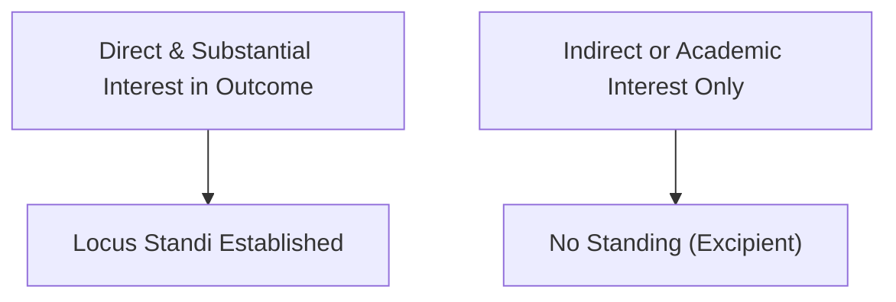

# Locus Standi

## Formal definition

The legal capacity or right of a party to bring an action or appear before a court in a particular matter. It requires the party to have a direct and substantial interest in the outcome of the litigation.

## In simple words

> [!tip] In simple words
> Your right to be heard in court on a specific issue. You cannot sue on behalf of someone else unless you have standing.
>
> **Analogy:** Having 'skin in the game'. If you aren't affected by a dispute, you can't join the fight.

## Why we need it

To prevent busybodies from clogging the courts with litigation in which they have no personal interest. Standing is a threshold issue and must be pleaded and proved.

## Visual

*Figure 4: Standing threshold test.*

## Related

[[Cause of Action]] · [[Pleadings]] · [[Urgent Application]]

## Source

Chapter 04 (Page 46)
