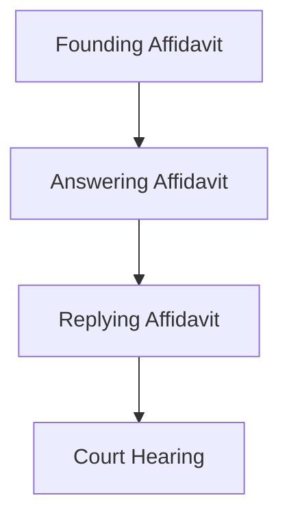

# Urgent Application

## Formal definition

An application brought in terms of High Court Rule 6(12) where standard timelines are bypassed due to immediate risk of irreparable harm or injustice.

## In simple words

> [!tip] In simple words
> An emergency court case that skips the usual long waiting times.
>
> **Analogy:** The emergency room in a hospital. You get immediate attention because your condition is life-threatening.

## Why we need it

To provide swift legal remedy in emergency situations where waiting for the normal court roll would render the eventual relief useless.

## Visual

**Animated:** Motion application exchange

![[anim_motion_exchange.gif]]

## Related

[[Affidavit]] · [[f- Urgent Application Test]]

## Source

Chapter 10 (Page 99)
